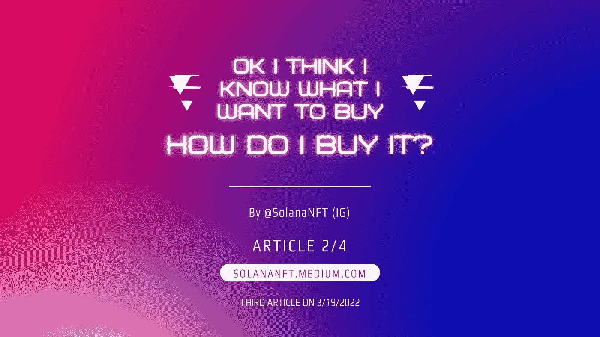
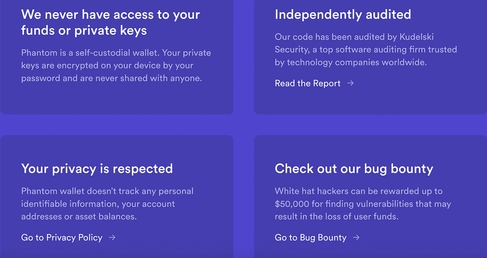
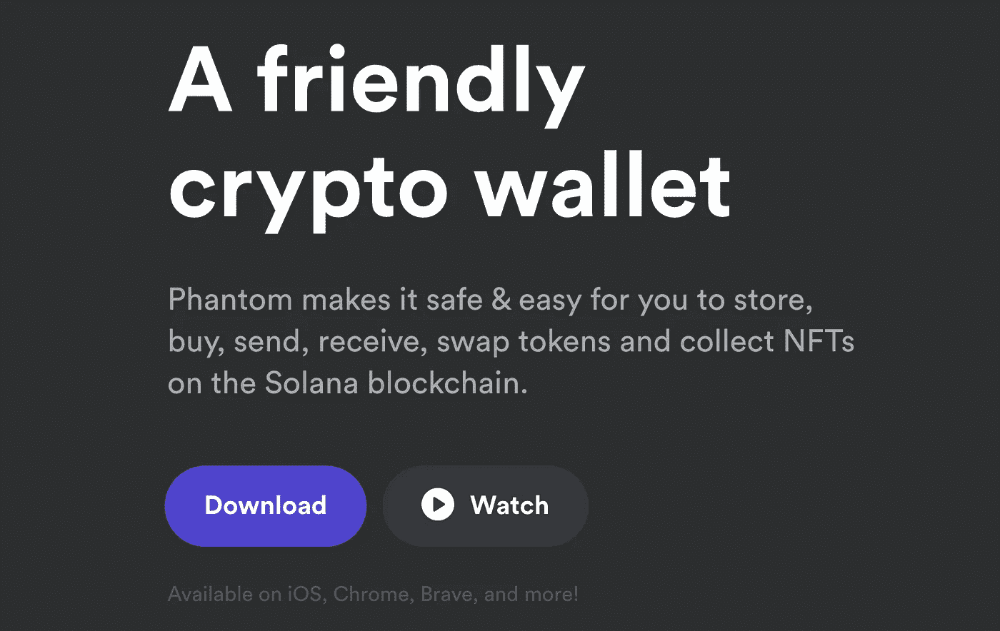
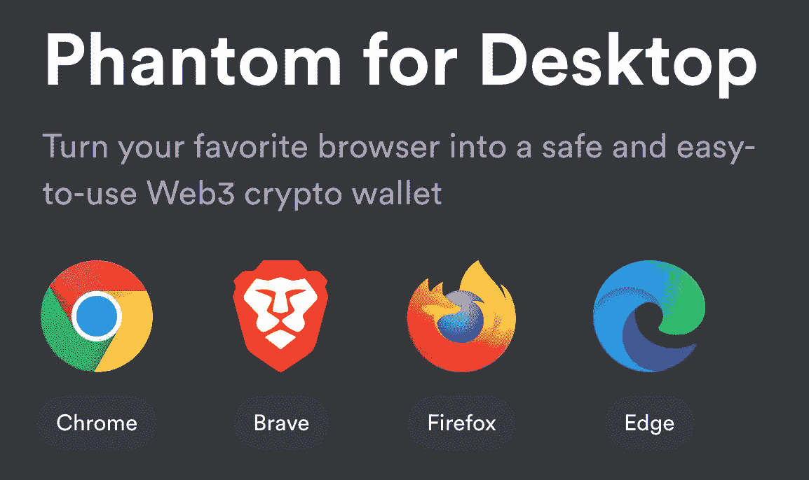
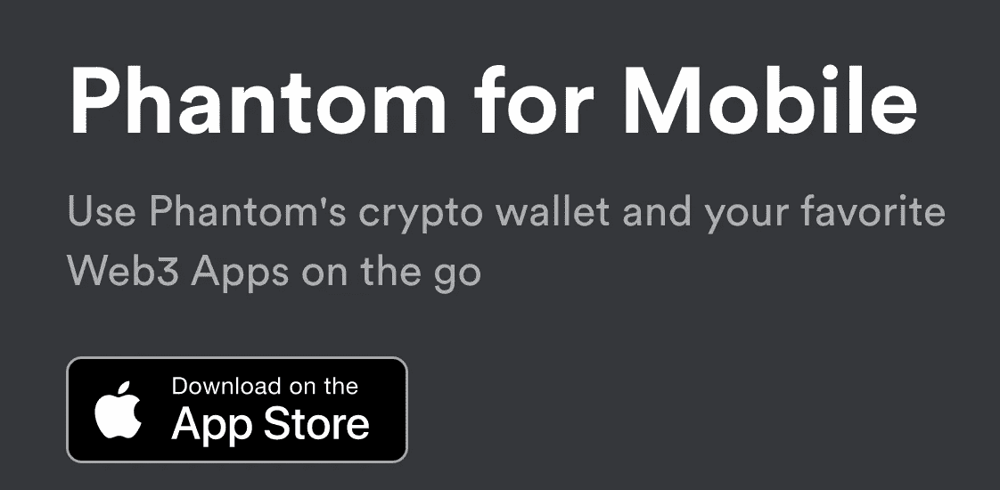
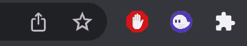

# 好了，我想我知道我想买什么了，我该怎么买！？

> 原文：<https://medium.com/coinmonks/ok-i-think-i-know-what-i-want-to-buy-how-do-i-buy-it-c61c2cd402c4?source=collection_archive---------49----------------------->

恭喜你，你现在正在成为一名成功的索拉纳 NFT 交易者和投资者！不管是谁告诉你第一步是得到索尔，他都不想看到你赢，很抱歉。严肃地说，现在是时候设置你的虚拟钱包，加载它，并获得你的第一件数码艺术品了！

还有其他几款 Solana 钱包——我们只用过 Phantom，而且是它的忠实粉丝，所以这是我们指定的一款。

Phantom security features

**前往 phantom.app**

Phantom Wallet Home Page

以此作为密码世界的经验法则:总是检查链接。就我个人而言，我们只会点击项目官方 Twitter 上的链接，或者他们 Discord 服务器上的官方链接频道。这个领域有很多骗子，而你想保证自己的安全。

一旦你上了 phantom.app(我们反复检查了这是正确的链接)，浏览网站，了解更多关于钱包的信息，它是如何工作的，以及它是如何被保护的。最终，你会想要点击下载按钮，或者获得笔记本电脑/个人电脑的浏览器扩展(Chrome、Brave、Firefox 或 Edge)，或者 iPhones 的移动应用(Android 尚不可用)。

Desktop browsers that support Phantom

Phantom on mobile

**浏览器扩展**

你将不再下载应用或程序，而是为你的浏览器添加一个扩展。因此，如果你正在使用 Chrome，你将点击“添加到 Chrome”，一个新的标签将打开，询问你是否要创建一个新的钱包，或访问一个现有的钱包。显然，你会想点击创建新的钱包，输入一个强大的，安全的密码，并同意服务条款。

这一点非常重要——你将看到一个秘密恢复短语。你应该用你的生命保护它，永远不要失去它。把它写在有形的东西上，藏在你能记住的地方。

现在你拿到钱包了！在你的浏览器中找到扩展(在 Chrome 上是右上角的拼图，在个人资料图标旁边)，找到 phantom，然后点击右边的大头针。这将使图标在地址栏的右边可见。

Where to find the Phantom extension on Google Chrome after pinning it

**向您的虚拟钱包发送资金**

登录中央交易所，购买索拉纳、USDC 或 USDT，并将其发送到您的虚拟钱包中(一些交易所不支持将 USDC/USDT 发送到索拉纳，因此您可能只能购买和转移索尔)。你可以打开钱包，点击显示“钱包 1”的地方，找到你的钱包地址。你将需要索拉纳进行交易，购买 NFT，并使用 DeFi 应用程序。

我们建议创建第二个一次性钱包，你可以用来造币。这只是保护您免受骗子和黑客攻击的又一层安全措施。每次你必须连接到一个造币网站，从你的 OG 钱包发送足够的造币到你的一次性钱包。请记住，你需要大约 0.01 索尔的交易费。(0.01 索尔对于 1 笔交易费来说已经足够了，但对于未来的交易来说也是如此)

这样，如果你的钱包被掏空了，你失去的只是你原本打算用来造币的钱。相信我们，我们听说过人们被榨干了 100 份高价值的 NFT 和 1000 份 SOL 的故事。一点都不好玩。

你已经准备好买你的第一个 NFT 了！在下一篇文章中，我们将教你如何连接到市场，理解显示的指标，并购买你的 NFT。

> 加入 Coinmonks [电报频道](https://t.me/coincodecap)和 [Youtube 频道](https://www.youtube.com/c/coinmonks/videos)了解加密交易和投资

# 另外，阅读

*   [Bitsgap 审核](/coinmonks/bitsgap-review-a-crypto-trading-bot-that-makes-easy-money-a5d88a336df2) | [Quadency 审核](/coinmonks/quadency-review-a-crypto-trading-automation-platform-3068eaa374e1) | [Bitbns 审核](/coinmonks/bitbns-review-38256a07e161)
*   [加密复制交易平台](/coinmonks/top-10-crypto-copy-trading-platforms-for-beginners-d0c37c7d698c) | [Coinmama 审核](/coinmonks/coinmama-review-ace5641bde6e)
*   [印度的加密交易所](/coinmonks/bitcoin-exchange-in-india-7f1fe79715c9) | [比特币储蓄账户](/coinmonks/bitcoin-savings-account-e65b13f92451)
*   [OKEx vs KuCoin](https://coincodecap.com/okex-kucoin) | [摄氏替代品](https://coincodecap.com/celsius-alternatives) | [如何购买 VeChain](https://coincodecap.com/buy-vechain)
*   [币安期货交易](https://coincodecap.com/binance-futures-trading)|[3 commas vs Mudrex vs eToro](https://coincodecap.com/mudrex-3commas-etoro)