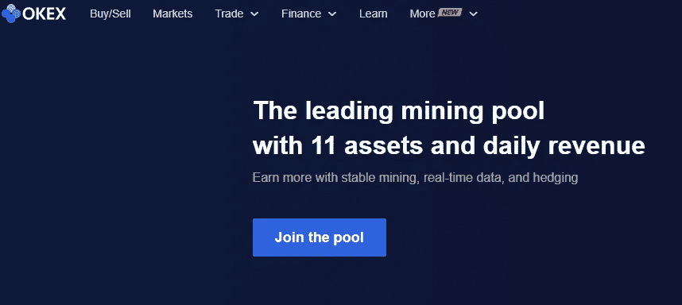
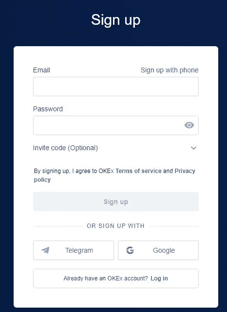

# OKEx 评论:OKEx 交易所合法可靠吗？

> 原文：<https://medium.com/coinmonks/okex-review-is-okex-exchange-legit-reliable-ab1cce33fc5b?source=collection_archive---------28----------------------->

OKEx 是一家总部位于马耳他的加密货币交易所，成立于 2014 年，一直在为全球 100 多个国家的数百万用户提供服务，交易量排名第四。除了加密货币，OKEx 还提供现货交易、期货交易和衍生品交易，因此，它被认为是世界上最大的现货和衍生品交易所(就交易量而言也是如此)。OKEx 交易平台的现任首席执行官 JayHao 在加入加密货币交易平台之前，对游戏开发有着深厚的兴趣和专业知识。

该交易所从香港开始其旅程，后来在马耳他政府对加密货币投资和交易采取完全友好的态度后，将其业务扩展到了马耳他。多年来，OKEx 获得了领先的风险投资家和投资公司的支持和投资建议，如策源风险投资公司、VentureLab、渴望资本、鳄龙公司和何谦资本管理公司，这些公司帮助数字资产交易所达到了现在的顶峰。因此，请进一步阅读这篇 OKEx 评论，了解本次交流的所有见解，并开始探索！

pics

OKEx 是从它的姐妹公司 OKCoin 中诞生的，ok coin 是一个更简单的美国加密交易所，主要面向专业加密交易者。OKCoin 只专注于加密货币交易(买卖)和 ICO 代币，而 OKEx 则为除加密货币之外的其他金融证券，如现货、期权、衍生品和杠杆交易提供了一个更复杂的平台。OKEx 在 2018 年推出了自己的“实用令牌”OKB。

该令牌既可以用于结算 OKEx 平台上的交易费用，也可以用于支付“包括客户支持服务和增强型 API 费率在内的专属服务”。在平台上注册之前，建议交易者浏览 OKEx 的各种评论，以全面了解交易所的运作方式。

[签到](https://www.okx.com/join/16597724)

# OKEx 交易所的特点

【https://www.cpagrip.com/common/offer_feed_json.php? user _ id = 598647&pubkey = fc 436 f 0 CD 7 BCB 56179784 b 235042 ca 30&tracking _ id =

OKEx 交易平台拥有一些创新功能，使其成为世界上领先的加密货币交易所之一。

*   易于使用的界面允许初学者和更有经验的交易者在平台上交易密码。
*   提供了大量的交易资产选择—超过 140 个数字代币和超过 400 个 BTC 和 USDT 对。
*   允许多种支付方式，如借记卡、信用卡、电汇、Google Pay 等。
*   提供广泛的加密交易解决方案，如现货交易、保证金交易、DEX 交易、期货、期权、永久掉期、快速交易(一站式市场)。
*   基于市场接受者和做市商模型的低费用结构。
*   零存款费用和低取款费用。
*   强有力的安全措施。
*   卓越的全天候客户服务。
*   OKEx 学院为初学者提供了一个很好的教育部分。

[https://www.okx.com/join/16597724](https://www.okx.com/join/16597724)

# OKEx 评论:利弊

和所有其他交易所一样，OKEx 有自己的优势和劣势。

# 赞成的意见

*   交易费用低。
*   交易费用低。
*   零 OKEx 押金费用。
*   接受多种付款方式。
*   大量的加密硬币可供选择。
*   允许广泛的亲交易选项，如现货，期货和衍生品交易。此外，提供保证金交易。
*   它有一个简单的界面和一个独立的移动应用程序。

# 骗局

*   美国公民不允许。
*   模拟账户不可用。
*   取款是有限制的。

# 注册过程

在 OKEx 平台上注册并不危险，只需几分钟就能完成。这里有一个一步一步的指南，介绍 OKEx [登录](https://www.okx.com/join/16597724)流程，以及如何在 OKEx 交易所注册并开始交易。

[点击这里](https://www.okx.com/join/16597724)

## 创建帐户

要在 OKEx 交易所创建交易账户，用户首先需要登录 OKEx 的官方网站，然后点击“注册”选项卡，这将打开一个注册表单，其中包含电子邮件地址(或电话号码)和密码等必填字段。用户应该创建一个强密码，因为这些是他们每次登录 OKEx 账户时需要的凭证。

接下来，一个 6 位数的 pin 码(更像是一次性密码)将被发送到给定的电子邮件地址和电话号码，必须输入该号码才能进一步进行注册过程。在 OKEx 注册时不需要 KYC，这使该交易所有别于大多数竞争对手。然而，如果任何交易者希望在 24 小时内撤回超过 100 BTC，交易所可能会要求提交 KYC 文件。

## 存款基金

现在使用 6 位 pin 码完成帐户验证后，用户必须向各自的帐户注入资金。OKEx 允许多个加密硬币进行存款，因此用户可以选择他们喜欢的加密货币来为他们的账户提供资金。有一个名为“资产”的独立选项卡，单击它将出现弹出菜单，用户可以选择“存款”选项进行存款。这将开放平台上允许的各种加密货币，它们的用户可以选择自己喜欢的。

然而，需要记住的是，用户只允许将他们在所选加密货币上收到的特定类型的加密货币转移到钱包存款地址。将钱包地址复制到用户自己的数字钱包中，然后转移加密硬币，这将结束向 OKEx 上的交易账户提供资金的步骤。为交易者的账户提供资金并开始交易的最低金额是 10 USDT 或同等金额的任何其他加密资产。

## 开始交易

OKEX 既允许加密到加密的交易，也允许直接到加密的交易。在加密对加密交易的情况下，一旦交易者在 OKEx 交易所为他们的交易账户注入资金，他们就可以直接开始这样做。OKEx 允许多种类型的交易选项，如现货交易、保证金交易、期货交易对、期权、dex 或永久掉期。

然而，在菲亚特到加密交易的情况下，用户需要点击“快速交易”选项，允许他们用菲亚特购买加密货币。点击“快速交易”选项，交易者会被询问他们想做什么——买还是卖。如果他们选择“购买”选项，接下来，他们将不得不选择任何一种受支持的法定货币，并设置他们希望用法定货币购买的特定密码的数量。然后，用户将被引导到一个单独的页面，在那里 OKEx 为第三方提供的加密货币提供最优惠的价格。

[了解更多](https://www.okx.com/join/16597724)

[针对密码初学者的电子书](https://www.digistore24.com/redir/223831/mctria/)

> 加入 Coinmonks [电报频道](https://t.me/coincodecap)和 [Youtube 频道](https://www.youtube.com/c/coinmonks/videos)了解加密交易和投资

# 另外，阅读

*   [Bookmap 评论](https://coincodecap.com/bookmap-review-2021-best-trading-software) | [美国 5 大最佳加密交易所](https://coincodecap.com/crypto-exchange-usa)
*   最佳加密[硬件钱包](/coinmonks/hardware-wallets-dfa1211730c6) | [Bitbns 评论](/coinmonks/bitbns-review-38256a07e161)
*   [新加坡十大最佳加密交易所](https://coincodecap.com/crypto-exchange-in-singapore) | [购买 AXS](https://coincodecap.com/buy-axs-token)
*   [红狗赌场评论](https://coincodecap.com/red-dog-casino-review) | [Swyftx 评论](https://coincodecap.com/swyftx-review) | [造币厂评论](https://coincodecap.com/coingate-review)
*   [投资印度的最佳密码](https://coincodecap.com/best-crypto-to-invest-in-india-in-2021)|[WazirX P2P](https://coincodecap.com/wazirx-p2p)|[Hi Dollar Review](https://coincodecap.com/hi-dollar-review)
*   [加拿大最佳加密交易机器人](https://coincodecap.com/5-best-crypto-trading-bots-in-canada) | [库币评论](https://coincodecap.com/kucoin-review)