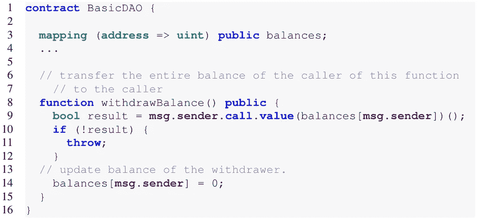
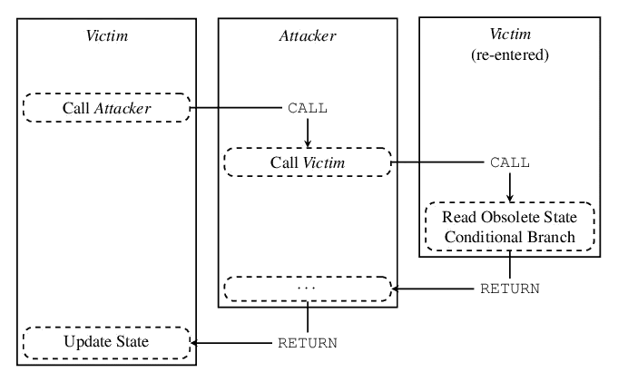
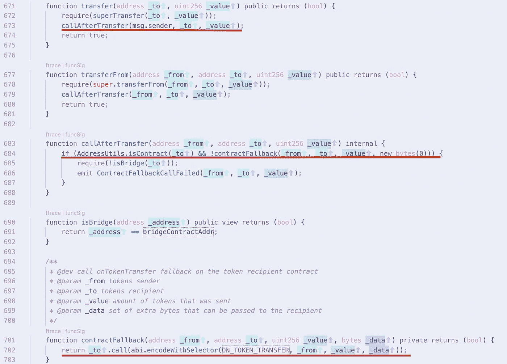
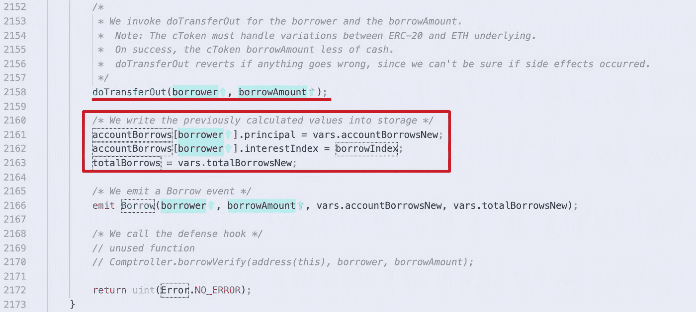
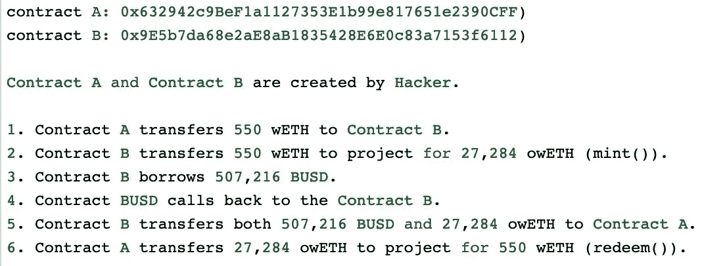
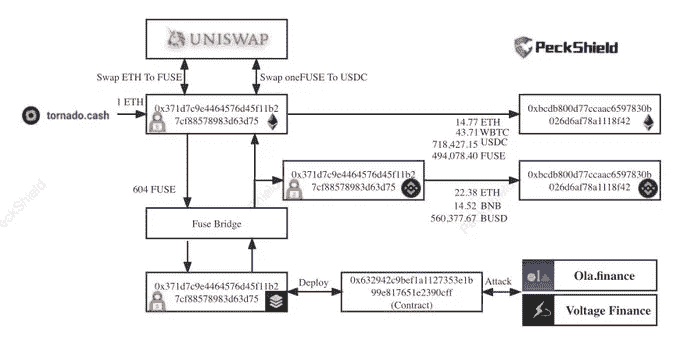
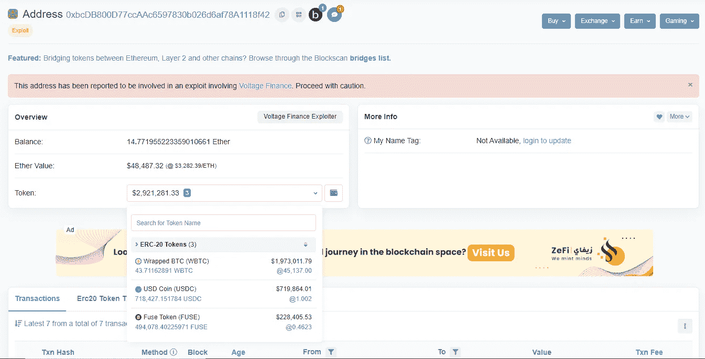
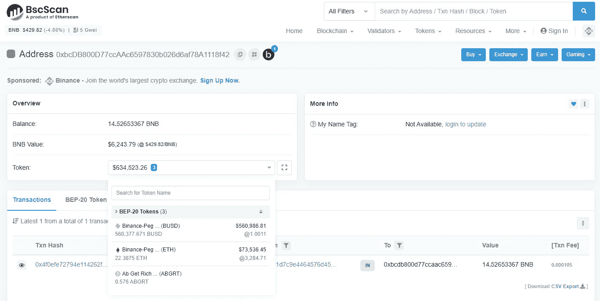

# Ola 财务黑客:事后分析

> 原文：<https://medium.com/coinmonks/ola-finance-hack-a-post-mortem-analysis-7bf498f73a54?source=collection_archive---------11----------------------->

Ola Finance 是一个贷款即服务平台，任何人只需点击一下按钮，就可以创建自己的品牌贷款网络和 Defi 模块。它是一个技术提供者，使其他人能够构建由创建者管理和控制的类似复合的实例，因为每个借出网络(LeN)由许多不同的令牌(由网络创建者确定)组成，这些令牌可以借出和借出，而无需通过不必要的和浪费时间的管理要求。

2022 年 3 月 31 日，奥拉金融被黑。

这次攻击跨越了两个协议，两个区块链和六个资产($usdc，$fusd，$busd，$wbtc，$weth & $fuse)。这是可能的，因为 Ola 的一部分构建在复合分叉(COMP)和一些基于以太坊的令牌之间缺乏兼容性。ERC677/ERC77 令牌具有内置的回调功能，这使得黑客能够滥用 Ola 的机制来耗尽访问的流动性池，并利用他们在 Fuse Chain 上构建的一个网络中价值 400 万美元的加密资产。

**重入漏洞**

当一个函数对另一个不受信任的契约进行外部调用时，就会发生可重入攻击。然后不受信任的契约对原始函数进行回调，企图榨干资金。在 borrow()函数的代码逻辑中，相关的内部状态在外部调用后被更新。具体来说，doTransferOut()函数将调用基于 ERC677 的令牌的 transfer()函数，这将最终导致外部调用。

同样的攻击已经在使用 Compound 代码的其他几个项目(Agave DAO & Bailey Finance)上进行过，应该足以警告 Ola Finance 检查他们的代码。

BlockSec

BlockSec

通过利用重新进入漏洞，攻击者能够在平台上获得贷款，提取抵押品，然后在不偿还贷款的情况下离开。被盗资金随后被转移到币安和以太坊连锁店，因此更难追回。[https://explorer . fuse . io/tx/0x 1 B3 e 06 b 6 b 310886 DFD 90 a5 df 8 ddbaf 515750 EDA 7126 cf 5 f 69874 e 92761 B1 DC 90/token-transfers？s=03](https://explorer.fuse.io/tx/0x1b3e06b6b310886dfd90a5df8ddbaf515750eda7126cf5f69874e92761b1dc90/token-transfers?s=03)

BlockSec

资助黑客的初始资金从 tornado cash 中提取，并通过 Fuse bridge 发送到 Fuse network。Voltage Finance 已经要求 USD coin operator (Circle Inc .)、Etherscan 和 CEX 团队将参与黑客攻击的地址列入黑名单。截至本文撰写之时，被利用的资金仍在黑客的钱包里。

PeckShield

学分:BlockSecTeam、Peckshield 和 Etherscsan

> 加入 Coinmonks [电报频道](https://t.me/coincodecap)和 [Youtube 频道](https://www.youtube.com/c/coinmonks/videos)了解加密交易和投资

# 另外，阅读

*   [SmithBot 评论](https://coincodecap.com/smithbot-review) | [4 款最佳免费开源交易机器人](https://coincodecap.com/free-open-source-trading-bots)
*   [比特币基地僵尸程序](/coinmonks/coinbase-bots-ac6359e897f3) | [AscendEX 审查](/coinmonks/ascendex-review-53e829cf75fa) | [OKEx 交易僵尸程序](/coinmonks/okex-trading-bots-234920f61e60)
*   [如何在印度购买比特币？](/coinmonks/buy-bitcoin-in-india-feb50ddfef94) | [瓦济克斯审查](/coinmonks/wazirx-review-5c811b074f5b)
*   [隐翅虫替代品](/coinmonks/cryptohopper-alternatives-d67287b16d27) | [HitBTC 审查](/coinmonks/hitbtc-review-c5143c5d53c2)
*   [CBET 评论](https://coincodecap.com/cbet-casino-review) | [库科恩 vs 比特币基地](https://coincodecap.com/kucoin-vs-coinbase)
*   [折叠 App 审核](https://coincodecap.com/fold-app-review) | [Kucoin 交易机器人](/coinmonks/kucoin-trading-bot-automate-your-trades-8cf0ca2138e0) | [Probit 审核](https://coincodecap.com/probit-review)