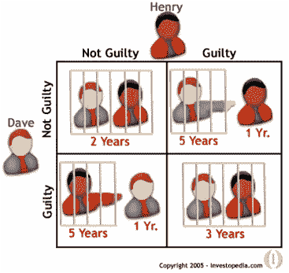
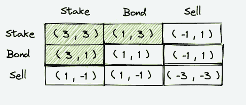
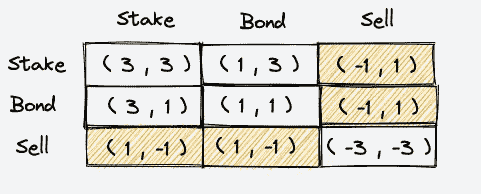
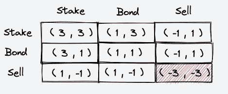
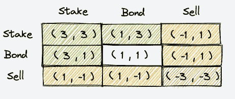
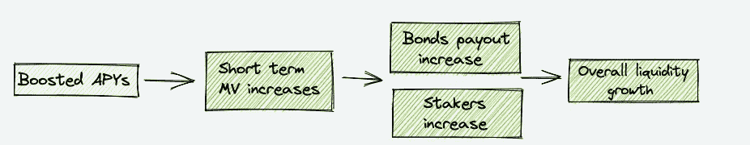
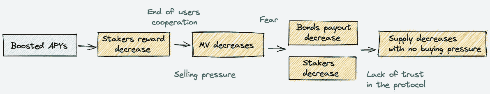
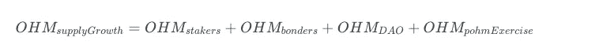
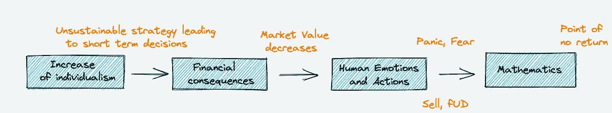
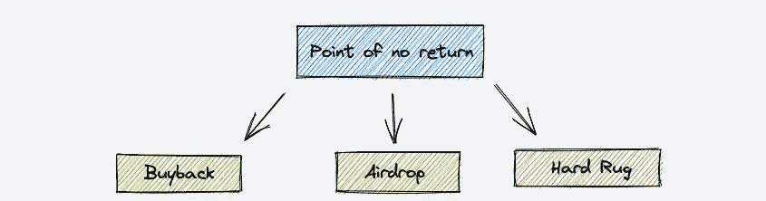

# 奥林巴斯刀叉崩溃，发生了什么，结束了吗？

> 原文：<https://medium.com/coinmonks/olympus-dao-forks-crash-what-happened-and-is-it-over-499f3e213aaa?source=collection_archive---------1----------------------->

## 数学和人类情感创造纯粹金融混乱的那一天。

> 介绍

**Olympus DAO** 是去中心化金融的一项重大创新，该系统通过拥有自己的储备货币确实暂时解决了 DeFi 1.0 中面临的流动性问题，并旨在成为一种协议拥有的储备货币。
也就是说，这篇文章将不会关注机制，而是对博弈论以及福克斯如何导致他们自己堕落的分析。
如果您想了解更多关于该协议的信息，请点击[此处](https://docs.olympusdao.finance/main/)。

> 博弈论

> 博弈论研究交互式决策，其中每个参与者或“玩家”的结果取决于所有人的行动。如果你是这种游戏的玩家，在选择你的行动路线或“策略”时，你必须考虑到其他人的选择。
> 但是在思考他们的选择时，你必须认识到他们也在思考你的选择，反过来也试图考虑到你对他们的思考，等等。
> 
> 该理论构建了一个“平衡”的概念，关于思维的复杂思维链可以汇聚到这个概念上。那么所有参与人的策略都是相互一致的，也就是说每个人都会选择自己对其他人选择的最佳对策。
> **约翰·f·纳什** ( *1928，2005* )用新颖的数学技巧证明了一类非常一般的博弈中均衡的存在。
> 来源:[https://www . PBS . org/wgbh/American experience/features/Nash-game/](https://www.pbs.org/wgbh/americanexperience/features/nash-game/)

最常见的是囚徒困境，奥林巴斯白皮书[对此进行了完美的总结。](https://docs.olympusdao.finance/main/whitepapers/game-theory)

## 博弈论:奥林匹斯道系统的核心

*以下部分需要关于博弈论的基础知识，如果这不适合你的话我奉劝这款好玩又可玩的* [*文档*](https://ncase.me/trust/) *在阅读之前。*

Olympus strategies

这个矩阵概括了持有人在协议中可以执行的所有策略，每个方框都是策略的组合，为奥林巴斯带来积极或消极的结果。

坦率地说，这些数字在数学层面上没有多大意义，但重要的是，它们对奥林巴斯来说要么是正面的，要么是负面的。
让我们根据这些策略对协议的影响来分解它们。

Olympus strategies : Case One

*绿色方框表示持有者操作的哪些策略对 OHM 最有利。*

你可能在用户名或推文中见过 **(3，3)** 符号，它是奥林巴斯最佳战略的参考。
**(3，3)** 策略确保了协议内的稳定性，并允许奥林巴斯实现其储值目标。
**(3，1)** 和 **(1，3)** 策略是结合和赌注的组合，通过确保稳定性和积累流动性来服务于协议。

Olympus strategies : Case Two

*橙色方框表示由持有者操作的哪些策略在协议内相互补偿。*

**(1，-1)** 和 **(1，-1)** 策略是奥林巴斯内部消极和积极行动的组合，要么是赌注/债券，要么是出售。
出售策略会对奥林巴斯产生负面影响，这并不奇怪，但有趣的是，由于采取了积极的行动，整体稳定。

这解释了为什么系统需要持续的流动性流动或持续的积极协调(这是**不**可实现的)以使持有者和协议受益并保持安全和稳定。

Olympus strategies : Case Three

*红框表示持有人操作的唯一一个对奥林巴斯产生负面影响的策略。*

**(-3，-3)** 策略对协议非常不利，因为它代表了没有额外流动性的抛售压力，并威胁到系统的稳定性和生存能力。
它降低价值，**直接或间接，**如果销售压力很大，会对协议的内部机制产生负面影响。

**(-3，-3)** 策略将会发生的场景是，如果每个人都认为加密货币将趋于零(例如，在熊市期间)，或者如果没有人再信任这个系统。你应该记住这一点，以备后用。

Olympus strategies : Recap

> 崩溃和市场分析

在 Dao 试图通过提供甚至无法在屏幕上显示的 APYs 来吸引和留住投资者和流动性之后，价格随之下跌。
在竞争激烈的市场中，几乎没有什么可以区分这些分叉，所有的项目在看到它是如何吸引投资者后都模仿这个过程。虽然大多数投资者都知道奥林巴斯 DAO 系统从长远来看是不可持续的，但这一趋势加速了他们的程序化下跌。

## 增强的 APYs:持有者的乌托邦

*让我们通过下图来尝试理解提供高产量的协议的意图:*

The result of Boosted APYs at T0

该策略的要点是首先通过高额赌注回报带来流动性和投资者，然后通过市值增加带来诱人的债券回报。起初它可能会工作，因为系统是全新的，用户保持合作的时间更长，这是福克斯的情况，如*冰刀*和*银河护目镜* s.
在这一点上，协议有了新的利益相关者，新的债券人和不断增加的市场价值，这是进一步发展项目的最佳条件，但发生了什么？

**剧透预警:**DAOs 没有考虑到两个主要因素，分别是**时间**和**简单的人类推理**。

## 提高 APYs:持有者的噩梦

*接下来的分析，让我们看看几个 rebase(T+1，T+2，…)之后会发生什么:*

The result of Boosted APYs at T≥T+1

**赌注者回报减少 *:*** 通过提高 APYs 几天，协议已经做出选择，用一种他们无法长期维持的高风险策略来吸引新的流动性。
在每一次重置基础后，奖励越来越少，如果用户已经获利，他们更有可能相互抛售，因为他们知道这一事件将在短期内结束。

**市值减少:**重要的是要明白，由于预热系统，获利回吐经常同时发生，这既是优点也是缺点。这个阶段可以分两个阶段发生:
1)随之而来的抛售，首先是大规模获利回吐，然后是“抄底者”在恐慌之下亏本抛售。价格永远不会回升。2)市场价值的第一次下降(获利回吐),随后多数人试图购买底部，这使得价格回升(市场价值由于错误的原因被高估，人们认为他们正在交易),最后抛售压力接管。

**债券支付减少:**债券支付是市场价值的函数，总是在协议的 dApp 中显示。

在市场价值崩溃后，债券价格通常高于市场价值，这使得比率和债券支付为负。在大多数情况下，团队没有费心做任何事情来防止或修复它，而是给债券人留下了负面的回报。
**更少的赌注:**提高产量后，开发商必须设置“低 APYs”以保持协议内的稳定性。对于那些在其他奥林巴斯道系统中可以获得更好的赌注奖励的用户来说，奖励不再有吸引力了。

在这一点上，债券人或股东没有兴趣使用该协议，特别是在市场价值崩溃和沮丧和困惑的持有人带来整体恐慌之后。

**时间因素**很重要，因为销售压力*逐渐*恶化，以及缺乏信任和合作**(简单的人类推理)**。
一旦投资者经历了“提振 APYs”策略，他们将*逐渐*使用自私的策略，因为他们现在意识到短期推理是从中获利的唯一途径。这种集体行为导致市场价值在更少的基础上崩溃，直到最后的崩溃，在此期间投资者离开协议并以亏损的价格出售他们的代币。

因此，缺乏购买压力和新的投资者使得该协议不可能按照**数学**的规则进一步发展，这一切都始于**人类心理**。

如果你想更具体，下图解释了两者之间的简化关系。

Relationship between human psychology and the mathematical PNR.

这一分析的目的是要表明，尽管 Dao 们没有做出最好的决定，但他们不可能猜到它所产生的滚雪球效应。
考虑到市场的竞争性，协议必须适应市场，它们不是市场崩溃的唯一原因。

> 奥林巴斯刀叉赛季结束了吗？

通过合作(在最佳市场条件下)和更好地控制情绪，投资者本可以阻止一些分叉到达不归点，这难道不疯狂吗？
他们罪有应得，因为无论如何，该策略都会影响协议的稳定性和可行性，但投资者基本上使其成为最终的*。我提出这一点的唯一原因是，我看到许多投资者要求 protocols 使用增强的 APYs 策略，然后指责他们造成价格暴跌。*

*如前所述，Olympus DAO 系统基于约翰·纳西的博弈论，其中玩家的决策会影响其他玩家，并奖励他们之间的合作: **(3，3)** 是协议的最佳结果。
通过优先考虑短期结果，然后在恐慌之下冲动地做出反应，投资者集体发现自己处于对持有者和协议都是最糟糕的情况，即(卖出，卖出): **(-3，-3)** 。*

## *当一个协议到了不可逆转的地步会发生什么？*

*在到达不归路后，协议有两种选择来补偿投资者使用剩余的资金，但不幸的是大多数团队放弃了项目，没有任何补偿(硬地毯)。*

**

*Strategies used after reaching PNR.*

***回购:**这是团队购买自己代币的过程，很可能是在多次交易中，以提高市值，切断亏损。
如果你是一个面临这种情况的协议，这不是最好的选择，因为它主要是受益于机器人。
**空投:这是将国库重新分配给剩余持有者的过程，这往往取决于你持有的供应量的百分比。在我看来，这种选择是公平补偿投资者的最佳方式。***

## ***那么，现在投资奥林巴斯刀叉安全吗？***

***每天仍有大量新的 OHM Forks 推出，当前最大的问题是需求和项目的可行性。大多数协议最近的崩溃和衰落向投资者表明，如果没有持续的流动性，这个系统会多么脆弱。尽管任何有据可查的人都知道这一点，但投资者会记住这一事实。***

***这意味着进入福克斯的流动性减少，剩下的投资者要么采取更安全的行动，要么试图“赚回来”，这两者都导致短期策略。现在，你知道这是如何影响最终结果的。
没有人合作**(简单的人类推理)**和长期思考**(时间因素)**这使我们回到了同样的位置，所有的分叉目前都受到这种影响。***

***请记住，加密货币市场的总体状况也是投资者应该考虑的因素，因为如果市场崩溃，人们最有可能退出波动性协议，并且当前的奥林巴斯 DAO 系统在熊市期间是不可持续的。***

*****如果投资者希望看到叉形欧姆趋势的“第二季”**，他们必须集体考虑长期问题，促进/支持协议，以获得持续稳定的流动性。
**如果 Dao 想要看到福克斯欧姆趋势的“第二季”**，他们必须做的不仅仅是模仿系统，还要想出创新的解决方案来吸引投资者并保留流动性。***

> ***加入 Coinmonks [电报频道](https://t.me/coincodecap)和 [Youtube 频道](https://www.youtube.com/c/coinmonks/videos)了解加密交易和投资***

## ***另外，阅读***

*   ***[印度最佳 P2P 加密交易所](https://blog.coincodecap.com/p2p-crypto-exchanges-in-india) | [柴犬钱包](https://blog.coincodecap.com/baby-shiba-inu-wallets)***
*   ***[八大加密附属计划](https://blog.coincodecap.com/crypto-affiliate-programs) | [eToro vs 比特币基地](https://blog.coincodecap.com/etoro-vs-coinbase)***
*   ***[最佳以太坊钱包](https://blog.coincodecap.com/best-ethereum-wallets) | [电报上的加密货币机器人](https://blog.coincodecap.com/telegram-crypto-bots)***
*   ***[交易杠杆代币的最佳交易所](https://blog.coincodecap.com/leveraged-token-exchanges) | [购买 HTZ 代币](https://blog.coincodecap.com/how-to-buy-htz-token)***
*   ***[5 大最佳社交交易平台](https://blog.coincodecap.com/best-social-trading-platforms) | [瓦济克斯 NFT 印度](https://blog.coincodecap.com/wazirx-nft-india)***
*   ***[10 本关于加密的最佳书籍](https://blog.coincodecap.com/best-crypto-books) | [英国 5 个最佳加密机器人](https://blog.coincodecap.com/uk-trading-bots)***
*   ***[ko only 点评](https://blog.coincodecap.com/koinly-review) | [Binaryx 点评](https://blog.coincodecap.com/binaryx-review)|[Hodlnaut vs CakeDefi](https://blog.coincodecap.com/hodlnaut-vs-cakedefi-vs-celsius)***
*   ***[比斯勒评论](https://blog.coincodecap.com/bitsler-review)|[WazirX vs coin switch vs coin dcx](https://blog.coincodecap.com/wazirx-vs-coinswitch-vs-coindcx)***
*   ***[赢取注册奖金——10 大最佳加密平台](https://blog.coincodecap.com/earn-sign-up-bonus)***
*   ***[最佳加密交易信号电报](/coinmonks/best-crypto-signals-telegram-5785cdbc4b2b) | [MoonXBT 评论](/coinmonks/moonxbt-review-6e4ab26d037)***
*   ***[Coinswitch 俱吠罗评论](/coinmonks/coinswitch-kuber-review-1a8dc5c7a739) | [电网交易机器人](https://blog.coincodecap.com/grid-trading) | [比特币基地收费](/coinmonks/coinbase-fees-831e77d4f2c5)***
*   ***[Bitget 回顾](https://blog.coincodecap.com/bitget-review) | [双子 vs 区块链](https://blog.coincodecap.com/gemini-vs-blockfi) | [OKEx 期货交易](https://blog.coincodecap.com/okex-futures-trading)***