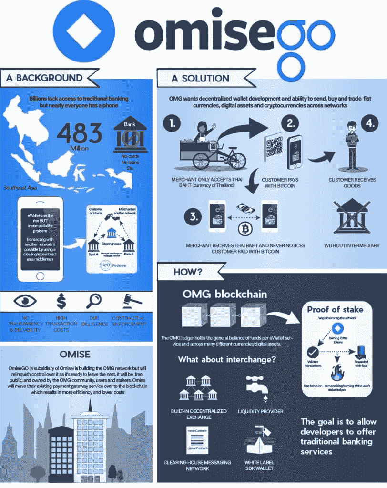

# OMG 网络(OMG):首个生产级第 2 层以太坊扩展解决方案

> 原文：<https://medium.com/coinmonks/omg-network-omg-first-production-grade-layer-2-ethereum-scaling-solution-a50472168f2d?source=collection_archive---------40----------------------->

OMISEGO (OMG)加密网络，也称为 OMISEGO，是以太坊和任何 ERC-20 令牌的价值转移网络。它自称是首个生产级第 2 层以太坊扩展解决方案。它的目标是让人们在区块链上更便宜、更快捷地转移资金和各种数字价值，而不损害安全性。

[OMG](https://www.youtube.com/channel/UC-NfGRxTkJfVbFgyJoOxzCQ)

# 什么是 OMG 网络？

OMISEGO (OMG)加密网络是一个公共的分散式网络，支持高吞吐量、低成本的点对点交易。任何人都可以通过 OMISEGO (OMG)加密网络在不同地区、资产类型和应用程序之间交换这些值。OMG 以前被称为 OmiseGo。OMISEGO (OMG)的加密网络是建立在等离子体基础上的，这是一个由以太坊创造者 Vitalik Buterin 和区块链专家 Joseph Poon 开发的框架。

> 在[**procommun.com**](https://procommun.com/)上多读些这样有趣的文章

OMISEGO (OMG)加密网络采用第 2 层等离子体架构，为希望在 ETH(以太坊)网络上构建可扩展的分散式支付应用的第三方提供高吞吐量和安全保障。此外，该网络利用其用户来管理、轻松访问和处理安全存储在区块链上的数字资产。

此外，第 2 层是建立在现有区块链系统上的次级协议。第二层协议的主要目标是解决困扰加密货币网络的交易速度和扩展困难。

OMISEGO (OMG)加密网络在以太坊的顶部构建了一个价值传输层，进一步合并以太坊交易，并在将交易返回以太坊区块链进行确认之前，通过速度优化的区块链或子链进行验证。等离子链，也称为子链，是连接到以太坊主链的独立区块链。

# OMG 网络的历史

如上所述，OMISEGO (OMG)加密网络也称为 OMISEGO，于 2017 年推出。这家 OmiseGo 背后的公司是 Omise，一家支付网关提供商，总部设在泰国。Omise 本身成立于 2013 年，ICO(首次发行硬币)发生在 2017 年，筹集了 2500 万美元。

长谷川润领导 Omise 团队，在来 Omise 工作之前，他是 Alpha-do Inc .的董事，也是 LIFEmee Inc .的联合创始人兼首席执行官。该团队的其他著名成员包括 Anuchit Chitpirom(首席运营官)、Ezra Don Harinsut(首席执行官/联合创始人)、June Seah(首席业务发展官)、Frederico Araujo(首席信息官)、Nick Gan(首席增长官)、Kazuhiro Koiso(首席财务官)和 Max Rokhline(首席产品官)。

> 在**上多看些这样有趣的文章**

****

**OMISEGO (OMG)加密网络通过实施一个通常被称为“更可行的等离子体(MoreVP)”的扩展系统来显著提高交易吞吐量，从而解决了可扩展性问题。特别是 OMISEGO (OMG)加密网络基金会将交易捆绑在一起，压缩成一个交易，在 OMG 基金会的子链上进行验证。之后，子链将确认的交易返回给以太坊进行区块链确认。由于捆绑技术；OMG 基金会每秒可以处理数千笔交易。因为煤气费或以太坊上的交易费是在捆绑的压缩交易中支付的，而不是在每次交易中支付的，所以交易成本是以太坊上的三分之一。**

# **OMG 网络的主要组成部分是什么？**

**以下是 OmiseGo (OMG)加密网络的三个主要组成部分:**

1.  **部署到以太坊的 **OMISEGO (OMG)加密网络**智能合约提供了一个接口，不同的用户可以通过这个接口将资金转入和转出网络。**
2.  **其次，OmiseGo (OMG)加密网络团队管理的子链应用程序接收用户的交易，进一步将它们组合成块，并将这些块共享给 OmiseGo (OMG)加密网络智能合约。**
3.  **Watcher 应用程序观察子链应用程序，验证行为并向订阅用户报告任何错误行为。**

# **奥米塞戈加密网络的财务状况**

**OMG 令牌是平台的实用令牌，也是与平台交互的主要模式。像其他流行的加密货币一样，它也基于 ERC-20 令牌标准。这些 OMG 令牌的总供应量约为 140，245，398 个，其中 65.1%是公共 ICO(初始硬币发行)，5%在用户钱包中免费与用户共享，20%作为 OMG 网络的储备。除此之外，剩下的 9.9%都留给了团队。**

> **原载于[**procommun.com**](https://procommun.com/2022/04/technology/omg-network-omg-first-production-grade-layer-2-ethereum-scaling-solution/)**