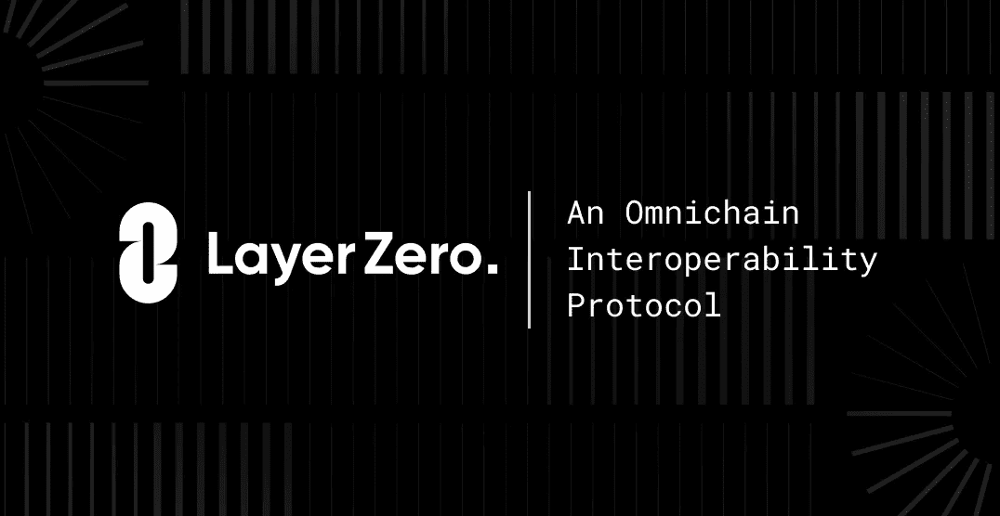

# Omnichain NFTs:它们是什么以及它们为什么重要！！

> 原文：<https://medium.com/coinmonks/omnichain-nfts-what-they-are-and-why-they-matter-ba03de9c97a2?source=collection_archive---------4----------------------->

Flow.

最近每个人都在谈论 omnichain NFTs。

但是到底什么是全链 NFT 呢？

如果你对什么是全链 NFT 一无所知，不用担心——这篇文章将向你展示你需要知道的关于这种最近席卷了秘密经济的现象的一切。

# 了解 Omnichain NFTs

LayerZero

最近对 omnichain 的兴趣激增与 LayerZero 实验室的崛起有关，这是一个总部位于加拿大的团队，负责构建互操作性协议 LayerZero。

简而言之，LayerZero 是消息传递的传输层，它允许智能合约在许多或任何区块链之间轻松通信。

如果你想深入研究，请查看该协议的白皮书[这里](https://layerzero.network/pdf/LayerZero_Whitepaper_Release.pdf)。

该协议目前支持使用以太坊虚拟机(EVM)的区块链，例如以太坊、雪崩、多边形。然而，LayerZero 团队计划增加对非 EVM 连锁店如 Cosmos hub 和 beyond 的支持。

 [## 最佳加密税务软件——评论和比较

### 不管你是刚接触加密还是已经在这个领域呆了一段时间，你都需要交税。

medium.com](/coinmonks/best-crypto-tax-tool-for-my-money-72d4b430816b) 

# LayerZero 协议是如何工作的

要理解 LayerZero 协议是如何工作的，您必须比较 omnichain 和 crosschain & multichain。

当两个或多个不同的区块链可以直接通信时，就会发生跨链事务。多链技术允许项目同时存在于至少两个区块链上。例如:波尔卡多特和宇宙。

LayerZero 协议的功能与上面提到的不同…

例如，跨链模型需要使用一个桥将资产直接迁移或包装到其他链上。如果你跨过浪人桥使用[武士刀](https://katana.roninchain.com/)，你的 ETH 直接从以太坊移动到浪人。

LayerZero 协议只有消息传递，没有中间层、包装等。它可以即时支持任何支持消息传递层的链，无需额外的信任假设或单独的共识。

这个过程与流行的以太坊 L2 缩放解决方案非常不同。

# 全链 NFT 的兴起

Two Chains; One Chain.

全链 NFT 是可以存在于两个或更多链中的 NFT。

最近几个月，随着莱泽罗的到来，人们对他们的兴趣大增。

现在，NFT 可以以更广泛的方式存在。

想象一下，在以太坊 L1 上拿着一个 NFT，同时仍然在 L2 缩放解决方案上使用它。

但是，omnichain NFTs 并不新鲜，也不局限于 LayerZero。比如 UMA 看好的 Oracle 已经有一些 omnichain 的功能。还有一些其他项目，如 Axie Infinity 和 CoolCats，弥补了 L1 和 L2 NFT 之间的差距。

我相信，随着时间的推移，我们会看到更多的项目采用新的方法来开展全链条 NFT 活动。

就是这样！

如果你通读…

谢谢你。

学到什么了吗？

让我在评论中知道。

页（page 的缩写）s:灵感来自无银行的文章。

> 加入 Coinmonks [电报频道](https://t.me/coincodecap)和 [Youtube 频道](https://www.youtube.com/c/coinmonks/videos)了解加密交易和投资

# 另外，阅读

*   [币安期货交易](https://coincodecap.com/binance-futures-trading)|[3 commas vs Mudrex vs eToro](https://coincodecap.com/mudrex-3commas-etoro)
*   [如何购买 Monero](https://coincodecap.com/buy-monero) | [IDEX 评论](https://coincodecap.com/idex-review) | [BitKan 交易机器人](https://coincodecap.com/bitkan-trading-bot)
*   [CoinDCX 评论](/coinmonks/coindcx-review-8444db3621a2) | [加密保证金交易交易所](https://coincodecap.com/crypto-margin-trading-exchanges)
*   [红狗赌场评论](https://coincodecap.com/red-dog-casino-review) | [Swyftx 评论](https://coincodecap.com/swyftx-review) | [CoinGate 评论](https://coincodecap.com/coingate-review)
*   [Bookmap 评论](https://coincodecap.com/bookmap-review-2021-best-trading-software) | [美国 5 大最佳加密交易所](https://coincodecap.com/crypto-exchange-usa)