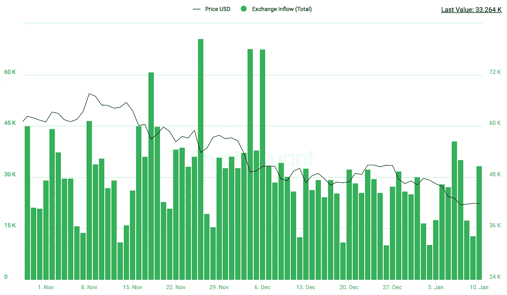

# 海恩周报第 52 期(2022 年第 1 周)

> 原文：<https://medium.com/coinmonks/on-%D1%81hain-weekly-report-52-b9945bd21c6b?source=collection_archive---------12----------------------->

联邦公开市场委员会会议纪要的发布压低了比特币以及许多其他资产的价格。主要关注点与加息、加速缩减量化宽松以及潜在的量化紧缩有关，以减轻央行的资产负债表。期货未平仓合约已经增加到新的水平，许多多头头寸被平仓，现在可能的空头挤压正在形成。

根据币安(BTC/USDT 组合)的数据，比特币本周以 47281 美元开盘，周六跌至 40491 美元的低点。此前一周，比特币价格下跌了约 15%。

本周，我将在报告中更多关注期货市场的未平仓头寸水平、比特币流入和流出、矿商储备和其他指标。

> 自 12 月 4 日以来，永久未平仓合约达到了 264，000 BTC**的历史新高，上涨了 42%**

****

> **币安期货未平仓合约份额增长了 9.4%，目前市场份额超过 30%。按公开利息市场份额计算，第二大交易所是 FTX，占 19%的市场份额。**

****

> **所有交易所的美元储备持平。由于储备价值将上升，这将表明更高的抛售压力。**

****

> **上周现货交易所的比特币流入量处于中等水平。**

****

> **现货交易所的比特币外流没有增长。低值表明现货交易所的抛售压力增加。**

****

**矿工头寸指数(MPI ),显示矿工总流出量(美元)与其矿工总流出量(美元)的一年移动平均值的比率。
当前的低价值表明，矿商没有发送比平时更多的硬币，这并不表明抛售。**

****

> **交易所鲸鱼比率是前 10 大流入量与现货交易所的比率。
> 低值表示鲸鱼没有大量使用交易所，可能在场外市场交易。**

****

> **交易所稳定硬币比率是硬币储备除以交易所持有的所有稳定硬币。低价值意味着购买力，这可能导致价格上涨。**

****

> ***总结:***
> 
> **过去 2 个月比特币经历了熊市，但长期结构仍然看好 2022 年。与 2022 年底相比，Q1 2022 的宏观结构看起来更加强大。期货未平仓合约已经增加到新的水平，许多多头头寸被平仓，现在可能的空头挤压正在形成。市场非常不稳定，对新闻非常敏感。**

**来源:[https://insights.glassnode.com/](https://insights.glassnode.com/)，[https://studio.glassnode.com/metrics?a=BTC&m =地址。https://alternative.me/crypto/fear-and-greed-index/](https://studio.glassnode.com/metrics?a=BTC&m=addresses.ActiveCount)、[https://cryptoquant.com/](https://cryptoquant.com/)、[https://www.tradingview.com/](https://www.tradingview.com/)，**

> **加入 Coinmonks [电报频道](https://t.me/coincodecap)和 [Youtube 频道](https://www.youtube.com/c/coinmonks/videos)了解加密交易和投资**

# **另外，阅读**

*   **[SmithBot 评论](https://coincodecap.com/smithbot-review) | [4 款最佳免费开源交易机器人](https://coincodecap.com/free-open-source-trading-bots)**
*   **[比特币基地僵尸程序](/coinmonks/coinbase-bots-ac6359e897f3) | [AscendEX 审查](/coinmonks/ascendex-review-53e829cf75fa) | [OKEx 交易僵尸程序](/coinmonks/okex-trading-bots-234920f61e60)**
*   **[如何在印度购买比特币？](/coinmonks/buy-bitcoin-in-india-feb50ddfef94) | [瓦济克斯审查](/coinmonks/wazirx-review-5c811b074f5b)**
*   **[隐翅虫替代品](/coinmonks/cryptohopper-alternatives-d67287b16d27) | [HitBTC 审查](/coinmonks/hitbtc-review-c5143c5d53c2)**
*   **[CBET 评论](https://coincodecap.com/cbet-casino-review) | [库科恩 vs 比特币基地](https://coincodecap.com/kucoin-vs-coinbase)**
*   **[折叠 App 审核](https://coincodecap.com/fold-app-review) | [Kucoin 交易机器人](/coinmonks/kucoin-trading-bot-automate-your-trades-8cf0ca2138e0) | [Probit 审核](https://coincodecap.com/probit-review)**
*   **[如何匿名购买比特币](https://coincodecap.com/buy-bitcoin-anonymously) | [比特币现金钱包](https://coincodecap.com/bitcoin-cash-wallets)**
*   **[币安 vs FTX](https://coincodecap.com/binance-vs-ftx) | [最佳(SOL)索拉纳钱包](https://coincodecap.com/solana-wallets)**
*   **[比诺莫评论](https://coincodecap.com/binomo-review) | [斯多葛派 vs 3Commas vs TradeSanta](https://coincodecap.com/stoic-vs-3commas-vs-tradesanta)**