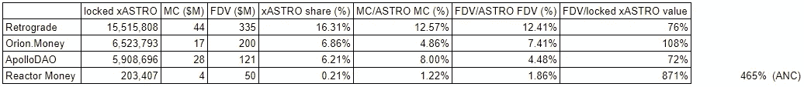
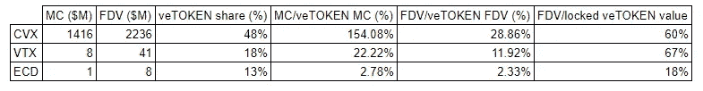
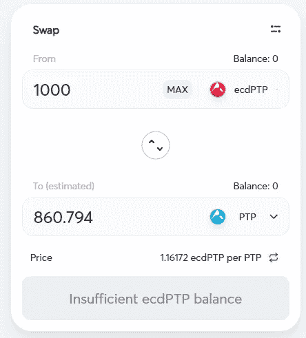
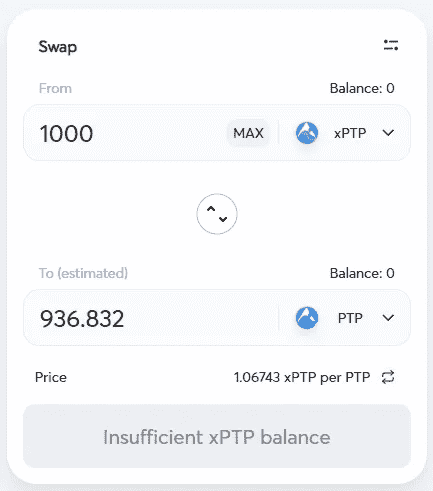
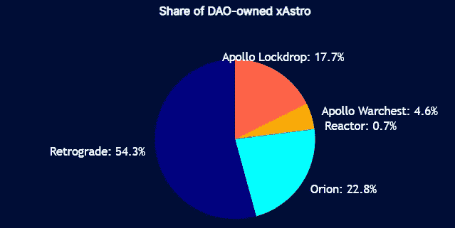
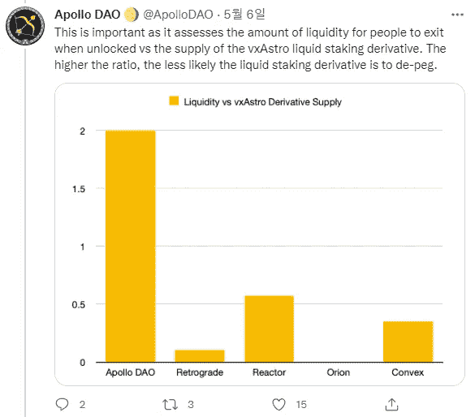

# 关于星球大战

> 原文：<https://medium.com/coinmonks/on-astro-wars-19e749832f10?source=collection_archive---------18----------------------->

# 0.介绍

Terra 生态系统中的杰出和主导 DEX astro port 最近宣布了其期待已久的投票托管系统 vxASTRO，该系统将在几天内上线。尽管是这个行业的后来者，Terra (LUNA)已经成长为 TVL 最大的加密经济体之一，仅次于以太坊。

曲线战争非常重要，自从 Curve.fi 引入投票托管令牌组学(veTokens)以及随后囤积 veTokens 的 Convex 的到来，所有 DeFi 爱好者都呼吁他们最喜欢的协议来实现 veTokens 并煽动*(插入令牌)*战争。

由于曲线战的机制已经被彻底研究过了，我就不多讲背景了。目前，知道 Astroport 建立了一个与 Curve.fi 非常相似的 veToken 模型就足够了——投资者可以锁定其治理令牌 ASTRO，作为投票锁定令牌 vxASTRO，利用它他们可以控制每个流动性池的 LP 奖励排放。

仅仅通过激励来关注否决权的积累是很诱人的，因为锁定是不可逆的，但还有一个因素是至关重要的:挂钩稳定性。

# 1.参与者

当然，如果没有战斗人员，就不会有战争。截至 5 月 8 日，共有 5 个协议宣布加入星战:两个新生儿协议(逆行，反应堆钱)，三个老派协议(阿波罗道，猎户座钱，光谱协议)。每个人都有独特的接近战场的策略，但是他们的目标基本上是一样的——囤积更多的太空人。

在 5 个参与者中，反应堆资金承认他们的不足，并退出了天文战争，以积累 ANC，锚协议的治理令牌；光谱协议确实陈述了他们的使命和策略，但是还没有开始积累，因此天体战争的积极参与者是逆行者、阿波罗道和猎户座金钱。

虽然我不会深入研究这些协议的策略，因为这不是我写作的目的，但我至少会总结一下这些协议的目的。

**逆行**

*   新生儿协议完全是为了成为第一号太空囤积者而建立的
*   模仿凸面，使逆向发射与锁定的天体生长相关联
*   将在 Astroport 上为 rexASTRO-ASTRO 推出 stableswap 对

**阿波罗道**

*   已经工作的产量优化器
*   将放弃一些收益，为 zvxASTRO 建立深度流动性

**猎户币**

*   已经开展跨链 DeFi 服务
*   有一些小 NFT 滴在星球大战中，以提高产量

我找不到太多关于 Orion Money 战略的信息，逆行和阿波罗道之间的主要区别在于，前者是为星际战争的唯一目的而建造的，因此它可以比后者部署更多的激励措施。

# **2。性能**

每个协议在战争中进展如何？

Table of results

大多数数字都是不言自明的，我想把重点放在最右边的一列:FDV/锁定的 xASTRO 值，它实际上显示了每个锁定的 xASTRO 值多少 FDV。这可能是一个不公平的衡量标准，因为猎户座金钱和阿波罗道是**而不是**为星际战争的唯一目的而建造的，但它仍然有助于抓住价值感。

Reactor Money 很快调整了策略，从积累 ASTRO 转向积累 ANC，但即使计入 ANC，它的估值仍然过高。反应堆资金**是为了囤积否决权而建造的**，所以没有很多否决权是一个不好的迹象。

对于其他协议，它们的值大致相同，为锁定 xASTRO 值的 0.7x ~ 1.0x。我来查一下同行，看他们的估值是否公平。

Other Convex-style protocols

CVX 是锁定 CRV 的凸型协议；VTX 和 ECD 锁定 PTP，也就是雪崩的 CRV。现在 Fantom 链运行了各种 veToken 索引，但是我现在忽略了这个链，因为没有累积单个 veToken 的凸型协议。(VTX 买了 PTP **和**乔，但功能相对较新。)

因此，看看第一个 to 条目，veToken 囤积者的估值为锁定 veToken 价值的 0.7 倍似乎是合理的——直到我看到第三个条目 ECD。

即使在最近的 BTC 崩盘之前，ECD 相对于其竞争对手 VTX 的相对价格一直表现不佳。PTP 机制并不妨碍少数人获得更高的收益率，因此看到 ECD 的价值落后如此之多令人感到奇怪。

成为战争中的失败者会让名誉损失到那种程度吗？事实上，我对这个现象有更好的解释。

A screenshot from TraderJoe

A screenshot from TraderJoe

从一开始，ecdPTP-PTP 的利差就一直大于 xPTP-PTP。

凸模型的全部目的是授予“锁定的 veTokens 的液体导数”如果流动性衍生品以 90%的折扣交易，那将毫无用处，因为如此巨大的折扣无论如何都会阻碍流动性。

VTX 协议和 ECD 协议都指出，这两个团队没有进行任何操纵来保持钉住汇率，因此钉住汇率的稳定性完全由市场决定——资金池深度。

# 3.太空战争的胜利者

最初的天体积累阶段已经过去，很明显逆行遥遥领先。

source : astro-wars.xyz

由于更多的流动性保证了流动性衍生品对的更好的互换率，逆行肯定会是最好的选择，但我不会把阿波罗排除在外。

source : ApolloDAO Twitter

ApolloDAO 已经知道了挂钩的重要性，他们甚至牺牲了自己的收益，并阐明了在发生 depeg 事件时，他们将如何使用自己的资金回购流动性衍生品。

只要 peg 优势存在(如果有的话)，ApolloDAO 虽然在数量上可能不会取代逆行，但它仍然比其他参与者有更好的机会推动更多的天文和更多的价值。

> *加入 Coinmonks* [*电报频道*](https://t.me/coincodecap) *和* [*Youtube 频道*](https://www.youtube.com/c/coinmonks/videos) *了解加密交易和投资*

# 另外，阅读

*   [有哪些交易信号？](https://coincodecap.com/trading-signal) | [Bitstamp vs 比特币基地](https://coincodecap.com/bitstamp-coinbase) | [买索拉纳](https://coincodecap.com/buy-solana)
*   [ProfitFarmers 点评](https://coincodecap.com/profitfarmers-review) | [如何使用 Cornix 交易机器人](https://coincodecap.com/cornix-trading-bot)
*   [十大最佳加密货币博客](https://coincodecap.com/best-cryptocurrency-blogs) | [YouHodler 评论](https://coincodecap.com/youhodler-review)
*   [my constant Review](https://coincodecap.com/myconstant-review)|[8 款最佳摇摆交易机器人](https://coincodecap.com/best-swing-trading-bots)
*   [MXC 交易所评论](/coinmonks/mxc-exchange-review-3af0ec1cba8c) | [Pionex vs 币安](https://coincodecap.com/pionex-vs-binance) | [Pionex 套利机器人](https://coincodecap.com/pionex-arbitrage-bot)