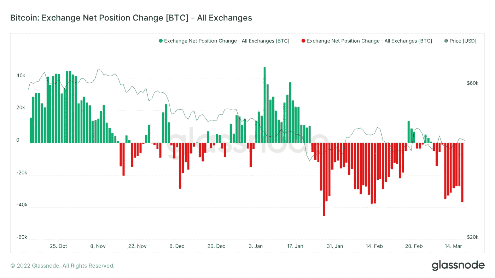
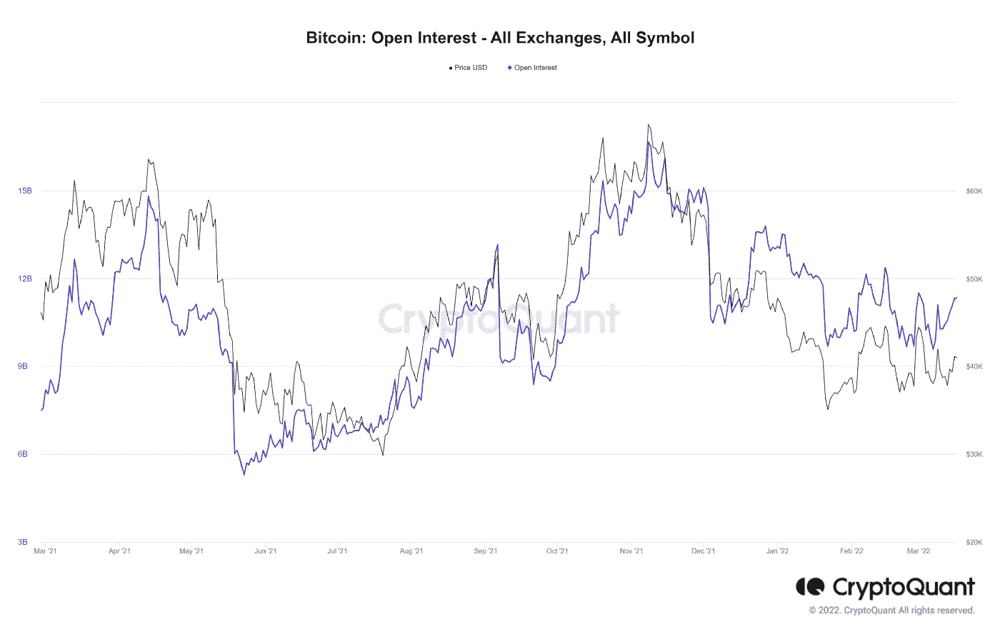
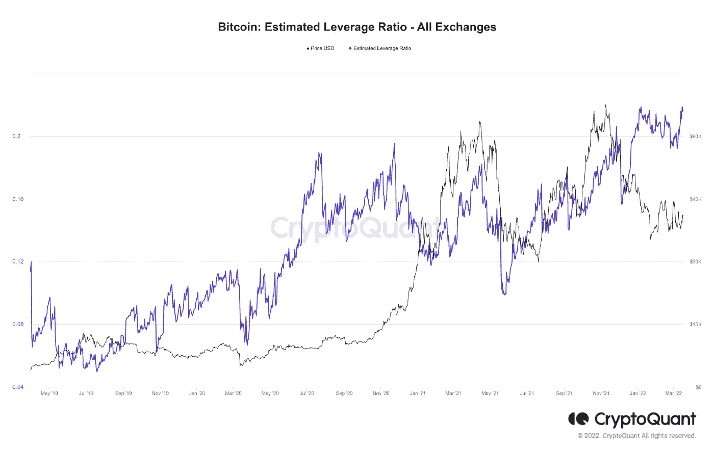
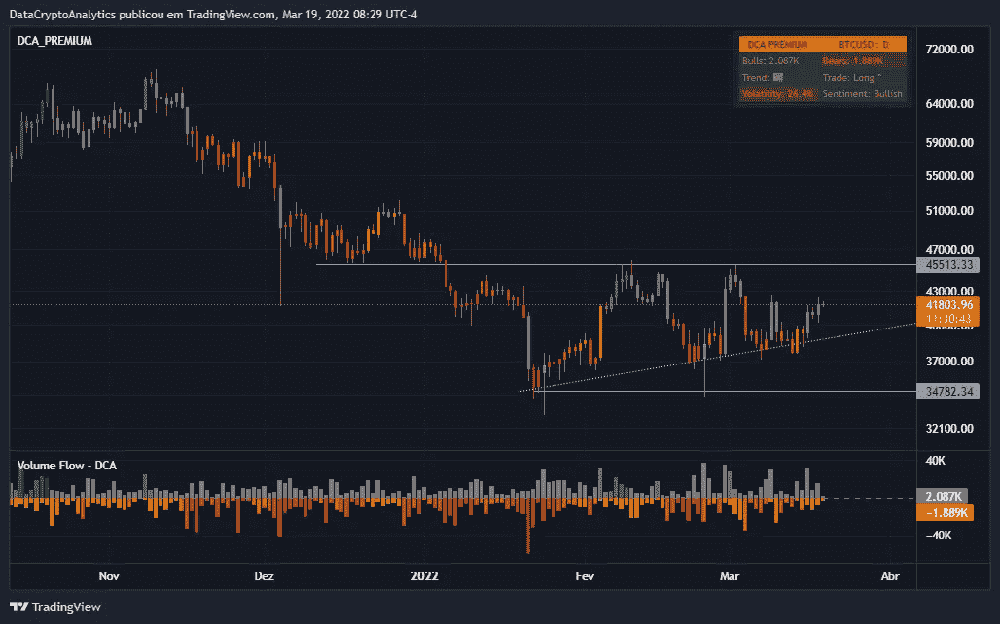
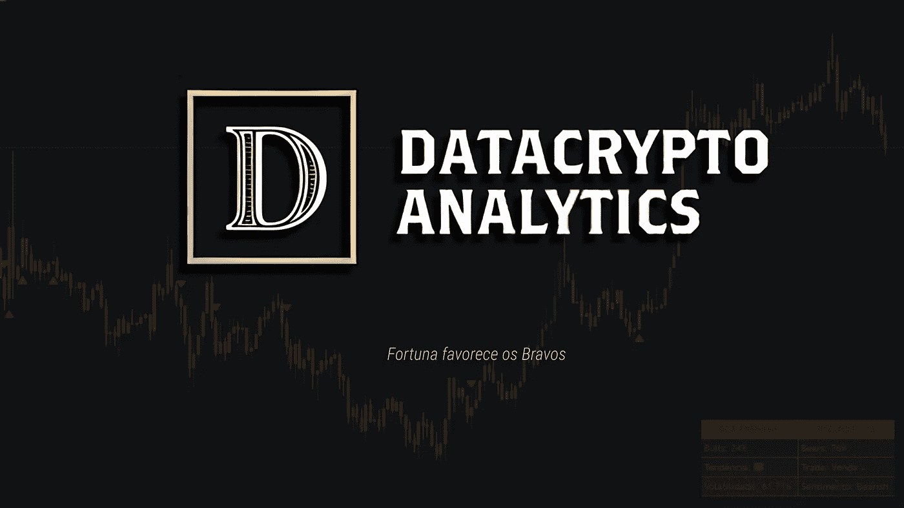

# 链上分析—比特币#2

> 原文：<https://medium.com/coinmonks/on-chain-analysis-bitcoin-2-62d058a15cc4?source=collection_archive---------18----------------------->

给多头带来希望的是“交易所净头寸变化(BTC)指标”，该指标目前处于红色，表明比特币出现净流出。3 月 11 日大约有 36，600 个比特币离开了集中交易所，3 月 16 日有 13，000 个。

尽管资金净流入略有增加，但过去一周的大规模资金流出表明，机构投资者或高净值投资者持乐观态度，他们预计股市将上涨，正在将手中的资金转移到冷钱包里。

Exchange Net Position Change [BTC]

事情看涨的一面看起来很酷，并支持比特币价格上涨的可能性。然而，未平仓合约(OI)图并不意味着看涨。自 1 月 12 日以来，投资回报率在 125 亿至 96 亿之间波动。最近，这个数字已经下降到 110 亿，并且自 2021 年 11 月 8 日以来一直在下降，这表明缺乏鲸鱼的参与。

如果石油指数上升而价格保持平稳，这将是一个看涨的信号。然而，由于缺乏上升，向上移动的可能性仍然受到抑制。

Open Interest (OI)

支持这一观点的未平仓头寸(OI)是比特币价格的估计杠杆率。高比率表明许多投资者用荒谬的杠杆交易。这样的市场条件不支持看涨。通常，与这些交易者的方向相反的小波动可能会导致大规模的清算，重新设置场景，并允许聪明的资金长期定位自己。

因此，期货交易者需要密切关注这张图表，因为它显示了投降式走势的可能性。还有，这个指标在完全反转之前总是下降；2020 年 3 月和 2021 年 9 月的崩盘就是很好的例子。

此外，估计杠杆率在 3 月 15 日创下 0.218 的历史新高，进一步表明市场有多紧张。

Estimated Leverage Ratio

BTC 估计杠杆指数在链上和市场指标的假设下，熊市情景将包括比特币价格打破上升三角形的斜边，使其无效，并下跌以重新测试每周美元的支持水平。34,782.

在这里，买家有另一个引发挤兑的尝试；然而，日蜡烛线收盘低于它将创造一个更低的低点，并使看涨论点无效。在这种情况下，BTC 可以跌至 30，000 美元或 29，100 美元以下，以从其下方的卖方收集流动性。

 [## 文献馆

### 但是萨巴人和我们一样，把服务的各个方面都做了详细的介绍。使用 o painel…

dc-analytics.gitbook.io](https://dc-analytics.gitbook.io/docs/)  [## #canal —数据加密分析

### 官方运河。

t.me](https://t.me/dc_analytics)  [## #grupo —数据加密分析

### Grupo——数据加密分析 Grupo da DCA comícias and analyses de criptomoedas e Forex。Seja 成员 e…

t.me](https://t.me/datacryptoanalytics)  [## 数据加密分析

### 常见问题——Perguntas 经常去 funciona 吗？开放源代码 hospidados em nosso GitHub…

datacryptoanalytics.com](https://datacryptoanalytics.com/) 

> 加入 Coinmonks [电报频道](https://t.me/coincodecap)和 [Youtube 频道](https://www.youtube.com/c/coinmonks/videos)了解加密交易和投资

# 另外，阅读

*   [币安期货交易](https://coincodecap.com/binance-futures-trading)|[3 commas vs Mudrex vs eToro](https://coincodecap.com/mudrex-3commas-etoro)
*   [如何购买 Monero](https://coincodecap.com/buy-monero) | [IDEX 评论](https://coincodecap.com/idex-review) | [BitKan 交易机器人](https://coincodecap.com/bitkan-trading-bot)
*   [CoinDCX 评论](/coinmonks/coindcx-review-8444db3621a2) | [加密保证金交易交易所](https://coincodecap.com/crypto-margin-trading-exchanges)
*   [红狗赌场评论](https://coincodecap.com/red-dog-casino-review) | [Swyftx 评论](https://coincodecap.com/swyftx-review) | [CoinGate 评论](https://coincodecap.com/coingate-review)
*   [Bookmap 评论](https://coincodecap.com/bookmap-review-2021-best-trading-software) | [美国 5 大最佳加密交易所](https://coincodecap.com/crypto-exchange-usa)