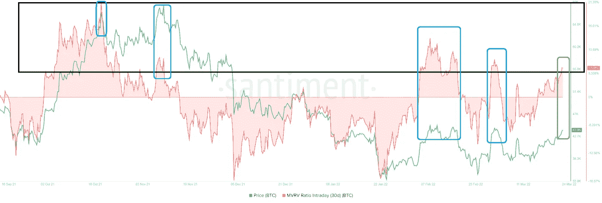
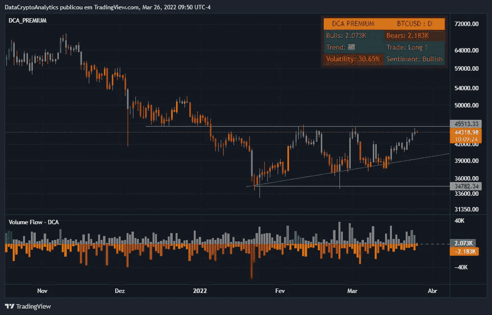

# 链上分析—比特币#3

> 原文：<https://medium.com/coinmonks/on-chain-analysis-bitcoin-3-a3e4458e7526?source=collection_archive---------29----------------------->

加密货币的市值为 2.07 万亿美元，上周增长了+5.64%。1 周全球加密货币交易量为 1.33 万亿美元，增长了+18.06%(其中 49%，即 6479.8 亿美元为透明交易量)。比特币优势度为 41%，代表最近 7 天的涨幅为+0.51%。

购买压力的增加似乎清算了一些卖空者，但链上交易量和每日活跃地址(DAA)并没有反映出任何异常。

说实话，自 3 月 2 日以来，DAA 的数量已经从 109 万减少到 95 万。同期的环比成交量保持在 300 亿左右。

BTC DAA, on-chain volume

BTC·DAA，环比成交量 30 天内市场价值实现值(MVRV)类似于 MVRV 指标，用于确定过去一个月购买 BTC 的投资者的平均盈亏。

MVRV 指标的增加表明，短期持有人正在受益，并有可能从出售中受益。对于比特币来说，买盘压力的进一步增加推动日内 30 天 MVRV 达到 6.5%。

有趣的是，最近几次比特币达到 44000 美元或更高时，这个列表也在 6%以上，表示接近顶部，导致 15%至 20%的下跌。假设历史是任何迹象，交易者需要保持警惕，提防可能的下跌。

Intraday 30-day MVRV of the BTC

此外，市场情绪显示，投资者在最近一周迅速从“极度恐惧”转为“中性”。最近两次，恐惧和贪婪指数达到 50 至 54，BTC 经历了一次修正。当这个指标在 47 上下波动时，交易者需要问这个上涨是否会打破这个模式，或者历史会重复同样的事情。

BTC Fear and Greed Index

虽然保持看涨更简单，但交易者应该为看跌做好准备。假设比特币价值未能突破上升三角形的上趋势线 44，418 美元，它可能会反转并重新测试下趋势线 40，000 美元或 38，000 美元。

在可以想象的最可怕的结果中，比特币可能会突破每日需求区，从 38，895 美元扩展到 36，398 美元，引发跌至 35，000 美元。假设多头忽略这一支撑位，这将使反弹无效，下跌至 30，000 美元或更低是可能的。

Bitcoin Daily Chart with DCA Indicators

 [## 证明文件

### 在接下来的几页中，详细了解我们以及如何使用我们服务的各个方面…

dc-analytics.gitbook.io](https://dc-analytics.gitbook.io/docs/)  [## #通道—数据加密分析

### 官方 DCA 渠道。

t.me](https://t.me/dc_analytics)  [## #group —数据加密分析

### group-data crypto Analytics 免费 DCA group，提供加密货币和外汇新闻及分析。成为会员并…

t.me](https://t.me/datacryptoanalytics)  [## 数据加密分析

### 加密货币和外汇交易策略…

datacryptoanalytics.com](https://datacryptoanalytics.com/) 

> 加入 Coinmonks [电报频道](https://t.me/coincodecap)和 [Youtube 频道](https://www.youtube.com/c/coinmonks/videos)了解加密交易和投资

# 另外，阅读

*   [币安期货交易](https://coincodecap.com/binance-futures-trading)|[3 commas vs Mudrex vs eToro](https://coincodecap.com/mudrex-3commas-etoro)
*   [如何购买 Monero](https://coincodecap.com/buy-monero) | [IDEX 评论](https://coincodecap.com/idex-review) | [BitKan 交易机器人](https://coincodecap.com/bitkan-trading-bot)
*   [CoinDCX 评论](/coinmonks/coindcx-review-8444db3621a2) | [加密保证金交易交易所](https://coincodecap.com/crypto-margin-trading-exchanges)
*   [红狗赌场评论](https://coincodecap.com/red-dog-casino-review) | [Swyftx 评论](https://coincodecap.com/swyftx-review) | [CoinGate 评论](https://coincodecap.com/coingate-review)
*   [Bookmap 评论](https://coincodecap.com/bookmap-review-2021-best-trading-software) | [美国 5 大最佳加密交易所](https://coincodecap.com/crypto-exchange-usa)