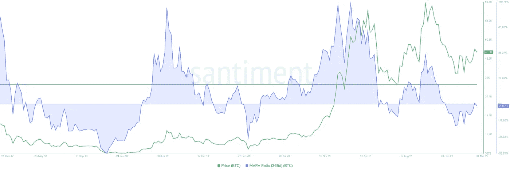
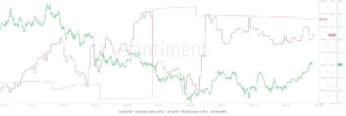
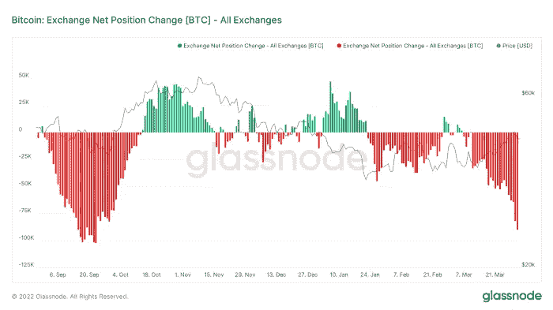
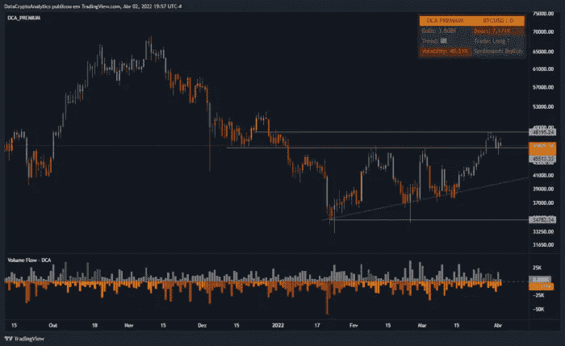
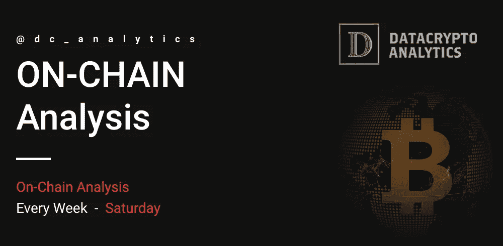

# 链上分析——比特币#4

> 原文：<https://medium.com/coinmonks/on-chain-analysis-bitcoin-4-3b4a2ca16774?source=collection_archive---------17----------------------->

加密货币的总市值为 2.22 万亿美元，比上周增长了+6.71%。全球一周加密交易量为 1.82 万亿美元，增长了+35.46%(其中 50%，即 9039.2 亿美元为透明交易量)。比特币的优势度为 39%，这意味着最近 7 天的涨幅为+3.25%。

随着比特币价格升至 48000 美元，市值对已实现价值(MVRV)模型短暂转正。这个环比指标用于确定去年购买 BTC 的投资者的平均盈利/亏损。

即使该指数高于零线，历史数据表明，365 天的 MVRV 峰值约为 22%，这表明比特币价格仍有更多上涨空间。

365-day MVRV BTC

也许最重要的指标是积累 BTC 的鲸鱼数量的增加。自 11 月 12 日以来，比特币的价格从 6.6 万美元跌至 3.4 万美元的低点，持有 1 万至 10 万 BTC 的鲸鱼正忙于积累更多的比特币。

拥有 1 万至 10 万 BTC 的投资者类别从 10.26%增至 11.26%，拥有 10 万至 100 万 BTC 的投资者类别从 3.03%升至 3.48%。

这一发展只指向一件事，即机构对比特币价格的乐观程度。

BTC Supply Distribution

自 3 月 6 日以来，比特币的价格从 38400 美元上涨到 48000 美元。尽管如此，投资者似乎正在将他们的股票转移出交易所。这可以从自 3 月 7 日以来净货币头寸变化导致的流出量上升中看出。

总之，不仅机构和鲸鱼在积累，而且他们也在将他们的持有转移到冰冷的钱包，这为比特币的未来描绘了一幅乐观的画面。

Exchange Net Position Change

虽然比特币价格正在好转，但前景仍然乐观，但如果突破 45，513 美元的支撑位，可能会失败。这样的变动意味着对 42，103 美元的直接支撑位的重新测试。

Bitcoin Daily Chart on TradingView with indicator DCA PREMIUM

如果比特币价格产生接近 42076 美元的日蜡烛线，它将使看涨论点无效，并将主要加密货币送到上升三角形的下限，约为 37000 美元。

在高度看跌的情况下，突破 35，000 美元的支撑底可能导致比特币价格跌至 30，000 美元。

 [## 证明文件

### 在接下来的几页中，详细了解我们以及如何使用我们服务的各个方面…

dc-analytics.gitbook.io](https://dc-analytics.gitbook.io/docs/)  [## #通道—数据加密分析

### 官方 DCA 渠道。

t.me](https://t.me/dc_analytics)  [## #group —数据加密分析

### group-data crypto Analytics 免费 DCA group，提供加密货币和外汇新闻及分析。成为会员并…

t.me](https://t.me/datacryptoanalytics)  [## 数据加密分析

### 加密货币和外汇交易策略…

datacryptoanalytics.com](https://datacryptoanalytics.com/) 

> 加入 Coinmonks [电报频道](https://t.me/coincodecap)和 [Youtube 频道](https://www.youtube.com/c/coinmonks/videos)了解加密交易和投资

# 另外，阅读

*   [3 商业评论](/coinmonks/3commas-review-an-excellent-crypto-trading-bot-2020-1313a58bec92) | [Pionex 评论](https://coincodecap.com/pionex-review-exchange-with-crypto-trading-bot) | [Coinrule 评论](/coinmonks/coinrule-review-2021-a-beginner-friendly-crypto-trading-bot-daf0504848ba)
*   [莱杰 vs n rave](/coinmonks/ledger-vs-ngrave-zero-7e40f0c1d694)|[莱杰 nano s vs x](/coinmonks/ledger-nano-s-vs-x-battery-hardware-price-storage-59a6663fe3b0) | [币安评论](/coinmonks/binance-review-ee10d3bf3b6e)
*   [Bybit Exchange 审查](/coinmonks/bybit-exchange-review-dbd570019b71) | [Bityard 审查](https://coincodecap.com/bityard-reivew) | [Jet-Bot 审查](https://coincodecap.com/jet-bot-review)
*   [3 commas vs crypto hopper](/coinmonks/3commas-vs-pionex-vs-cryptohopper-best-crypto-bot-6a98d2baa203)|[赚取加密利息](/coinmonks/earn-crypto-interest-b10b810fdda3)
*   最好的比特币[硬件钱包](/coinmonks/hardware-wallets-dfa1211730c6) | [BitBox02 回顾](/coinmonks/bitbox02-review-your-swiss-bitcoin-hardware-wallet-c36c88fff29)