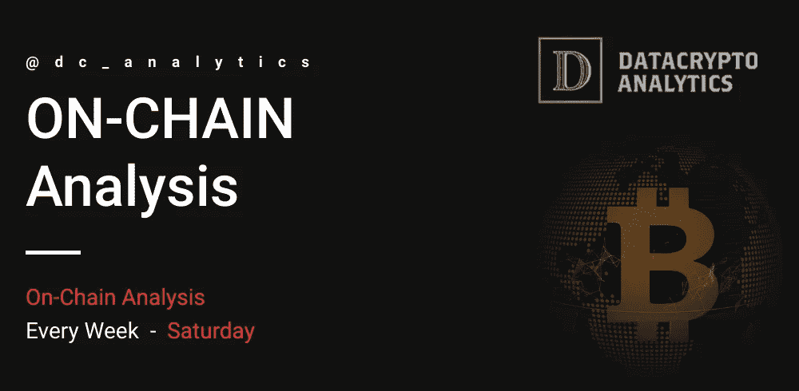

# 链上分析——比特币#5

> 原文：<https://medium.com/coinmonks/on-chain-analysis-bitcoin-5-9392400a5e23?source=collection_archive---------55----------------------->

加密货币市值为 2.05 万亿美元，比上周下降了 7.02%。全球一周加密货币交易量为 1.70 美元，下降了 2.03%(其中 46%，即 7865.3 亿美元为透明交易量)。比特币优势度为 40%，代表最近 7 天的涨幅为+0.22%。

该交易所的净头寸变化指标(net position change metric)显示，自 3 月 7 日以来，约有 10 万 BTC 离开了集中式交易所。净头寸变化指标是一个跟踪交易所代币流出量的指标。

如此大规模的人口外流在 BTC 历史上发生过五次，最近一次是第六次。和其他指数一样，这个链上指数也表明长期持有人非常看好比特币的价格表现。

BTC Net Position Change

具有 1000 到 100000 BTC 的鲸鱼的供应分布显示自 2021 年 6 月以来大量积累。最近，BTC 在 1000 到 10000 之间的投资组合从 2034 个增加到 2166 个。

拥有 10，000 到 100，000 BTC 的钱包也有同样的趋势，其数量从 78 个增加到 85 个。这种机构增持只能说明鲸鱼看好比特币的价格表现。

BTC Supply Distribution

如果比特币价格日蜡烛线低于 40490 美元，它将使需求区失效，从而使看涨论点失效。这样的发展可以将主要的加密货币送到下一个支撑位 34，782 美元。

在高度看跌的情况下，这一头寸的突破可能导致比特币价格跌至 30，000 美元。

Bitcoin Daily

 [## 证明文件

### 在接下来的几页中，详细了解我们以及如何使用我们服务的各个方面…

dc-analytics.gitbook.io](https://dc-analytics.gitbook.io/docs/)  [## #通道—数据加密分析

### 官方 DCA 渠道。

t.me](https://t.me/dc_analytics)  [## #group —数据加密分析

### group-data crypto Analytics 免费 DCA group，提供加密货币和外汇新闻及分析。成为会员并…

t.me](https://t.me/datacryptoanalytics)  [## 数据加密分析

### 加密货币和外汇交易策略…

datacryptoanalytics.com](https://datacryptoanalytics.com/) 

> 加入 Coinmonks [电报频道](https://t.me/coincodecap)和 [Youtube 频道](https://www.youtube.com/c/coinmonks/videos)了解加密交易和投资

# 另外，阅读

*   [BigONE 交易所点评](/coinmonks/bigone-exchange-review-64705d85a1d4) | [电网交易 Bot](https://coincodecap.com/grid-trading)
*   [氹欞侊贸易评论](https://coincodecap.com/anny-trade-review) | [CoinSpot 评论](https://coincodecap.com/coinspot-review)
*   [新加坡十大最佳加密交易所](https://coincodecap.com/crypto-exchange-in-singapore) | [收购 AXS](https://coincodecap.com/buy-axs-token)
*   [投资印度的最佳加密软件](https://coincodecap.com/best-crypto-to-invest-in-india-in-2021) | [WazirX P2P](https://coincodecap.com/wazirx-p2p)
*   [7 个最佳零费用加密交易平台](https://coincodecap.com/zero-fee-crypto-exchanges)
*   [最佳网上赌场](https://coincodecap.com/best-online-casinos) | [期货交易机器人](/coinmonks/futures-trading-bots-5a282ccee3f5)