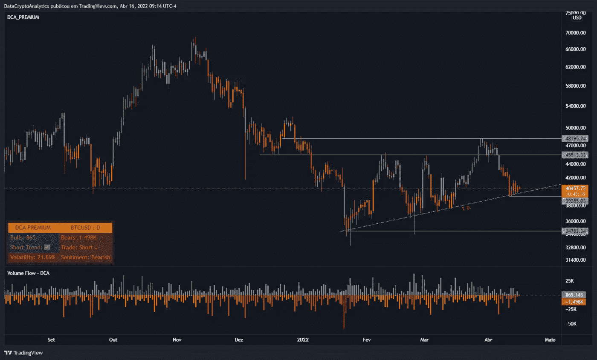

# 链上分析——比特币#6

> 原文：<https://medium.com/coinmonks/on-chain-analysis-bitcoin-6-497927023d4a?source=collection_archive---------37----------------------->

比特币的市值为 7718.2 亿美元。BTC 1 周成交量为 2818.0 亿美元。基于交易所的净头寸变化指标，它跟踪看涨交易所钱包的比特币的 30 天变化。截至 2022 年 3 月 1 日，近 1000 家 B 3 月作为交易所。此外，在 BTC 长达十年的历史中，这种外流扩大只出现过五次。

> 所有这些都表明，投资者押注于大型加密货币在更长时间内会有更好的表现。

Change in the net position of the BTC exchange

通过持有余额对比特币价格分布的高度相似性前景是比特币的类似前景。该指数显示，持有 10 万至 100 万 BTC 的鲸鱼数量从 2021 年 12 月的 2.93%净增长至目前的 3.47%。这一指标的上升最明显地表明了机构投资者的意图。

BTC distribution distribution chart

该指标跟踪集中持有的 BTC 数量，如果出现问题，可以作为抛售压力的估计实体。通常，这一指标的峰值通常会导致销售。然而，对于比特币来说，该指标自 2020 年 3 月以来一直处于下降趋势。

交易所的 BTC 总数已降至 191 万，为 208 年 12 月 6 日的水平，表明投资者对比特币的价格表现充满信心。

BTC supply on exchanges

比特币价格似乎正在寻求启动一项重大的链上救助，并积极支持这一前景。然而，日线收于 34，752 美元支撑位以下将确保 BTC 继续下跌。这种发展可以提供支持能力。因此，投资者需要注意 30.00 美元以下的卖出止损，因为 BTC 可能会在 2022 年反弹之前放弃这种流动性。

 [## 证明文件

### 在接下来的几页中，详细了解我们以及如何使用我们服务的各个方面…

dc-analytics.gitbook.io](https://dc-analytics.gitbook.io/docs/)  [## #通道—数据加密分析

### 官方 DCA 渠道。

t.me](https://t.me/dc_analytics)  [## #group —数据加密分析

### group-data crypto Analytics 免费 DCA group，提供加密货币和外汇新闻及分析。成为会员并…

t.me](https://t.me/datacryptoanalytics)  [## 数据加密分析

### 加密货币和外汇交易策略…

datacryptoanalytics.com](https://datacryptoanalytics.com/) 

> 加入 Coinmonks [电报频道](https://t.me/coincodecap)和 [Youtube 频道](https://www.youtube.com/c/coinmonks/videos)了解加密交易和投资

# 另外，阅读

*   [Bookmap 评论](https://coincodecap.com/bookmap-review-2021-best-trading-software) | [美国 5 大最佳加密交易所](https://coincodecap.com/crypto-exchange-usa)
*   最佳加密[硬件钱包](/coinmonks/hardware-wallets-dfa1211730c6) | [Bitbns 评论](/coinmonks/bitbns-review-38256a07e161)
*   [新加坡十大最佳加密交易所](https://coincodecap.com/crypto-exchange-in-singapore) | [收购 AXS](https://coincodecap.com/buy-axs-token)
*   [红狗赌场评论](https://coincodecap.com/red-dog-casino-review) | [Swyftx 评论](https://coincodecap.com/swyftx-review) | [CoinGate 评论](https://coincodecap.com/coingate-review)
*   [投资印度的最佳加密软件](https://coincodecap.com/best-crypto-to-invest-in-india-in-2021)|[WazirX P2P](https://coincodecap.com/wazirx-p2p)|[Hi Dollar Review](https://coincodecap.com/hi-dollar-review)