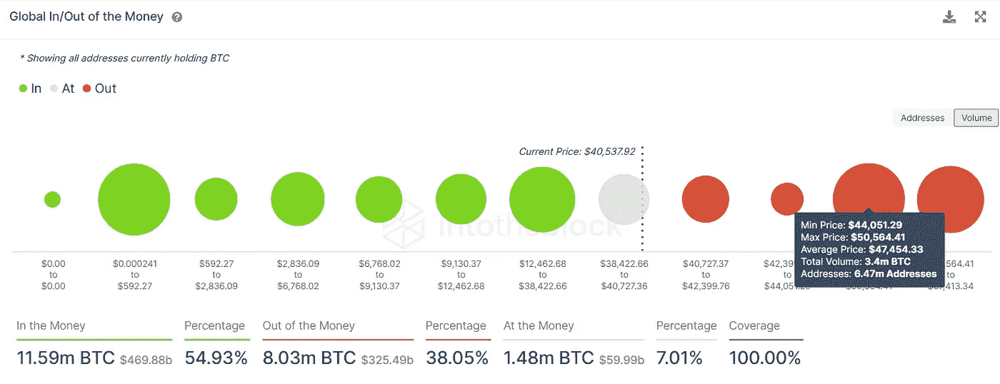
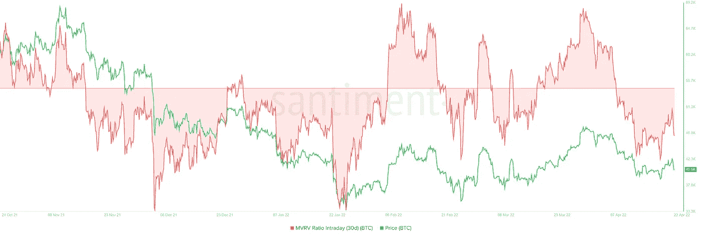
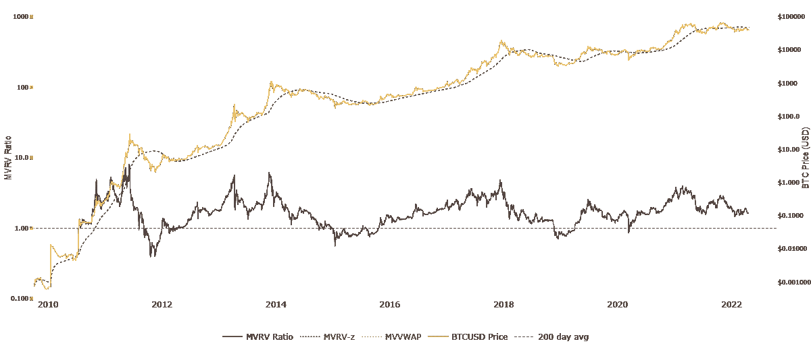
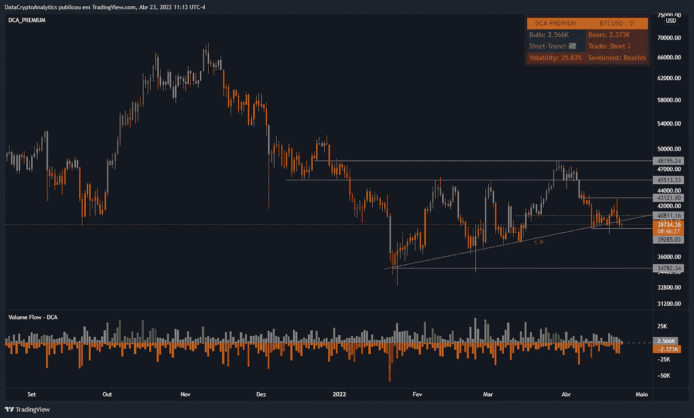

# 链上分析—比特币#7

> 原文：<https://medium.com/coinmonks/on-chain-analysis-bitcoin-7-6832c886aa24?source=collection_archive---------27----------------------->

比特币的市值为 7565.4 亿美元。BTC 1 周成交量为 2823.8 亿美元。

IntoTheBlock 的全球资金进出(GIOM)模型显示，高达 44，000 美元的阻力很弱。因此，快速增加的购买压力可以很容易地解除 BTC。

以 47，454 美元的平均价格购买了近 340 万 BTC 的场外投资者可能会对上涨构成重大威胁。有趣的是，从技术角度来看，BTC 的上限也在 47，998 美元左右，也称为 200 天 SMA。

30 天 MVRV 指数日内指标在当地底部-8%附近徘徊。最近几次，这一比率下降得如此之低，比特币价格已经建立了局部底部，并引发了反弹。此外，最近的崩盘让持有者不知所措，进一步减轻了抛售压力。

因此，如果历史重演，BTC 可能会催化另一次向 46，200 美元或更高的移动，这与从技术角度描述的前景一致。

BTC 30 Days MVRV Intraday

比特币:交易所净流量(总量)——显示从交易所持续流出的硬币。从交易所流出的资金增加通常是看涨信号，而流入交易所的资金增加通常是看跌信号。

虽然主要加密货币的情况正在好转，但突破 40，100 美元至 40，500 美元的支持区域可能会跌至 34，752 美元。日线收盘低于这个重要位置将创造一个更低的低点，并使看涨论点无效。

在这种情况下，BTC 做市商可以推动 BTC 下跌，并收集 30，000 美元以下的卖出止损。

 [## 证明文件

### 在接下来的几页中，详细了解我们以及如何使用我们服务的各个方面…

dc-analytics.gitbook.io](https://dc-analytics.gitbook.io/docs/)  [## 加入 DataCrypto Analytics Discord 服务器！

### 加密货币的交易策略。| 15 名成员

discord.com](https://discord.com/invite/5ywpZMt6Kp)  [## #通道—数据加密分析

### 官方 DCA 渠道。

t.me](https://t.me/dc_analytics)  [## #group —数据加密分析

### group-data crypto Analytics 免费 DCA group，提供加密货币和外汇新闻及分析。成为会员并…

t.me](https://t.me/datacryptoanalytics)  [## 数据加密分析

### 加密货币和外汇交易策略…

datacryptoanalytics.com](https://datacryptoanalytics.com/) 

> 加入 Coinmonks [电报频道](https://t.me/coincodecap)和 [Youtube 频道](https://www.youtube.com/c/coinmonks/videos)了解加密交易和投资

# 另外，阅读

*   [加密货币储蓄账户](/coinmonks/cryptocurrency-savings-accounts-be3bc0feffbf) | [YoBit 审核](/coinmonks/yobit-review-175464162c62)
*   [Botsfolio vs nap bots vs Mudrex](/coinmonks/botsfolio-vs-napbots-vs-mudrex-c81344970c02)|[gate . io 交流回顾](/coinmonks/gate-io-exchange-review-61bf87b7078f)
*   [CoinFLEX 评论](https://coincodecap.com/coinflex-review) | [AEX 交易所评论](https://coincodecap.com/aex-exchange-review) | [UPbit 评论](https://coincodecap.com/upbit-review)
*   [AscendEx 保证金交易](https://coincodecap.com/ascendex-margin-trading) | [Bitfinex 赌注](https://coincodecap.com/bitfinex-staking) | [bitFlyer 评论](https://coincodecap.com/bitflyer-review)
*   [Bitget 回顾](https://coincodecap.com/bitget-review)|[Gemini vs block fi](https://coincodecap.com/gemini-vs-blockfi)cmd |[OKEx 期货交易](https://coincodecap.com/okex-futures-trading)