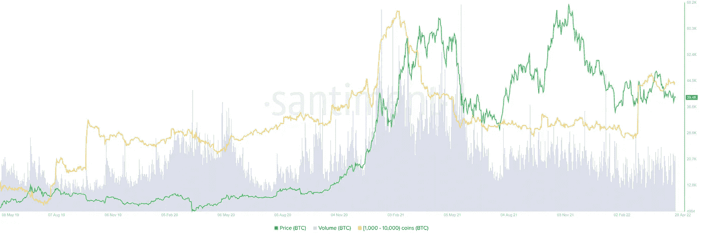
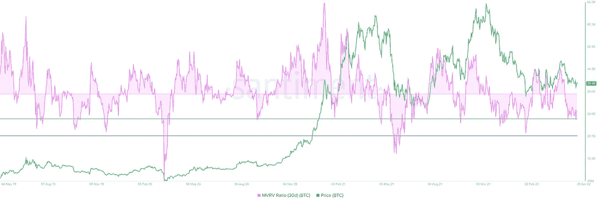
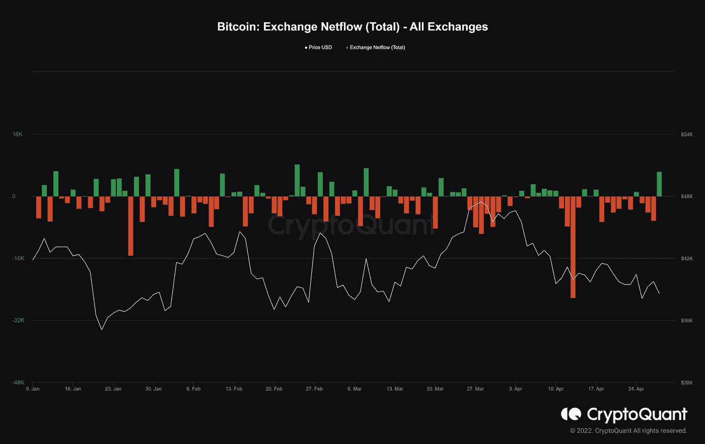
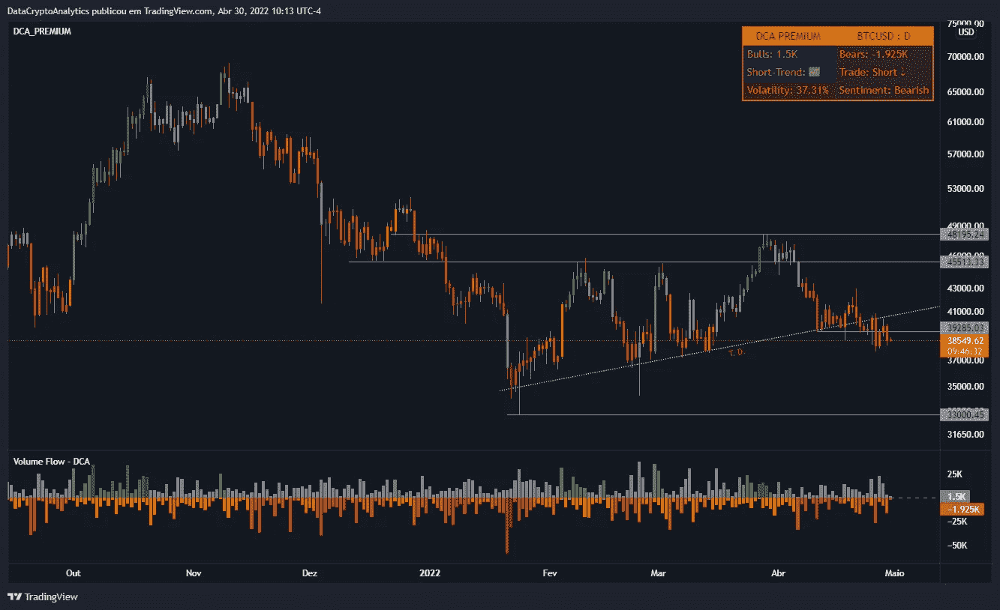

# 链上分析——比特币#8

> 原文：<https://medium.com/coinmonks/on-chain-analysis-bitcoin-8-35a7faa2491a?source=collection_archive---------28----------------------->

比特币的市值为 7352.1 亿美元。BTC 1 周成交量为 3261.8 亿美元。

截至 2 月 24 日，拥有 1000 到 10000 BTC 的鲸鱼已经增加到 204444 头。预计比特币的价格会上涨。

因此，从长期来看，BTC 仍将忠实看涨，如果从技术展望来看，在 45，510 美元。

支撑比特币价格短期下跌的是 30 天已实现价值市场(MVRV)指标。该指标用于衡量过去一个月买入 BTC 的投资者的平均盈利/亏损。

从-10%到-15%的任何值都被称为“机会区”，因为长期持有人处于利润中，当长期持有人积累时，他们不太可能出售。因此，在这些水平附近通常会形成局部底部。

然而，对于 BTC 来说，该指数大约为-7.1%，刚好高于第一个本地底部-11%。这种下跌通常是本地底部形成的地方，但也有几次 BTC 跌至-18.7%。因此，比特币的价格很有可能会再次跌至这些水平，这与从技术角度描述的前景非常吻合。

30-Day BTC MVRV

比特币:交易所 Netflow(Total)——显示继续从交易所退出硬币。从交易所流出的资金越来越多通常是一个看涨信号，而流入交易所的资金越来越多通常是一个看跌信号。

无论短期看跌预期如何，主要加密货币都将迎来趋势逆转。然而，如果熊市控制了局面，并把 BTC 和 BTC 拉下马是很重要的。

在这种情况下，BTC 做市商将采取 BTC，并可作为 30.00 美元水平的卖出止损。

 [## 证明文件

### 在接下来的几页中，详细了解我们以及如何使用我们服务的各个方面…

dc-analytics.gitbook.io](https://dc-analytics.gitbook.io/docs/)  [## 加入 DataCrypto Analytics Discord 服务器！

### 加密货币的交易策略。| 15 名成员

discord.com](https://discord.com/invite/5ywpZMt6Kp)  [## #通道—数据加密分析

### 官方 DCA 渠道。

t.me](https://t.me/dc_analytics)  [## #group —数据加密分析

### group-data crypto Analytics 免费 DCA group，提供加密货币和外汇新闻及分析。成为会员并…

t.me](https://t.me/datacryptoanalytics)  [## 数据加密分析

### 加密货币和外汇交易策略…

datacryptoanalytics.com](https://datacryptoanalytics.com/) 

> 加入 Coinmonks [电报频道](https://t.me/coincodecap)和 [Youtube 频道](https://www.youtube.com/c/coinmonks/videos)了解加密交易和投资

# 另外，阅读

*   [3 商业评论](/coinmonks/3commas-review-an-excellent-crypto-trading-bot-2020-1313a58bec92) | [Pionex 评论](https://coincodecap.com/pionex-review-exchange-with-crypto-trading-bot) | [Coinrule 评论](/coinmonks/coinrule-review-2021-a-beginner-friendly-crypto-trading-bot-daf0504848ba)
*   [莱杰 vs Ngrave](/coinmonks/ledger-vs-ngrave-zero-7e40f0c1d694) | [莱杰 nano s vs x](/coinmonks/ledger-nano-s-vs-x-battery-hardware-price-storage-59a6663fe3b0) | [币安评论](/coinmonks/binance-review-ee10d3bf3b6e)
*   [Bybit Exchange 评论](/coinmonks/bybit-exchange-review-dbd570019b71) | [Bityard 评论](https://coincodecap.com/bityard-reivew) | [Jet-Bot 评论](https://coincodecap.com/jet-bot-review)
*   [3 commas vs crypto hopper](/coinmonks/3commas-vs-pionex-vs-cryptohopper-best-crypto-bot-6a98d2baa203)|[赚取加密利息](/coinmonks/earn-crypto-interest-b10b810fdda3)
*   最好的比特币[硬件钱包](/coinmonks/hardware-wallets-dfa1211730c6) | [BitBox02 回顾](/coinmonks/bitbox02-review-your-swiss-bitcoin-hardware-wallet-c36c88fff29)