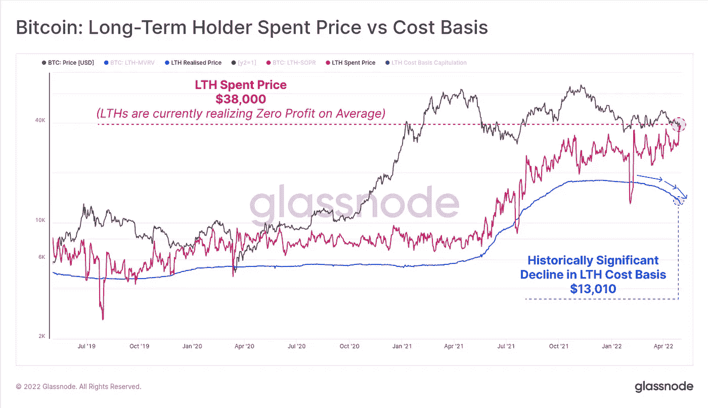
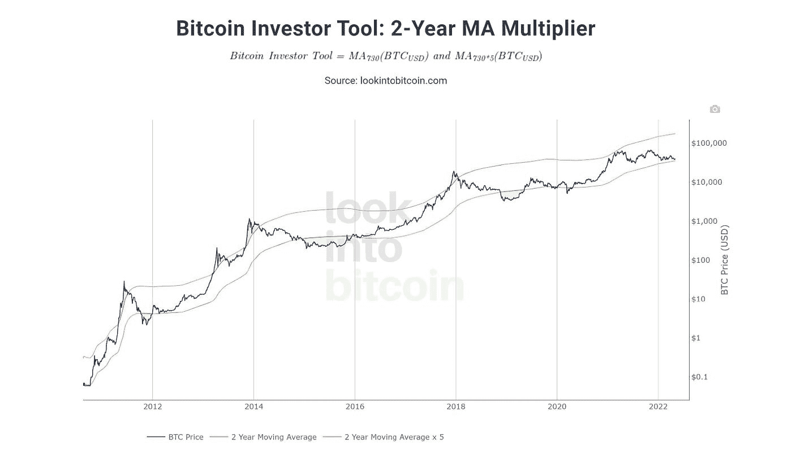
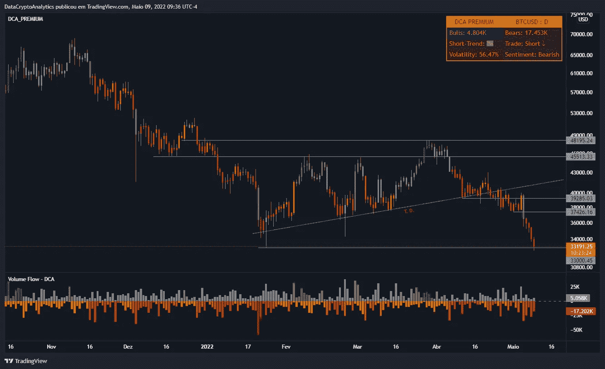

# 链上分析——比特币#9

> 原文：<https://medium.com/coinmonks/on-chain-analysis-bitcoin-9-ee26e88b0932?source=collection_archive---------31----------------------->

比特币的市值为 6266.0 亿美元。BTC 1 周成交量为 3419.6 亿美元。

由于 5 月 5 日的 FOMC 会议，比特币价格在小幅上涨后遭遇重大挫折。虽然美联储完成了 50 个基点的加息，但它带来的波动性导致股市和 BTC 暴跌。

一个重要的连锁指标是长期持有人(LTH)情绪的趋势，这表明并支持比特币价格的看跌前景。LTH 花费价格(粉红色)显示，这些投资者花费的硬币的平均购买价格处于盈亏平衡点，因为它符合现货价格。这一发展表明，平均而言，在 2021 年和 2022 年积累 BTC 的长期住房贷款正在盈亏平衡状态下恐慌性抛售。

Price spent by long-term BTC holder versus cost basis

最近对 2 年移动平均线的重新测试进一步质疑了反弹的有效性，并增加了下行前景的可信度。在其 11 年的历史中，比特币的价格在每个周期或大牛市开始前都会跌破这一关口。

投资者可能会认为这一举动是投降或灾难，即使它在引发多年反弹之前清除了止跌流动性。

BTC 2-Year MA Multiplier

多头能够从这种巨大的熊市前景中回来的唯一方法是推动比特币价格突破中间阻力障碍，并在 52，000 美元附近产生一个周蜡烛线。

这一举措将从 2021 年 12 月下旬形成的反弹中产生更高的反弹，并使低点无效。在这种情况下，BTC 可能会在 45，000 美元关口附近形成更高的低点，并试图重新回到 69，000 美元的历史高点，甚至 100，000 美元的新高。

 [## 证明文件

### 在接下来的几页中，详细了解我们以及如何使用我们服务的各个方面…

dc-analytics.gitbook.io](https://dc-analytics.gitbook.io/docs/)  [## 加入 DataCrypto Analytics Discord 服务器！

### 加密货币的交易策略。| 15 名成员

discord.com](https://discord.com/invite/5ywpZMt6Kp)  [## #通道—数据加密分析

### 官方 DCA 渠道。

t.me](https://t.me/dc_analytics)  [## #group —数据加密分析

### group-data crypto Analytics 免费 DCA group，提供加密货币和外汇新闻及分析。成为会员并…

t.me](https://t.me/datacryptoanalytics)  [## 数据加密分析

### 加密货币和外汇交易策略…

datacryptoanalytics.com](https://datacryptoanalytics.com/) 

> 加入 Coinmonks [电报频道](https://t.me/coincodecap)和 [Youtube 频道](https://www.youtube.com/c/coinmonks/videos)了解加密交易和投资

# 另外，阅读

*   [如何在 FTX 交易所交易期货](https://coincodecap.com/ftx-futures-trading) | [OKEx vs 币安](https://coincodecap.com/okex-vs-binance)
*   [CoinLoan 评论](https://coincodecap.com/coinloan-review) | [YouHodler 评论](/coinmonks/youhodler-4-easy-ways-to-make-money-98969b9689f2) | [BlockFi 评论](https://coincodecap.com/blockfi-review)
*   [XT.COM 评论](https://coincodecap.com/profittradingapp-for-binance) | [币安评论](https://coincodecap.com/xt-com-review)
*   [SmithBot 评论](https://coincodecap.com/smithbot-review) | [4 款最佳免费开源交易机器人](https://coincodecap.com/free-open-source-trading-bots)
*   [比特币基地僵尸工具](/coinmonks/coinbase-bots-ac6359e897f3) | [AscendEX 审查](/coinmonks/ascendex-review-53e829cf75fa) | [OKEx 交易僵尸工具](/coinmonks/okex-trading-bots-234920f61e60)