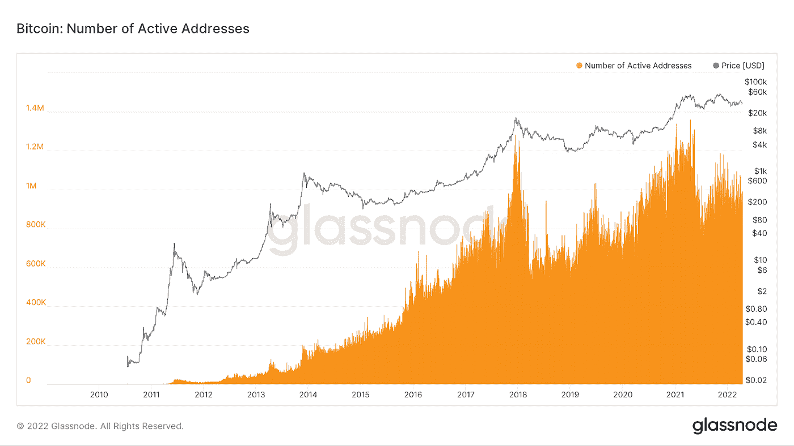
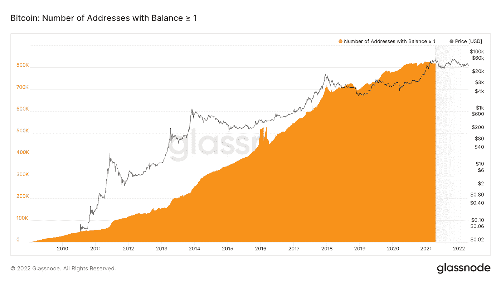
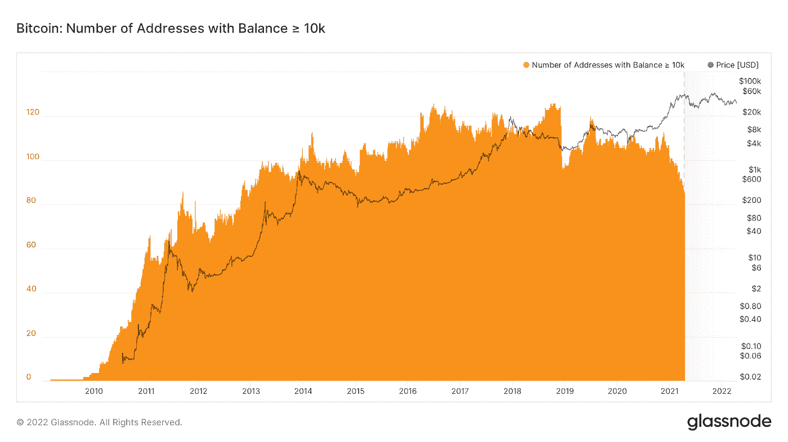
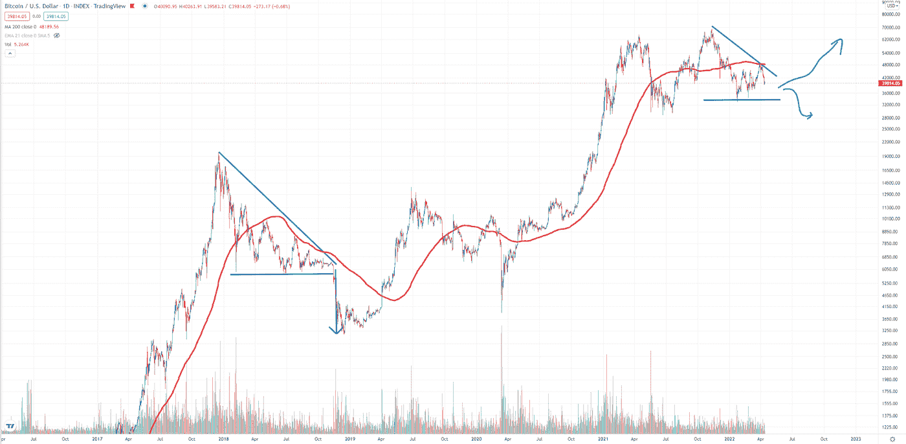

# 连锁分析:鲸鱼在获利，而小投资者的信心在增加。

> 原文：<https://medium.com/coinmonks/on-chain-analysis-whales-are-taking-profit-while-the-conviction-is-increasing-among-the-small-2363c8aedb10?source=collection_archive---------35----------------------->

比特币区块链提供了传统股票市场不提供的东西，即链上分析。我们所知道的比特币是去中心化、分布式、开放的。比特币区块链上发生的所有交易都可以被追踪、跟踪和分析，以了解那里正在发生什么。虽然日线图、周线图的技术分析很重要，但如果你是一名长期投资者，研究比特币的链上活动也同样有用。

以下是比特币网络上发生的连锁活动。

# 活动地址

活跃地址统计比特币网络中活跃的唯一地址。它可以是发送者也可以是接收者。目前的活跃地址略低于 100 万，低于 2017 年和 2021 年牛市期间的活跃地址。虽然这并不能揭示整个故事，因为大多数投资者会长期持有它，但它确实表明网络活动较低。

# 余额≥ 1 BTC 的比特币地址数量

自 2018 年以来，BTC 低于 1 的小投资者数量呈指数增长。这表明比特币越来越被接受，人们对比特币的未来更加确信。尽管持有不到 1 BTC 不会对市场行为产生太大影响，但由于比特币的供应有限，这对持有者来说肯定很重要。

# 余额≥ 10k BTC 的比特币地址数量

现在，对于持有超过 1 万 BTC 的鲸鱼来说，故事完全改变了。自上一次 ATH 以来，鲸鱼一直在获取利润。这当然是有道理的，因为如果你长期持有这些资产，如果到了你获利的时候，你肯定会这么做。有趣的是，鲸鱼们正在当前的市场低迷中回购股票。

# 如果历史重演，聪明的人正在积累。

这是比特币市场对美元的 200 天移动平均图表。每一次，价格移动到 200 天移动平均线之下，都伴随着一个漫长的积累阶段。但是请记住，没有人知道当前的三角关系是否会爆发。因此，最好是保持警惕和立场。阅读此处的了解更多信息。

注意:投资加密包含风险。提交人对资产损失没有责任。这只是为了教育和信息的目的，因此，它不应该被视为财务建议。请在投资前做好自己的研究。

> 加入 Coinmonks [电报频道](https://t.me/coincodecap)和 [Youtube 频道](https://www.youtube.com/c/coinmonks/videos)了解密码交易和投资

# 此外，请阅读

*   [霍笔交易机器人](https://coincodecap.com/huobi-trading-bot) | [如何购买 ADA](https://coincodecap.com/buy-ada-cardano) | [Geco。一次回顾](https://coincodecap.com/geco-one-review)
*   [加密副本交易平台](/coinmonks/top-10-crypto-copy-trading-platforms-for-beginners-d0c37c7d698c) | [前 5 大 BlockFi 备选平台](https://coincodecap.com/blockfi-alternatives)
*   [共贷回顾](https://coincodecap.com/coinloan-review)|[Crypto.com 回顾](/coinmonks/crypto-com-review-f143dca1f74c) | [活壁融资融券](/coinmonks/huobi-margin-trading-b3b06cdc1519)
*   [Bybit vs 币安](https://coincodecap.com/bybit-binance-moonxbt)|[leave the x Review](/coinmonks/stealthex-review-396c67309988)|[Probit Review](https://coincodecap.com/probit-review)
*   [高薪隐币和区块链课程](https://coincodecap.com/blockchain-courses)