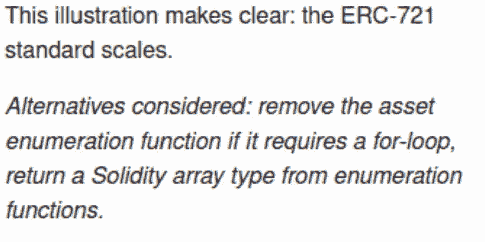

# 链上 NFTs，代价是什么？

> 原文：<https://medium.com/coinmonks/on-chain-nfts-at-what-cost-6ea7970c8dac?source=collection_archive---------4----------------------->

随着时间的推移，越来越多的 Solidity 开发人员开始接触 ERC721 和 ERC1155 标准，他们开始更加关注不变性和链上数据的重要性。

然而，一个经常被忽视的错误是使用了用于其他协议交互和链上发现的数据结构。

智能合约在交易期间或转移时循环遍历 for 循环中的项目变得越来越常见。然而，可枚举数据结构是为了链上发现而不是前端消费。“EnumerableSet”等数据结构的用例源自它的实用性，当它被其他协议以“廉价”的方式在链上发现时。这意味着其他协议可以轻松、廉价地迭代一个帐户的 NFTs。

然而，在铸造的时候，循环这些项目变得越来越昂贵。因此，可枚举数据结构的良好实践是只在链上用例中使用它们。

如果我们考虑一个拥有几个 NFT 的帐户和一个涉及几个事务的迭代(还记得我们提到的‘for’循环迭代)，那么这个函数耗尽 gas 的机会将会增加，甚至对于一个链外读取也是如此。

如果我们回到基础，即使一个函数被声明为“虚拟的”,它也只是一个“自由读取”的函数，只要没有项目被转移。如果一个用户有 10 个商品，那么检查 id 列表和检查每个 id 将变得非常昂贵，从而增加了协议契约的外部调用数量。

## 如何解决这个问题

1.  创建一个列出帐户令牌 id 的函数
2.  离线调用这个函数
3.  将令牌 id 传递给需要它们的函数，并验证该函数的所有权

```
 function useTokenIds(
   address registry, 
   uint256[] calldata tokenIds
) external {
   address sender = msg.sender;
   uint256 tokenId;
   for (uint256 i; i < tokenIds.length; i++){
     tokenId = tokenIds[i];
     require(
     IERC721(registry).ownerOf(tokenIds[i]) == sender,
     “not owner of those tokenIds”
     );
     _doSomethingWithThisTokenId(registry, tokenId, sender)
 }
}
```

如果前端需要 id 列表，我们可以实现一个 getter 函数来遍历所有令牌并返回我们感兴趣的令牌 id。这样做，我们将避免使用像 Enumerable 这样的数据结构，因为我们不需要其他链上协议来了解它。

你也可以使用[图](https://thegraph.com/en/)来索引用户的所有项目，甚至是一些市场的 API，比如 [OpenSea](https://opensea.io/) 。

EIP721 直截了当地告诉了 EIP:

>考虑的替代方案:如果需要 for 循环，则删除资产枚举函数，从枚举函数中返回一个实数组类型。

【https://eips.ethereum.org/EIPS/eip-721 



> *加入 Coinmonks* [*电报频道*](https://t.me/coincodecap) *和* [*Youtube 频道*](https://www.youtube.com/c/coinmonks/videos) *了解加密交易和投资*

# 另外，阅读

*   [印度最佳 P2P 加密交易所](https://coincodecap.com/p2p-crypto-exchanges-in-india) | [柴犬钱包](https://coincodecap.com/baby-shiba-inu-wallets)
*   [8 大加密附属计划](https://coincodecap.com/crypto-affiliate-programs) | [eToro vs 比特币基地](https://coincodecap.com/etoro-vs-coinbase)
*   [最佳以太坊钱包](https://coincodecap.com/best-ethereum-wallets) | [电报上的加密货币机器人](https://coincodecap.com/telegram-crypto-bots)
*   [交易杠杆代币的最佳交易所](https://coincodecap.com/leveraged-token-exchanges)
*   [最佳加密分析或链上数据](https://coincodecap.com/blockchain-analytics) | [Bexplus 评论](https://coincodecap.com/bexplus-review)
*   [NFT 十大市场造币集锦](https://coincodecap.com/nft-marketplaces)
*   [AscendEx Staking](https://coincodecap.com/ascendex-staking)|[Bot Ocean Review](https://coincodecap.com/bot-ocean-review)|[最佳比特币钱包](https://coincodecap.com/bitcoin-wallets-india)
*   [Bitget 评论](https://coincodecap.com/bitget-review) | [双子星 vs BlockFi](https://coincodecap.com/gemini-vs-blockfi) | [OKEx 期货交易](https://coincodecap.com/okex-futures-trading)
*   [美国最佳加密交易机器人](https://coincodecap.com/crypto-trading-bots-in-the-us) | [经常性评论](https://coincodecap.com/changelly-review)
*   [在印度利用加密套利赚取被动收入](https://coincodecap.com/crypto-arbitrage-in-india)
*   [霍比评论](https://coincodecap.com/huobi-review) | [OKEx 保证金交易](https://coincodecap.com/okex-margin-trading) | [期货交易](https://coincodecap.com/futures-trading)
*   [麻雀交换评论](https://coincodecap.com/sparrow-exchange-review) | [纳什交换评论](https://coincodecap.com/nash-exchange-review)