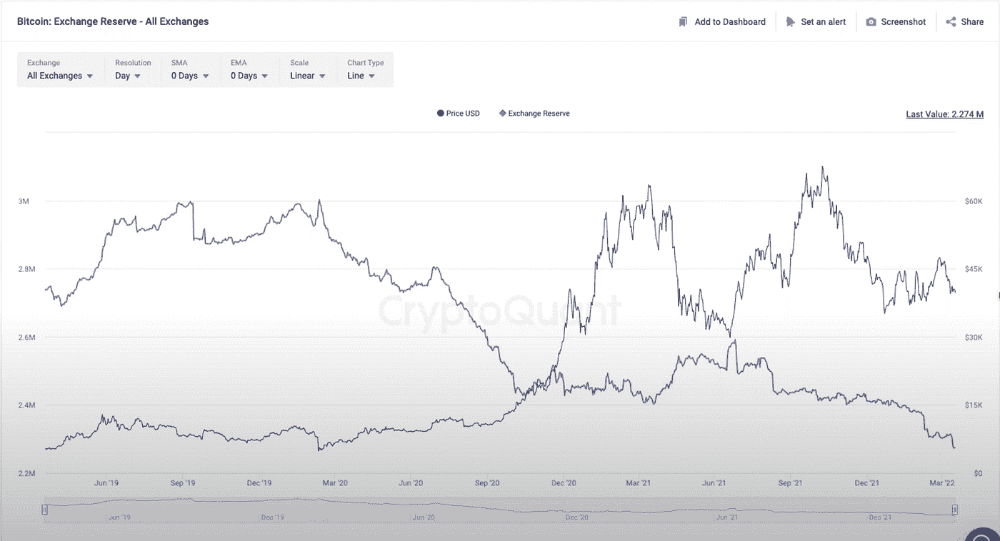
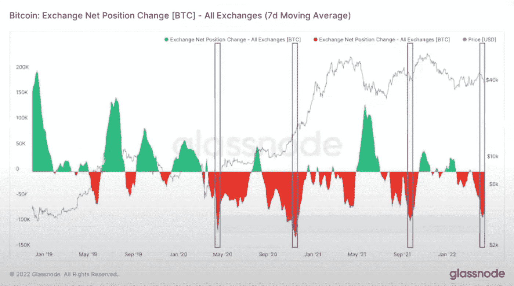
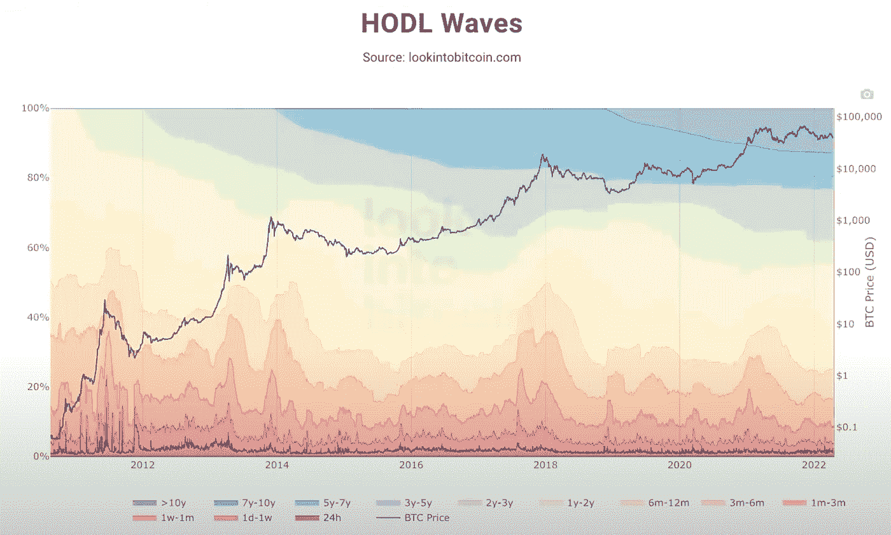
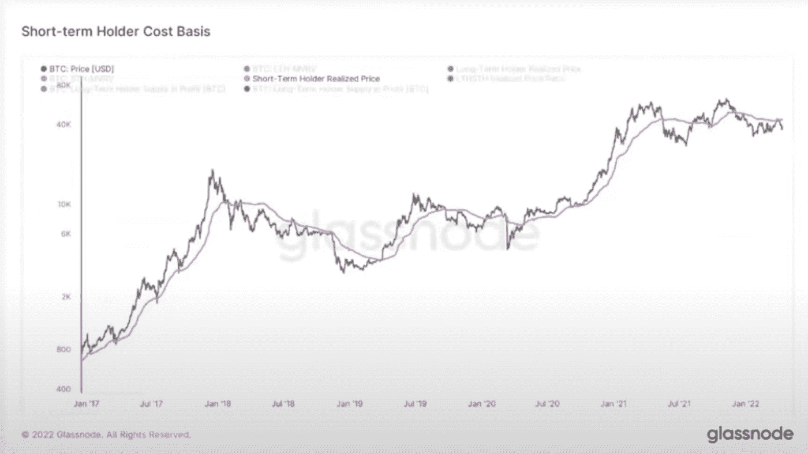

# 比特币触底的连锁迹象

> 原文：<https://medium.com/coinmonks/on-chain-signs-of-bottoming-for-bitcoin-12b89deb2616?source=collection_archive---------37----------------------->

由于比特币价格疲软，投资者感到恐惧，许多人都在寻找迹象，以确定我们是否接近底部，是否会很快上涨，或者是否会进一步下跌。以下是 3 个连锁统计数据，以及它们对比特币和其他加密货币价格的影响。

**外汇净流入/流出和供应:**

第一张图显示了交易所的比特币总供应量。这是有史以来的最低点。

这个图表可能对大多数人来说更熟悉，因为它是一个广泛使用的工具，可以让我们一窥机构和大资金个人(鲸鱼)对他们的比特币做了什么。左边的 y 轴表示进出交易所的比特币供应量。绿色表示比特币转移到交易所，而红色表示比特币从交易所转移到其他存储介质(硬钱包等)。).

通常情况下，流入交易所的比特币描绘了一个熊市，因为机构投资者可能会出售他们的比特币以换取现金。这就是为什么资本流入通常伴随着价格下跌(最近一次是 2021 年 5 月的崩盘)。

另一方面，资金外流意味着市场中的大鱼对比特币持乐观态度，因为他们正在将比特币从交易所转移到更安全的冷库中储存，这表明他们不打算在短期内出售比特币。

截至目前，交易所外比特币供应的外流正在增加，此前如此大规模的外流恰逢价格多次看涨运动的开始。上一次如此大规模的外流是在 2021 年 9 月，当时恰逢比特币从 42，000 美元飙升至 69，000 美元的历史高点。在比特币交易所供应处于历史低点的情况下，希望拥有比特币的新投资者可供购买的比特币越来越少，长期来看只会推动价格上涨。总体而言，这些指标描绘了对比特币价格的乐观看法，这可能因无聊的价格行为而被忽略。

**比特币 HODL 波:**

该指标表明在一定时期内持有比特币供应量的比例。顶部的深紫色部分显示了持有超过 10 年的比特币供应的比例，随着我们向下移动，持有时间会减少。

看看图表中大于 10y 和 7y-10y 的部分，几乎 20%的比特币供应已经超过 7 年没有变动。对于短期持有人(1 年以下)，该百分比已从 2021 年初约 40%的局部高点降至目前的 30%以下。

显然，长期持有人持有的比特币供应最近在增加，而短期持有人(1 年以下)的比例在下降(见 HODL 波的橙色和红色部分越来越窄)。这表明，由于最近的价格波动，大多数“弱手”(希望快速获利的短期交易者)被赶出了市场，而长期持有者仍在持有。

有趣的是，持有 1-2 年的比特币(浅黄色部分)的比例在过去两个月翻了一番。请注意，一年前，比特币达到顶峰，几乎要从 64000 美元跌至 29000 美元。这表明，买家并没有出售，实际上是在等待价格在未来上涨。

然而，同样明显的是，短期持有者缺席。这表明新的投资者没有进入市场，这表明比特币缺乏新的需求。因此，比特币的需求方面肯定有改善的空间，以显示更多的看涨价格行动。

**短期持有人成本基础:**

短期持有人成本基础表示最近 5 个月内购买比特币的投资者的平均成本基础(最近 5 个月购买的所有比特币的平均价格)。紫色线代表的是现在的 47，000 美元。

截至目前，我们处于线下(比特币目前为 40，800 美元)。从本质上来说，没有长期眼光的短期投资者很可能处于水深火热之中，因此一旦价格回到其初始成本，他们很可能会出售比特币以实现盈亏平衡。这解释了从 2022 年 1 月到现在我们在排队时看到的无数拒绝。

看涨信号是如果我们设法清除该线，因为这表明买家在获利，整体市场情绪看涨。因此，买家很可能会在价格跌至低于最初购买价格时购买，这使得该线可以作为支撑(就像我们在 2021 年 9 月的下跌中看到的那样。因此，在我们能够在市场中获得更多牛市之前，使用该指标作为比特币多头突破的目标是有用的。

**结论:**

总的来说，环比指标显示了很多东西。首先，目前的投资者看好比特币，没有抛售。其次，可供购买的比特币供应正在减少，这意味着未来的看涨价格行动迫在眉睫。不幸的是，需求端并不乐观，短期持有者成本基础为比特币价格带来了技术阻力，短期 HODL 波动显示比特币缺乏新的投资者。因此，要推动比特币的价格，最重要的是有更多的需求进入这个空间。然而，重要的是要认识到，比特币和加密货币的基本面正在日益改善，这就是为什么现在可能是在价格开始走高之前积累的绝佳机会。

请在下面的评论区分享你的想法。

> 加入 Coinmonks [电报频道](https://t.me/coincodecap)和 [Youtube 频道](https://www.youtube.com/c/coinmonks/videos)了解加密交易和投资

# 另外，阅读

*   [AscendEx 保证金交易](https://coincodecap.com/ascendex-margin-trading) | [Bitfinex 赌注](https://coincodecap.com/bitfinex-staking)
*   [最好的卡达诺钱包](https://coincodecap.com/best-cardano-wallets) | [Bingbon 副本交易](https://coincodecap.com/bingbon-copy-trading)
*   [印度最佳 P2P 加密交易所](https://coincodecap.com/p2p-crypto-exchanges-in-india) | [柴犬钱包](https://coincodecap.com/baby-shiba-inu-wallets)
*   [8 大加密附属计划](https://coincodecap.com/crypto-affiliate-programs) | [eToro vs 比特币基地](https://coincodecap.com/etoro-vs-coinbase)
*   [最佳以太坊钱包](https://coincodecap.com/best-ethereum-wallets) | [电报上的加密货币机器人](https://coincodecap.com/telegram-crypto-bots)