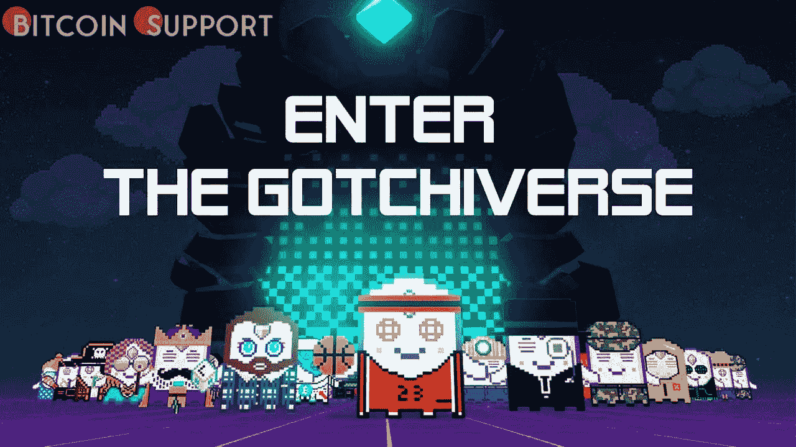

# 3 月 31 日，Aavegotchi 的 3D 元宇宙 Gotchiverse 将首次亮相

> 原文：<https://medium.com/coinmonks/on-march-31-aavegotchis-3d-metaverse-gotchiverse-will-debut-26543432b411?source=collection_archive---------72----------------------->

**Visit our website:-** [**https://bitcoinsupports.com/**](https://bitcoinsupports.com/)

电子鸡是结合了电子鸡和数字存钱罐特征的非功能性食物。除了社交媒体之外，Aavegotchi 所有者社区将能够使用元宇宙进行实时连接。创作者正致力于让所有玩家同时看到彼此。根据最初发布在 Defiant，Aavegotchi 上的新闻声明，装载了 Aave 计息代币(Aave 美元)的可玩角色将获得他们自己的元宇宙 Gotchiverse，将于 3 月 31 日首映。

**电子鸡和存钱罐难分伯仲**

电子鸡和数字存钱罐的混合体 NFT 被称为 Aavegotchi。为了让它们成长，它们的主人必须照顾它们。Gotchiverse 是一个三维世界，其中的人物可以互动，四处旅行，制作物品，收集新的令牌，并最终与入侵者战斗。由于这次元宇宙，Aavegotchi 已经发展成为一款成熟的游戏。鼓励玩家积累与 ERC 20 代币相关的游戏内资产，这些资产具有真实世界的价值。

**创建新领域**

Aavegotchi 所有者社区将能够通过将于 3 月 31 日开放的元宇宙进行实时参与。游戏的创作者正试图以这种方式创造新的天地。杰西·约翰逊，Pixelcraft 工作室的首席运营官，为 Aavegotchi DAO 工作，并制作了游戏到这个阶段，他说:

我们基本上是在这里进行一个巨大的项目。我们用同一个世界的每个人使用同一个实例来测试它。

这到底意味着什么？虽然有很多游戏让玩家在虚拟环境中互动，但这些世界通常都是重复的。因为网络不够强大或速度不够快，没有一个玩家可以同时看到其他玩家。Aavegotchi 正在努力解决这个问题。

**玩围棋最好的方法是什么？玩围棋的一种方法是参加一场吃豆人式的比赛，收集散落各处的贵重物品。这些是真实世界中的 ERC 20 资产。如果一个 Aavegotchi 在另一个之前得到某个资产，关键是不要混淆谁先得到它。这就是实时方面进入画面的地方。

**四个新的资产已经发布**

FUD、FOMO、阿尔法和 KEK，合称为炼金术，是即将到来的四个新的游戏内资产。它们将从最稀有到最不稀有排列。所有这些都可以在 Polygon (MATIC/USD)或 Ethereum (ETH/USD)上兑换实际货币。

**访问我们的网站:-**[**https://bitcoinsupports.com/**](https://bitcoinsupports.com/)

**免责声明:以上为作者观点，不应视为投资建议。读者应该自己做研究。****