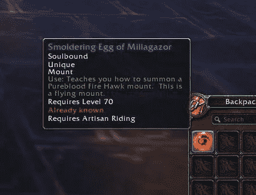
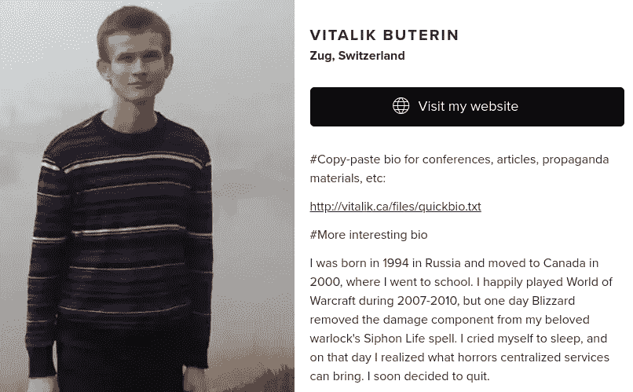

# 论灵魂绑定令牌的实际应用

> 原文：<https://medium.com/coinmonks/on-the-practical-application-of-soulbound-tokens-2a5ba1813ba1?source=collection_archive---------11----------------------->

虽然灵魂绑定令牌源于老派 MMORPGs，但在 Web 3 中却是一个相对较新的概念。对于这个领域的许多人来说，灵魂绑定的令牌会让人产生困惑感。"拥有一个不可转让的令牌有什么意义呢？"Web 3 的全部意义不就是拥有金融化的数字资产吗？随着我继续探索区块链技术，我被超越财务动机的数字世界的理念所吸引。我相信灵魂绑定令牌为我们创造强大的数字身份和更有意义的互动提供了机会，有助于塑造 Web 3 的未来。

灵魂绑定的概念来自于魔兽世界，在那里某些游戏中的物品被绑定到你的玩家角色身上，不能再被出售或与其他玩家交易。虽然这限制了某些项目的财政可行性，但它为玩家创造了有意义的进步激励。

如果魔兽世界中的每一个物品都是可以转移的，你可能会发现人们只是在耕种黄金而不是在游戏中取得进步。拥有特殊武器或稀有战利品将失去意义，因为不清楚你玩游戏是为了获得什么还是有黄金来支付。灵魂束缚的概念阻止了数字空间成为富人的游乐场，并为真正关心游戏进展的人创造了更有意义的激励。

作为 WoW 的长期粉丝，Vitalik Beuterin 花了很多时间思考 SBTs，最近写了一篇论文讨论 SBTs 在 Web 3 中的潜在应用。

论文链接:

[https://papers.ssrn.com/sol3/papers.cfm?abstract_id=4105763](https://papers.ssrn.com/sol3/papers.cfm?abstract_id=4105763)

Vitalik 甚至出现在无银行播客的一集里，更详细地探讨这个话题。

 [## 灵魂捆绑:链上还是链下？维塔利克·布特林和艾文·麦克马伦

### 一场引人入胜的智力辩论正在去中心化的身份认同世界中出现。今天，维塔利克·布特林代表…

newsletter.banklesshq.com](https://newsletter.banklesshq.com/p/soulbound-on-or-off-chain-vitalik?s=r#details) 

这里有一些关于灵魂绑定令牌实际应用的要点。

**治理权:**对 Web 3 的一大批评是，它是一个非常金融化的环境，几乎所有事情，包括你投票或参与项目的能力，都是由资本驱动的。资本统治从根本上来说是不公平的，因为它把那些没有办法适当参与的人排斥在外。灵魂绑定令牌可能是迈向基于价值的治理的伟大的第一步。

**出席证明:**poap 是分发给人们的 NFT，用来表示他们参加了某个活动。《POAP 议定书》是 SBTs 可以非常自然地整合和实施的地方之一。如果有人在看你的 POAP，他们想知道你是否亲自出席了活动。尽管一些 POAPs 可以在二级市场上交易，但如果它是 soulbound 的话，出席证明协议将从根本上工作得更好。

**人性认证的证明:**该协议在 Web 3 中构建了更好的数字身份认证。虽然数字政府 id 已经存在，但它们很容易被流氓国家复制或审查。人性的证明档案被设计成不可转让的，事实上是灵魂绑定的。有趣的是，我们可以考虑在人性基础设施的基础上建立什么，包括学术文凭、专业认证等。

**隐私:**随着《人性的证明》被广泛采用，我们将不可避免地遇到隐私问题。例如，如果我们将来收到的不是疫苗接种卡，而是疫苗接种 POAPs，我们可能希望有一个选择来决定我们是否要公开这些信息。这就是 ZK-SNARK——零知识证明的用武之地。

zk-SNARK 是首字母缩写词，代表“零知识简洁的非交互式知识论证”。这是一个证明结构，你可以证明一个钱包里有类似于 POAP 疫苗的东西，而不需要透露该信息，也不需要证明者和验证者之间的任何交互。

通过使用 ZK Snarks，SBTs 可用于保持敏感信息的私密性，同时也可用于区块链。这开启了设计的可能性，像人类证明这样的协议可以培养数字身份感，同时保持用户的隐私感。

Web 3 处于创建分散数字身份的最前沿。然而，在这个领域中，我们唯一确切知道的是给定钱包中包含的资产的价值。灵魂绑定令牌为我们提供了一个建立强大的数字身份的机会，这种身份不仅仅与金融化的数字资产相关。此外，SBTs 可以确保隐私，让我们以更公平的方式参与治理。

考虑到 SBT 的相对危险性，我认为我们仅仅触及了这项新技术潜在用例的表面。随着我们看到 Web 3 越来越多地被采用，我相信灵魂绑定令牌将在未来数字身份的形成中发挥重要作用。

感谢您的阅读。

查看我的 Web 3 之旅:

[https://twitter.com/wasifmrahman](https://twitter.com/wasifmrahman)

在 LinkedIn 上关注我:

 [## Wasif Rahman -营销伙伴关系总监- Ex Populus | LinkedIn

### 查看 Wasif Rahman 在全球最大的职业社区 LinkedIn 上的个人资料。Wasif 有 4 个工作列在他们的…

www.linkedin.com](https://www.linkedin.com/in/wasif-rahman-91114a85/) 

我的 Web 3 淋浴想法:

 [## 瓦西夫·拉赫曼-中号

### 阅读瓦西夫·拉赫曼在媒介上的作品。Web 3 德根 Ex Populus 营销伙伴关系总监。每天…

medium.com](/@wasifmrahman) 

阅读:高潮与低谷:网络 3 的一年

 [## 高潮与低谷:Web 3 的一年

### 我在去年 6 月 22 日买了我的第一个密码。我清楚地记得这是自加密以来的第一次重大下跌…

medium.com](/@wasifmrahman/the-highs-and-lows-a-year-in-web-3-eed764aa6efb) 

阅读:网络 3 和魔兽世界第二部分——中国淘金者

 [## Web 3 DNA 和魔兽世界第二部分——中国淘金者

### 我登录了我的魔兽世界账户，发现我的 80 级战士一丝不挂地坐在暴风城。我的用户界面看起来不一样…我…

medium.com](/@wasifmrahman/web-3-dna-and-world-of-warcraft-part-2-chinese-gold-farmers-b71b1e7b5ac6) 

阅读:人工智能艺术兔子洞第 1 部分:人工智能月鸟

 [## 人工智能艺术兔洞第 1 部分:人工智能月鸟

### 我最初是出于沮丧和怨恨而走进 AI 艺术兔子洞的。这一切都是从我收到我的…

medium.com](/@wasifmrahman/the-ai-art-rabbit-hole-ai-moonbirds-5916df277ba7) 

> 加入 Coinmonks [电报频道](https://t.me/coincodecap)和 [Youtube 频道](https://www.youtube.com/c/coinmonks/videos)了解加密交易和投资

# 另外，阅读

*   [Bookmap 点评](https://coincodecap.com/bookmap-review-2021-best-trading-software) | [美国 5 大最佳加密交易所](https://coincodecap.com/crypto-exchange-usa)
*   最佳加密[硬件钱包](/coinmonks/hardware-wallets-dfa1211730c6) | [Bitbns 评论](/coinmonks/bitbns-review-38256a07e161)
*   [新加坡十大最佳加密交易所](https://coincodecap.com/crypto-exchange-in-singapore) | [购买 AXS](https://coincodecap.com/buy-axs-token)
*   [红狗赌场评论](https://coincodecap.com/red-dog-casino-review) | [Swyftx 评论](https://coincodecap.com/swyftx-review) | [CoinGate 评论](https://coincodecap.com/coingate-review)
*   [投资印度的最佳密码](https://coincodecap.com/best-crypto-to-invest-in-india-in-2021)|[WazirX P2P](https://coincodecap.com/wazirx-p2p)|[Hi Dollar Review](https://coincodecap.com/hi-dollar-review)
*   [加拿大最好的加密交易机器人](https://coincodecap.com/5-best-crypto-trading-bots-in-canada) | [库币评论](https://coincodecap.com/kucoin-review)