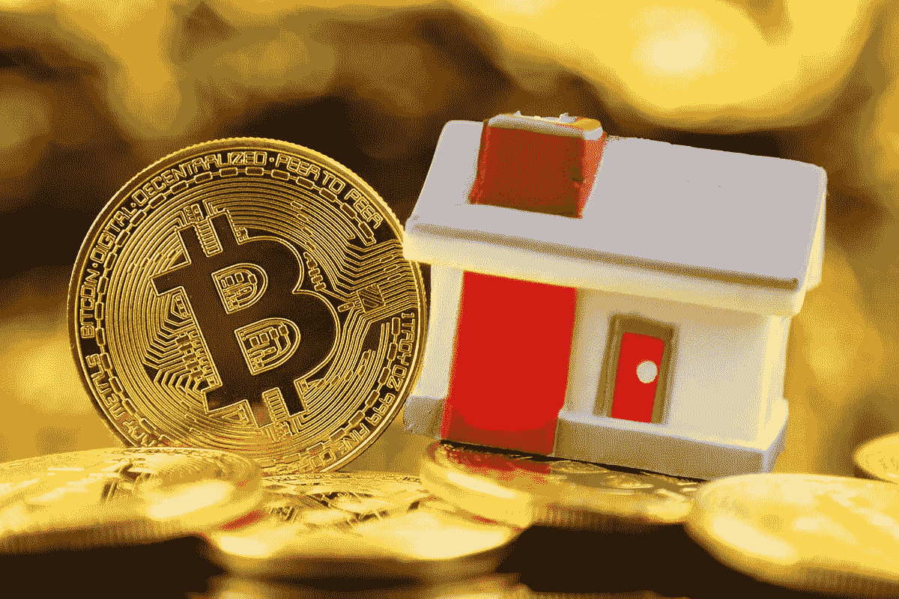

# 如何在 2022 年获得比特币抵押贷款

> 原文：<https://medium.com/coinmonks/one-of-the-most-commonly-known-financial-services-in-the-us-is-the-mortgage-where-a-loan-is-used-3abab7594e20?source=collection_archive---------32----------------------->

美国最广为人知的金融服务之一是[抵押贷款](https://www.investopedia.com/terms/m/mortgage.asp)，贷款用于购买/维护房屋或任何其他类型的房地产。借款人同意支付一段时间的价值加上应计利息，房产是贷款的抵押品，这意味着如果他停止支付，贷款人可以取消房产的赎回权。

**2021 年，80%的美国人的抵押贷款被拒绝**
许多美国公民面临的一个障碍是[通过申请要求](https://www.marketwatch.com/picks/this-is-the-no-1-reason-americans-get-denied-a-mortgage-01639588234)，其中包括对以下方面的分析:

*   FICO 信用评分；
*   首期付款；
*   纳税申报表上的收入；
*   不利的债务收入比(DTI)。

假设一个普通的成功人士有商业收入(少于 2 年)或任何其他与传统工作无关的收入。在这种情况下，抵押贷款可能会被拒绝。

随着近年来区块链的崛起，一些投资组合主要由比特币、以太币和其他加密货币组成的人无法获得抵押贷款的案例开始增加。传统的融资市场不适合 crypto，拥有这种类型的资产对业内人士来说甚至可能是负面的。

以 32 岁的前高盛副总裁 Matta 为例，他创立了资产新月加密公司。他的净资产主要由 BTC 和瑞士联邦理工学院组成，由于“他拥有的风险资产”，主要银行不批准他的抵押贷款

**抵押贷款住房市场的加密破坏**
加密市场不断给金融领域带来创新，解决了传统金融因其严格的监管和官僚作风而无法解决的问题。

一项新的服务正在形成，可能会给那些打算购买房地产的加密服务商带来解决方案:**比特币抵押**。借款人基本上以比特币作为贷款的抵押品(通常是房产价值的 100%)，定义利率和支付频率，并可以购买房产。

**如何获得比特币抵押贷款？**

这个领域有两家领先的公司——Milo 和 Ledn，想要获得比特币抵押贷款的用户现在应该加入这两家网站的候选名单。在第一个过程中被选中后，有四个简单的步骤:

*   在网站上在线申请并查看价格
*   选择初始费率和定期付款
*   关闭贷款申请
*   获得抵押贷款后，定期还款或还清贷款

值得注意的是，这两家公司都是直接贷款人，都经过许可、审计和保险，因此能够支持他们的贷款承诺。

**获得比特币抵押贷款的好处**

如果你是一名加密霍德勒，并想购买房地产，有几个原因可以说明你应该获得比特币抵押贷款，而不是常规的。

*   你可以保留你的多头头寸，并把它们作为抵押品。
*   你可以避免向传统的贷方出售你的密码来证明你的资产，从而避免纳税。
*   你不需要提交纳税申报表、FICO 评分或传统贷款中的其他要求。如果你是一个长期的加密持有者，这是你最好的选择。
*   在贷款期间，你完全可以自由调整利率和每月还款额。
*   公司是处理官僚程序的人，比如所有权、保险和评估。
*   在抵押贷款中没有首期付款，使这一过程更快、更有效。

**获得比特币抵押贷款的弊端**

虽然这项服务似乎是那些无法获得传统抵押贷款的人的出路，但它并不适合一个普通的投资者:

*   为了获得抵押贷款的资格，借款人应该拥有比特币 100%的财产价值。
*   在 BTC 价格暴跌的情况下，借款人可能会被要求追加保证金，这意味着出售他们的比特币并失去他们的房子。

**我应该申请比特币抵押贷款吗？**

比特币抵押贷款推荐给那些风险偏好高、相信 crypto 未来会有价值、不打算出售头寸的人。如果你有钱获得传统抵押贷款，但也有加密资产来支持贷款，你应该做尽职调查，以决定选择哪个选项。

*在 Robert Ventures，我们认为做出决策的最佳方式是清楚地了解当前的市场状况以及我们未来应该预期的情景。然后，根据创建的假设，选择最佳选项。*

*如果您是合格投资者，并想了解更多关于我们产品的信息，请联系我们罗伯特风险投资公司的***。**

*[*乔·罗伯特*](https://joerobert.com/) *现任罗伯特风险投资公司首席执行官，拥有超过 20 年的资产管理经验。自创业以来，乔已经为投资者&合伙人创造了可预见的两位数回报。Joe 已经投资了股权和代币的种子轮，以及比特币、以太坊和其他顶级加密货币的投资组合。**

**如果您是合格投资者，并想了解更多关于我们产品的信息，请联系我们。**

> *加入 Coinmonks [电报频道](https://t.me/coincodecap)和 [Youtube 频道](https://www.youtube.com/c/coinmonks/videos)了解加密交易和投资*

# *另外，阅读*

*   *[3 商业评论](/coinmonks/3commas-review-an-excellent-crypto-trading-bot-2020-1313a58bec92) | [Pionex 评论](https://coincodecap.com/pionex-review-exchange-with-crypto-trading-bot) | [Coinrule 评论](/coinmonks/coinrule-review-2021-a-beginner-friendly-crypto-trading-bot-daf0504848ba)*
*   *[莱杰 vs n rave](/coinmonks/ledger-vs-ngrave-zero-7e40f0c1d694)|[莱杰 nano s vs x](/coinmonks/ledger-nano-s-vs-x-battery-hardware-price-storage-59a6663fe3b0) | [币安评论](/coinmonks/binance-review-ee10d3bf3b6e)*
*   *[Bybit Exchange 审查](/coinmonks/bybit-exchange-review-dbd570019b71) | [Bityard 审查](https://coincodecap.com/bityard-reivew) | [Jet-Bot 审查](https://coincodecap.com/jet-bot-review)*
*   *[3 commas vs crypto hopper](/coinmonks/3commas-vs-pionex-vs-cryptohopper-best-crypto-bot-6a98d2baa203)|[赚取加密利息](/coinmonks/earn-crypto-interest-b10b810fdda3)*
*   *最好的比特币[硬件钱包](/coinmonks/hardware-wallets-dfa1211730c6) | [BitBox02 回顾](/coinmonks/bitbox02-review-your-swiss-bitcoin-hardware-wallet-c36c88fff29)*