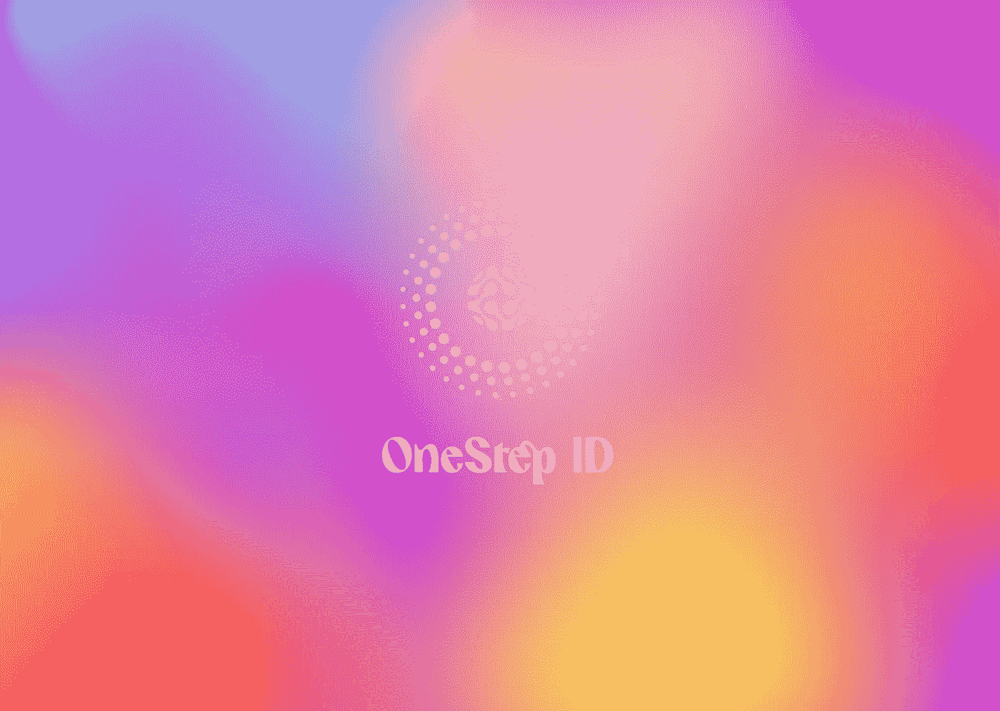

# 一步到位:无限制胜的营销解决方案

> 原文：<https://medium.com/coinmonks/onestep-ultainfinity-winning-solution-to-marketing-4e24764c94a5?source=collection_archive---------41----------------------->

在线平台的用户通常会对一系列要求他们填写电子邮件等内容的弹出窗口感到沮丧，然后他们才能享受在平台上的时光。从公司的角度来看，如果没有经常光顾或访问该平台的用户或顾客，任何业务都无法生存。因此，平台会尽一切可能确保接触到更多的用户，并通过电子邮件的方式获得平台的访问者。

然而，这种弹出窗口会激怒用户，因为它最终会告诉用户使用这种平台的体验。这使得 M. Michael 先生有必要为 Ultainfinity 平台及其在 Ultainfinity Global Group 的整个生态系统中的附属公司创建一个包罗万象的解决方案。

# **什么是 OneStep？**

顾名思义，OneStep 是一个解决多个不必要程序的方案，只需一个步骤即可完成！该解决方案帮助用户登录，而不使用电子邮件或传统的令人沮丧的注册系统。它与一个简单的 OneStep ID 一起工作，与 Apple ID 有一些相似之处，但与 Apple ID 不同的是，它有更多的好处和好处。OneStep 系统可细分为三个工作部分:

> one step ID
> one step 通讯录
> one step contact cash

## **什么是 OneStep ID**

前面提到的 OneStep ID 可以比作 Apple ID，但是，有了 OneStep ID，你需要的只是你的手机和 messenger。这个 ID 的独特之处在于其强大的内置安全密码系统。锦上添花的是，你只需登录一次。获得用户许可后，您将成为 Ultainfinity Global Group 的一员，Ultainfinity Global Group 是一个全球生态系统，其中包括:金融科技、加密货币、市场、信使，无需进一步检查、识别和确认。

## **OneStep 通讯录**

就像其他生态系统一样，OneStep 联系簿面向社区的地方性和病毒式扩张，以吸引志同道合者。曾经想要与多个朋友分享一个新的机会，但是手动一个接一个地发送的方式让你望而却步？

OneStep ContactBook 可以让您轻松地将联系人普遍引用到您所属的生态系统，而无需手动操作。你只需点击你想分享的联系人，他们就能得到你需要的信息。不仅如此，仅仅通过推荐联系人，你就赢了，而公司也赢了。这个特性是 OneStep 项目的 ContactCash 特性所固有的。

## **为什么 ContactCash 是你赢，我赢**

不必要的垃圾邮件时代已经过去了。就像我们正处于由 ULTAINFINITY 引导的前所未有的财富创造和转移的时代，社区将通过有机的方式增长，而不会破坏优秀的用户体验。通过将联系人推荐到 ULTAINFINITY 平台，你可以根据你为该平台带来的志同道合者的数量获得奖励。这个过程是如此的透明，以至于你知道谁会采取行动。然而，OneStep 的这个选项是可选的。

通过点击和引用的方式，你可以点击你的方式到数千美元。平台获得了感兴趣的用户，而你也因此获得了回报。你赢了，我也赢了。

> 加入 Coinmonks [电报频道](https://t.me/coincodecap)和 [Youtube 频道](https://www.youtube.com/c/coinmonks/videos)了解加密交易和投资

# 另外，阅读

*   [3 商业评论](/coinmonks/3commas-review-an-excellent-crypto-trading-bot-2020-1313a58bec92) | [Pionex 评论](https://coincodecap.com/pionex-review-exchange-with-crypto-trading-bot) | [Coinrule 评论](/coinmonks/coinrule-review-2021-a-beginner-friendly-crypto-trading-bot-daf0504848ba)
*   [莱杰 vs n rave](/coinmonks/ledger-vs-ngrave-zero-7e40f0c1d694)|[莱杰 nano s vs x](/coinmonks/ledger-nano-s-vs-x-battery-hardware-price-storage-59a6663fe3b0) | [币安评论](/coinmonks/binance-review-ee10d3bf3b6e)
*   [Bybit Exchange 审查](/coinmonks/bybit-exchange-review-dbd570019b71) | [Bityard 审查](https://coincodecap.com/bityard-reivew) | [Jet-Bot 审查](https://coincodecap.com/jet-bot-review)
*   [3 commas vs crypto hopper](/coinmonks/3commas-vs-pionex-vs-cryptohopper-best-crypto-bot-6a98d2baa203)|[赚取加密利息](/coinmonks/earn-crypto-interest-b10b810fdda3)
*   最好的比特币[硬件钱包](/coinmonks/hardware-wallets-dfa1211730c6) | [BitBox02 回顾](/coinmonks/bitbox02-review-your-swiss-bitcoin-hardware-wallet-c36c88fff29)