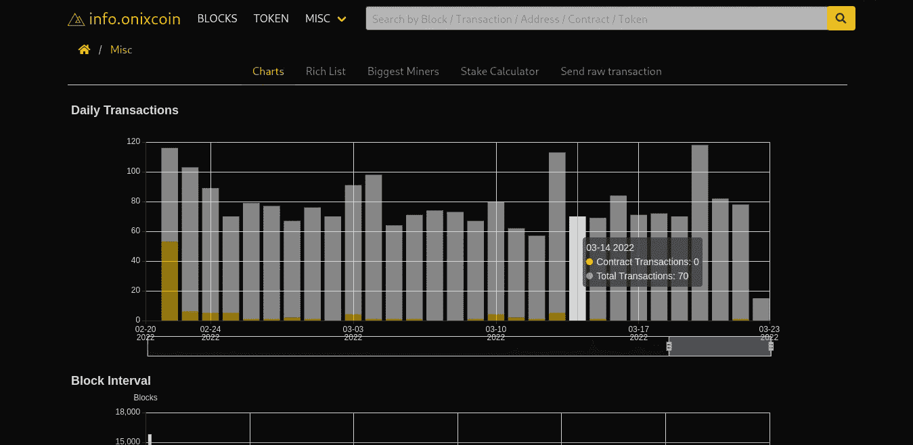
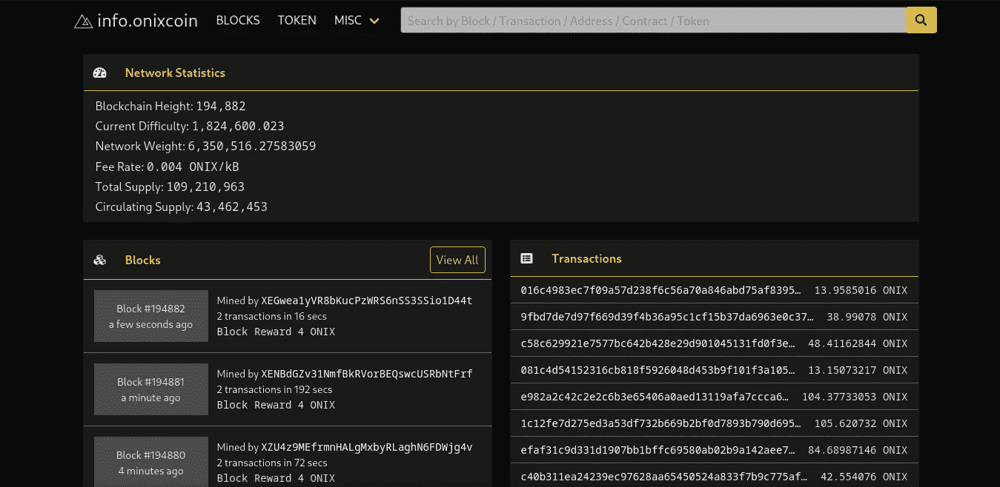

# Onixcoin 宣布他们新的高级区块链浏览器！

> 原文：<https://medium.com/coinmonks/onixcoin-announces-their-new-advanced-blockchain-explorer-f7ffef7a9805?source=collection_archive---------52----------------------->

Onix 开发团队刚刚宣布了他们新的光滑和用户友好的区块链浏览器。新的浏览器提供了一个简单的用户界面，允许更多的非技术持有者在 Onix 区块链上查找 varios 数据。这提高了业务的透明度，所有实时交易都可以通过互联网上的任何用户进行验证。我们将看看使用块浏览器的好处。

# 如何使用块管理器

区块链浏览器的主要目的是允许透明跟踪所有加密货币交易。您不必等待交易完成的确认。如果它发生了，你可以在任何块浏览器上看到它。

P2P 交易可以在区块链浏览器上进行，但请记住，所有交易都是最终的，不能退款。了解了这一点，block explorer 是通过从该地址查找公共信息以及与它进行交易的地址列表来验证收件人地址的完美工具。这种方法是向另一个地址发送和接收硬币的最佳实践。

**投资 Onix 区块链上的项目**并验证正确的智能合约地址或 ICO 地址是否合法。使用块资源管理器，您可以键入项目的智能合同地址或 ICO 地址，并查看有关已分发硬币的总供应量的公共信息，以及迄今为止硬币已分发到的地址数量。在投资任何项目之前，确保检查官方注册的 ORC 令牌。

使用浏览器，您还可以查看 Onix Token 的**市场数据，以了解市值和当前流通供应量。超级赌注者也可以找到有用的信息，如当前块高度，当前难度，网络重量和每 Mb 的费用。explorer 还以图表形式提供统计数据，包括每日交易数据、帐户数量和数据块间隔。**

**使用 block explorer 提供的赌注计算器计算您的年度投资回报**。这为投资者和持有人提供了有关投资回报率百分比的实时数据，具体取决于分配给赌注池的总权重。该百分比不是固定的，会根据分配给池的 Onix 数量而波动。

在块资源管理器中可以找到包含最大数量 Onix 的丰富列表或地址。在这里，您可以通过分配到一个公共地址的硬币的百分比来验证硬币的分布情况以及该项目是否是“地毯式”的。学习如何利用探索者提供的信息来分析给定硬币的令牌组学，可以防止投资损失。

[https://daily cooin . com/what-a-block-explorer-and-how-to-use-it/](https://dailycoin.com/what-is-a-block-explorer-and-how-to-use-it/)[https://medium . com/@ VerifiedICOs/using-a-区块链-explorer-to-your-advantage-46e6f 368375d](/@VerifiedICOs/using-a-blockchain-explorer-to-your-advantage-46e6f368375d)

*原发表于*[*https://onixcoin . io*](https://onixcoin.io/onixcoin-announces-their-new-advanced-blockchain-explorer)*。*

> 加入 Coinmonks [电报频道](https://t.me/coincodecap)和 [Youtube 频道](https://www.youtube.com/c/coinmonks/videos)了解加密交易和投资

# 另外，阅读

*   [非洲最佳加密交易所](https://coincodecap.com/crypto-exchange-africa) | [胡交易所评论](https://coincodecap.com/hoo-exchange-review)
*   [eToro vs 罗宾汉](https://coincodecap.com/etoro-robinhood)|[MoonXBT vs by bit vs Bityard](https://coincodecap.com/bybit-bityard-moonxbt)
*   [Stormgain 评论](https://coincodecap.com/stormgain-review) | [Probit 评论](https://coincodecap.com/probit-review) | [北海巨妖评论](/coinmonks/kraken-review-6165fc1056ac)
*   [如何在势不可挡的域名上购买域名？](https://coincodecap.com/buy-domain-on-unstoppable-domains)
*   [印度的加密税](https://coincodecap.com/crypto-tax-india) | [altFINS 审核](https://coincodecap.com/altfins-review) | [Prokey 审核](/coinmonks/prokey-review-26611173c13c)
*   [Blockfi vs 比特币基地](https://coincodecap.com/blockfi-vs-coinbase) | [BitKan 评论](https://coincodecap.com/bitkan-review) | [期货交易机器人](/coinmonks/futures-trading-bots-5a282ccee3f5)