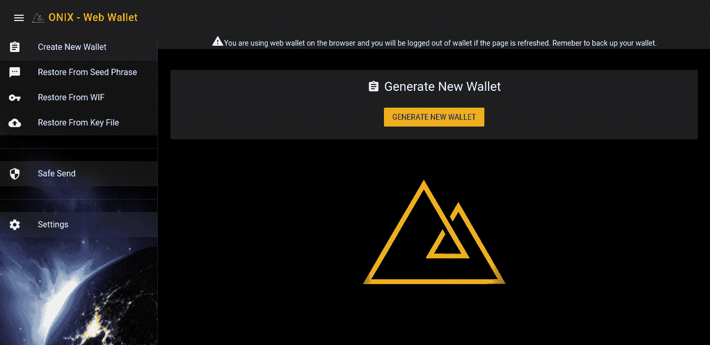
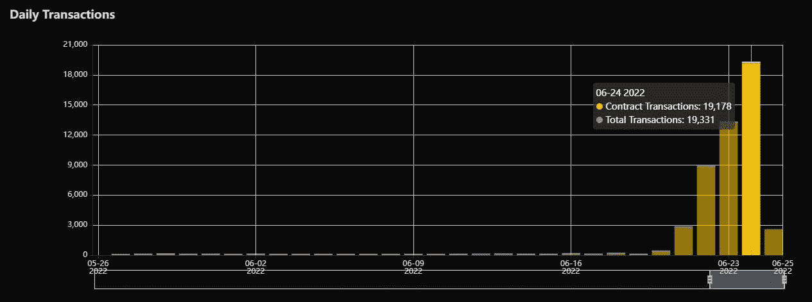
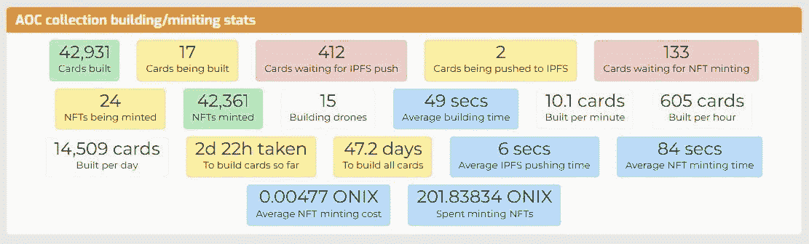

# Onixcoin 区块链& NFT 加密游戏大军在熊市条件下继续前进

> 原文：<https://medium.com/coinmonks/onixcoin-blockchain-army-of-crypto-nft-game-continues-to-move-forward-despite-bear-market-9e7278cf5183?source=collection_archive---------18----------------------->

2022 年 6 月 25 日

# Onixcoin 区块链

尽管市场环境恶劣，Onixcoin 的开发人员仍在继续努力，提供安全、快速、实惠和用户友好的区块链体验。最近，开发者宣布了对[网络钱包](https://wallet.onixcoin.io/)的 UI/UX 的更新，这是添加到先前版本的最新平台，先前版本用于 [Windows](https://onixcoin.io/downloads/onix-0.2.1-windows.zip) 、 [Mac](https://onixcoin.io/downloads/onix-0.2.1-mac.zip) 、 [Linux](https://onixcoin.io/downloads/onix-0.2.1-linux.tar.gz) 和 [Pi OS x64](https://onixcoin.io/downloads/onix-0.2.1-rpi64.tar.gz) 。Android 和 iOS 的移动钱包将是 Onixcoin devs 计划在不久的将来为 NFT 游戏平台提供的下一个里程碑。

Onixcoin 最近还与 BCF Exchange(block chain financial)联合，通过访问新实现的[水龙头](https://blockchainfinancial.com/faucets/onix_test_faucet)，提供更多赚取 ONIX 的机会。BCF 在他们的平台上有许多水龙头，Onixcoin 很高兴加入到可获得额外 ONIX 的选项列表中。

分析 Onixcoin [Block Explorer](https://info.onixcoin.io:5001/) 的最新数据，您会注意到日常事务的突然增加，本文稍后将对此进行详细介绍。从最近的活动中得出的主要结论表明，活动的突然增加不会以任何显著的方式影响性能或油费，这对于审查数据后的开发人员来说是个好消息。可扩展性一直是 L1·区块链的主要关注点，Onixcoin 为 NFT 游戏提供了一个非常稳定、安全、快速和可扩展的网络。

# 密码大军(NFT 游戏)

在 Onixcoin 平台上发布的第一款游戏《密码大军》即将发布 Alpha 版本，在该版本中可以看到第一次游戏体验和测试反馈。来自开发团队的最新消息是，即将到来的 TCG 的 AOC NFT 卡的内部铸造已经开始。这反过来导致了 Onixcoin 网络上最近的日交易量激增，因为每张卡都被永久铸造/上传到区块链。要制作的 NFT 卡片总数为 912，284 张，你可以去[https://sps.kobol.cc/](https://sps.kobol.cc/)了解制作进度。

据说 AOC 背后的团队正在为 RPG TCG 提供独特的游戏机制，并对卡牌战斗进行了新的调整。对于这个新版本有很多兴奋和期待，游戏社区期待着投入到这个体验中。专为 NFT 游戏设计的 Onixcoin 区块链首款游戏将于今年第四季度发布。关注 Onixcoin 和 Army of Crypto 社交平台，了解这两个项目的新闻和更新。

# 在社交平台上

网址: [https://onixcoin.io](https://onixcoin.io)

电报:【https://t.me/onixcoin_io 

推特:[https://twitter.com/Onixcoin_io?s=20&t = 0 V5 resas 6 brsrohs 516 yva](https://twitter.com/Onixcoin_io?s=20&t=0v5ReSAS6BrsROHS516yvA)

AOC 社交平台

电报:[https://t.me/armyofcrypto](https://t.me/armyofcrypto)

推特:[https://twitter.com/thearmyofcrypto?s=20&t = 0 V5 resas 6 brsrohs 516 yva](https://twitter.com/thearmyofcrypto?s=20&t=0v5ReSAS6BrsROHS516yvA)

> 加入 Coinmonks [电报频道](https://t.me/coincodecap)和 [Youtube 频道](https://www.youtube.com/c/coinmonks/videos)了解加密交易和投资

# 另外，阅读

*   [币安 vs FTX](https://coincodecap.com/binance-vs-ftx) | [最佳(SOL)索拉纳钱包](https://coincodecap.com/solana-wallets)
*   [比诺莫评论](https://coincodecap.com/binomo-review) | [斯多葛派 vs 3Commas vs TradeSanta](https://coincodecap.com/stoic-vs-3commas-vs-tradesanta)
*   [Capital.com 审查](https://coincodecap.com/capital-com-review) | [港加密借贷平台](https://coincodecap.com/crypto-lending-hong-kong)
*   [如何在 Uniswap 上交换加密？](https://coincodecap.com/swap-crypto-on-uniswap) | [A-Ads 审核](https://coincodecap.com/a-ads-review)
*   [WazirX vs coin dcx vs bit bns](/coinmonks/wazirx-vs-coindcx-vs-bitbns-149f4f19a2f1)|[block fi vs coin loan vs Nexo](/coinmonks/blockfi-vs-coinloan-vs-nexo-cb624635230d)
*   [本地比特币审核](/coinmonks/localbitcoins-review-6cc001c6ed56) | [加密货币储蓄账户](https://coincodecap.com/cryptocurrency-savings-accounts)