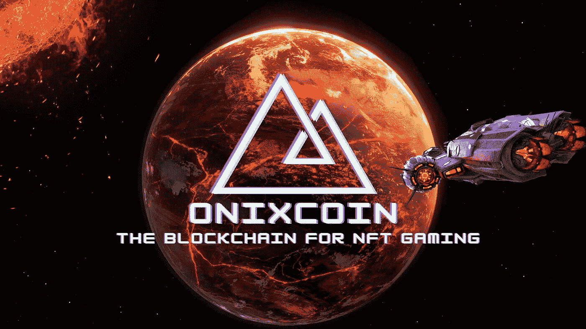
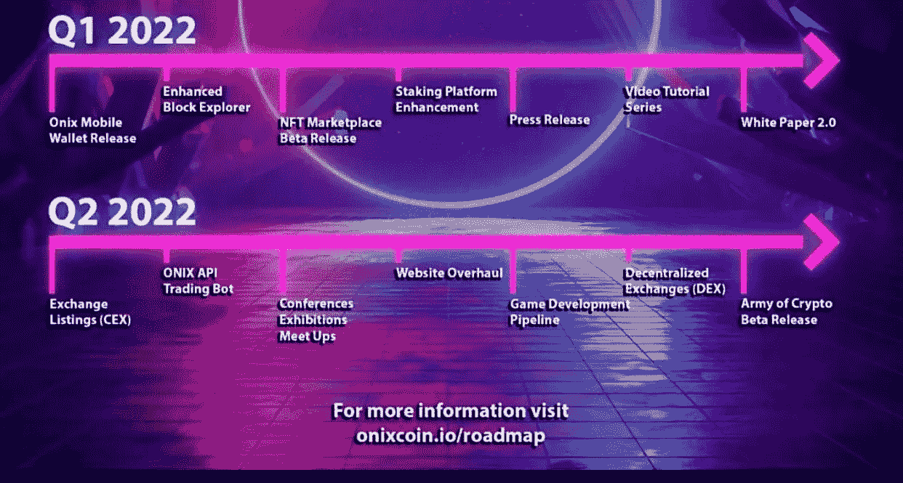

# Q1 综合报道& Q2 有什么值得期待的

> 原文：<https://medium.com/coinmonks/onixcoin-q1-roundup-what-to-expect-in-q2-c7673c40fcdb?source=collection_archive---------55----------------------->

面向 NFT 博彩的 Onixcoin 区块链于 2021 年 10 月 31 日推出了他们的平台，并继续在里程碑上稳步前进。当我们处于 2022 年第一季度末时，我们将看看迄今为止的进展。路线图上列出的目标概述了 Onixcoin 团队计划今年在 Q1 发布网络钱包、增强型区块链浏览器、NFT 市场测试版、赌注平台增强、新闻稿、视频教程系列和白皮书 2.0。

第一个目标是在 1 月 26 日完成的，这是第一季度的第一个主要新闻发布会。许多大的新闻平台，如[雅虎财经](https://finance.yahoo.com/onix-becomes-future-gaming-blockchain-032800803.html)、[市场观察](https://www.marketwatch.com/press-release/onix-becomes-the-future-of-gaming-with-blockchain-technology-by-providing-exclusive-features-2022-01-20?tesla=y)等等，发布关于 Onixcoin 区块链项目的新闻。这引起了加密社区的积极反应，并引起了对该项目的更多兴趣。

onixcoin staking 平台的更新是本季度完成的第二个里程碑。这个增强的赌注池被命名为[Onix Shrine](https://onixcoin.io/onix-shrine)，它使用比例奖励方法。从资金池基金或任何委托中击中方块获得的奖励将给予资金池。因此，脚本根据每个地址的权重将奖励分配给委派者。这一改进也是在 1 月 26 日与新闻稿同时发布的。

下一个要完成的里程碑是 2 月 21 日完成并发布了[on excoin 网络钱包](https://onixcoin.io/onix-official-web-wallet-release)。这款钱包非常适合那些希望自己的硬币归私人所有，但又不能使用我们的全桌面钱包的人。用户可以从任何连接到互联网并能运行网络浏览器的设备上备份、发送、接收和委托他们的 Onix 硬币。这次发布正好与[视频教程系列](https://www.youtube.com/channel/UCF4KGP-LwCocFrAGu4OJJJQ)的开始相吻合，该系列视频教程旨在帮助社区应对使用该平台的挑战。这些视频目前可以在 youtube 平台上找到。

增强的 block explorer 是 onixcoin 团队遇到的最新里程碑。在区块链执行的详细信息，如交易、钱包地址、令牌创建、持有者数量等。可以使用高级块管理器进行跟踪。新浏览器的发布是在 3 月 21 日完成的。

onixcoin NFT 市场测试版正在取得进展，该团队决定在 Q2 推出该版本，以激发人们对第一款游戏《密码大军》的兴趣。新的 NFT 市场预计将于 2022 年初发布，NFT·TCG 的军队预计将在 Q2 年底发布测试版。这是 onix 社区最受期待的两个版本，应该会产生大量新用户和感兴趣的投资者。Q2 还将在更多的 dex 和 cex 上市，同时完成 onix api 交易机器人，该机器人已完成 50%。将 ONIX 在新交易所上市的工作已经开始，相关公告将在官方的 onixcoin 社交平台上发布。

onixcoin 区块链游戏开发管道也将在《NFT 密码大军》游戏发布后在 Q2 发布。在 AoC 发布之前，开发管道模型已经完成，并且正在后台、内部和私下进行测试。

到目前为止，随着大量主要用例的发布以及对市场营销的日益关注，Q2 正在寻求成为该项目的最令人兴奋的阶段。Onix 团队计划增加参加一些聚会、会议和展览的人数，因为 Q1 看到了未来的开端。

要了解该项目的最新新闻和公告，请加入[官方 on excoin 电报群](https://t.me/onixcoin_io)，关注[官方 onixcoin twitter 页面](https://twitter.com/Onixcoin_io)，并在[on excoin 官方网站](https://onixcoin.io)上保持关注。

*原发布于*[*https://onix coin . io*](https://onixcoin.io/onixcoin-q1-roundup-what-to-expect-in-q2)*。*

> *加入 Coinmonks* [*电报频道*](https://t.me/coincodecap) *和* [*Youtube 频道*](https://www.youtube.com/c/coinmonks/videos) *了解加密交易和投资*

# 另外，阅读

*   [Bookmap 点评](https://coincodecap.com/bookmap-review-2021-best-trading-software) | [美国 5 大最佳加密交易所](https://coincodecap.com/crypto-exchange-usa)
*   最佳加密[硬件钱包](/coinmonks/hardware-wallets-dfa1211730c6) | [Bitbns 评论](/coinmonks/bitbns-review-38256a07e161)
*   [新加坡十大最佳加密交易所](https://coincodecap.com/crypto-exchange-in-singapore) | [购买 AXS](https://coincodecap.com/buy-axs-token)
*   [红狗赌场评论](https://coincodecap.com/red-dog-casino-review) | [Swyftx 评论](https://coincodecap.com/swyftx-review) | [CoinGate 评论](https://coincodecap.com/coingate-review)
*   [投资印度的最佳密码](https://coincodecap.com/best-crypto-to-invest-in-india-in-2021)|[WazirX P2P](https://coincodecap.com/wazirx-p2p)|[Hi Dollar Review](https://coincodecap.com/hi-dollar-review)