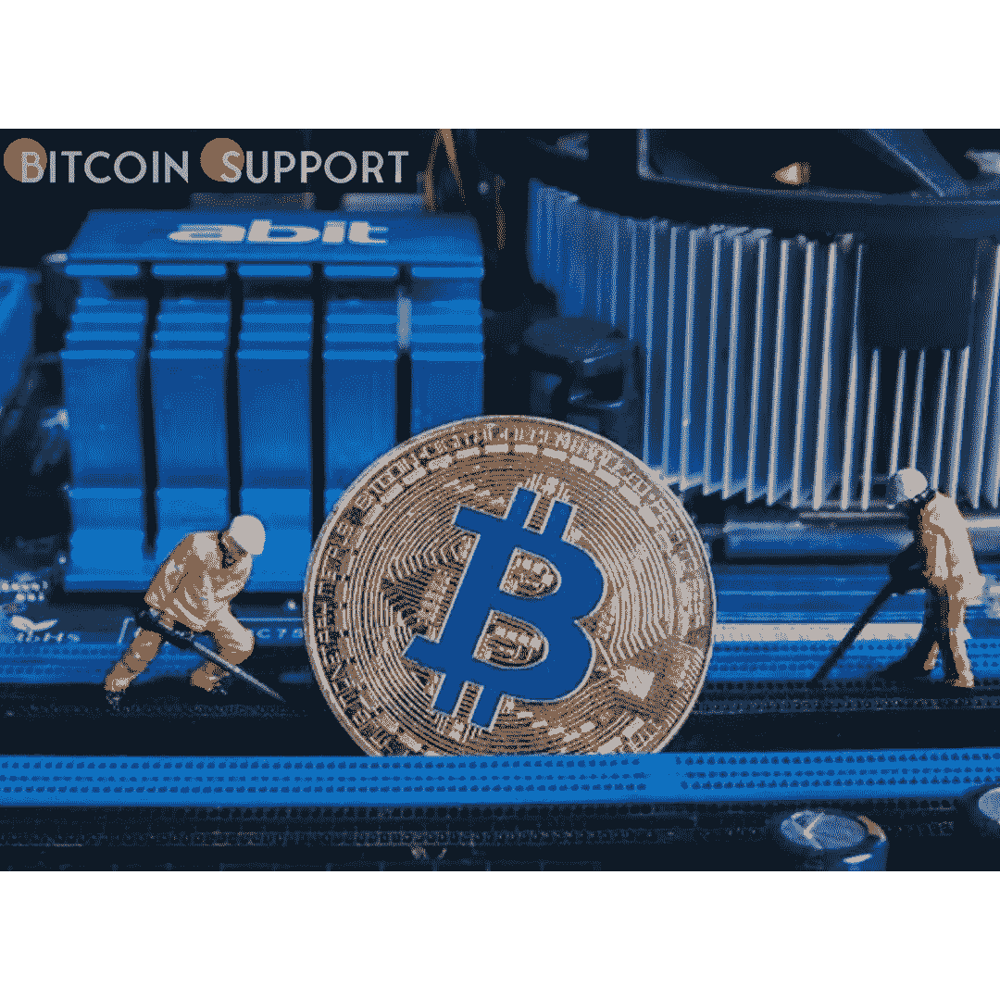
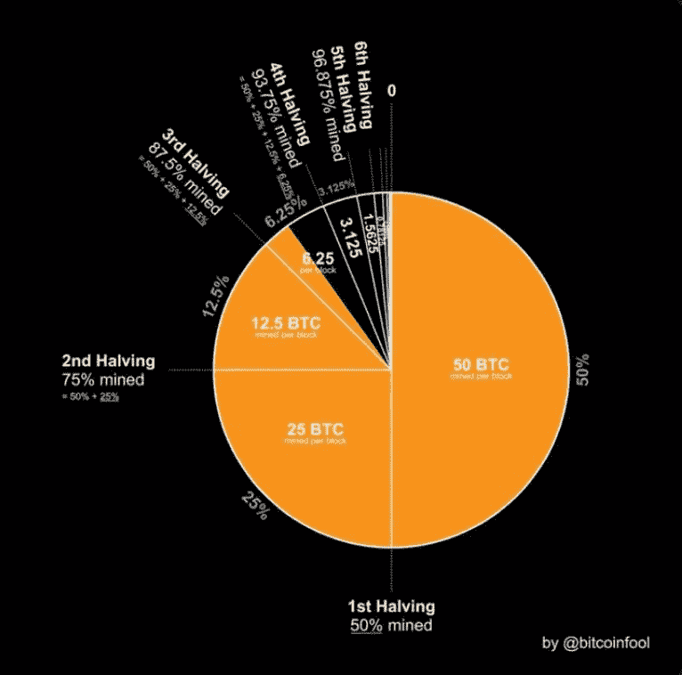

# 只剩下 200 万个比特币:比特币达到 1900 万个

> 原文：<https://medium.com/coinmonks/only-2-million-bitcoins-remain-bitcoin-reaches-the-19-million-mark-805388c9bf39?source=collection_archive---------41----------------------->

**Visit our website:-** [**https://bitcoinsupports.com/**](https://bitcoinsupports.com/)

在第 1900 万个被开采出来后，未来 100 年内只会开采出 200 万个比特币。

今天，第 1900 万枚比特币(BTC)被开采出来，标志着世界上最有价值的货币的分水岭时刻。大约到 2140 年，只有 200 万枚比特币会被铸造(或开采)，剩下 1900 万枚在流通。

第 1900 万枚比特币被 SBI 加密公司开采，并在第 730002 号区块进入流通。由于交易费和区块奖励的麻烦，SBI 加密公司获得了 6.32 BTC，或近 293，000 美元。

比特币社区很快意识到这一历史性事件值得庆祝。Kryptovault 的 Kjetil Hove Pettersen 说:“我们只剩下 200 万枚比特币——不到总量的 10%”,他可能是世界上对 ESG 最友好的比特币矿工之一。他接着说:

“乍一看，这似乎是一个微不足道的数字，但我相信采矿业最辉煌的日子还在前面。”比特币开花矿业公司 Bitcoin Bloem 的创始人伯特·德·格鲁特表示，“今天开采的 1900 万枚比特币标志着一个历史时刻”。他表示，这“提醒我们中本聪的努力有多么重要”，并补充说“我们希望我们能送花来表达我们的感激之情。”

“在未来的 118 年里，只剩下 200 万 BTC 可供开采！”比特币收购公司创始人弗拉德·科斯泰亚说。比特币推出 13 年来，矿工发现了 1900 万个比特币；最后一枚比特币预计将在 2140 年被开采出来。

因为目前的供给率是每块 6.25 个比特币，所以 2020 年 9 月开采了第 1850 万个比特币。下一次降息将在 2024 年进行，届时发行利率将降低一半。

**Visit our website:-** [**https://bitcoinsupports.com/**](https://bitcoinsupports.com/)

第 1900 万枚比特币的开采凸显了比特币对比特币社区的稀缺性。人权基金会(Human Rights Foundation)首席战略官亚历克斯格拉德斯坦(Alex Gladstein)表示，考虑到全球采用比特币的时间有多早，这种稀缺性就更加明显了:

[【https://twitter.com/gladstein/status/1509687439559999503](https://twitter.com/gladstein/status/1509687439559999503)

萨尔瓦多现在是唯一一个接受比特币作为法定货币的国家，它现在正在发行比特币支持的“火山债券”来筹集资金。然而，在 2021 年，许多其他国家，如巴西，显示出接受比特币的迹象。最激进的比特币买家，如跆拳道的 Luna Foundation Guard，如果他们希望在比特币剩余不到 10%的情况下继续持有 sat，他们将面临一场艰苦的斗争。

**访问我们的网站:-**[**https://bitcoinsupports.com/**](https://bitcoinsupports.com/)

**免责声明:以上为作者观点，不应视为投资建议。读者应该自己做研究。**

> 加入 Coinmonks [电报频道](https://t.me/coincodecap)和 [Youtube 频道](https://www.youtube.com/c/coinmonks/videos)了解加密交易和投资

# 另外，阅读

*   [霍比评论](https://coincodecap.com/huobi-review) | [OKEx 保证金交易](https://coincodecap.com/okex-margin-trading) | [期货交易](https://coincodecap.com/futures-trading)
*   [网格交易机器人](https://coincodecap.com/grid-trading) | [Cryptohopper 审查](/coinmonks/cryptohopper-review-a388ff5bae88) | [Bexplus 审查](https://coincodecap.com/bexplus-review)
*   [7 个最佳零费用加密交易平台](https://coincodecap.com/zero-fee-crypto-exchanges)
*   [氹欞侊贸易评论](https://coincodecap.com/anny-trade-review) | [火币保证金交易](/coinmonks/huobi-margin-trading-b3b06cdc1519)
*   [去中心化交易所](https://coincodecap.com/what-are-decentralized-exchanges) | [比特恩斯 FIP](https://coincodecap.com/bitbns-fip) | [Pionex 评论](https://coincodecap.com/pionex-review-exchange-with-crypto-trading-bot)