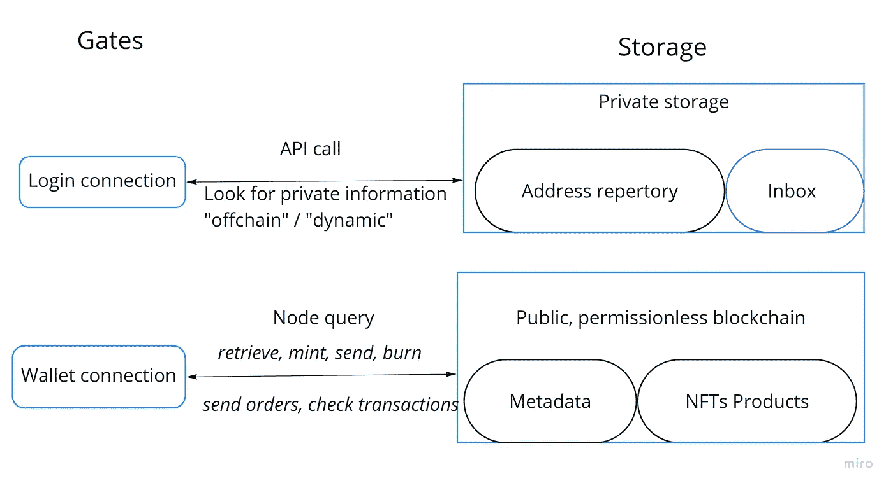
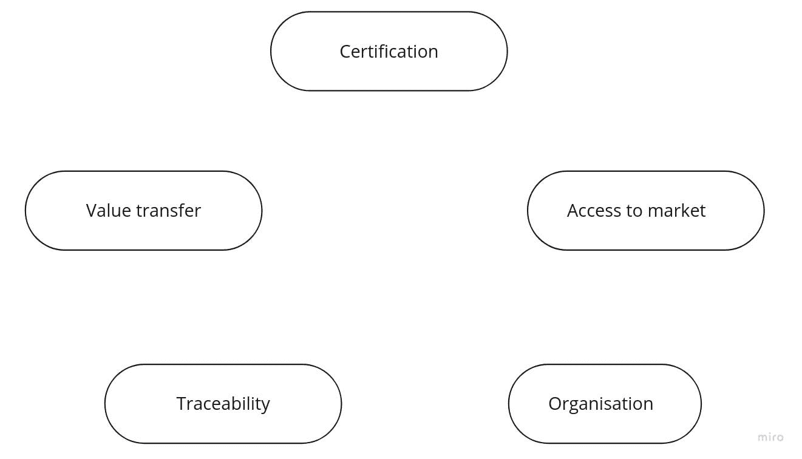
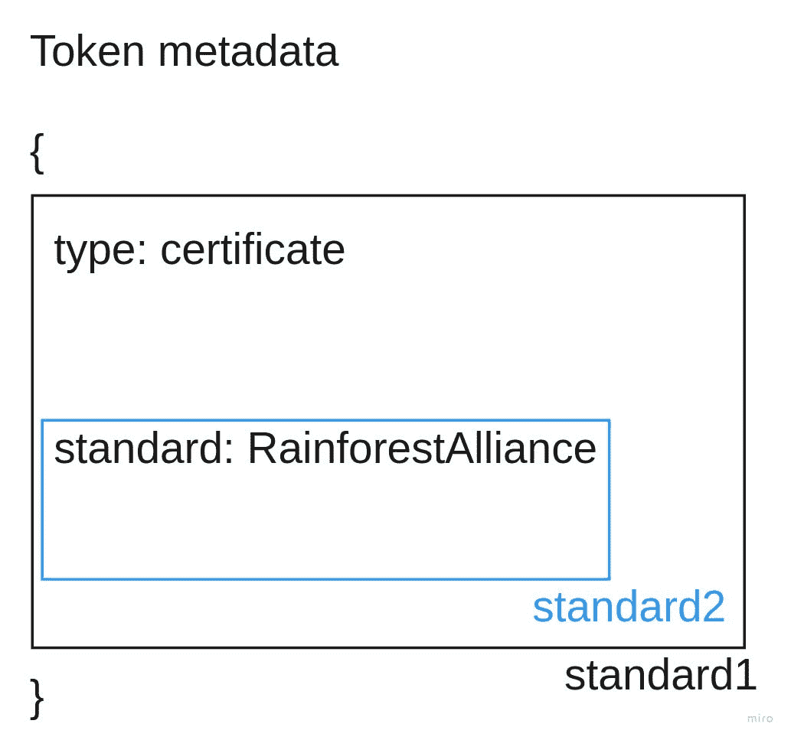
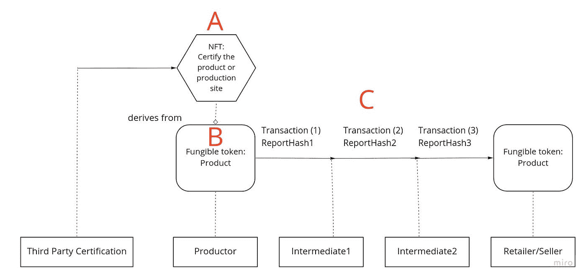
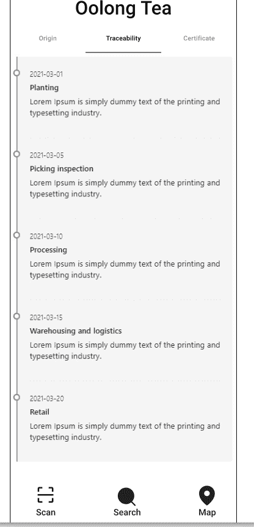
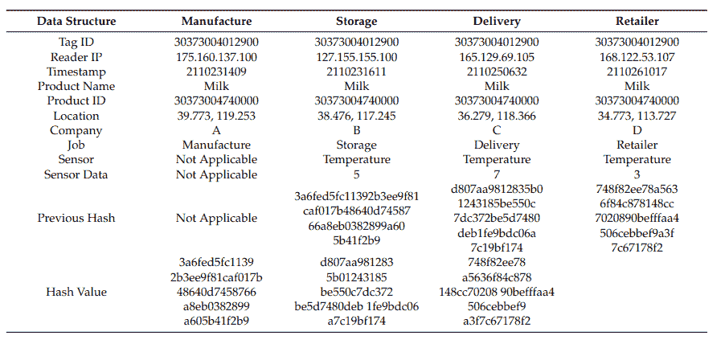
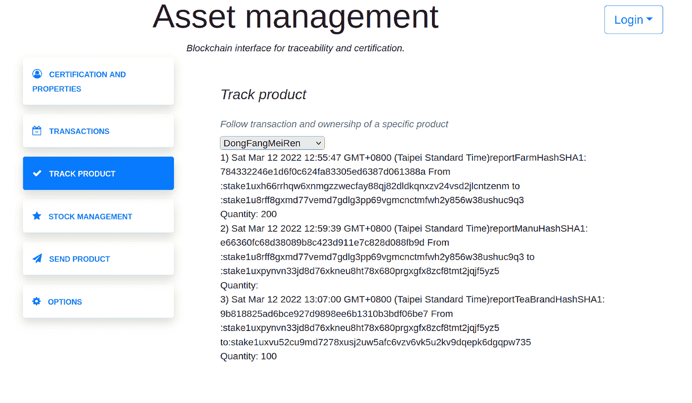

# 基于区块链令牌构建开放的认证和追溯体系

> 原文：<https://medium.com/coinmonks/open-traceability-technical-documentation-6c86e92cbc36?source=collection_archive---------27----------------------->

Structure of the open traceability and certification system

***语境***

产品追溯系统可用于识别食品、药品、服装、化妆品、汽车和消费电子产品等的来源。该系统携带的信息有助于做出更有意识和可持续的决策。在工业部门和学术研究中，采用区块链实现可追溯性是最近蓬勃发展的趋势。然而，大多数区块链解决方案都很昂贵，需要权限和专业知识来设置和运行(例如 IBM food trust)。

我们的系统以产品为中心，与产品无关，源于多种需求:

*   供应链的透明度和利益相关者之间的信息对称
*   供应链的直接连接、去中心化和去中介化
*   无许可，开源和低成本，以提高区块链的采用。

这种可追溯性系统使用令牌作为产品和认证的数字符号。该系统可以集成产品的所有类型的认证、安全测试，并直接在区块链上发布，降低了成本。

**A/结构**

这种混合结构将允许用户在资产创建、转移、烧毁和加密货币交易后接收来自区块链的警报。

私有存储将方便用户的区块链书写和阅读过程。例如，将钱包地址保存在私有存储库中，并创建一个句柄来连接加密货币或代币。这个数据库还将允许用户使用他们的句柄相互发送消息，并携带关于产品的动态信息(如消费者反馈)，并且可能在未来保留用户偏好(如语言、时区)。

该系统也将有助于代币组织。因此，可以根据他们的令牌来组织群组。

该应用程序将要求使用密码和电子邮件登录，以简化私人存储中的帐户创建过程。然而，该系统仍将作为匿名使用，所有的功能将是开放源代码和用户审计记录。

因此，通过与用户加密钱包连接，该平台将容易集成，并且许多并发平台可以建立在相同的区块链信息上。

**原型制作**:

*   我们正在 react 平台上开发一个登录系统。我们的原型允许使用 cardano 序列化库(*)连接 Cardano 钱包，我们正在努力集成所有部件。

**B/结构优势**

Five advantages for the hybrid storage platform

这种混合结构有助于实现一个完整的系统，包括认证、价值转移、可追溯性、组织(和分权治理)和市场准入。

**1。资产铸造认证**

日常生活中需要认证来评估日常产品对社会、健康和环境的影响。区块链令牌通过证明发送者的身份来帮助给出这一重要信息。

认证者可以直接铸造令牌并将其发送到接收者认证的钱包。一旦创建了数字资产，任何消费者和利益相关者都将能够参考他的资产 ID 和原始交易(Tx0 ),可以通过 QR 码显示。QR 码将激活区块链查询以及与认证、测试、出处相关的产品和信息相关的令牌。

认证和可追溯性系统的一个主要问题是利益相关者之间的数据协调。互操作性需要标准化的框架。

区块链在元数据领域实现数据的方式很灵活。因此，有可能创建标准和子标准来更容易地交换信息和令牌。

为了解决这一问题，我们开发了一个 JavaScript 对象符号(JSON)文件的开放库系统，以创建、保存和共享用于铸造实物资产产品的画布，并实现元数据连接器以将这些产品的令牌与地点、证书相链接。

令牌和元数据格式必须与在产品生命周期内共享产品和认证信息的积极利益相关者共同决定。

例如，使用私有存储，供应链利益相关者可以向生产商发送画布，用所需的数据制作其食品的标记。

**原型制作**:

*   我们正在创建一个代币铸造平台，允许任何类型的信息进行注册。然后，我们将致力于 NFTs 开放格式的开发，以带来更多实际的用例，并帮助 NFT 参考和描述真实的产品。该平台将在开始时使用第三方，但在期限内应使用自己的节点来创建产品认证

**2。资产和加密货币转移**

该平台旨在将资产和加密货币直接发送到另一个指定的地址。我们将开发一个处理系统，用更短@handle 链接加密钱包地址。

该系统可以用于以后更容易地创建交换和市场功能。最后，该平台可以帮助发布来自物联网的原始数据，这些数据可以保存在帐户上，然后在交易过程中部署，以提供关于产品的公共/私人信息。

**原型制作**

*   可以提交 ADA 和 token 事务并添加元数据的功能原型。我们正在努力整合董事会。

**3。可追溯性**

从一个加密钱包到另一个加密钱包的每一笔资产交易都保存在区块链上。因此，如果令牌是产品的表示，则不可变事务转换产品的可追溯性。私有信息可以在资产元数据中传输，并追踪产品的来源。这一功能对于可能需要验证可追溯性系统并发现供应链中的污染的监管机构尤为重要。

选自《面向食品供应链的区块链可追溯系统框架设计》

A light explorer for consumer

Example of metadata from “Design of a Blockchain-Enabled Traceability System Framework for Food Supply Chains”

Our tracking product system

该系统能够发送嵌入在事务中的元数据事务，例如到私有或公共存储器的超链接，在该存储器中可以找到具有信息散列的文件。私有存储提供了基于注册的凭证访问某些信息的能力，从而即使在许可的区块链上也能保持机密性。

至于数据协调，系统也可以接受使用 JSON 文件的元数据事务框架

**原型制作**:

我们的原型可以检索几个信息，包括:

*   特定批次的产品在哪里
*   交易是什么时候进行的
*   哪些信息存储在事务元数据中

我们仍在评估所需的规格。我们还将包括可以隐藏的交易，以帮助清晰和可视化。

**5。组织**

使用他们的认证令牌，利益相关者将能够管理一个特定的分散自治组织(tokens-DAO)或团体并做出决策，并且可以发送和接收成员基金。

我们可以使用之前的收件箱/聊天来创建一个将拥有某些特定令牌的组，并更容易地提高组的自主性和自我管理。

由于该组使用来自区块链的令牌，因此许多并发系统可以提供基于用户令牌的解决方案。

**原型:**

*   我们正在开发一个混合解决方案，其中用户根据处理程序发送一个入侵，并需要一个令牌来加入一个组并进行交互或投票。

**6。产品交流和市场准入**

该平台可以帮助将资产连接到 NFT 社交或市场平台的 twitter/Instagram 或个人网站，以提高产品和认证的可见性。

我们可以想象一个来自消费者和农民的反馈系统。该系统将帮助农民增加其产品的附加值，并在消费者和农民之间建立直接联系，并在社交媒体上分享产品，以帮助促销。

最后，该系统允许在食品代币和加密货币之间部署分散市场和产品交换(DEX ),这可以是在区块链上直接交易产品的机会。

**原型制作:**

*   我们正在开发一个类似的食品系统，用户可以从移动版本给出反馈。我们也期待开发一个交易平台(DEX)来交易产品。

**结论**

我们仍在产品和功能上努力。感谢您的阅读！

**参考文献**:

【https://codepen.io/ninojamay/full/ExoKxVX】T4+有待发布叉自[https://github . com/dynamic strategies/cardano-wallet-connector](https://github.com/dynamicstrategies/cardano-wallet-connector)

> 加入 Coinmonks [电报频道](https://t.me/coincodecap)和 [Youtube 频道](https://www.youtube.com/c/coinmonks/videos)了解加密交易和投资

# 另外，阅读

*   [最佳免费加密信号](https://coincodecap.com/free-crypto-signals) | [YoBit 评论](/coinmonks/yobit-review-175464162c62) | [Bitbns 评论](/coinmonks/bitbns-review-38256a07e161)
*   [OKEx 评论](/coinmonks/okex-review-6b369304110f) | [Kucoin 交易机器人](/coinmonks/kucoin-trading-bot-automate-your-trades-8cf0ca2138e0) | [期货交易机器人](/coinmonks/futures-trading-bots-5a282ccee3f5)
*   [AscendEx Staking](https://coincodecap.com/ascendex-staking)|[Bot Ocean Review](https://coincodecap.com/bot-ocean-review)|[最佳比特币钱包](https://coincodecap.com/bitcoin-wallets-india)
*   [霍比审核](https://coincodecap.com/huobi-review) | [OKEx 保证金交易](https://coincodecap.com/okex-margin-trading) | [期货交易](https://coincodecap.com/futures-trading)