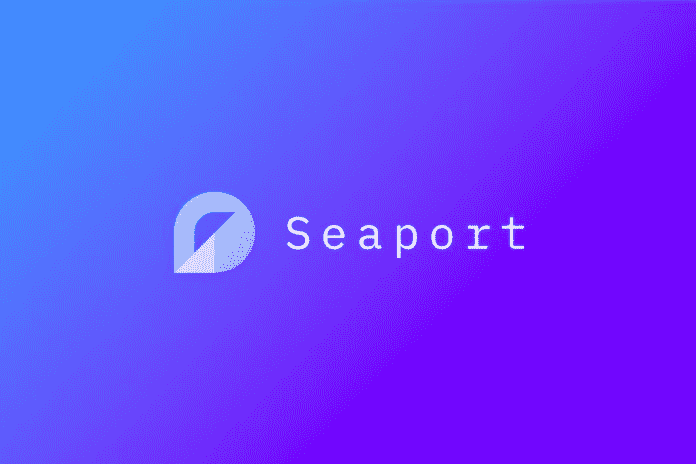
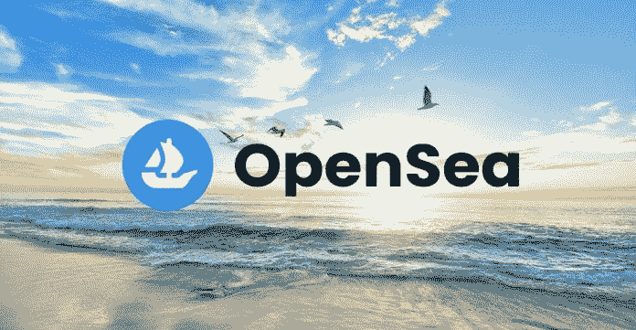

# OpenSea 将推出一个名为 SeaPort 的新 NFT 市场

> 原文：<https://medium.com/coinmonks/opensea-to-launch-a-new-nft-marketplace-named-seaport-98c37a294a37?source=collection_archive---------28----------------------->

OpenSea 是目前最受欢迎的 NFT 市场，它将扩展其生态系统，并推出一个名为 Seaport 的全新 NFT 市场。

OpenSea 在 5 月 20 日宣布，他们将发布一个新的 Web3 NFT 市场(海港),用于交易流行的令牌集合。SeaPort 将是一个分散的协议，对所有内容创作者、开发者和 NFT 收藏者开放。海港将提供一种新的交易 NFTs 的方式，允许一个舞台，买方和卖方创造自己的交易或销售。

*OpenSea 宣布 NFT 海港市场*

# NFT 海港市场与 OpenSea 有什么不同

大多数当前的 NFT 市场仅提供一种用于列表的手段，其中一方同意提供 NFT(卖方)而另一方同意提供加密支付(买方)。Seaport 采取了一种不同的方法:“要约人”可以同意供应一些[ETH](https://bumblebeecrypto.com/crypto-prices/)/ERC 20/ERC 721/ERC 1155 物品，这被称为“要约”为了让要约被接受，要约人指定的收件人必须收到一些物品，这就是“对价”

每个[海港](https://opensea.io/blog/announcements/introducing-seaport-protocol/)列表都由相同的结构组成，包括一个改进的 EIP-712 签名有效载荷，它清楚地概述了什么可以花费，什么将由谁接收。然而，有许多不同的方式可以让实现者选择实现列表。

最直接的实现选项包括选择一个特定的列表并创建该列表的隐含“镜像”,其中实现者接收所有要约项目并提供所有考虑项目。Seaport 还支持通过一组“履行”一次履行任意数量的列表的选项——每次履行对应于单个商品转移，并指示提交者可以与相应的考虑商品匹配的一组要约商品。只要每个清单上的每个对价项目在所有履行都被应用之后被完全记入，要约人就可以利用他们的需求的一致性来完成他们的转让。这使得能够消除冗余传输(这通常是协议中最消耗气体的部分),并允许新颖和高效的交易。

要约人也可以选择在任何列表中指定“区域”和“渠道”。任何人都可以创建新的区域或部署新的管道。区域是一个帐户(通常是一个合同),它在履行之前执行额外的验证，并且可以代表要约人取消列表。

渠道是要约人设定象征性批准的合同。管道的所有者可以添加和删除管道的“通道”，注册的通道可以指示管道如何传输令牌。这两个概念以完全“选择加入”的方式实现了可扩展性和可升级性，给予创建者、收集者和平台额外的能力，使他们能够自己选择如何利用海港，同时保持与协议上的其他列表的广泛可组合性。

此外，任何列表还可以选择支持所提供项目的部分填充，其中填充者可以选择花费全部所提供项目中的每一个的某一部分，并且接收回每个报酬项目的相等部分，只要相对比率基于初始提供保持不变。要约人可以将部分填充与基于标准的项目相结合，以创建购买或出售多个具有给定特征的 NFT 的长期要约。

最后，海港协议支持“小费”——当履行一个清单时，一个履行者可以包括额外的考虑项目，只要他们不“小费”多于最初的报价。

[OpenSea](http://opensea.io/) 宣布 Seaport 是完全去中心化和开源的，并声明“OpenSea 不控制或运行 SeaPort 协议——我们只是众多建立在这个共享协议之上的协议中的一个。”他们还表示，新平台消除了可能导致高油价的冗余传输。

来源:BumbleBeeCrypto.com

> 加入 Coinmonks [电报频道](https://t.me/coincodecap)和 [Youtube 频道](https://www.youtube.com/c/coinmonks/videos)了解加密交易和投资

# 另外，阅读

*   [Bookmap 评论](https://coincodecap.com/bookmap-review-2021-best-trading-software) | [美国 5 大最佳加密交易所](https://coincodecap.com/crypto-exchange-usa)
*   最佳加密[硬件钱包](/coinmonks/hardware-wallets-dfa1211730c6) | [Bitbns 评论](/coinmonks/bitbns-review-38256a07e161)
*   [新加坡十大最佳加密交易所](https://coincodecap.com/crypto-exchange-in-singapore) | [购买 AXS](https://coincodecap.com/buy-axs-token)
*   [红狗赌场评论](https://coincodecap.com/red-dog-casino-review) | [Swyftx 评论](https://coincodecap.com/swyftx-review) | [造币厂评论](https://coincodecap.com/coingate-review)
*   [投资印度的最佳密码](https://coincodecap.com/best-crypto-to-invest-in-india-in-2021)|[WazirX P2P](https://coincodecap.com/wazirx-p2p)|[Hi Dollar Review](https://coincodecap.com/hi-dollar-review)