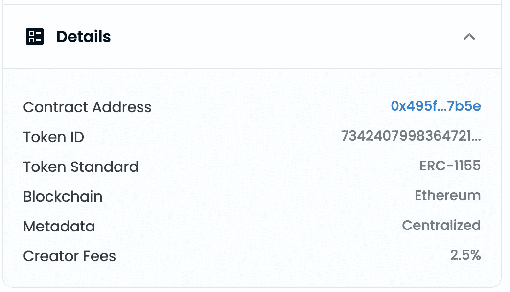
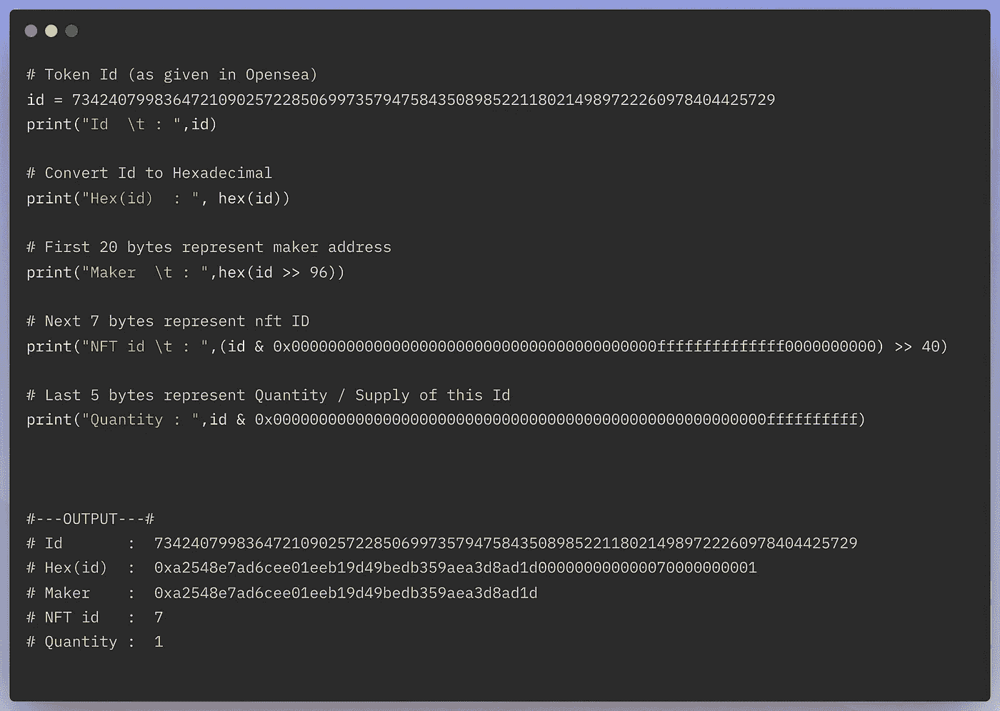
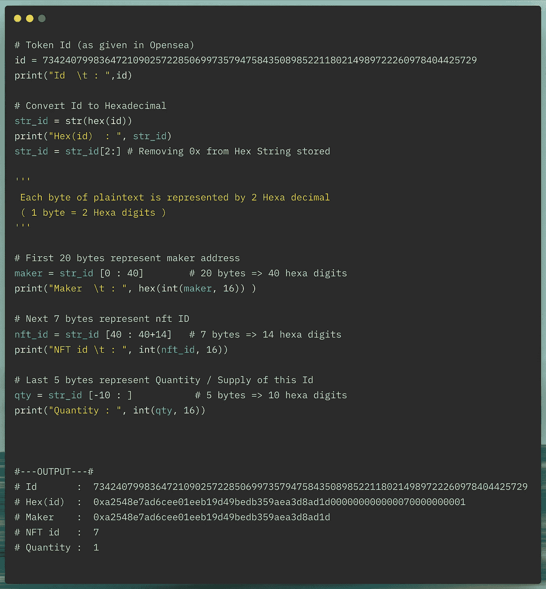
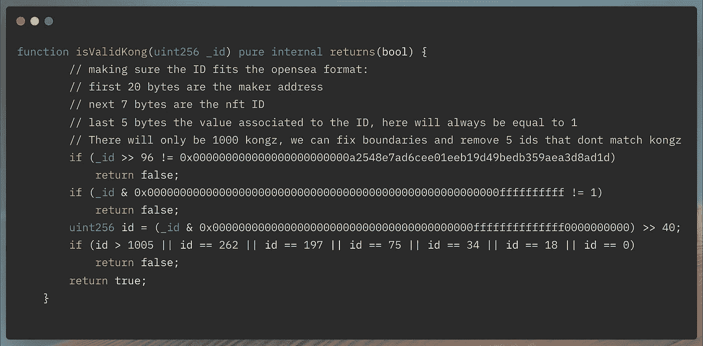

# Opensea TokenId:已解释

> 原文：<https://medium.com/coinmonks/opensea-tokenid-explained-f420401f5109?source=collection_archive---------3----------------------->

> “这是什么垃圾数字……等等，那真的是垃圾号吗？”

Photo by [Nick Hillier](https://unsplash.com/@nhillier?utm_source=medium&utm_medium=referral) on [Unsplash](https://unsplash.com?utm_source=medium&utm_medium=referral)

# 介绍

你有没有尝试过在没有自己合同的情况下在 *Opensea* 中创建 NFT，并且想知道*令牌 ID* 中的巨大数字实际上意味着什么…？
如果是，*大家好，欢迎来到这个愚蠢的傻瓜俱乐部*。让我作为同一个俱乐部的成员，帮你解决这个问题。

# 这个庞大的数字是什么？

[Token Id : 73424079983647210902572285069973579475843508985221180214989723113099915952129](https://opensea.io/assets/ethereum/0x495f947276749ce646f68ac8c248420045cb7b5e/73424079983647210902572285069973579475843508985221180214989723113099915952129)

令牌 id 中的这个庞大的垃圾号码包含了更多的价值，并提供了令牌历史的整体数据。解码后的数字给出了创建者的地址、nft id 和相应令牌的供应量(数量)。

# TokenId 已解释

令牌 id 作为一个整数值是没有意义的，但是当解码为字节值时，它会解包很多数据。令牌 id 的 32 个字节被分解成有用的 20 个字节、7 个字节和 5 个字节。

*   前 20 个字节→代表制造商的地址
*   接下来的 7 个字节→代表 NFT id
*   最后 5 个字节→代表 NFT 的供应量或数量

由于 Opensea 中的所有令牌都符合 ERC 1155 标准，这里提到的数量或供应量定义了每个可用令牌的供应量。

# **举例**

考虑一下直接在 opensea 上创建的 NFT([*cyber kong # 7*](https://opensea.io/assets/ethereum/0x495f947276749ce646f68ac8c248420045cb7b5e/73424079983647210902572285069973579475843508985221180214989722260978404425729)*)，*。让我们使用下面的 python 脚本来解码它的令牌 id。

> ***注*** *:* 脚本 1 和脚本 2 的功能相同，但在核心实现上有所不同。

## 剧本 1 ( **优码**)

*   下面的脚本[open sea _ token Id _ decoded . py](https://gist.github.com/sidarth16/12dc23f53c48fbbcf18644c935c770b1#file-opensea_tokenid_decoded-py)，将令牌 id 作为输入，并执行移位操作以提取相应的字节值

opensea_tokenId_decoded.py : [view raw source code](https://gist.github.com/sidarth16/12dc23f53c48fbbcf18644c935c770b1#file-opensea_tokenid_decoded-py)

## 脚本 2(简单易懂的代码)

*   下面的脚本[open sea _ Token id _ decoded _ easy . py](https://gist.github.com/sidarth16/12dc23f53c48fbbcf18644c935c770b1#file-opensea_tokenid_decoded-py)，将令牌 Id 作为输入，对令牌 Id 的十六进制转换字符串执行切片操作。

opensea_tokenId_decoded_easy.py : [view raw source code](https://gist.github.com/sidarth16/c0e03083267d16490a59f398cb5d769e#file-opensea_tokenid_decoded_easy-py)

# TokenId 的这种格式为什么有用？

## **优化记账**:

*   制定者/创建者解决了具体的簿记问题，使这种方法实施起来简洁流畅。
*   不考虑集合，当用户创建一个新的 NFT 时，NFT id 保持递增。
*   因此，每个用户/制造商地址都被视为 opensea 上直接创建的 NFTs 的参考源事实，从而使记账变得没有麻烦。

## **将 NFTs 提升到新合同:**

*   让我们假设一个最初在没有任何合同的情况下在 opensea 上创建的集合获得了巨大的成功。
*   现在您想在现有的 NFTs 上添加一些实用程序，为此您需要将 opensea 中列出的 NFTs 移动到您自己的合同中。
*   通过使用上述令牌 id 格式，将最初的 Opensea 创建的 NFTs 提升到新契约的过程变得非常简单。
*   像最初直接在 opensea 上创建的 [CyberKong_old](https://opensea.io/collection/cyberkongzold) 这样的受欢迎的 NFT 集合已经有效地将 NFTs 升级到他们的新合同 [CyberKongz](https://opensea.io/collection/cyberkongz) ，最大限度地利用了 opensea 的令牌 id 的这种格式。

Contract : [CyberKongz (0x57a204aa1042f6e66dd7730813f4024114d74f37)](https://etherscan.io/address/0x57a204aa1042f6e66dd7730813f4024114d74f37#code)

# 结论

虽然初看起来，opensea 中使用的令牌 id 格式看起来像令人难以置信的大数字列表，但当解码时，事情就很有意义了。从而使 tokenId 的这种格式成为以有效的分散方式在单个契约平台下容纳来自多个用户的多个集合的最佳可能方式之一。

> “使用荷兰拍卖机制进行 IPO / ICO 的基本演练，以及为什么它在区块链市场被广泛采用。！! "
> 查看:[荷兰拍卖——IPO/ICO](/coinmonks/dutch-auction-ipo-ico-e02d4441a286)

# 创作者笔记

非常感谢您的阅读。我希望这对你的 web3 之旅有所帮助。如果有任何疑问，请随时联系我们。
这是**我的第一个媒体博客**，欢迎你的宝贵建议。

关注区块链、NFTs、Defi、智能合约等更多内容
*联系我*[***LinkedIn***](https://www.linkedin.com/in/sidarths/)， [***邮箱***](http://ssidarth1999@gmail.com) 。

> 加入 Coinmonks [电报频道](https://t.me/coincodecap)和 [Youtube 频道](https://www.youtube.com/c/coinmonks/videos)了解加密交易和投资

# 另外，阅读

*   [MXC 交易所评论](/coinmonks/mxc-exchange-review-3af0ec1cba8c) | [Pionex vs 币安](https://coincodecap.com/pionex-vs-binance) | [Pionex 套利机器人](https://coincodecap.com/pionex-arbitrage-bot)
*   [我的密码交易经验](/coinmonks/my-experience-with-crypto-copy-trading-d6feb2ce3ac5) | [比特币基地评论](/coinmonks/coinbase-review-6ef4e0f56064)
*   [CoinFLEX 评论](https://coincodecap.com/coinflex-review) | [AEX 交易所评论](https://coincodecap.com/aex-exchange-review) | [UPbit 评论](https://coincodecap.com/upbit-review)
*   [AscendEx 保证金交易](https://coincodecap.com/ascendex-margin-trading) | [Bitfinex 赌注](https://coincodecap.com/bitfinex-staking) | [bitFlyer 点评](https://coincodecap.com/bitflyer-review)
*   [麻雀交换评论](https://coincodecap.com/sparrow-exchange-review) | [纳什交换评论](https://coincodecap.com/nash-exchange-review)
*   [支持卡审核](https://coincodecap.com/uphold-card-review) | [信任钱包 vs 元掩码](https://coincodecap.com/trust-wallet-vs-metamask)
*   [TraderWagon 回顾](https://coincodecap.com/traderwagon-review) | [北海巨妖 vs 双子星 vs BitYard](https://coincodecap.com/kraken-vs-gemini-vs-bityard)