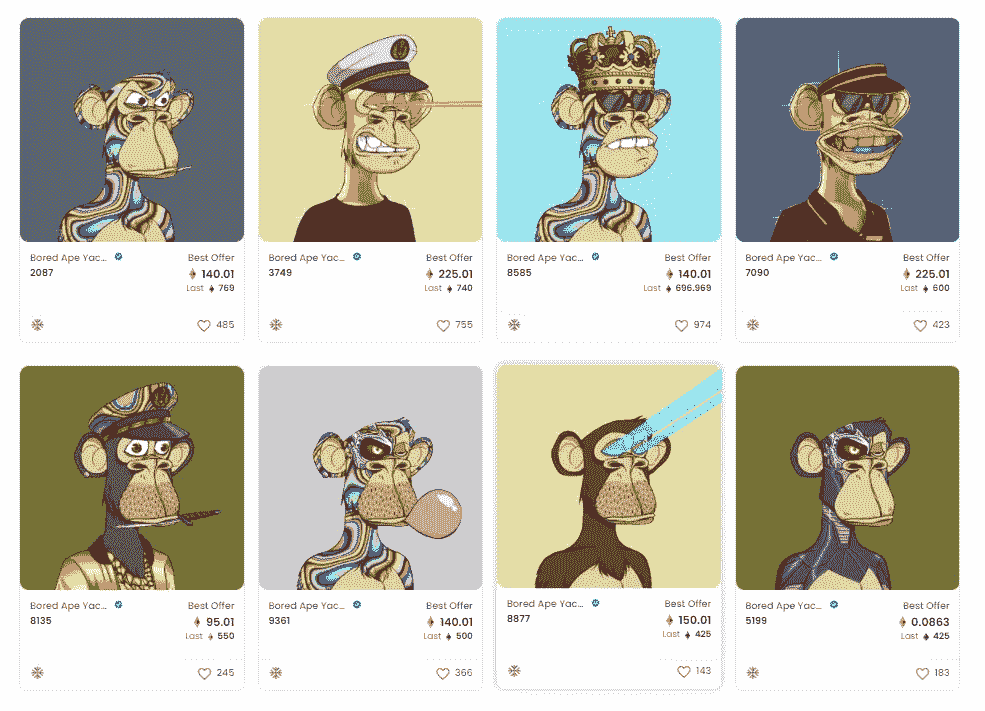
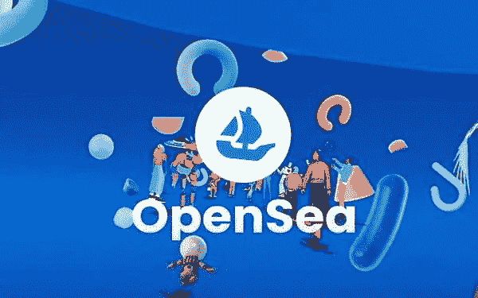

# OpenSea Vs ArtKit

> 原文：<https://medium.com/coinmonks/opensea-vs-artkit-3f46d5ed0898?source=collection_archive---------12----------------------->

NFT 哪家商场比较好？
O *pensea 或 Artkit*

虽然使用 OpenSea 和 Artkit NFT 市场各有利弊，但我们认为你应该知道以下几点。

非功能性数字技术基于能够创造、交易和拥有独一无二且不可改变的数字资产的理念。因此，毫不奇怪，NFT 市场对这场运动的成功至关重要，它提供了实现这一目标所需的工具(制造和交易 NFT)。这些市场可以根据其平台运营的开放程度进行分类

一方面，有平台允许预先批准的艺术家在选择性的基础上列出或铸造 NFT。另一方面，更受欢迎的选项在销售和铸造非功能性交易时有一种更放松和包容的态度。换句话说，他们使得任何人都有可能在他们的市场上提供非功能性交易。

**什么是 OpenSea？**

OpenSea 是一个 NFT 特有的点对点市场。这提供了特别是制造和交换非功能性交易所需的基础设施。这一平台的优势是允许其大部分(如果不是全部)活动在区块链进行。用户不需要中介的帮助来制作、购买或销售基于 NFT 的数字对象，这是平台去中心化的一个重要方面。

什么是 Artkit？

ArtKit 是一个社交媒体 NFT 平台，允许用户使用 NFT 创建、分享和参与故事。它将为每个人提供一个 3D 数字平台，通过它他们可以享受艺术和文化。ArtKit 将为社交媒体开发自己的 NFT 平台，让消费者享受艺术。
因此，为了扩展故事并为创建的 NFT 添加一些实用工具，NFT 将变得更加包容，普通人将理解它为什么存在，用户也可以购买、出售、喜欢和不喜欢物品，还可以对 NFTs 发表评论。

**它们如何比较？**

现在你已经对 OpenSea 和 Artkit 有了基本的了解，让我们根据它们的服务和特性对两者进行比较。
art kit 和 Opensea 以及基于 Nft 的平台，您可以买卖 Nft、查看统计数据以及执行其他功能，

下面是两个平台的一些相似之处，而 OpenSea 允许你做很多很酷的事情。当然，交易、出售和购买不同类型的非金融交易是最常见的行为。但是，您可以通过该网站了解更多关于 NFT 市场的信息，并了解新的计划

另一方面，Artkit 还提供教育功能，除了交易和参与 NFT，留出一个教育系统，在那里你可以学习系统如何工作

在区块链，NFT 可以表示任何对象，无论是物理的还是数字的，OpenSea 和 Artkit 都缩小了使用类别的范围，以捕捉当今最流行的 NFT。
艺术、音乐、域名、虚拟世界、交易卡、收藏品、体育资产和公用事业非功能性物品也像会员证一样，非功能性物品被分为几类

这两个平台都允许你创建自己的非功能性物品，即使事先不知道它们，也不用编写代码块。在这些平台上创建 NFT 之前，您不需要知道如何编码，也没有任何利用其令人困惑的交易接口的技术要求。

*多区块链支持*

值得注意的是，NFT 市场通常会定制自己的基础设施，以适应各种区块链。用户只能与 NFT 市场支持的区块链本地的 NFT 和项目进行交互。例如，基于以太坊的 NFTs 将在基于以太坊的市场上得到支持。
NFT 市场正在逐步实施多链方法，允许用户探索许多区块链的 NFT 生态系统

Opensea 允许其用户在以太坊、Polygon 和 Klaytn 上创建和访问 NFT，而 Artkit 从 BSc 开始扩展其运营，但将纳入 Cronos、Pulse chain、Algorand、Stellar、Tron 和以太坊，因此，这两个平台的区块链集成显然非常重要。

**是什么让 Artkit 与 Opensea 不同？**

虽然 NFT 市场的基础设施是由 OpenSea 免费提供的，但用户在每笔 NFT 交易中要支付 2.5%的费用来资助平台的维护，而你在 Artkit 上只需支付 1%或更少的费用。虽然 Opensea 是一个允许创建和交易 NFT 的平台，但 ArtKit 正在社交媒体、NFT 和元宇宙之间架起一座桥梁。解释这一点的一个简单方法是将 Opensea + Instagram +元宇宙放在一个平台上，包括 Move to Earn

Artkit 正在建立一个分散的跨链/多链 NFT 市场加上社交媒体，支持买家和创作者之间的社交互动，这与 Opensea 不同。OpenSea 和 ArtKit 允许任何人在平台上创建和销售 NFT，但在 Artkit 上，经过验证的用户/艺术家将无限销售，而未经验证的用户将有限销售，以阻止抄袭。在 ArtKit 上，任何人都可以将他们的音乐或艺术转换成 NFTs，在他们的社交媒体上展示，获得喜欢，关注者，评论，出售和购买等。

Opensea 还没有原生令牌，但 Artkit 的令牌$Arti 在 BSC 上推出。他们的分散式多链 NFT 平台将 Pulsechain、BSC、Cronos 和 Polygon 作为第一批纳入的链之一，费用将以无限的方式支付，包括使用稳定的硬币、菲亚特、ArtKit 或本地代币或任何在 ArtKit 平台上销售的项目。

虽然 Artkit 支持分散化运营，但 Opensea 不支持，因为它尚未部署民主化决策流程所需的基础设施，OpenSea 没有运营完全分散化的治理模式

Opensea 支持超过 150 种支付选项，而 Artkit 不受限制，将接受超过 1000 种支付选项。Artkit 还通过捐款或合作，甚至为您的社区创建页面来帮助 NFT 创作者。
基于元宇宙技术，ArtKit 还将建造一个博物馆作为元宇宙，供游客体验 3D 艺术展。艺术家将能够展示他们的作品，举办音乐会，表演单口喜剧，并组织 3D 展览。ArtKit 将在网上(如 Arti Lucky Box)和元宇宙画廊(如单口喜剧)举办活动，让事情变得更有趣，并增强社区凝聚力。他们还将在 Telegram 等社区渠道和其他社交媒体上为投资者举办活动。

**总之**

> 那么，哪个市场更好呢？

最终的答案取决于个人偏好，以及为了使用某个特定的功能或服务，你准备放弃什么。

由于其类似社交媒体的结构和设计师讲述其 NFT 故事的能力，Artkit 具有明显的优势。由于博物馆和元宇宙的活动和展示，Artkit 也将更具吸引力和参与性，这与 Opensea 相反，open sea 只允许您交易和查看 NFT，而没有任何类型的互动参与。