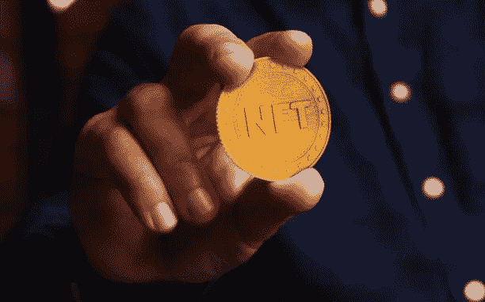

# 完成元宇宙学业后的就业机会

> 原文：<https://medium.com/coinmonks/opportunities-for-employment-upon-completion-of-your-metaverse-studies-74b19bfc71e2?source=collection_archive---------48----------------------->

二十世纪见证了互联网的兴起和跨国公司大规模生产的全球化。元宇宙于 2021 年推出，并将作为首次推出的一年而被铭记。一种全新的互联网即将出现:它比之前的任何互联网都更具沉浸感、互动性和团队导向性。说到科幻和幻想，像增强或虚拟现实这样的技术早就被包括在内了。

随着元宇宙越来越受欢迎，管理它和提供新的创新服务的就业机会也在增加。正因为如此，我们现在可以描绘一个充满尖端技术的世界，而不是一个反乌托邦的世界。对技术有热情并渴望了解元宇宙专业的人将来可能会在这个领域找到很多机会。另一方面，想去元宇宙工作的人需要大量的时间和练习才能精通。所以，今天，我们整理了一份元宇宙最重要工作的清单。

# 在元宇宙工作有几个好处

增强现实和虚拟现实的几个方面使元宇宙变得可行，允许用户居住在数字并行维度中，做他们想做的任何事情，如玩、学习、参加音乐会和会议，甚至旅行。

您可以使用元宇宙为我们的虚拟角色购买虚拟 3D 商品，在购买之前使用电子商务平台测试产品，以及购买加密货币代币。

用户可以使用虚拟现实耳机被传送到一个三维世界，这使得元宇宙能够存在。连接到用户手部的各种运动传感器被用来与元宇宙中的虚拟物品进行交互。

# 元宇宙地区

目前，元宇宙分为以下几个部分:

# 数字土地:

不可替代代币(NFT)是人们购买一块数字土地，对其进行定制，然后转售的一种方式。在元宇宙使用虚拟现实购买虚拟土地是可能的。此外，元宇宙的数字土地可以用来开展业务，建造住宅，或开发用户想要的任何其他东西。

# 虚拟音乐会:

使用虚拟和增强现实，元宇宙可以举办虚拟音乐会，展示来自世界各地的各种音乐和舞蹈流派。虚拟表演允许人们通过特殊的虚拟现实设备在自己家中舒适地观看现场表演。音乐会观众可以使用 Oculus Quest 等可穿戴虚拟现实耳机来参加这些音乐会和活动。那些不能亲自参加活动的人提供了类似的经历。为了增加乐趣，音乐会观众可以带一个朋友或家人一起参加这些活动。

# 视频会议:

疫情之后，视频会议变得很普遍。通过使用虚拟现实，元宇宙用户可以在微软团队中举行视频会议。化身——与某个用户有惊人相似之处的卡通人物——也可以被创造出来。这一元宇宙功能使会议更具沉浸感，提高了网络研讨会和团队会议的生产率和效率。

# 购物:

多亏了元宇宙，网上购物从未如此简单。例如，消费者现在可以在自己舒适的家中使用虚拟现实平台元宇宙中的虚拟现实来购买和测试服装和服饰等物品。有一个应用程序使用虚拟现实来测量和试穿服装，以使用户了解他们可能对商品和服务的期望。通过使用元宇宙和虚拟现实耳机，用户将能够试穿衣服、太阳镜和鞋子，看看它们穿起来怎么样。

这是未来几年需要额外工人的众多元宇宙油田的清单。

1.  **元宇宙科学家**

增强现实(AR)和虚拟现实(VR)的研究人员在当前的技术领域已经声名狼藉，但元宇宙的发展推动了元宇宙研究人员的地位，他们将负责管理元宇宙应用的基础。他们不只是为真实世界的事件创建数字模型；他们还将为创建元宇宙解决方案创建一个可见且实用的框架。

1.  **区块链工程师**

作为一名区块链工程师，您负责实施和创建企业应用的数字链。技术咨询和数据服务公司是区块链工程师最常见的雇主。尽管如此，在元宇宙，他们将是建立和实施区块链系统的人。

1.  **NFT 军师**

区块链技术和元宇宙就业领域的专业知识对于 NFT 战略的成功至关重要。他们将负责研究市场趋势，提出具体的建议和机会。此外，NFT 的战略家们将设计出将 NFT 概念与游戏化、战术执行和其他必要元素相结合的策略。

1.  **元宇宙规划师**

元宇宙的规划者为元宇宙公司创造了扩张的基础设施。为了构建机会的战略组合，他们发现市场可能性，并建立商业案例和路线图，等等。

1.  **生态系统的建筑师**

他们负责与其他组织和政府合作，以确保现有功能可以在大型平台上实现。元宇宙参与者有责任使政府能够投资于基础设施，并将重要的社区聚集在一起。

1.  **元宇宙软件工程师**

总而言之，软件工程师负责设计、实现和测试软件。元宇宙的软件开发商进行研究，开发新的软件和操作系统。除了创建新的程序，这些专家还钻研现有的程序，看看哪里可以改进。软件和系统评估是这个职位的要求。

1.  **元宇宙安全经理**

预测元宇宙函数将如何以及何时被使用或利用对于安全管理者来说至关重要。识别安全关键系统、组件和生产方法将由他们负责。这些人将面对他们行为的后果。

1.  **网络安全官员**

专门研究元宇宙的安全专业人员被称为“元宇宙网络安全专家”，他们通过实时阻止网络攻击、执行现有法律和协议以及开发新的应用程序和平台来监控潜在危险，从而保护元宇宙免受网络攻击。

1.  **元宇宙的数据科学家**

元宇宙对数据科学家的需求很大，这导致了一系列高薪职业的可能性。元宇宙是由数据组成的，这种现象在未来还会继续增长。

1.  **云专家元宇宙**

随着当前的疫情，云计算已经起飞到一个巨大的程度。元宇宙世界需要一个云专家来确保存储在那里的所有数据的安全，并且只允许那些被允许查看的人访问。

# 在线合作承诺元宇宙

控制员工花在元宇宙虚拟世界的时间是至关重要的。使用元宇宙技术，公司可以以新颖的方式在线合作和交流。然而，领导者必须保证这种愿景不会导致疲惫和侵犯隐私。

Metaverses 为公司提供新产品创造了巨大的画布。工作场所中的人工智能和虚拟现实为人们提供了令人着迷的新方式来连接和一起工作。因此，由于公司能够有效地雇佣有才能的元宇宙员工，公司将会兴旺发达。关注人-技术活动的元宇宙整合可以帮助企业建立支持自觉劳动的创新文化。

> 加入 Coinmonks [电报频道](https://t.me/coincodecap)和 [Youtube 频道](https://www.youtube.com/c/coinmonks/videos)了解加密交易和投资

# 另外，阅读

*   [瓦济里克斯 NFT 评论](https://coincodecap.com/wazirx-nft-review) | [比茨盖普 vs 皮奥克斯](https://coincodecap.com/bitsgap-vs-pionex) | [坦吉姆评论](https://coincodecap.com/tangem-wallet-review)
*   [如何使用 Solidity 在以太坊上创建 DApp？](https://coincodecap.com/create-a-dapp-on-ethereum-using-solidity)
*   [币安 vs FTX](https://coincodecap.com/binance-vs-ftx) | [最佳(SOL)索拉纳钱包](https://coincodecap.com/solana-wallets)
*   [如何在 Uniswap 上交换加密？](https://coincodecap.com/swap-crypto-on-uniswap) | [A-Ads 审查](https://coincodecap.com/a-ads-review)
*   [加密货币储蓄账户](/coinmonks/cryptocurrency-savings-accounts-be3bc0feffbf) | [YoBit 审核](/coinmonks/yobit-review-175464162c62)
*   [Botsfolio vs nap bots vs Mudrex](/coinmonks/botsfolio-vs-napbots-vs-mudrex-c81344970c02)|[gate . io 交流回顾](/coinmonks/gate-io-exchange-review-61bf87b7078f)