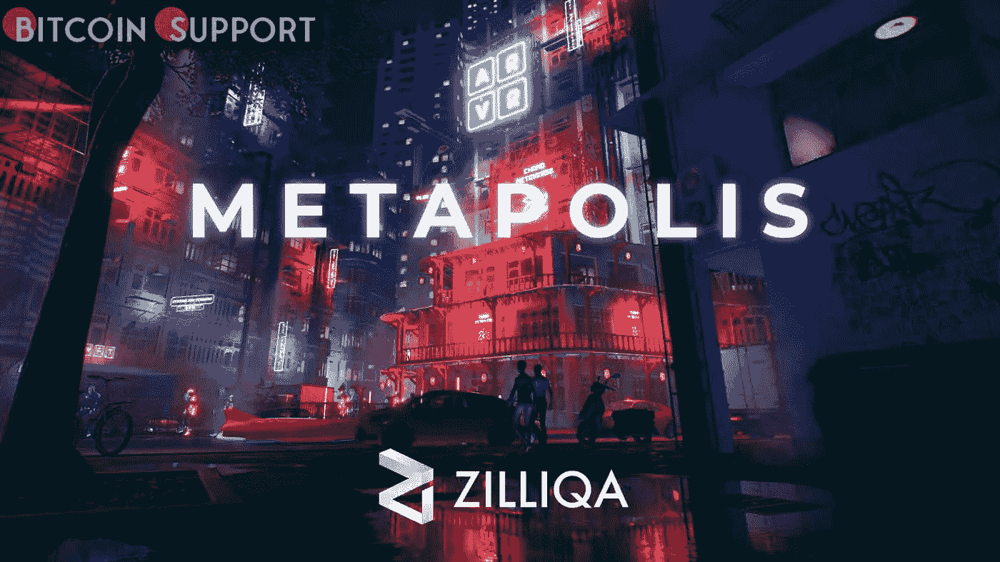

# 随着元宇宙服务推出 Metapolis，Zilliqa 的 ZIL 的乐观情绪翻了两番

> 原文：<https://medium.com/coinmonks/optimism-in-zilliqas-zil-quadruples-as-the-metaverse-service-launches-metapolis-ea2a2147d19d?source=collection_archive---------6----------------------->

**Visit our website:-** [**https://bitcoinsupports.com/**](https://bitcoinsupports.com/)

Metapolis，一个基于 Zilliqa 的区块链的元宇宙即服务平台，将于 4 月 2 日上线。智能合约平台 Zilliqa 的 ZIL 代币在六天内上涨了两倍，成为本月表现最佳的加密货币之一。

根据数据来源 Messari 的数据，代币已经从 3 月 26 日的 0.045 美元上涨了 300%，达到 0.186 美元——在过去的 24 小时内，价值大约上涨了 20%。截至记者发稿时，加密货币本月上涨了 321%，是市值至少 10 亿美元的数字资产中涨幅最大的。

社交媒体热议 Zilliqa 的 Metapolis，这是一个元宇宙即服务(MaaS)平台，将于 2022 年 4 月 2 日在佛罗里达州迈阿密举行的 VIP 活动中首次亮相。“我们才刚刚开始，”Redditor BlockChayne 在本周早些时候回顾 Zilliqa 在 2021 年的进展后在 Reddit 上写道。“引领潮流的是改变游戏规则的 Metapolis，它将使 Zilliqa 能够在各种垂直行业和区块链展开其 meta 翅膀。”

元宇宙是虚拟现实(VR)、增强现实(AR)和互联网的结合。它本质上试图通过网络空间重建民主的真实世界。根据 Markets 和 Markets 的数据，到 2025 年，增强现实产业预计将从 153 亿美元增长到 770 亿美元，复合年增长率为 38.1%。2025 年，虚拟现实市场预计将从 61 亿美元升至 209 亿美元。

[https://twitter.com/sandra_tlibe/status/1490239099831296001](https://twitter.com/sandra_tlibe/status/1490239099831296001)

**是什么让 Metapolis 独一无二？**

Metapolis，通常被称为“所有人的元宇宙”，是一种为客户提供空白画布的服务，客户可以在上面创建自己的虚拟世界。

虽然许多人预测元宇宙行业将在未来几年扩张，但普通公众很难获得信息技术，因为开发虚拟基础设施需要大量投资和技术知识。Meta，原名脸书，去年在增强和虚拟现实活动上损失了 100 亿美元。据报道，这一损失是脸书 2014 年为 Oculus VR 所花金额的 5 倍，是 Instagram 购买成本的 10 倍。

元宇宙即服务提供商，如 Metapolis，为客户提供必要的技术和基础设施来建立和管理他们自己的 metaverses。服务提供商基本上消除了高成本的进入壁垒，允许较小的公司进入。Zilliqa 的通信主管 Aparna Narayanan 在去年 12 月发表的一篇博客中表示:“Metapolis，其后缀在希腊语中的意思是‘城市’，被设计为一个尖端的扩展现实(XR 元宇宙)——AR 和 VR 的混合体——并由 Zilliqa 的可扩展和安全的区块链平台提供支持。”。“Metapolis 将使概念丰富、定制设计的穹顶成为城市的一部分，可以容纳品牌、艺术家、概念、游戏、电子商店、房地产或其他数字活动——为物理和数字世界提供一个新的连接层。”纳拉亚南指出:“Metapolis 似乎是自我维持的，有互动层，如 NFTs、电子商务、游戏赚取、数字人体模型、广告牌等。”根据 3 月 25 日的新闻稿，Metapolis 建立在“虚幻引擎”上，这是一种强大的实时 3D 开发工具，用于照片级图像和沉浸式体验，这意味着用户体验很可能与顶级游戏相同。Metapolis 最近宣布与全球人才奖应用 Agora 建立合作关系，并从其客户渠道获得了 200 万美元的预发布收入。

“我们对这一合作充满热情，因为我们不仅能够将创作带入元宇宙的生活，还能为世界各地的创意人员提供无国界的渠道，让他们在数字世界中保持联系。”“Agora、Zilliqa 和 Metapolis 之间的合作使我们处于 web 3 创新的前沿，”Zilliqa 的元宇宙和不可替代令牌负责人桑德拉·贺楼在一份新闻稿中说。

**访问我们的网站:-**[**【https://bitcoinsupports.com/】**](https://bitcoinsupports.com/)

**免责声明:以上为作者观点，不应视为投资建议。读者应该自己做研究。**

> 加入 Coinmonks [电报频道](https://t.me/coincodecap)和 [Youtube 频道](https://www.youtube.com/c/coinmonks/videos)了解加密交易和投资

# 另外，阅读

*   [3 商业评论](/coinmonks/3commas-review-an-excellent-crypto-trading-bot-2020-1313a58bec92) | [Pionex 评论](https://coincodecap.com/pionex-review-exchange-with-crypto-trading-bot) | [Coinrule 评论](/coinmonks/coinrule-review-2021-a-beginner-friendly-crypto-trading-bot-daf0504848ba)
*   [莱杰 vs n 格拉夫](/coinmonks/ledger-vs-ngrave-zero-7e40f0c1d694) | [莱杰纳诺 s vs x](/coinmonks/ledger-nano-s-vs-x-battery-hardware-price-storage-59a6663fe3b0) | [币安评论](/coinmonks/binance-review-ee10d3bf3b6e)
*   [Bybit Exchange 审查](/coinmonks/bybit-exchange-review-dbd570019b71) | [Bityard 审查](https://coincodecap.com/bityard-reivew) | [Jet-Bot 审查](https://coincodecap.com/jet-bot-review)
*   [3 commas vs crypto hopper](/coinmonks/3commas-vs-pionex-vs-cryptohopper-best-crypto-bot-6a98d2baa203)|[赚取加密利息](/coinmonks/earn-crypto-interest-b10b810fdda3)
*   最好的比特币[硬件钱包](/coinmonks/hardware-wallets-dfa1211730c6) | [BitBox02 回顾](/coinmonks/bitbox02-review-your-swiss-bitcoin-hardware-wallet-c36c88fff29)