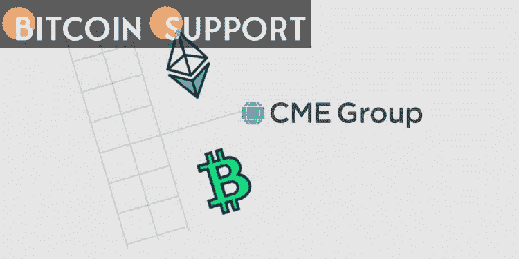

# CME 集团将推出微型比特币和以太期权

> 原文：<https://medium.com/coinmonks/options-on-micro-sized-bitcoin-and-ether-will-be-introduced-by-cme-group-99962e6a7d7d?source=collection_archive---------86----------------------->

**Visit our website:-** [**https://bitcoinsupports.com/**](https://bitcoinsupports.com/)

这些期货期权将于 3 月 28 日上线，比芝加哥商业交易所集团(CME Group)2020 年 1 月推出 BTC 期权交易产品晚了两年多。

针对其微型比特币和以太期货合约的主要衍生品市场，芝加哥商业交易所集团将推出期权交易。

芝加哥商业交易所集团周二宣布，如果获得监管机构的批准，它预计将为其现有的微型比特币(BTC)和以太(ETH)期货发行期权合约，其规模将为代币的 10%。期货期权将于 3 月 28 日上线，这是该公司在 2020 年 1 月推出 BTC 期权交易产品的两年多后，也是该公司在 2017 年 12 月发布首个比特币期货合约的四年多后。

“我们的微型期权将帮助各种规模的交易者以更高的精确度和灵活性经济地对冲市场波动事件，或微调他们的加密货币市场敞口，”CME Group 股票和外汇产品全球主管 Tim McCourt 表示。

[https://twitter.com/CMEGroup/status/1498666871276683275](https://twitter.com/CMEGroup/status/1498666871276683275)

CME 于 2021 年 12 月公布的微以太期货合约规模为 0.1 ETH，而自 2021 年 5 月开始交易的比特币期货合约规模为 0.1 BTC。CME 集团声明期权的最小块大小是 10 个微 BTC 合约和 100 个微 ETH 合约。加密投资工具的流动性可能来自 Genesis Global Trading、Cumberland 和 Akuna Capital。

自消息公布以来，BTC 的价格已从 38000 美元上涨超过 15%，达到 44816 美元的七天高点。ETH 的价格升至 3000 美元以上的两周高点，表明类似的上涨。价格波动可能与乌克兰战争的金融影响有关，这导致人们担心俄罗斯政府可能试图通过使用数字资产来绕过制裁。

**访问我们的网站:-**[**https://bitcoinsupports.com/**](https://bitcoinsupports.com/)

**免责声明:以上为作者观点，不应视为投资建议。读者应该自己做研究。**

> 加入 Coinmonks [电报频道](https://t.me/coincodecap)和 [Youtube 频道](https://www.youtube.com/c/coinmonks/videos)了解加密交易和投资

# 另外，阅读

*   [比特币基地僵尸程序](/coinmonks/coinbase-bots-ac6359e897f3) | [AscendEX 审查](/coinmonks/ascendex-review-53e829cf75fa) | [OKEx 交易僵尸程序](/coinmonks/okex-trading-bots-234920f61e60)
*   [如何在印度购买比特币？](/coinmonks/buy-bitcoin-in-india-feb50ddfef94) | [WazirX 评论](/coinmonks/wazirx-review-5c811b074f5b)
*   [CryptoHopper 替代品](/coinmonks/cryptohopper-alternatives-d67287b16d27) | [HitBTC 审查](/coinmonks/hitbtc-review-c5143c5d53c2)
*   [CBET 评论](https://coincodecap.com/cbet-casino-review) | [库科恩 vs 比特币基地](https://coincodecap.com/kucoin-vs-coinbase)
*   [折叠 App 审核](https://coincodecap.com/fold-app-review) | [Kucoin 交易机器人](/coinmonks/kucoin-trading-bot-automate-your-trades-8cf0ca2138e0) | [Probit 审核](https://coincodecap.com/probit-review)
*   [如何匿名购买比特币](https://coincodecap.com/buy-bitcoin-anonymously) | [比特币现金钱包](https://coincodecap.com/bitcoin-cash-wallets)
*   [币安 vs FTX](https://coincodecap.com/binance-vs-ftx) | [最佳(SOL)索拉纳钱包](https://coincodecap.com/solana-wallets)
*   [比诺莫评论](https://coincodecap.com/binomo-review) | [斯多葛派 vs 3Commas vs TradeSanta](https://coincodecap.com/stoic-vs-3commas-vs-tradesanta)
*   [Capital.com 评论](https://coincodecap.com/capital-com-review) | [香港的加密借贷平台](https://coincodecap.com/crypto-lending-hong-kong)
*   [如何在 Uniswap 上交换加密？](https://coincodecap.com/swap-crypto-on-uniswap) | [A-Ads 评论](https://coincodecap.com/a-ads-review)
*   [WazirX vs coin dcx vs bit bns](/coinmonks/wazirx-vs-coindcx-vs-bitbns-149f4f19a2f1)|[block fi vs coin loan vs Nexo](/coinmonks/blockfi-vs-coinloan-vs-nexo-cb624635230d)