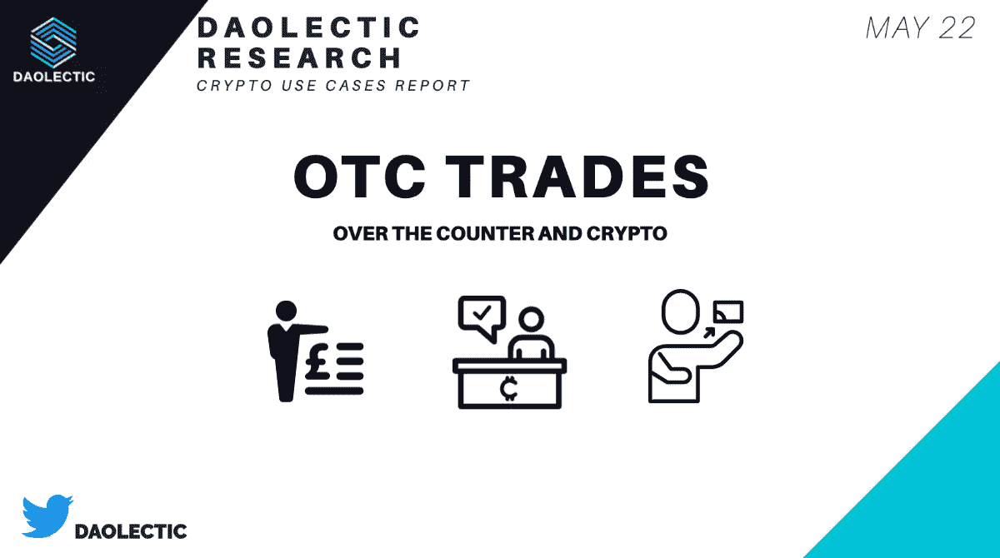
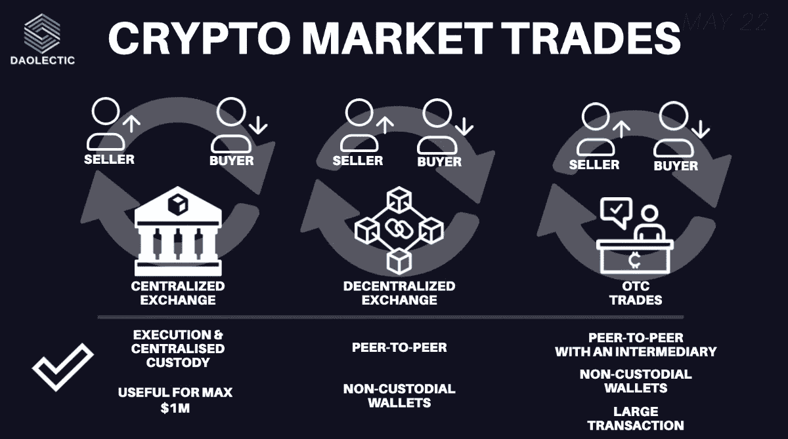
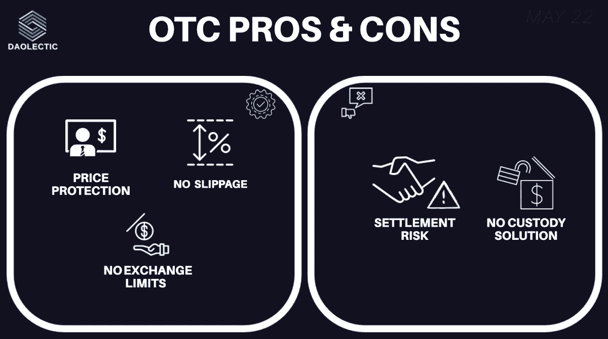
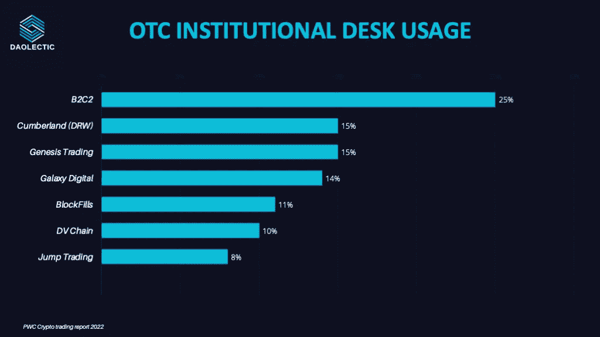
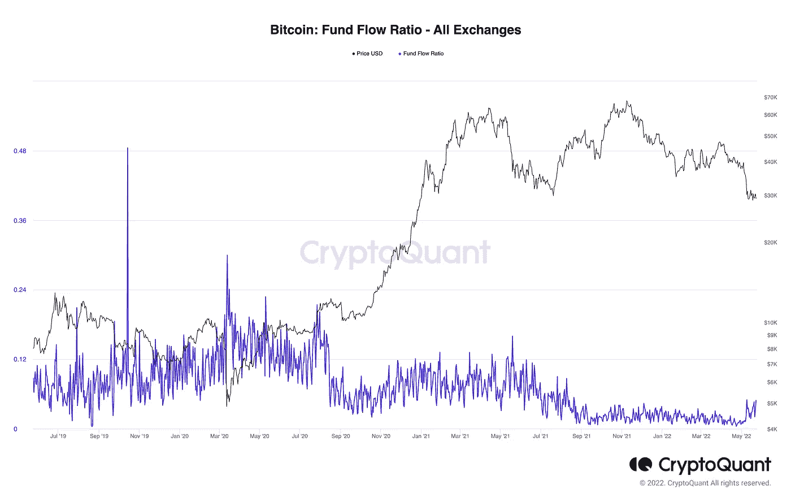
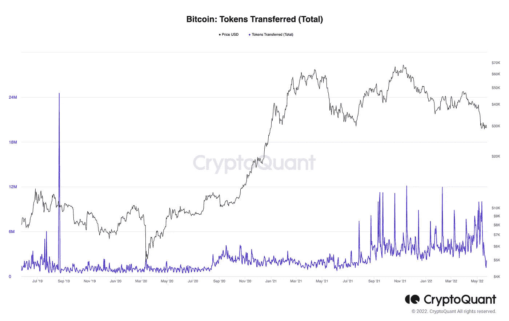
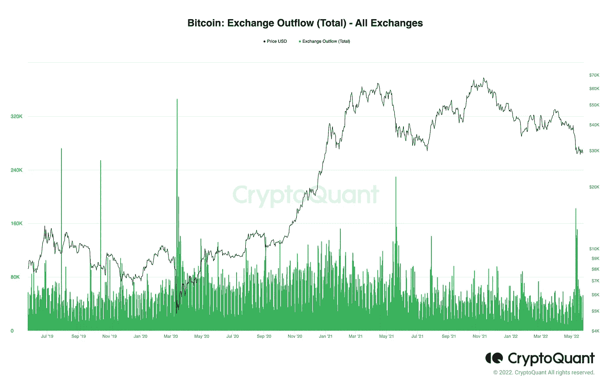

# 场外交易柜台及其在加密交易中的作用

> 原文：<https://medium.com/coinmonks/otc-desks-and-their-role-within-the-crypto-trades-4570159cb2ec?source=collection_archive---------19----------------------->

随着加密货币的兴起，许多机构业务&企业选择加入这个生态系统。

结构化和开放的市场促进了全球交易，使用户能够实时出价和结算。

密码交易可以通过集中交易所( **CEX** )、分散交易所( **DEX** )或者所谓的场外交易( **OTC** )进行。

在中央交易所购买 50 或 100 个比特币存在很大困难。

你的要求会被分成多个订单，你不会获得一个稳定的价格。

完成订单可能需要几个小时或几天，价格可能会波动。

那么，如何才能预防呢？

# OTC——在柜台上

场外交易，更广为人知的是 OTC，是交易所交易的替代品。

OTC 提供了两个基本任务，这两个任务主要是为“大量”订单设计的。

在场外交易市场，交易商提议用户可以购买和出售资产的价格。场外交易也可能指 P2P 服务，如本地比特币，让人们亲自交易 BTC。

一些加密自动柜员机交易是场外交易，因为它们并不总是在交易所结算。

执行选项与 dex 不同，在 dex 中，一个交易可能包括几个用户。

场外交易柜台可能集成 10 个或更多的密码交易所，并配备了执行巨额订单的算法。

> 谁使用场外交易？

任何希望以快速简单的方式获得或出售大量加密货币的人:富人、机构、风投和对冲基金。

> 场外交易柜台如何影响市场？

如果订单通过场外交易执行，市场不会受到影响:交易台在交易所之外采取行动，以避免可能的上涨或下跌。如果从场外交易市场向交易所大量转移和买卖，就会发生恶意事件。

Terra 和 Luna 的戏剧向我们解释了一些关于如何对算法稳定币进行恶意攻击的事情。

Elliptic 对导致生态系统崩溃的交易进行了有趣的深入研究。

> 场外交易台是如何运作的？

场外交易柜台寻找希望在当天买入和卖出的客户，同时收集差价:场外交易柜台积累多头或空头头寸。如有必要，他们将尝试通过交易所平仓。

> 谨慎和匿名呢？

场外交易柜台非常类似于集中式交易所。他们需要进行反洗钱的客户身份识别。然而，场外交易柜台通常不是维护隐私的手段。

> 场外交易柜台如何保持盈利？

他们的所有交易通常都要收取差价和交易费。虽然主流交易所可能收取平均 0.25%的费用，但场外交易柜台的费用远远超过 1%。

> 谁是最常用的 OTC 柜台？

引自[普华永道报告](https://www.pwc.ch/en/insights/crypto-trading-report-2022.html)，

> 在与 OTCdesks 进行交易的机构中，最“受欢迎”的交易对手是 B2C2，其次是 Cumberland、Genesis Trading、Galaxy digital、BlockFills 和 DV Chain，它们的交易对手数量都差不多。

> 链上分析要说什么？

让我们深入了解一些[密码分析师](https://cryptoquant.com/asset/btc/summary)的见解。有连锁措施来评估机构投资者可能的场外交易量。重要的场外交易大多发生在现在。

*   [**资金流比率【FFR】**](https://dataguide.cryptoquant.com/exchange-flows-indicators/fund-flow-ratio)估算有多少比特币兑换成 CEX。如果该值上升，这意味着大多数交易是在交易所存款或取款。否则，交易量将流向交易所外的钱包。

今天这个值是 0.04。这意味着只有 4%的 BTC 交易量是在交易所内进行的。这一趋势表明，大多数交易发生在交易所之外，主要涉及场外交易柜台。

*   [**令牌转移**](https://cryptoquant.com/asset/btc/chart/transactions/tokens-transferred-total?window=DAY&sma=0&ema=0&priceScale=log&metricScale=linear&chartStyle=line) 指标衡量网络比特币流量。如果这一指标上升，FFR 下降，大型场外交易正在发生。这种组合在过去几周已经出现，证实了场外交易柜台移动的假设。

*   [**外汇流出量**](https://cryptoquant.com/asset/btc/chart/exchange-flows/exchange-outflow-total?exchange=all_exchange&window=DAY&sma=0&ema=0&priceScale=log&metricScale=linear&chartStyle=column) 指标显示最近几周出现峰值。投资者正从现货市场转移 BTC，很可能是为了储存。这包括散户和机构购买者在场外交易中离开交易所的硬币。

最近，[温特穆特](https://www.wintermute.com)推出了他们的机构[场外密码交易平台](https://node.wintermute.com)。与整个市场相比，该公司努力降低费用。

全球多个场外交易柜台每年交易数十亿美元:这反映出自比特币问世以来，这项业务发生了多大的变化。加密 OTC 交易台每年处理数十亿美元的交易，而且还有更大的改进空间。

# 放弃

无论如何，这不是财务建议；我研究的目标永远是深入项目，从不同的角度研究它们；我确实包含了基于我最近了解到的类似项目经验的个人观点。

我现在和将来都愿意接受讨论。

**在 Twitter 上关注我们:**

**@道辛**

**在投资任何东西之前，请务必做好调查**。