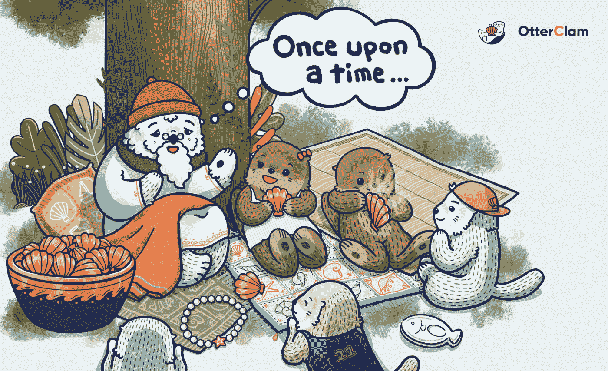

# 奥特卡姆:我们的故事

> 原文：<https://medium.com/coinmonks/otterclam-the-story-of-us-8a57b94cc630?source=collection_archive---------7----------------------->

# 介绍

奥特兰姆是一个社区的故事。这也是个人的故事。任何社区的文化都反映了组成该社区的个人的价值观。所以，如果你想更多地了解我们社区文化的起源和我们信奉的价值观，创始人可能是一个很好的起点。

今天，我的目标是把帷幕拉开一点，提供一点关于 OC——我们都知道的创始人“奥特金”的背景我希望这次采访能让人们以一种更亲密的方式去了解 OtterClam 通过它的创始人的头脑和眼光。

*注意* : *为了节省空间和最大限度地提高可读性，我省略了文稿中的大部分常规形式。对以下问题的回答已作了总结，以反映他的答复的实质。这次采访是一次语音通话，所以我尽了最大努力保持交流的随意性。我在这里记录的答案已经过 Otterking 的仔细审查和批准，以确保他的回答是准确的。*

**你是怎么进入加密领域的？你什么时候“啊哈！”瞬间？**

答:2018 年年中的某个时候，我在我的国家听当地的播客。这是一个涵盖加密、DeFi 和 NFTs 的常规播客。我的“啊哈！”在我试用了 Uniswap，并对 AMMs(自动做市商)的概念有了更深入的了解之后，我有了一个想法。我还尝试了 MakerDAO 和 Compound，并意识到去中心化平台可以提供的功能和自主性。我一直对集中式交换有些不信任，因为我是一名工程师，非常欣赏不可信代码的力量。我探索得越多，就越感兴趣。

你为什么决定开始自己的项目？

答:我一直想开始自己的项目。在 OtterClam 之前，我已经开始了几个项目。我在我的国家创办了一家 SaaS(软件即服务)公司，旨在帮助餐馆管理预订。这个软件现在在我国家 90%的餐馆里都有。此外，我一直喜欢构建对人们有用的东西，但 OtterClam 是我的第一个与密码相关的项目。

你为什么认为你能做到？我的意思是，很多人都有开始一个项目，搬到另一个国家，改变职业等想法。，但你确实在做。是什么让你真的实现了这个想法？

答:嗯……因为这不是我第一次开始新项目。我已经这样做了很多次，所以我有信心我能创造出一个令人敬畏的产品。

**Appppo 说是你建议用水獭的。他提到他们总是拿着东西，所以似乎很容易联系到 HODL 迷因。你决定用水獭还有其他原因吗？**

答:由于各种原因，我实际上在以前的项目中使用过水獭，但它非常适合这个项目，名字很容易发音，很容易识别水獭。而且说实话…我女朋友真的很喜欢水獭，建议我用水獭做这个项目。

**你为什么决定为这个项目创建一个 DAO？**

答:我创建 DAO 是因为社区对拥有一个 DAO 的想法的反应。在这个领域已经有几个例子，我认为这是利用我们全球社区的人才和技能的一种有价值的方式。它还反映了透明度和沟通，这些对我来说是很重要的价值观。我一直希望在我以前的工作中有更高的透明度，DAO 似乎是一个非常有用的模型，可以帮助我实现这个目标。

**为什么是多边形？有许多 EVM 兼容的区块链。**

答:嗯，Polygon 不像币安智能链那样集中，它是以太坊的一个重要的侧链，我认为它有一个光明的未来。我相信以太坊将成为加密的基础和安全层。这是最分散和安全的区块链。但目前，它太贵了，所以 Polygon 作为这个问题的 L2 解决方案是有意义的，我相信 Polygon 在未来几年有很大的发展空间。

**你的专业背景是什么？你一直是程序员/开发者吗？**

答:我有计算机科学硕士学位，我的大部分职业生涯都是在软件开发方面。在那段时间里，我一直是一名工程经理。我真的很喜欢编码，但是我也喜欢和团队一起编码来完成一个更大的项目，因为我相信你作为一个团队可以比你作为一个个体完成更多的事情。所以在过去的几年里，我的工作主要是工程管理。互相帮助和提高彼此的能力一直是我最近工作的中心焦点。

你喜欢你的工作吗？

答:当然。我实际上对我的工作投入了 100%。我从早到晚工作，这让我充实，所以这不仅仅是繁忙的工作。我认为热爱你的工作很重要，否则你会浪费你的生命去做你不喜欢的事情。他们领域中最好的专家喜欢他们的工作，他们花很多时间在工作和提高自己上。如果你喜欢你的工作，它不会让你觉得是一种负担或者是你不想做的事情。

**加密货币的发展速度令人难以置信。迪菲/NFT/元宇宙空间也不例外。你如何平衡维护社区文化和项目身份与创新的需要？**

答:基本上，我认为社区身份是由那些被我们作为一个团队所做的工作吸引的人创建的。如果创新对你来说不重要，那么你很可能不会被我们的社区所吸引。所以我认为社区自然应该是我们作为核心团队所持价值观的反映。这是我们工作的自然副产品。所以我们所做的创造了我们所拥有的社区。

这个项目还不到半年，但是这个社区已经成长起来，并且有了自己的生活。你对水獭王国已经发生的变化和发展速度有什么感觉？

我们已经经历了很多。这仅仅是 3-4 个月的时间，我觉得我们已经从中学到了很多东西，并有所提高。在这短暂的时间里，交流的需要对我来说变得非常重要。我意识到透明和沟通比我以前想象的更重要。社区和协议变得越来越好，因为我们在前进和学习，没有被犯错的可能性所麻痹。进步远比完美重要。我们还在研究这些东西。增长的速度真的很快，但我们通过采取行动学到了最多。我相信这为我们作为一个团队和一个社区创造了一条更清晰的前进道路。

**通过水獭王国，你认为水獭村将何去何从？**

答:这对我来说是一次很好的经历，我相信凭借我们目前的团队，我们可以为未来的发展打下基础。就目前而言，我认为我们只是继续改进，我认为我们可以完成我们路线图上的一切——我们将在 NFT 市场上交付产品，并从 Polygon NFT 生态系统中占有一些市场份额，这将帮助我们建立和维护国库，通过这一点，水獭王国社区成员将分享我们的成功。

**现在谈一个稍微不那么技术性的问题——你最喜欢的食物是什么？**

答:拉面。我家附近有一家很有名的拉面馆，我每周都会去那里和同事聚会吃饭。太好吃了！

**在您看来，是什么让 OtterClam 有别于该领域的其他项目？**

答:我们专注于在我们的产品中创造价值。人们很快就会看到它。但是，你不知道什么时候，或者如何，或者需要多长时间，但他们一定会看到。当然，风险是存在的，因为这是一家初创企业，你需要一定的资金和风险敞口才能成功。随着我们继续建设，我相信这将成为非常宝贵的资产。我们必须继续努力。很容易看出什么将继续交付价值，什么样的项目只是等死。OtterClam 专注于长期价值创造。我们有团队、DAO 和社区来实现这一目标。

**结束语**

考虑到该项目的生命周期相对较短——otter clam 甚至不到 6 个月——在如此短的时间内发生了如此多的事情令人难以置信。

有很多书籍和文章宣扬成功的初创企业创始人的“必备”特质，或者发展理想商业社区的完美方式。然而，最常见的情况是，即使是最成功的初创企业，也会经历断断续续的成长，然后才会从初创时期的不确定性中找到真正的身份。领导者比任何人都更容易受到这些成长烦恼的影响。

奥特金的领导能力的罕见之处在于，他愿意考虑可能完全改变项目轨迹的未经打磨和非传统的想法。诚然，道的过滤、集思广益和达成共识的能力在这一过程中发挥了重要作用，但最终，奥特金需要愿意将他的愿景提交审查，他每天都在这样做。对一些人来说，这可能是违反直觉的，但是这个过程需要信任。

对于许多企业家来说，团队建设过程可能是启动项目最艰难的一个方面。对于工程师来说，*尤其是那些在密码行业的人，信任是一个保留给代码引用的术语。“代码就是法律”和“相信代码”是现在定义一个万亿美元产业的口号。*

奥特卡姆的技术发展被一丝不苟地记录了下来。每一笔交易都被永久记录在区块链上。我们的协议所依赖的代码是开源的，任何有兴趣和能力的人都可以对其进行审计。信任实际上被编码在协议之外。矛盾的是，唯一值得信任的是代码本身。或者是？

我们呢？那些不和谐的“日常水獭”，那些分享他的愿景并承担风险的其他创始人，那些不知疲倦地执行愿景的道中每个部门的有才华、有技能的成员呢？那些管理频道并尽可能多的戴帽子以防止事情在不和谐中变得完全疯狂的 mod 们呢？是的，潜伏者-水獭呢，它们喜欢在远处观察，在舒适的巢穴中支持我们。

归根结底，奥特兰姆是一个关于我们的故事。我们所有人。如果没有你们每一个人的互动来创造我们所热爱的社区，这一切都是不可能的。

交易可以被记录。甚至我们大多数的 *inter* 动作都会被记录下来。但是你从与他人的互动中感受到的日益增长的联系感，以及你继续参与的决定——那是神圣的。它之所以神圣，正是因为它不能被记录在区块链或其他存储设备上。只能经历。这是水獭的方式。

“在奥特金，我们信任”经常在聊天中被开玩笑地抛来抛去，但我从这次采访中了解到，奥特金明白他对我们水獭家庭的信任培养了我们对他的信任。

奥特金决定与我们分享他的想法和愿景。至少在表面上看起来，一个建立在不信任交易基础上的生态系统，实际上是一个几乎每时每刻都依赖于信任并蓬勃发展的社区。

奥特金信任代码。他也相信我们是共同创造者，正在努力实现水獭王国的共同愿景。我们互相信任来实现社区的意愿。真的没有 tr *us* t 就没有 *us*

最后，我非常感谢有机会与我们的社区分享这次采访。我希望大家从这篇文章中获得一种新的归属感，并为我们的水獭家族及其领导层感到自豪。

在我们前进的过程中，请记住，我们的创新和执行能力将完全取决于我们首先作为个人，然后作为一个群体成长的意愿。只有到那时，我们才能实现我们的全部潜力。

下游水獭家庭见。

> 加入 Coinmonks [电报频道](https://t.me/coincodecap)和 [Youtube 频道](https://www.youtube.com/c/coinmonks/videos)了解加密交易和投资

# 另外，阅读

*   [最佳免费加密信号](https://coincodecap.com/free-crypto-signals) | [YoBit 评论](/coinmonks/yobit-review-175464162c62) | [Bitbns 评论](/coinmonks/bitbns-review-38256a07e161)
*   [OKEx 评论](/coinmonks/okex-review-6b369304110f) | [Kucoin 交易机器人](/coinmonks/kucoin-trading-bot-automate-your-trades-8cf0ca2138e0) | [期货交易机器人](/coinmonks/futures-trading-bots-5a282ccee3f5)
*   [AscendEx Staking](https://coincodecap.com/ascendex-staking)|[Bot Ocean Review](https://coincodecap.com/bot-ocean-review)|[最佳比特币钱包](https://coincodecap.com/bitcoin-wallets-india)
*   [霍比审核](https://coincodecap.com/huobi-review) | [OKEx 保证金交易](https://coincodecap.com/okex-margin-trading) | [期货交易](https://coincodecap.com/futures-trading)
*   [比特币基地赌注](https://coincodecap.com/coinbase-staking) | [热点评论](/coinmonks/hotbit-review-cd5bec41dafb) | [库币评论](https://coincodecap.com/kucoin-review)