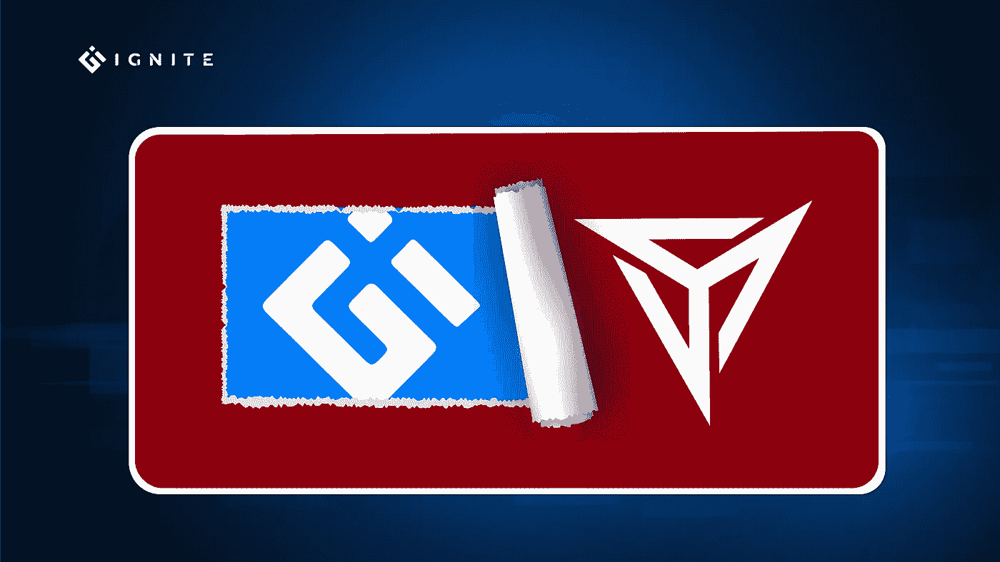
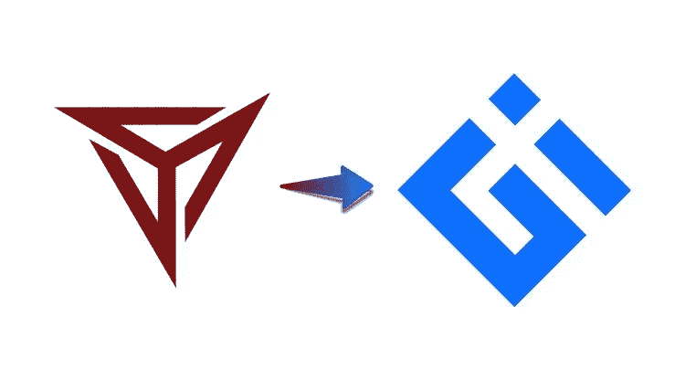

# 我们的网站有了新的标志和用户界面/UX

> 原文：<https://medium.com/coinmonks/our-website-got-a-new-logo-and-ui-ux-d3df823ec40?source=collection_archive---------57----------------------->

## 介绍新的“点火链”

有着相同的价值观和先进的功能，有着相同的目标和最新的技术。

IgniteChain 将成为分散经济的下一个中心。我们朝着在 Ignite 上实现我们的[区块链](https://blog.ignite.info/what-is-blockchain)功能迈出了重要的一步，我们升级了新的区块链功能及其相关技术，升级旨在简化交易处理，使它们在速度和成本方面更加高效。

IgniteChain 采用了新的徽标和 UI/UX 设计，以反映我们在区块链市场的新品牌定位。

IgniteChain new look 讲述了我们所做的事情、我们为什么要这样做，以及接下来您可以期待什么。

最后，我们更新了华丽的徽标和流畅的 UI/UX 设计，为我们的客户提供了更好的用户体验。

注意到“蓝色在我们的 IgniteChain 标志中的意义和用途”一文，该文称蓝色代表权威、忠诚、权力、专业精神和信任。

**让我们检查一下我们的新旧标志。**

查看我们的[标志样本](https://drive.google.com/drive/folders/1EDjDO0ZCVcYc8X1hRkfZCynZZv9kCiqs)

看一看[https://ignite.info/](https://ignite.info/)

别忘了把这个帖子分享给区块链社区。

让我们#BuildOnIgnite:)

> 加入 Coinmonks [电报频道](https://t.me/coincodecap)和 [Youtube 频道](https://www.youtube.com/c/coinmonks/videos)了解加密交易和投资

# 另外，阅读

*   [OKEx vs KuCoin](https://coincodecap.com/okex-kucoin) | [摄氏替代品](https://coincodecap.com/celsius-alternatives) | [如何购买 VeChain](https://coincodecap.com/buy-vechain)
*   [币安期货交易](https://coincodecap.com/binance-futures-trading)|[3 comas vs Mudrex vs eToro](https://coincodecap.com/mudrex-3commas-etoro)
*   [如何购买 Monero](https://coincodecap.com/buy-monero) | [IDEX 评论](https://coincodecap.com/idex-review) | [BitKan 交易机器人](https://coincodecap.com/bitkan-trading-bot)
*   [CoinDCX 评论](/coinmonks/coindcx-review-8444db3621a2) | [加密保证金交易交易所](https://coincodecap.com/crypto-margin-trading-exchanges)
*   [红狗赌场评论](https://coincodecap.com/red-dog-casino-review) | [Swyftx 评论](https://coincodecap.com/swyftx-review) | [CoinGate 评论](https://coincodecap.com/coingate-review)
*   [Bookmap 评论](https://coincodecap.com/bookmap-review-2021-best-trading-software) | [美国 5 大最佳加密交易所](https://coincodecap.com/crypto-exchange-usa)