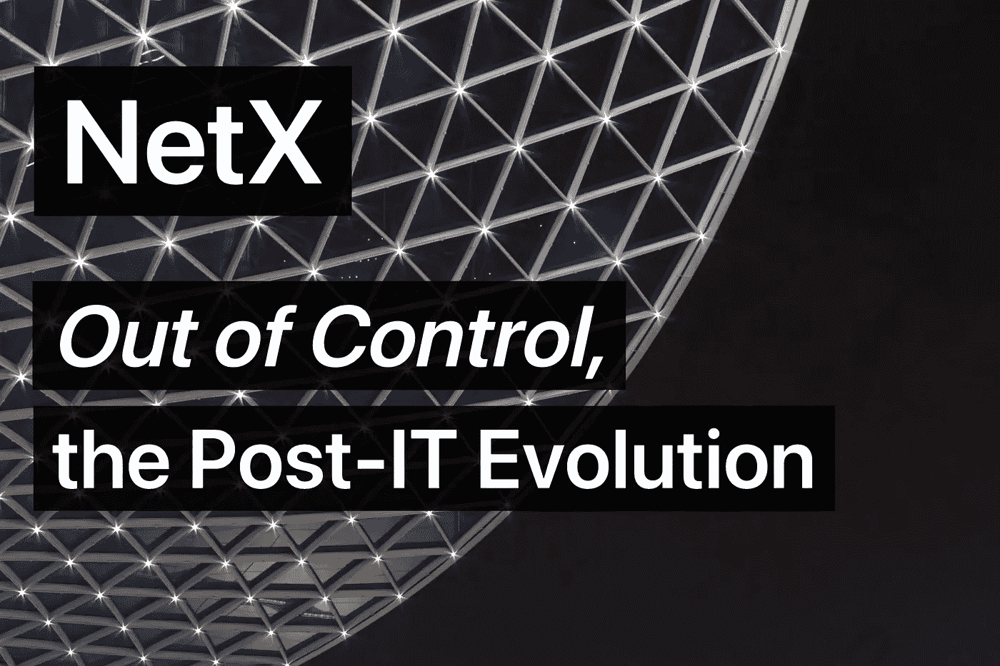
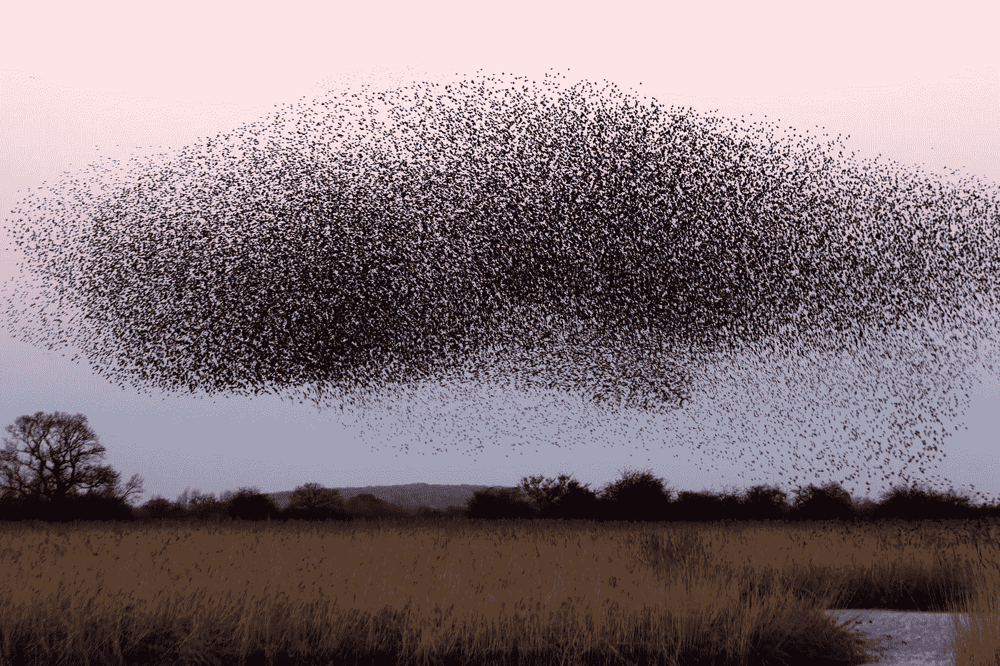

# 失控，后 IT 时代的演变

> 原文：<https://medium.com/coinmonks/out-of-control-the-post-it-evolution-dd64e05ff5bc?source=collection_archive---------12----------------------->

生命是一个网络化的东西——一个分布式的存在。它是一个在空间和时间上延伸的有机体。没有个体生命。生活需要相互联系、联系和共享。蚂蚁，我们是同一个血脉，你和我。

*—凯文·凯利失控*

# 认知唤起的

副标题为*机器、社会系统和经济世界的新生物学*，凯文·凯利的书*失控*从生物学的角度对科学、技术、经济和社会进步趋势的前景进行了全新的审视。这本书涉及了广泛的主题，从社会生态学到网络化产业，从流行的分布式并行系统到它们注定失去控制，从爆炸性信息到适应性共同进化，再到通过开放进化实现的自我调节。"机器正变得生物化，而生物正变得工程化."人类的轨迹已经揭示了几次认知觉醒。这一次，我们安排的是生态与技术的联姻，它孕育了新的生命，生态技术。

往前走，随着众生进化，并行，分布，筑巢，胜利，混沌在静静等待着人类社会。走出困境的唯一途径是通过所有生物/人类和机器之间的“联盟、伙伴关系和协作”。进化不可避免地到来。革命引导我们在不断的变化中适应和生存。这是凯利在他的书中阐述的方法论。

# 蜂群思维理论

Photo by [James Wainscoat](https://unsplash.com/@tumbao1949?utm_source=unsplash&utm_medium=referral&utm_content=creditCopyText) on [Unsplash](https://unsplash.com/s/photos/swarm?utm_source=unsplash&utm_medium=referral&utm_content=creditCopyText)

《失控的 T8》中最令人印象深刻的概念反映在其群体模型中，其中一千个时钟弹簧试图同时运行一个并行的、自我维持的系统。该模型将蜂群描述为一个超级有机体，一个由许多相互联系的部分组成的网络生物。这个分布式系统运行在我们所谓的集体意识上。提供活体系统的分布式生物有四个不同的方面:没有强加的集中控制；亚单位的自主性；亚单位之间的高度连接性；对等体影响对等体的威比非线性因果关系。

这些概念很适合作为企业的管理哲学。

## -权力下放

几乎所有团队都从与用户和市场的互动中获得第一手经验。凭借亲身体验的敏感性和直觉，能够迅速做出市场反应。

## -分销

这种模式对垂直组织结构提出了挑战。矩阵式管理依靠职能部门开展面向用户和市场的服务。

## 团队合作

鼓励跨单位的横向联络和协作，以弥合孤立的权力和所有权，进一步加强整体核心竞争力。

## -适应

随着市场环境的不断变化，团队成员不断学习和成长。

这种基于蜂巢的群体理论具有很强的适应性。例如，人类可以像时钟一样建立一个对预设刺激的反应系统。但对于前所未有的刺激或广泛的调整，群体模型是呼吁。在那里，即使有几个部分死亡，生存或适应也不会中断。

这个系统也经历自我进化。只有在群体系统中，由某一部分带头的适应才能随着时间的推移被吸收，从身体到基因，或者从一个个体到一个群体。然而，非集合系统不能以生物学的方式进化。建立在众多平行基础上的集体系统也有冗余和弹性。个人不算。小失败在喧嚣中退潮。主要的缺陷最终会通过成为层级中下一个最高级别的小缺陷而得到缓解。

简单的老式线性系统会遇到意想不到的正反馈环路，因为 PA 麦克风有时会发出令人不快的噪音。然而，群体模型能很好地管理和增强秩序。通过将一个新结构逐渐扩展到初始状态的边界之外，蜂群可以建立自己的脚手架来构建更复杂的结构。自发秩序有助于创造更多的秩序。生命孕育更多的生命。财富产生更多的财富。信息创造更多的信息。所有这些都打破了最初的摇篮，但前方有一条无限的道路。

# 进化的未来

在这本书的后半部分，凯文·凯利通过对计算机科学前沿和生物学研究边缘的审视，详细阐述了上帝的九大法则。以下是为你总结的一些鼓舞人心的概念:

**(A)革命性的未来:试点突破、分块升级、爆发式增长**

首先，运行在命令行界面(CLI)上的操作系统受益于 windows 的图形用户界面(GUI)。然后，简化的客户/服务器结构，多任务功能，以及其他创新概念点燃有效的市场化。在新概念的支持下，以及在跨应用程序的并发用户对共享数据库的需求的刺激下，自动化数据库正在经历飞速的增长。新兴的共享经济经受住了剧烈变化的考验，见证了前沿城市猖獗的设备安装。所有这些都是近几十年来技术和经济飞跃的缩影。

**(B)个体进化:共生、定向突变和自适应**

主要的信息交换允许不同进化的融合。非随机突变也出现在同一端。个体在不断的反馈中修正错误并进化得更好。参考《自然》和互联网上的案例，凯利试图揭示个体进化的内在机制。

**(C)关键推动力:互联网**

互联网是一个失控的存在，由于这个原因，世界正在去中心化。凯利相信，在重塑社会等级的非线性网络的沉重打击下，未来一切都是相互联系的。

事实上，每个人都在某种程度上致力于网络，这改变了当前社会如何展开现有的未解决的问题，如人际关系，隐私威胁，技术局外人等。我们认为网上的危险应该被消除。同时，我们呼吁探索、开发和应用创新的网络产品，为人们带来更多的便利和福利。

**(D)本质动力:天敌**

鲶鱼效应最好地说明了这一观点，即一个强大的竞争对手可以促使弱者超越自己。就像一只非洲鹿在美洲狮的追逐下变得更强壮一样，一个行业的驱动力在于强大的竞争对手。

同样，特斯拉引入中国改变了中国新能源汽车的整体格局。特斯拉在这里是鲶鱼，甚至是鲨鱼。

Photo by Dariusz Grosa: [https://www.pexels.com/photo/brown-deer-jumping-2570169/](https://www.pexels.com/photo/brown-deer-jumping-2570169/)

# 新有机体

数千年的信息革命已经走过了微型计算机和互联网的新时代，人们期待摩尔定律的终结，并将在未来的岁月里继续下去。通向“失控”和“生物装备”的唯一路径就是无处不在的进化。无论是为了政治民主，生物，代码程序，还是虚拟 VR 游戏，进化自始至终都在发生。它通过自我生成、自我支持和自我转变，从无序中创造出秩序，就像火车的不间断燃料引擎一样。一种由人类和机器人组成的新有机体将顺应潮流，同时保留其独特的性状。这种新的生命形式被鼓励学会与同伴相处、分享和共存。

《失控的 T2》和《T3》提供的这些见解给了我很大的触动。我不禁描绘了一幅新颖的 IT 有机体的生动画面，它基于“蜂群思维”理论，由革命性的架构、开发方法、部署方式等支撑。

***NetX，面向数字生活的可信可靠的智能自治系统链原生互联网(******Trias******)***

[***铁人三项***](https://www.triathon.space/#/)***|***[***Ethanim***](https://www.ethanim.network/)***|***[***Tusima***](https://www.tusima.network/#/)***| Behemotum | Octavius | leviam | Divina***