# 世界之外—宇宙(原子)基本分析

> 原文：<https://medium.com/coinmonks/out-of-this-world-cosmos-atom-fundamental-analysis-b7aeb65583f?source=collection_archive---------1----------------------->

这份基本面分析是 Crypto Consulting Institute 的付费时事通讯的一部分，提供市场洞察、可行的交易信号和基本面分析。更多信息请访问:【https://www.cryptoconsultinginstitute.com/newsletter 

许多人回忆起网络泡沫和互联网的最初出现。在过去的 20 年里，有相当多的评论者一直忍气吞声，因为他们曾吹捧说这只不过是一种时尚。

在某种程度上，我们可以原谅他们缺乏前瞻性思维，因为早期的消费者互联网是通过拨号调制解调器访问的，这并不特别实用。早期互联网的先驱消费者仍然清晰地记得调制解调器试图通过传输控制协议和互联网协议(TCP/IP)建立链接时发出的刺耳声音。这样的过程现在是残留的记忆，音效现在是从噩梦中醒来时的回忆。它速度慢且资源密集；当您的座机收到来电时，您的连接会中断。

在互联网出现之前，电脑只有两居室那么大。随着时间的推移，它们变得更加紧凑和高效，但功能和移动性有限。你不能随意走动，也没有可以接入的网络。

这些问题明显而突出。那些倾向于批评互联网可行性的人很快就把这项技术放进了太硬的篮子里。但是那些深刻理解这些问题的人被激励去寻找解决方案。

这些挑战带来了电池技术的进步。TCP/IP 的容量从每秒千比特增长到每秒兆字节再到每秒千兆字节。

你可以用金杯喝水，但里面的东西是一样的。

利用新媒体接入网络的问题依然存在。直到 Wi-Fi 出现，它结合了两种现有的技术:TCP/IP 和无线电波。两种截然不同的技术结合在一起解决了一个新问题。

从这一点开始，采用 S 曲线变成了抛物线。互联网不再是一种边缘奢侈品，而是一种基本工具，我们可以通过移动设备随身携带。Wi-Fi 加速了这种采用，并改变了我们访问互联网的方式。随着替代媒介开始跟上，连接进一步改善，例如最近电信塔和卫星发射的蜂窝数据。

供给和需求是两个不可避免的经济原则。随着 4G 和 5G 的不断推出，你可以在最偏远的地方以远低于早期的价格接入互联网。

现在，我们正盯着物联网(IoT)的木桶，它连接着我们的电视、冰箱、汽车以及几乎任何能够接收无线连接的电器。

互联网已经在多种设备上实现了广泛的互操作性，使得我们几乎可以在任何地方访问互联网。

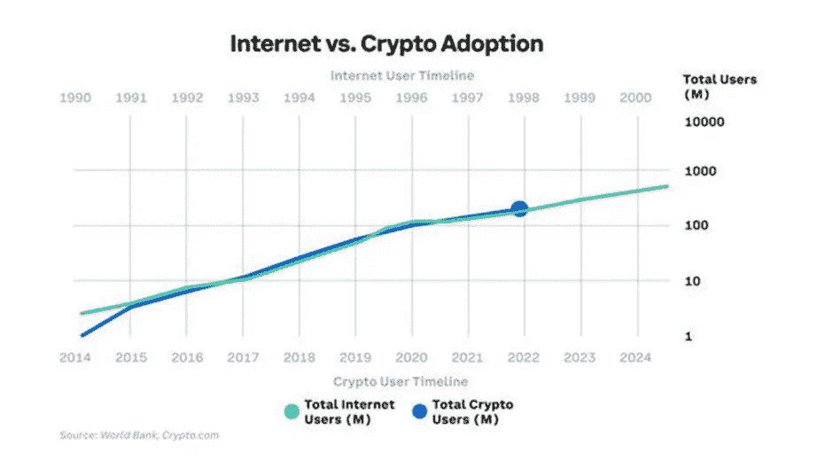

第三代区块链 Cosmos 在 2016 年发布了白皮书，并在 2017 年发布了后续的初始硬币发行(ICOs)。然而，All-in-bits incorporated 和 Tendermint 自 2014 年以来一直在探索中。这一开发解决了区块链空间中的一个突出问题，即缺乏互操作性，考虑到这一点的预见程度是令人震惊的。

在这篇文章中，我们将回顾驱动 Cosmos 的技术，并在梅特卡夫定律的背景下进一步阐述互操作性的含义。我们将通过将$ATOM 令牌与$DOT 进行比较，来分析$ ATOM 令牌缺乏实用性的问题，后者是唯一一个似乎可以与之匹敌的项目。然后，我们将通过假设 Cosmos 如何成为可互操作未来的关键组件来结束本文。

# Cosmos 关键要点——您的 TLDR 总结

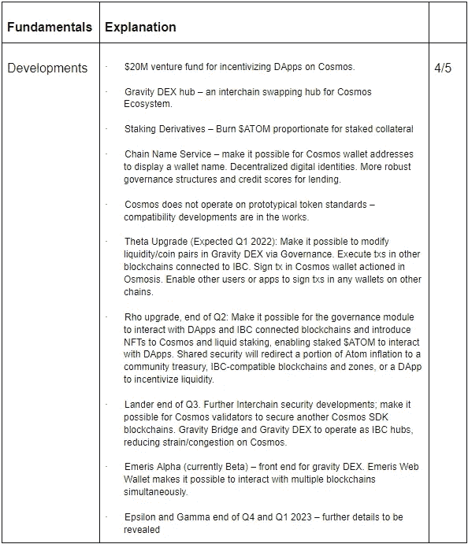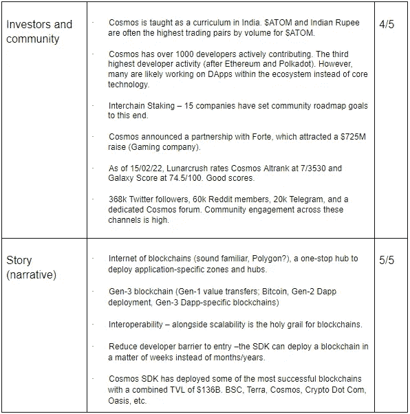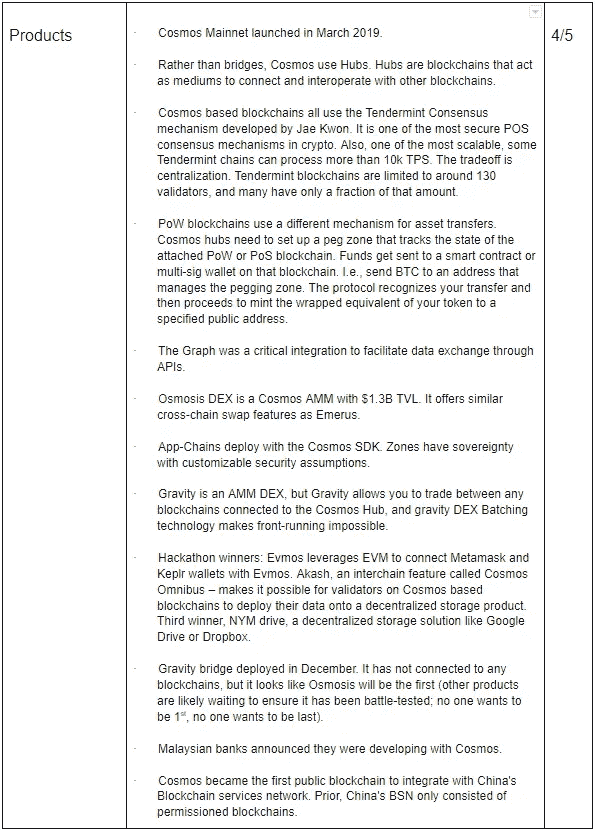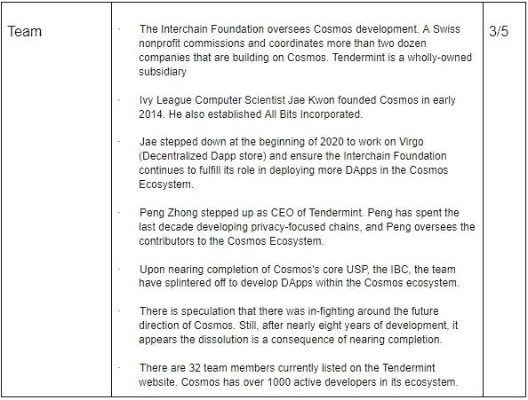

*TLDR 总结，D.I.S.R.U.P.T .关键要点。26/35*

# 星际旅行穿越秘密星球

有大量关于宇宙生态系统的信息，因为它已经在市场的雷达上存在了相当长的时间。

但是在高层次上，宇宙是整个生态系统的起源中心。新区块链、DApps 和加密货币与 Cosmos SDK 一起部署，并由 Tendermint consensus 保护。在不深入本质的情况下，只要 2/3 的验证器节点保持运行，该模型就能有效地使网络达成共识。

使用 Cosmos SDK 部署的每个区块链都被称为一个区域，具有自己的共识和一套安全假设。但是在基础层，每个区域都与 Cosmos SDK 的其他部署有着天生的兼容性。引人入胜的是，Cosmos SDK 可以部署在更大的生态系统中蓬勃发展的区块链，如币安智能链和 [Terra](/@justmy2satoshis/goodbye-moonman-hello-luna-an-in-depth-fundamental-analysis-on-terra-883eb3c1111b) (在以前的 FA 中讨论过)，但可以部署特定于应用程序的区块链。这些被称为第三代区块链。

第一代是价值转移和不可变存储，如比特币。但是对于大多数交易来说，通常有一些条款和条件对于不可信的第三方来说是不可执行的。以太坊是第二代区块链，体现了比特币的原则，但随着智能合约的部署，它又上了一个台阶。这一进步使得无信任中介或智能合约成为可能，它们构成了我们熟悉的许多产品的基础，特别是 DeFi、NFTs、Dao 和新兴创新。第三代区块链可以定制独特的共识和治理模式，专门用于在其生态系统内运营应用。

第三代区块链的一个关键特征是它们的互操作性和可持续性。波尔卡多特，卡尔达诺(我们不会探索卡尔达诺，但查理在第 1-3 代区块链值得一看的背景下提供了深入的[解释)，](https://www.youtube.com/watch?v=Ja9D0kpksxw&t)[多边形](/@justmy2satoshis/jack-of-all-trades-master-of-scaling-polygon-fundamental-analysis-c654de1d8b2a)，以及其他人已经采取了不同的途径来达到相同的目的。

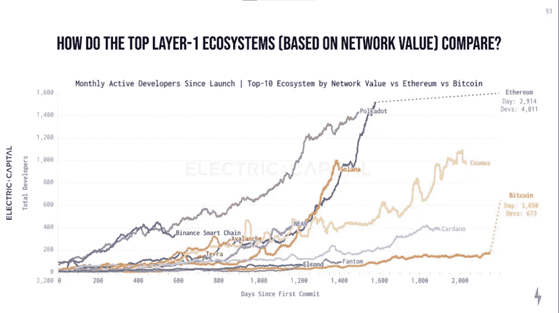

解决区块链三难困境是一个持续的追求，并被视为区块链发展的圣杯，但同样可以说是实现可持续性和互操作性。

对于 Cosmos 来说，互操作性通过 Cosmos hub 将区域和外部 PoS 区块链连接起来，Cosmos hub 是由区块链的一项强大技术——区块链内部通信枢纽(IBC)实现的。在最高级别上，目标是在一个链上启动一个在另一个链上执行的事务，无论是交换还是标记资产。

我们已经在以前的 FAs 中回顾了包装和桥接令牌。但在这种情况下，一个区域或 PoS 区块链可能希望将他们的资产锁定在他们的本地链上，而 IBC 中心则监管交易所。一旦接合，中枢将转发指令以在目标链上铸造和包装资产。

虽然这听起来像我刚刚描述的桥接，并且在某种程度上我已经描述过了，但是当代的桥接涉及将原生链上的资产锁定到目标链上。在这种情况下，不可信中介是本地链和目标链上可用的智能契约。如果我们反思最近的 3 . 25 亿美元的虫洞漏洞，漏洞发生在$ETH 的锁定机制中。一旦耗尽，索拉纳身上所有铸造的$ETH 就变得一文不值，因为没有任何东西可以支持它。

与 IBC 的主要区别在于，它作为一个独立的中心，具有自己的安全假设和共识，充当桥接过程的不可信中介。

在这种模式下，如果没有向 IBC 注册，任何资产都不会被桥接。部署了 Cosmos SDK 的区块链(区域)和外部 PoS 区块链利用 IBC 协议来保护桥接过程。

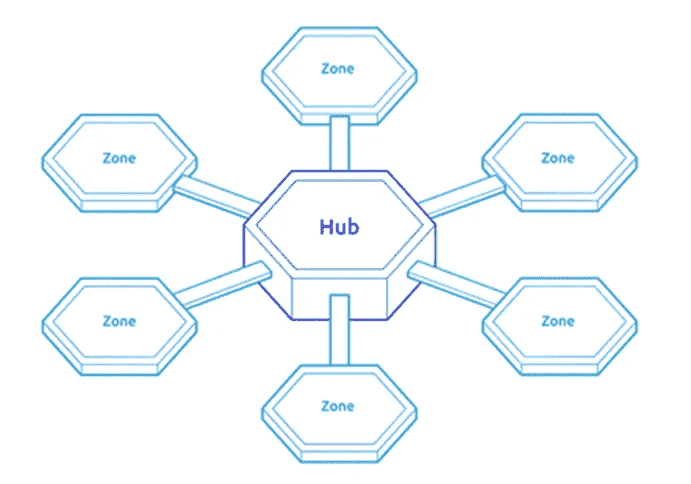

网络中的节点数量被限制为 135 个验证器，以确保可扩展性。如果我们回头看看比特币和以太坊，随着更多的节点进入网络，去中心化也在增加。

为什么这很重要？

因为每个节点(特别是$BTC 和$ETH)将从起源块下载现有分类帐的副本，直到分类帐的当前状态。增加的节点降低了系统故障的概率，在撰写本文时，有 5567 个活跃节点正在侦听以太坊网络。在这种情况下，2784 个节点需要协调来破坏分类帐的状态。

可以想象，用数千个节点来存储一个区块链的完整历史是非常耗费资源的。因此，通常情况下，网络参与者越多(分散程度越大),交易时间就越慢，通过网络存储数据的费用就越高。

虽然越来越分散的网络具有明显的安全优势，但不断增长的计算负担并不总是可持续的。

节点容量有限的孤立环境不是特别分散或可持续的。但是，如果可以在宇宙生态系统中部署的不同区域和中心之间共享安全性，会怎么样呢？

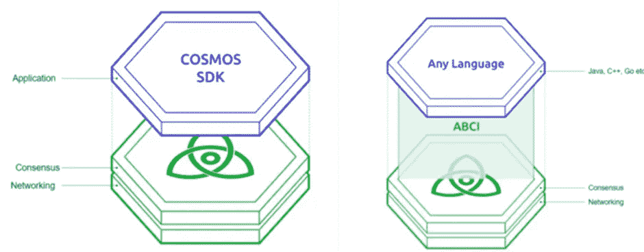

在那里，我们看到了共识层面的网络效应，它提供了呈指数级增长的跨链安全性。部署的区域和中心越多，就有越多的机会在生态系统内租赁所需的安全性，并划分跨链部署资产的智能合同风险。

# 由于光污染，星星显得稀少。

独立的区块链通常在有围墙的花园或封闭的环路中开始它们的生活。

从其他区块链筹集流动性的资产数量和能力最初是有限的。

每个链都需要本地数字资产来激励他们的生态系统，这不仅是为了让验证者维护网络，也是为了将价值与增量进入他们的生态系统以访问 DApps 的额外资产挂钩。

在价值交换的环境中，博弈论是稀缺的，直到生态系统中出现额外的资产和经济机会。如果网络上发生的交易越少，或者可用的经济机会越少，那么在共识水平上验证者可获得的奖励就越少。

我们知道每个区块链都有不同的用户活动水平和独特的参数来解决最紧迫的问题。虽然一个可能是高度可伸缩的，但它可能在去中心化上有所妥协。如果网络因此缺乏安全性，那么它在向集中化的另一个方向走得太远了。

但是，如果每个网络都能够弥补另一个网络的不足，那会怎么样呢？

互操作性使用户能够灵活地利用他们的资产来实现他们的目标。人们乐于将比特币储存在网络上，因为这是现存的最安全、最分散的网络之一。然而，就像拥有黄金一样，我们不会带着它去商店购物，我们会限制我们需要转移黄金的次数，以最大限度地提高安全性。运送大量黄金既昂贵，在物流上也很棘手。比特币也是如此，但程度要小得多。

如果我们希望经常与我们的资产进行交易，我们可能会倾向于将比特币包装在一个更具可扩展性和成本友好的区块链上使用。在这种情况下，我们牺牲了比特币网络的安全性，在一个有利于可扩展性的网络上使用它。

互操作性打开了原本封闭的循环。

那么，如果你购买了一张价值 100 美元的亚马逊礼品卡，会发生什么呢？

这 100 美元被锁定在亚马逊的资产负债表上。如果你爱的人不确定花在什么上，礼品卡可能会闲置一段时间。当礼品卡被消费时，一项资产将从亚马逊的资产负债表中移除。然而，亚马逊礼品卡在易贝是没用的——它是在一个闭环环境中。此外，他们有自己的收费结构，未使用的礼品卡信用实际上是留在亚马逊口袋里的资金。除了低买高卖之外，加密货币的效用也类似，特别是在支付象征性的汽油费、锁定流动性池、NFT 和其他 DeFi 产品中的资产时。

相反，如果你购买了一张价值 100 美元的预付 Visa 借记卡，会发生什么？

他们在哪里花这 100 美元受到的限制要少得多。

梅特卡夫定律在加密货币中经常被引用，主要是因为互联网和区块链采用之间的强相关性。这一概念旨在评估电信网络的价值。与网络的名义价值相关的数学观察值通常用网络中用户总数的平方根来表示。

在远程通信中，目的是使发送方能够对接收方解码的信息进行编码。通过电子邮件、传真、固定电话、移动设备、直接消息、社交媒体等不同媒介的可用性增加了整个网络的价值。媒体的更大接入和多样性使得用户活动在网络之间重叠。

交易越多，网络上收取和烧掉的费用就越大。但是以太坊可以以包装的形式存在，并且独立的桥使得替代的区块链可以使用。然而，最近的虫洞利用提醒我们，这些 exchange 环境的体系结构和安全性是至关重要的。

像 Cosmos 这样的公司使得资产在不同的区块链之间更自由地流动成为可能，打破了围墙花园，并为其本地生态系统之外的代币创造了效用。IBC 在他们的生态系统之外与 PoS 区块链反向兼容，消除了桥接 DApps 相互竞争来为各个令牌合约编码桥接功能的需要。

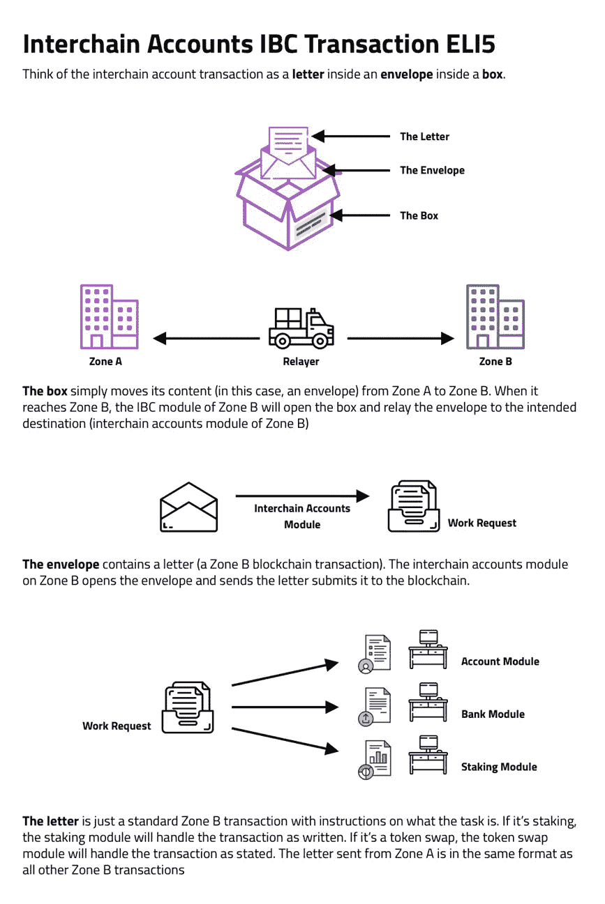

Source: Medium, Josh Lee

有人可能会认为这是对现有桥接功能的一次小升级，但是与 Cosmos SDK 一起部署的区块链是特定于应用程序的。实际上，Cosmos Hub 使这些应用程序能够无摩擦地捕获跨链的价值，同时保持与它们交互的环境相互排斥的自治和安全措施。换句话说，它们不符合通用的安全标准。

第三代区块链的一项重要任务是与遗留系统进行互操作。不过，人们普遍认为，金融机构不喜欢按照为它们设定的规则行事。银行可能希望构建具有所需权限的 DApps，这些 DApps 还可以访问高度流动的环境。需要 DApps 在维护隐私的同时实现特定管理、人力资源、工资和行政职能自动化的企业也可以将其安全性和功能租赁给其他传统企业。

当你可以想象这种网络效应和解决这些问题的创新时，似乎我们正走向用户在很大程度上意识不到他们甚至在区块链上操作。

实现加密货币的圣杯可以被解释为一种单一的追求，更倾向于将圣杯视为一套餐具的一部分。在理解网络价值的背景下，三个 A:采用、应用和访问代表了支撑梅特卡夫定律的基本原则。

# 眼不见，心不烦——原子标记组学

**$原子标记组学**(截至 2012 年 2 月 17 日):

当前价格:30.15 美元

市值:8696301574 美元

循环供应量:288434546.43

无盖电源

ATOM 股份:63.9%

当前通货膨胀率:9.5%

可变通货膨胀率:7-20%

归属期:完成

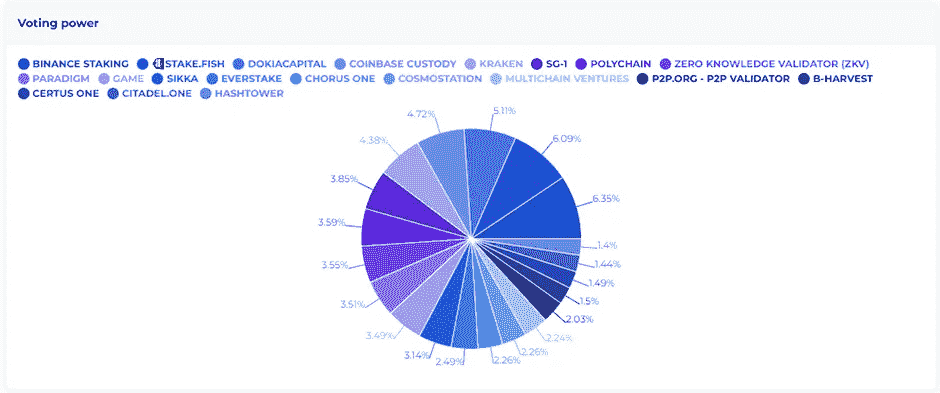

$ATOM 与其最接近的竞争对手$DOT 相比的效用需要一提。

$ATOM 用于作为委托人或验证人、治理，最近用于持有人获得空投激励的资格。虽然共享安全性是 IBC 的一个新兴特性，并且流动赌注有很多值得期待的地方，但是$ATOM 令牌目前并没有太多的实用性。

您不一定需要$ATOM 令牌来通过宇宙中枢进行操作。区域目前也不需要使用$ATOM 来支付其生态系统中的费用，因为它们通常使用自己的本地令牌。

没有深入研究，Polkadot 利用不同的网络体系结构来构建宇宙，并强调其生命周期中的早期效用。目前，$DOT token 比$ATOM 有更多的用途，还增加了用于连锁拍卖和大众贷款的赌注。这个选项要求赌注者将他们的$DOT 锁定 96 周。此外，DOT 还需要为主要中继链上的交易支付汽油费。

在验证者层面比较可变回报时:Polkadot 目前的回报率为 13.6%，通胀率为 8.6%，净投资回报率为 5.0%。Atom 目前的回报率为 14.85%，通货膨胀率为 9.5%，净投资回报率为 5.3%。

尽管 Cosmos 在 Polkadot 上领先一大步，但他们推迟了令牌的使用。相反，他们正通过基础设施层面的后期开发推出公用事业。

# 那个星座看起来像狮子还是猫？—讨论

这一块已经吸收了很多，还有很多需要拼凑。但是就讨论 Cosmos 的未来潜力而言，有几个关键指标值得讨论。

首先，Web 3 开发者非常受欢迎。虽然我们已经看到 Web 3 的开发者参与度逐年增长，但一些区块链已经提供了丰厚的奖励来挖走人才以发展他们的生态系统。

观察到优先激励新投资者的生态系统，早期的以太坊和币安智能链是显著的例子，投资者通常会迅速榨干发行中的每一滴，直到一无所有。在没有什么可压榨的了之后，他们转向下一个高 APY 的产品。正如在之前的 FA 中提到的，Andre Cronje 将这些投资者类型称为流动性蝗虫。

结果，修改后的方法激励开发者尽可能创造最好的产品。“建起来，他们就来了。”

Cosmos 在开发者活动中排名第三，落后于 Polkadot，而以太坊的活跃开发者数量仍然是它的四倍多。从监督 Cosmos 开发的 Tendermint 的假设裂缝中观察到，鉴于他们在基础设施级别的开发方面确实遥遥领先，该团队已经将他们的优先事项转移到部署特定于应用程序的区块链。

虽然他们可能改变了优先事项，但他们的价值观似乎保持不变。渗透是领先的 DEX 区域，锁定的总价值超过 14 亿美元。在交易所一再要求上市后，它们拒绝了，唯一的目的就是限制投资者进入它们的领域。

分散化似乎是渗透 DEX 和 Tendermint 团队的核心价值。尽管如此，一件好事做得太多也会产生负面后果。渗透错过了通过一级集中交易所(如 FTX)吸纳新投资者的机会。他们打算将用户限制在他们的生态系统中，但参与网络的复杂性可能让许多潜在投资者望而却步。Cosmos 专注于他们的基础设施，以追求$ATOM 的效用为代价，这导致价格明显落后于基本面。

此外，虽然 Cosmos 重视技术的创新和可获得性，但这种固定仍然使$ATOM 令牌没有什么用处。没有什么能阻止币安这样的公司再次使用 Cosmos SDK 部署他们自己的 IBC 中心，完全绕过了对$ATOM 令牌的需求。

看待$ATOM 令牌的另一种方式是，为了实现长期效用的承诺，可能已经在短期内做出了牺牲。当我们思考趋势时，采用不会在一夜之间发生。虽然用于治理和赌注以验证网络的令牌没有什么细微差别，但当我们认为 Cosmos 是一系列区域中的核心时，我们实际上是在等待合适的激励机制出现，以在其生态系统中获取更多价值。流动赌注和共享安全是朝着正确方向迈出的步伐，我们应该期待今年会有更多的发展。

人们不能忽视宇宙中指数网络效应的潜力。长期以来，人们一直认为 99.9%的加密货币和网络活动将“归零”。对于一些我们称之为“僵尸链”的生态系统来说，这无疑是正确的。它们缺乏在可互操作环境中的应用，并且将自己排除在自己的孤岛之外。EOS 就是一个明显的例子，他们确实有一些网络活动，但未能兑现承诺，被落在了后面。EOS 能做的，新兴或现有竞争对手都做得更好。Tron 是另一个有效复制和粘贴的例子。唯一想到的用例是利用网络上的低成本在集中式交换机之间传输稳定的内容。我要告诉你的是，那些无法在可互操作的环境中提供独特而有价值的应用程序的区块链将会死去。

许多人都非常熟悉卡尔达诺和创始人查尔斯·霍斯金森。2017 年，他声称“不会有一个密码来统治所有人”。此声明是在解释第三代区块链的背景下做出的。在以太坊工作时，他与波尔卡多特和 Web 3 基金会的创始人加文·伍德一起工作。然而，Cosmos 在这些项目之前就已经在工作了，看起来他们对互操作性的追求受到了启发。

具有讽刺意味的是，这是 Cosmos 发展缓慢的一个潜在解释，因为与上面提到的两个行业巨头相比，这个团队和创始人是未知的。虽然项目本身已经到了可以被认为太大而不能倒的地步，因为它的竞争对手在实现当今 IBC 存在的互操作性水平方面落后了，但它仍然是一个令人困惑的变量。

这两个项目是相关的，因为它们被认为是第三代区块链，就像宇宙一样。根本没用的项目会死掉，有应用的活下来。虽然直觉上 3 个可互操作的解决方案中只有 1 个能成功，但这是一个草率的假设。Cosmos 正在开发与基于衬底的区块链的兼容性。换句话说，它们将与波尔卡多特生态系统兼容。这是巨大的。随着集线器和中继链之间的价值转移，在区域、中继链和 EVM 环境中，将会出现指数级的应用。虽然所有三种解决方案的费用都可以忽略不计，但当每种解决方案以每天数百万笔交易的速度相互通信时，这些超过 1 美分的 tx 费用就开始增加。

一旦非 EVM 链的兼容性挑战得到令人信服的解决( [Solana](https://justmy2satoshis.medium.com/fundamentals-of-solana-summer-crypto-consulting-institute-in-depth-fa-2e2637ba5685) 是最值得注意的)，那么就不再是区块链将胜过其他人的问题，而是它们的功能和应用对未来有多大价值的问题。

这不是一个深刻的想法，显然，这已经在这些互操作项目背后的驱动力中实现了。如果可以合作，为什么还要竞争呢？

然后我们考虑遗留系统的破坏。互操作性将使这些实体能够共享功能并弥补彼此的不足。特定于应用程序的区块链是通向遗留系统的门户。个人、社区和组织寻求解决与他们相关的问题，互操作基础设施提供了应对这些挑战的手段。

Cosmos 已经启用了币安智能链和 Terra，这是继以太坊之后 TVL 最常用的两种区块链。这些系统之间的价值流动越自由，无论用户希望达到什么目的，我们都可以开始看到梅特卡夫定律的成果。

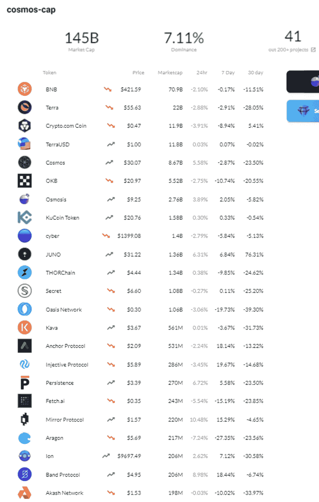

尽管如此，问题依然存在，宇宙生态系统和$ATOM 令牌将何去何从？

成功孕育成功。TVL 锁定了币安智能链和 Terra 等生态系统，这无疑激励了开发人员和机构利用 Cosmos SDK 来实现自己的目标。事实上，我们已经看到像马来西亚和中国这样的国家使用 Cosmos 将他们许可的区块链整合到一个可互操作的网络中。但这仅仅是宇宙生态系统的开始。

$ATOM 也是如此。一旦额外的实用程序可用，我们就可以开始认真考虑$ATOM 是否能与 Polkadot 甚至 Cardano 相提并论。

今年 1 月 17 日，$ATOM 达到了近 125 亿美元的历史最高市值。与此同时，Cardano 的市值为 505 亿美元，创下了 950 亿美元的历史新高。Polkadot 的估值为 297 亿美元，此前曾达到 565 亿美元的峰值。

虽然我们承认$ATOM 要实现其竞争对手的效用还有一段路要走，但断言$ATOM 的基本面被严重低估并不离谱。

如果市场全面迈向新的历史高点，ATOM 可能会达到$DOT 目前的市值——大约 3.5 倍

从现在起 7 倍，达到$DOTs 的历史新高不是不可能的。

假设市场对$ATOM 的估值超过了历史高点$ADA 的 12 倍。鉴于该项目和创始人的高调性质，这种大牛市情景不太可能出现，因为 ADA 的价值创历史新高主要是投机性的。一旦$ATOM 的效用实现取决于 Tendermint 在今年完成他们的关键里程碑，并且网络效应呈抛物线状，达到$ADA 的历史最高水平的概率就会增加。

然而，撇开任何不可预见的黑天鹅事件不谈，我们可以非常有信心地说,$ATOM 属于前 10 名，并且可能是前 30 名中风险/回报最好的游戏之一。

以上归结为 Cosmos 是否会成为主要的互操作生态系统。当我们考虑梅特卡夫定律和开始重叠的网络效应时，它们将可能共存并自由互动，而不是被 Polkadot、Cardano 和 Polygon 等竞争对手消灭。

除了价格预测，Cosmos 还将继续存在，并将通过统一区块链和将对遗留系统产生破坏性影响的应用程序，在打破围墙花园中发挥关键作用。

# 参考

*   Bityard，“宇宙:基本面、技术面、令牌组学和未来展望”，[https://support . bityard . com/HC/en-us/articles/4412612253977-宇宙-基本面-技术面-令牌组学-和-未来展望](https://support.bityard.com/hc/en-us/articles/4412612253977-Cosmos-Fundamentals-technicals-tokenomics-and-future-outlook)
*   区块极客，‘宇宙区块链是什么？有史以来最全面的指南”，2020 年 5 月 4 日，【https://blockgeeks.com/guides/cosmos-blockchain-guide/ 
*   宇宙生态系统(区块链用宇宙 SDK 开发)——【https://cosmos-cap.com/ 
*   Cosmos Learn，[https://cosmos . network/intro](https://cosmos.network/intro)
*   解密，“Cosmos 的内讧导致项目分裂”，2020 年 2 月，[https://decrypt . co/20013/in-fighting-at-Cosmos-leads-project-split](https://decrypt.co/20013/in-fighting-at-cosmos-leads-to-project-split)
*   德尔福数码，“宇宙生态系统已经到来”，2021 年 9 月 15 日，[https://www . realvision . com/RV/media/Issue/057 f 7 ca 0 Fe FD 4 f 69 be 16328230 EFD 909/pdf](https://www.realvision.com/rv/media/Issue/057f7ca0fefd4f69be16328230efd909/pdf)
*   电力资本，《开发商报告(2021)》，2022 年 1 月 6 日，[https://medium . com/electric-Capital/electric-Capital-Developer-Report-2021-f 37874 efea 6d](/electric-capital/electric-capital-developer-report-2021-f37874efea6d)
*   新月草，‘宇宙’，[https://lunarcrush.com/coins/atom/cosmos?section=summary](https://lunarcrush.com/coins/atom/cosmos?section=summary)
*   Medium，“为什么链间账户为 Cosmos 互操作性改变一切”，2020 年 6 月 16 日，[https://medium . com/chain apsis/Why-inter chain-Accounts-Change-Everything-for-Cosmos-inter operability-59c 19032 bf11](/chainapsis/why-interchain-accounts-change-everything-for-cosmos-interoperability-59c19032bf11)
*   嫩薄荷，[https://tendermint.com/about/](https://tendermint.com/about/)
*   Youtube，Coinbureau，Cosmos (ATOM):为什么它是一个密码游戏改变者！！🚀，2021 年 4 月 21 日，[https://www.youtube.com/watch?v=y4d8XMBVF1A](https://www.youtube.com/watch?v=y4d8XMBVF1A)
*   Youtube，Coinbureau，“宇宙:原子的强大价值和价格潜力！！🌌，2021 年 9 月 17 日，[https://www.youtube.com/watch?v=BnpUhcuD4KA](https://www.youtube.com/watch?v=BnpUhcuD4KA)
*   Youtube，Coinbureau，“宇宙:原子能在 2022 年发射火箭吗？！全面更新！！🚀2022 年 2 月 5 日，[https://www.youtube.com/watch?v=SsizxLsjo_Q](https://www.youtube.com/watch?v=SsizxLsjo_Q)
*   Youtube，Coinsider，“波尔卡多特 vs 宇宙:谁赢了？”，2022 年 2 月 10 日，[https://www.youtube.com/watch?v=kH1xXeinINY](https://www.youtube.com/watch?v=kH1xXeinINY)
*   Youtube，Max Maher，“宇宙与波尔卡多特的惊人真相”，2021 年 11 月 28 日，[https://www.youtube.com/watch?v=5-QlqbvU7pU](https://www.youtube.com/watch?v=5-QlqbvU7pU)

> *加入 Coinmonks* [*电报频道*](https://t.me/coincodecap) *和* [*Youtube 频道*](https://www.youtube.com/c/coinmonks/videos) *了解加密交易和投资*

# 另外，阅读

*   [Bookmap 评论](https://coincodecap.com/bookmap-review-2021-best-trading-software) | [美国 5 大最佳加密交易所](https://coincodecap.com/crypto-exchange-usa)
*   最佳加密[硬件钱包](/coinmonks/hardware-wallets-dfa1211730c6) | [Bitbns 评论](/coinmonks/bitbns-review-38256a07e161)
*   [新加坡十大最佳加密交易所](https://coincodecap.com/crypto-exchange-in-singapore) | [购买 AXS](https://coincodecap.com/buy-axs-token)
*   [红狗赌场评论](https://coincodecap.com/red-dog-casino-review) | [Swyftx 评论](https://coincodecap.com/swyftx-review) | [CoinGate 评论](https://coincodecap.com/coingate-review)
*   [投资印度的最佳密码](https://coincodecap.com/best-crypto-to-invest-in-india-in-2021)|[WazirX P2P](https://coincodecap.com/wazirx-p2p)|[Hi Dollar Review](https://coincodecap.com/hi-dollar-review)
*   [加拿大最佳加密交易机器人](https://coincodecap.com/5-best-crypto-trading-bots-in-canada) | [库币评论](https://coincodecap.com/kucoin-review)
*   [用于 Huobi 的加密交易信号](https://coincodecap.com/huobi-crypto-trading-signals) | [HitBTC 审查](/coinmonks/hitbtc-review-c5143c5d53c2)