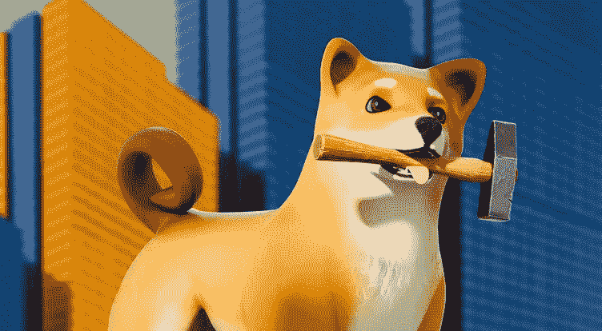

# 到目前为止，在 SHIB 的元宇宙已经购买了 19，000 多块土地

> 原文：<https://medium.com/coinmonks/over-19-000-land-plots-have-been-purchased-so-far-in-shibs-metaverse-812134eaf43e?source=collection_archive---------32----------------------->

元宇宙的统计数据由致力于柴犬社区的 Twitter 用户 ShibaInuart 提供。报告指出，已经购买了 19，611 块土地，土地所有者超过 5，613 人。

根据 shib.io 网站，随着时间的推移，总共将有 100，595 块土地可供使用。在第一个介绍阶段，在公布的 36，431 块土地中，已有 32，124 块土地挂牌出售。一些地区将继续被关闭，因为它们是共同的基础，是元宇宙内重要的流动枢纽。

柴犬元宇宙队最近在 5 月份看到了玛茜·贾斯特罗和雪莉·库奥诺的加入。

# 柴犬最近的发展

在暗示上市几周后，爱沙尼亚领先的交易所 Switcher 正式宣布将柴犬标志 SHIB、皮带和骨头上市。奢侈手表品牌百年灵也宣布，它现在通过加密支付处理器 BitPay 接受加密货币，包括柴犬。

此外，比特币基地商业增加了对柴犬和其他六种新资产的支持，允许商家和消费者在加密支付方面有更多选择。

柴犬团队表示，一旦铸造了 2.3 亿只骨，就停止所有骨养殖，以保留剩余的 2000 万只用于柴犬验证的提案以 97.88%的投票率获得通过。

随着新提案的通过，骨骼的总供应量仍保持在 2.5 亿。尽管目前价格下跌，柴犬持有者也在继续增长。根据捕鲸业的统计，目前 SHIB 持有者总数为 1188601 人。本文发表时，柴犬交易价格下跌近 10%，至 0.0000098 美元。

点击这里关注我们了解更多故事[。](http://t.me/etellworld)

> 加入 Coinmonks [电报频道](https://t.me/coincodecap)和 [Youtube 频道](https://www.youtube.com/c/coinmonks/videos)了解加密交易和投资

# 另外，阅读

*   [Bookmap 评论](https://coincodecap.com/bookmap-review-2021-best-trading-software) | [美国 5 大最佳加密交易所](https://coincodecap.com/crypto-exchange-usa)
*   [加密交易机器人](/coinmonks/crypto-trading-bot-c2ffce8acb2a) | [造币评论](https://coincodecap.com/coingate-review)
*   最佳加密[硬件钱包](/coinmonks/hardware-wallets-dfa1211730c6) | [Bitbns 评论](/coinmonks/bitbns-review-38256a07e161)
*   [新加坡十大最佳加密交易所](https://coincodecap.com/crypto-exchange-in-singapore) | [收购 AXS](https://coincodecap.com/buy-axs-token)
*   [红狗赌场评论](https://coincodecap.com/red-dog-casino-review) | [Swyftx 评论](https://coincodecap.com/swyftx-review)
*   [投资印度的最佳密码](https://coincodecap.com/best-crypto-to-invest-in-india-in-2021)|[WazirX P2P](https://coincodecap.com/wazirx-p2p)|[Hi Dollar Review](https://coincodecap.com/hi-dollar-review)