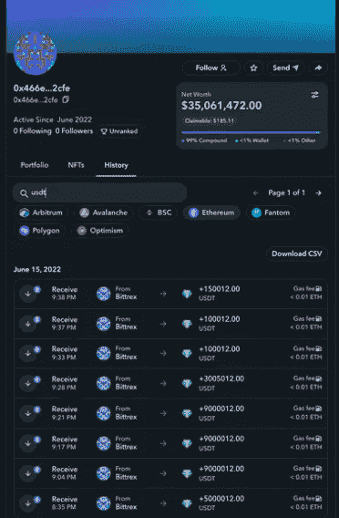
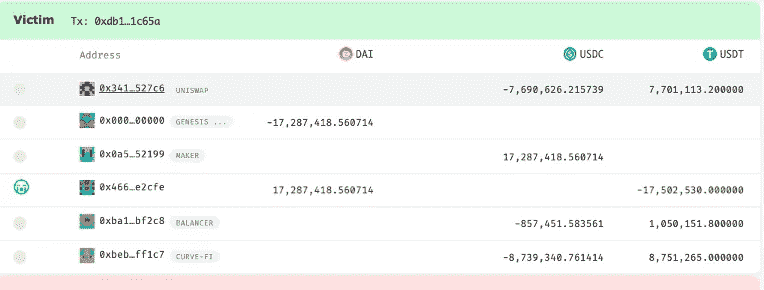
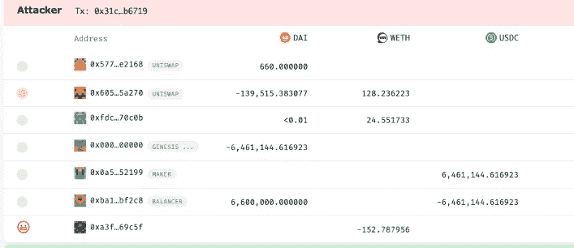
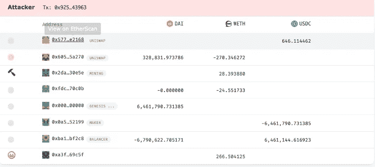
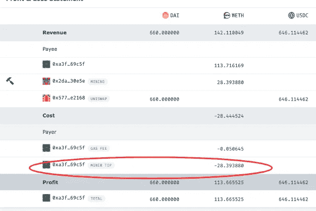
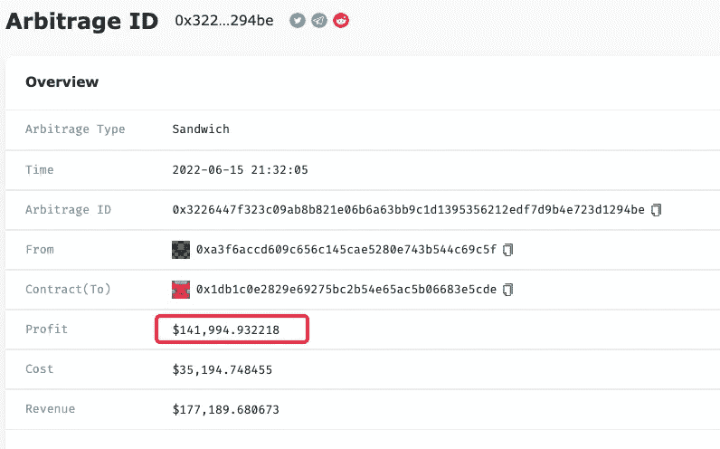
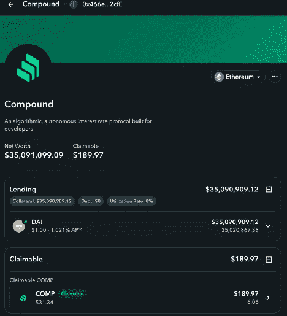

# 昨晚，超过 3500 万美元的 USDT-戴交换在 7 分钟内被 3 个三明治损失了 26.8 万美元

> 原文：<https://medium.com/coinmonks/over-35m-usdt-dai-swapping-suffered-268k-loss-by-3-sandwiches-in-7-minutes-last-night-16efa107fc5b?source=collection_archive---------13----------------------->

Photo by [Alexander Popov](https://unsplash.com/@5tep5) on [Unsplash](https://unsplash.com)

昨晚美国东部时间 21:32 到 21:39，有人用超过 3500 万的 USDT 换了 3000 万美元的戴。不幸的是，在交流过程中，该地址成为 3 次三明治攻击的受害者，总共损失了 26.8 万美元。

从晚上 8 点 35 分开始，[地址 0x 466 e 89 db 9 e 88 a 69367 E4 e 9 aa E5 b 6 ff 508 f8e 2 cfe](https://zapper.fi/account/0x466e89db9e88a69367e4e9aae5b6ff508f8e2cfe)通过 8 次转账共收到来自 [Bittrex](https://zapper.fi/account/0xfbb1b73c4f0bda4f67dca266ce6ef42f520fbb98?tab=history) 的 35355096 USDT。

然后地址通过 1 英寸在 4 次交易中把换成戴，其中 3 次被夹在中间。你可以在这里找到[所有的攻击](https://eigenphi.io/ethereum/sandwich/victim/0x466e89db9e88a69367e4e9aae5b6ff508f8e2cfe.)。

该页面列出了 3 次攻击。打开详细页面你可以揭示整个过程。

[就拿最大的那个来说吧。](https://eigenphi.io/ethereum/tx/0x3226447f323c09ab8b821e06b6a63bb9c1d1395356212edf7d9b4e723d1294be)

受害人欲以 1750.2 万换戴。

攻击者首先提高了戴的价格。

在受害者交易后，攻击者以 266 WETH 的价格出售了戴。

在袭击中，袭击者付给矿工超过 28 个星期的小费，并收获了 113 个星期的利润。

[整个攻击](https://eigenphi.io/ethereum/tx/0x3226447f323c09ab8b821e06b6a63bb9c1d1395356212edf7d9b4e723d1294be)给攻击者带来了 14.2 万美元的利润。

由于类似的攻击，[前述地址](https://eigenphi.io/ethereum/sandwich/victim/0x466e89db9e88a69367e4e9aae5b6ff508f8e2cfe)最终遭受了总计 26.8 万美元的损失。

最终，这个地址[将超过 3500 万的戴放入复利进行借贷](https://zapper.fi/account/0x466e89db9e88a69367e4e9aae5b6ff508f8e2cfe/protocols/ethereum/compound)却不知道他们本可以多投资 26.8 万美元。

更多实时三明治攻击和总结，请访问 [EigenPhi 的三明治模块](https://eigenphi.io/ethereum/sandwich)。

跟随我们通过这些来挖掘更多隐藏的 DeFi 的智慧:

*   [EigenPhi 官方推特](https://twitter.com/eigenphi)
*   [EigenPhi MEV 提醒推特](https://twitter.com/eigenphi_alert)
*   [子栈](https://eigenphi.substack.com/)
*   [中等](/@eigenphi)
*   [Mirror.xyz](https://mirror.xyz/0xc19565163aFdEe3783FC970E4Bd0275B11848d34)
*   [电报](https://t.me/WisdomOfDeFi)
*   [不和](https://discord.com/invite/JXD8cyzR2a)
*   [Revue](https://www.getrevue.co/profile/EigenPhi)

> 加入 Coinmonks [电报频道](https://t.me/coincodecap)和 [Youtube 频道](https://www.youtube.com/c/coinmonks/videos)了解加密交易和投资

# 另外，阅读

*   [如何在 FTX 交易所交易期货](https://coincodecap.com/ftx-futures-trading) | [OKEx vs 币安](https://coincodecap.com/okex-vs-binance)
*   [CoinLoan 评论](https://coincodecap.com/coinloan-review) | [YouHodler 评论](/coinmonks/youhodler-4-easy-ways-to-make-money-98969b9689f2) | [BlockFi 评论](https://coincodecap.com/blockfi-review)
*   [XT.COM 评论](https://coincodecap.com/profittradingapp-for-binance)币安评论 |
*   [SmithBot 评论](https://coincodecap.com/smithbot-review) | [4 款最佳免费开源交易机器人](https://coincodecap.com/free-open-source-trading-bots)
*   [比特币基地僵尸程序](/coinmonks/coinbase-bots-ac6359e897f3) | [AscendEX 审查](/coinmonks/ascendex-review-53e829cf75fa) | [OKEx 交易僵尸程序](/coinmonks/okex-trading-bots-234920f61e60)