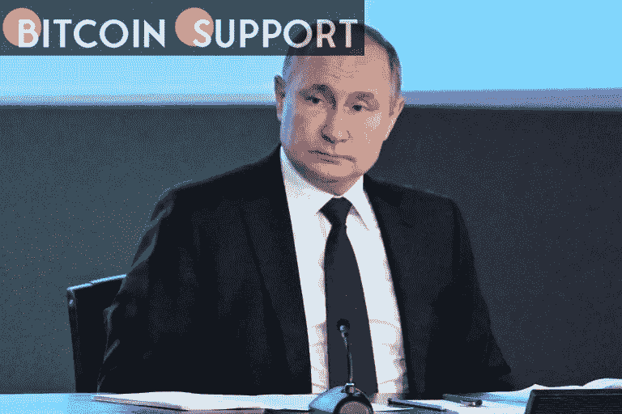

# 由于入侵乌克兰，欧盟即将切断俄罗斯与 SWIFT 的联系

> 原文：<https://medium.com/coinmonks/over-the-ukraine-invasion-the-eu-is-on-the-verge-of-cutting-russia-off-from-swift-a9e161d270c?source=collection_archive---------40----------------------->

**Visit our website:-** [**https://bitcoinsupports.com/**](https://bitcoinsupports.com/)

越来越多的成员国限制俄罗斯进入国际银行体系。随着越来越多的成员国站出来支持取消或禁止俄罗斯加入全球银行间金融电信协会(SWIFT ),欧盟正在接近做出决定。

通过将俄罗斯排除在 SWIFT 之外，欧盟将有效地将俄罗斯从全球金融体系中切断，阻止俄罗斯机构与非俄罗斯公司进行任何银行间交易。就在几天前，俄罗斯武装部队袭击了乌克兰各地的城市和军事基地，包括该国首都基辅。意大利、匈牙利和塞浦路斯最初反对这个想法，但在周五和周六，他们表示支持。与此同时，德国支持对俄罗斯实施“有针对性的、功能性的”制裁。

据彭博报道，德国外交部长安娜莱娜·贝尔博克和副总理罗伯特·哈贝克在周六的一份声明中表示，“我们正在全力以赴，以一种影响适当个人的方式，将脱离 SWIFT 的附带伤害降至最低。”欧洲国家的官员预计将于周日聚集一堂，开始这一进程。

鉴于 SWIFT 总部位于比利时，驱逐任何国家(如俄罗斯)都需要欧洲的广泛支持。

与此同时，美国副总统乔·拜登正在辩论是否公开支持俄罗斯退出 SWIFT 的决定。在周五的新闻发布会上，白宫新闻秘书珍·普萨基表示，政府从未取消对俄罗斯的快速禁令。毫无疑问，这个问题还会继续讨论下去您可能知道，SWIFT 是一项连接 11，000 家银行的报文传送服务。许多人会说，随着时间的推移，俄罗斯——俄罗斯领导人——有办法解决这个问题，但这肯定是摆在桌面上的一个选项。

**访问我们的网站:-**[**https://bitcoinsupports.com/**](https://bitcoinsupports.com/)

**免责声明:以上为作者观点，不应视为投资建议。读者应该自己做研究。**

> 加入 Coinmonks [电报频道](https://t.me/coincodecap)和 [Youtube 频道](https://www.youtube.com/c/coinmonks/videos)了解加密交易和投资

# 另外，阅读

*   [用信用卡购买密码的 10 个最佳地点](https://coincodecap.com/buy-crypto-with-credit-card)
*   [百佳卡达诺钱包](https://coincodecap.com/best-cardano-wallets) | [Bingbon 副本交易](https://coincodecap.com/bingbon-copy-trading)
*   [印度最佳 P2P 加密交易所](https://coincodecap.com/p2p-crypto-exchanges-in-india) | [柴犬钱包](https://coincodecap.com/baby-shiba-inu-wallets)
*   [八大加密附属计划](https://coincodecap.com/crypto-affiliate-programs) | [eToro vs 比特币基地](https://coincodecap.com/etoro-vs-coinbase)
*   [最佳以太坊钱包](https://coincodecap.com/best-ethereum-wallets) | [电报上的加密货币机器人](https://coincodecap.com/telegram-crypto-bots)
*   [交易杠杆代币的最佳交易所](https://coincodecap.com/leveraged-token-exchanges) | [购买弗洛基](https://coincodecap.com/buy-floki-inu-token)
*   [3Commas 对 Pionex 对 Cryptohopper](https://coincodecap.com/3commas-vs-pionex-vs-cryptohopper) | [Bingbon 评论](https://coincodecap.com/bingbon-review)
*   [加密复制交易平台](/coinmonks/top-10-crypto-copy-trading-platforms-for-beginners-d0c37c7d698c) | [如何在 WazirX 上购买比特币](/coinmonks/buy-bitcoin-on-wazirx-2d12b7989af1)
*   [CoinLoan 评论](https://coincodecap.com/coinloan-review)|[Crypto.com 评论](/coinmonks/crypto-com-review-f143dca1f74c)
*   [如何在加拿大购买加密货币？](https://coincodecap.com/how-to-buy-cryptocurrency-in-canada)