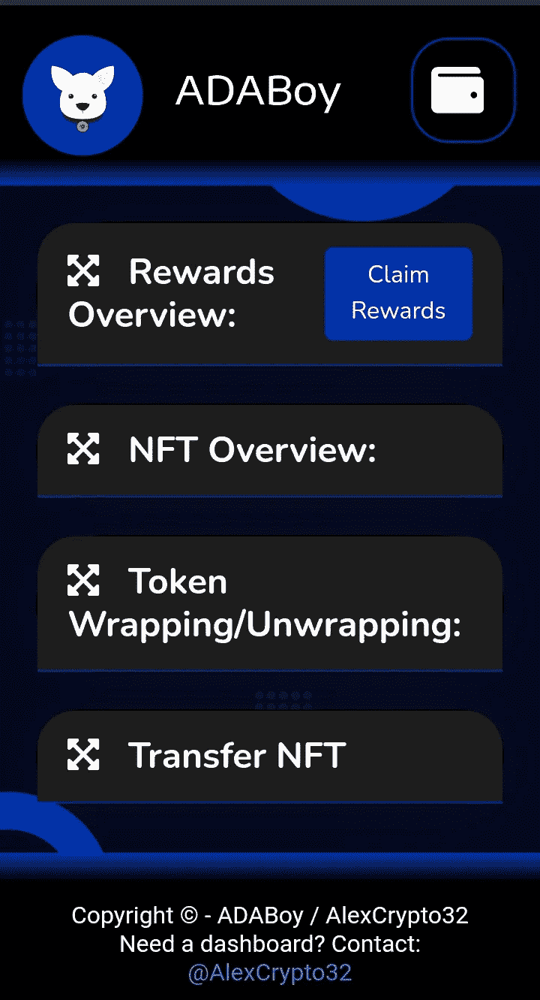

# Adaboy Nft 概述

> 原文：<https://medium.com/coinmonks/overview-of-adaboy-nft-336211474c22?source=collection_archive---------41----------------------->

> 不可替代令牌是一种不可转让的数据单位，可以出售和交易，并保存在区块链(一种数字分类账)中。照片、视频和音频等数字媒体可以与几种类型的 NFT 数据单元连接。NFT 是一种类似艺术品的数字代币，已经变得越来越受欢迎，有些售价高达数百万美元。它们通常建立在以太坊(Ethereum)等区块链平台上，消费者用加密货币支付代币。

