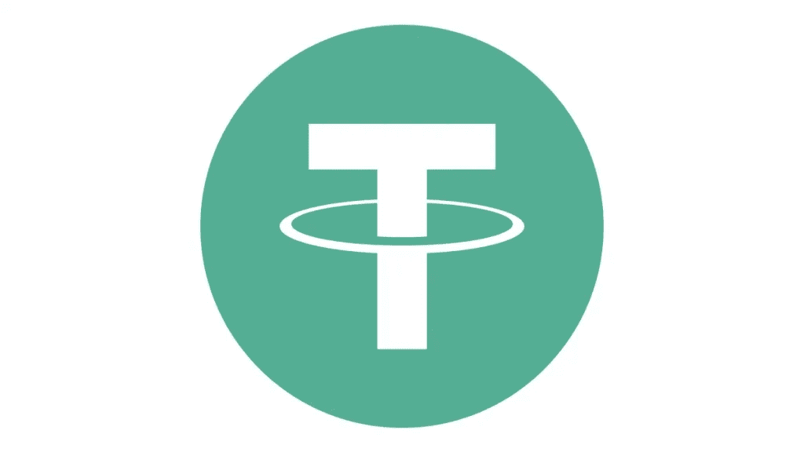
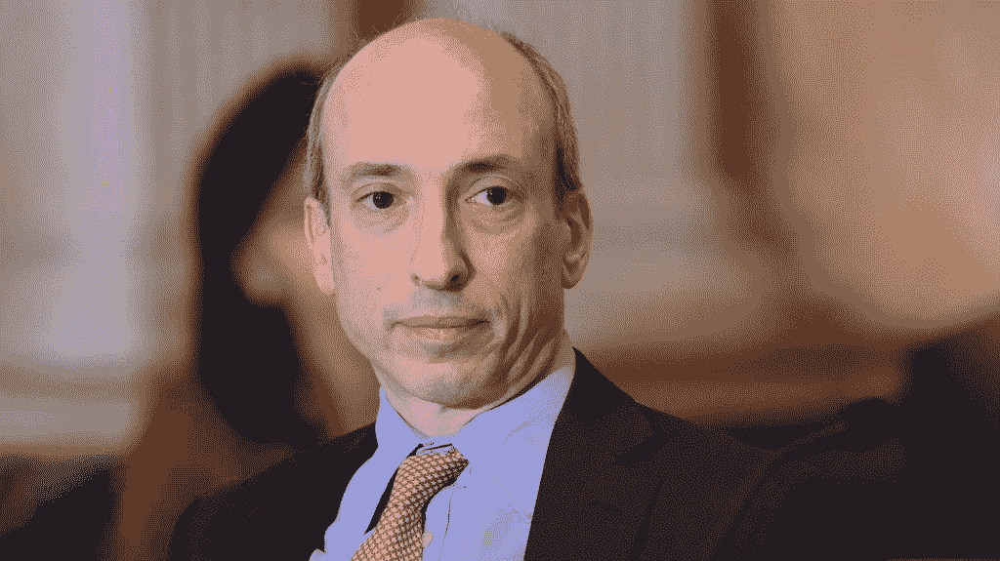
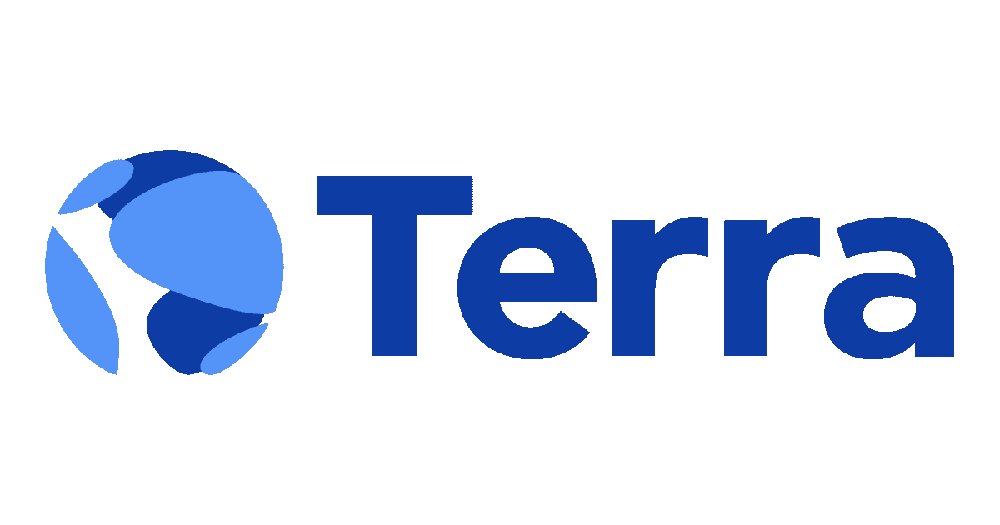
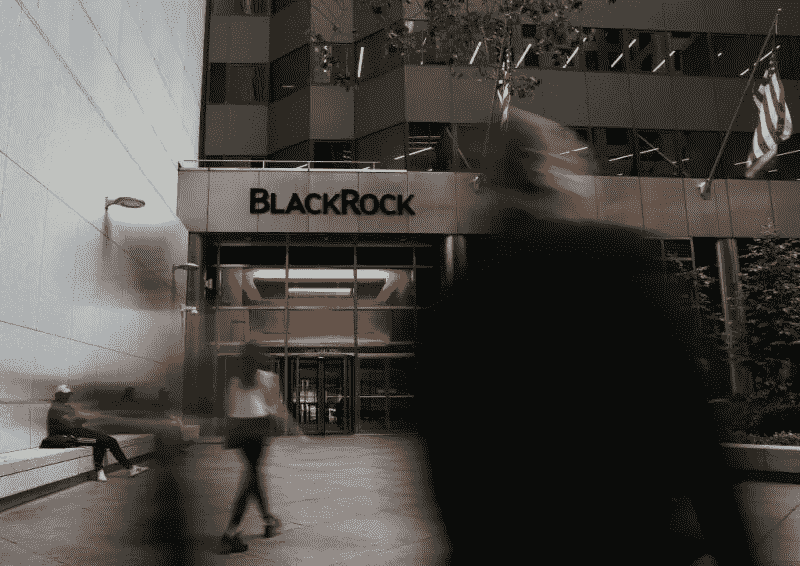
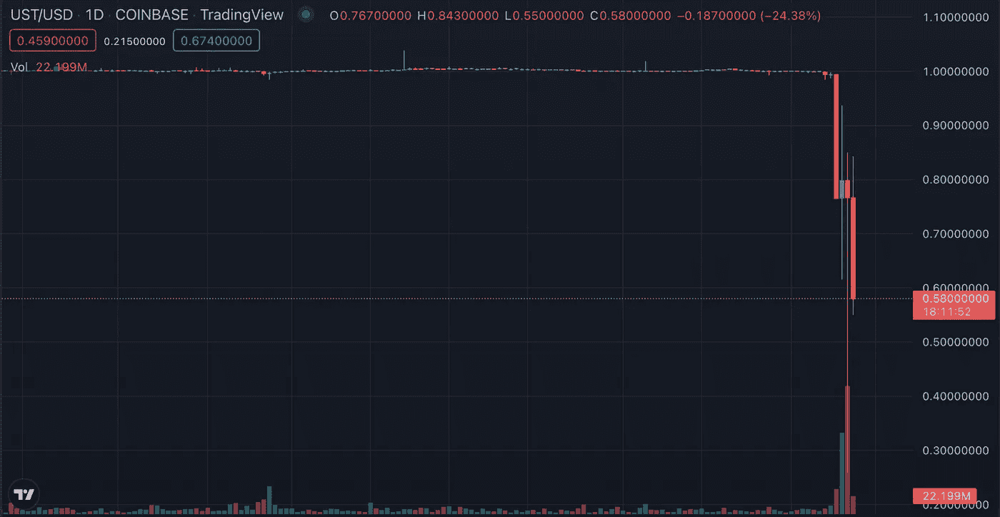
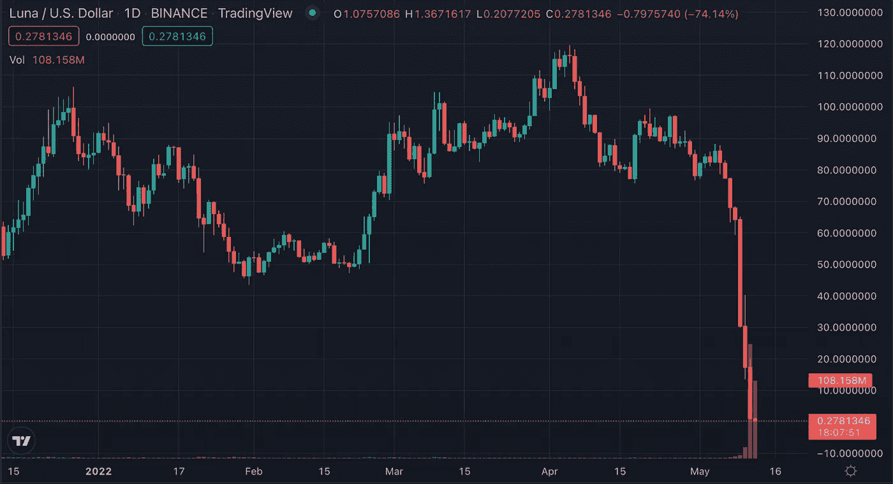
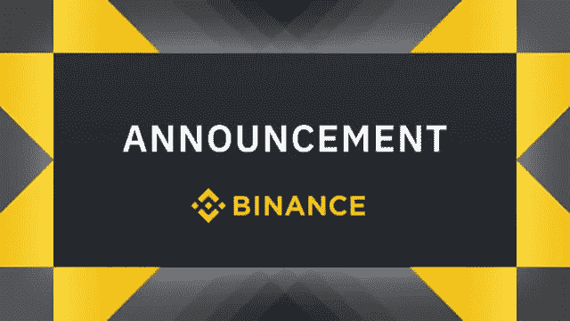

# 最新区块链行业新闻概述

> 原文：<https://medium.com/coinmonks/overview-of-the-latest-blockchain-industry-news-e11eef5871c5?source=collection_archive---------16----------------------->

## 今天最新的区块链行业新闻，让我们开始吧。

**1。跟随 UST 的 USDT 在钉住美元上有问题**

最受欢迎的与美元挂钩的稳定货币 USDT 下跌了 5%，至 0.94 美元。该指数略有回升，但仍低于 1 美元。UST 和比特币价格的严重下跌是一切的罪魁祸首。

由 Tether 发行的 USDT 是市场上最大的稳定币，据 [CoinGeck](https://www.coingecko.com/) o 称，其资本总额超过 820 亿美元。然而，这并不能保护他免受不愉快的惊喜。USDT 衰落的局面是由另一种稳定货币引发的，这种货币是与美元挂钩的[【UST】](https://www.coinbase.com/ru/price/terrausd)，继比特币之后，于 5 月 10 日开始自由浮动。美元急剧下跌至 0.22 美元，LUNA 的价值在一天内暴跌了近 95%。两种流行的加密货币衰落的后果对整个市场都有负面影响。

## USDT 是什么，怎么吃

USDT 和 UST 彼此不同。UST 是一种由智能合约控制的算法稳定的货币，而 USDT 1:1 的盯住美元汇率制度是由限额储备支持的。

USDT 支持的 Tether 储备包括 83.74%的现金和现金等价物，4.61%的公司债券和贵金属，5.27%的抵押贷款，以及 6.38%的其他投资，包括数字令牌。

该公司报告称，在这 83.74%的现金和现金等价物中，只有 6.36%是现金和银行存款。

Tether 定期发布审计报告，确认 Tether tokens 完全由其资金支持。

它被迫承担如此严格的责任，因为不断有人指责[系绳](https://coinmarketcap.com/currencies/tether/)不够安全，以及对纽约当局的义务。去年 2 月，Tether 及其子公司 Bitfinex 与纽约检察官办公室(NYAG)解决了一场纠纷。自 2019 年 4 月以来，针对 Bitfinex 和 Tether 的法律诉讼一直在拖延，使加密社区感到非常不安。纽约当局声称，Tether stablecoin 没有得到菲亚特的完全支持，尽管该公司声称并非如此。根据协议条款，这些公司向纽约州支付了一大笔赔偿金，并同意自愿向纽约州政府和公众提供两年内 USDT 稳定币的季度担保报告。

然而，USDT 与美元 1:1 的挂钩经常在加密界引发健康的怀疑。一些 Twitter 用户有理由怀疑审计报告的真实性，因为它们的数字是由稳定币的发行者提供的，而不是由审计公司提供的。

## 不要慌！一切都按计划进行

Tether 的发行人首席技术官 Paolo Ardoino 声称，一切都会好的——公司的储备将足以以 1:1 的比例回购所有资产。他强调， [Tether](https://coinmarketcap.com/currencies/tether/) 通过 tether.to 门户以 1:1 的比例将资产换成美元。最低还款额为 10 万美元。

超过 3 亿美元的 USDT 在过去的 24 小时内被赎回。

**2。加里·詹斯勒批评加密交易所:它们不符合客户的利益**

美国证券交易委员会(SEC)主席加里·詹斯勒(Gary Gensler)认为，加密货币交易所应该有兴趣与监管机构合作——这将有利于他们的客户。但交易平台不想占据头脑。

Gensler 认为，一些加密货币交易所正在规避规则，不符合自己客户的利益。他回忆说，大多数数字资产都属于 SEC 的管辖范围，与它们合作的交易所必须在该监管机构注册。

SEC 主席一再呼吁对数字资产行业适用通用规则。他不断强调该部门关心美国加密投资者的安全。然而，SEC 的保护看起来好像监管机构只是先发制人地扼杀加密货币初创公司，对它们处以数百万美元的罚款，并干扰它们的工作。

Gensler 担心交易平台未能通过必要的安全措施保护客户:“加密货币有很多问题。事实上，平台往往不会根据客户的利益进行交易。”

三大稳定币——Tether、USD Coin 和币安 USD——有助于避免 KYC 和反洗钱合规，从而促进主要交易所的交易。

> 我不认为这是巧合。三大[stablecoins]均由交易平台推出，旨在促进这些平台上的交易，并可能避免反洗钱和 KYC。

**3。Terraform 实验室公布了恢复卢娜和 UST 的额外措施**

Terraform 实验室提出了许多措施，旨在恢复 UST 币和卢娜加密货币的算法稳定性。

该公司指出，UST 供应过剩给 LUNA 报价带来压力。据开发商称，他们的主要任务是在相当短的时间内将稳定货币中的“坏账”从流通中收回。

主要措施之一是激活提议#1164，这是 Terraform 实验室负责人 Do Kwon 以前介绍过的。该倡议涉及扩大 LUNA 基础池和增加加密货币的发行，据称这将允许所需数量的 UST 更快地退出流通。

根据 CoinGecko 的数据，在撰写本文时，UST 的交易价格接近 0.47 美元，而 LUNA 的交易价格为 0.05 美元。一周前，第一个是盯住美元，第二个是 85 美元左右。

Terraform 实验室提出了稳定局势的额外措施:

(a)烧毁 UST 项目剩余的社区资金(约 10 亿代币)；
b)在以太坊区块链上焚烧 3.71 亿 UST；
c)拨款 2.4 亿 LUNA，防范网络潜在攻击。

> “这三项优惠措施实施后，总共将有约 1，388，233，195 UST 退出流通。这大约是稳定硬币总供应量的 11%，”开发商写道。

该公司的措施在网上遭到了批评。特别是，一些用户已经注意到提案#1164 只会加速生态系统的“死亡螺旋”。小组成员还指出，试图拯救 UST 将导致月球完全贬值。

Block 分析师 Larry Cermak 认为，Terraform Labs 的唯一出路是放弃 UST，专注于主网络的发展。他强调，随着生态系统的增长，项目团队必须还清稳定的货币债务。

> “当然，就算他们照我说的做，成功的几率大概是零。然而，否则就是 100%零，并且由于法律原因情况不会好转。此外，如果 Terra 仍然有储备，他们绝对必须将它们发送出去，以补偿用户的损失，”Cermak 写道。

**4。贝莱德和 Citadel 宣称与 UST 的崩溃无关。LUNA 价格暴跌至 0.3 美元**

资产管理公司贝莱德(BlackRock)和对冲基金 Citadel Securities 否认参与了算法稳定币 UST 和加密货币 LUNA 的崩溃。

在此之前，网上有传言称，这些公司从双子星交易所借了 10 万 BTC，用 2.5 万 BTC 换了 UST。据称，他们联系了 Terraform 实验室的负责人 Do Kwon，并表示他们将出售大量比特币，提议他以折扣价为 UST 购买一大批加密货币。

随后，贝莱德和 Citadel 据称抛售了所有资产，这导致了 UST、LUNA 和整个市场的崩溃。

> “贝莱德和 Citadel 知道，Anchor 持有大量 LUNA 是一个庞氏骗局，这次崩盘将导致更多提款，超出 Anchor 的偿还能力。这将引发大规模的 Luna 抛售，导致与 1 美元脱钩，并进一步摧毁市场。现在，贝莱德和 Citadel 可以便宜地购买比特币来偿还贷款，并获得差价，”理论是这样的。

它是由 IOHK 的负责人 Charles Hoskinson 分发的。他后来删除了这条推文，并声明谣言不是真的。

双子座交易所表示，它没有向机构交易对手提供 10 万 BTC 的贷款。

贝莱德称有关其参与 UST 破产的传言是“绝对错误的”,并指出该公司不交易该资产。

Citadel 还表示，该公司不交易稳定的硬币，包括 UST。

在撰写本文时，UST 的价格在 0.6 美元左右。

LUNA 的价格暴跌至 0.3 美元。

**5。币安摘牌 LUNA 永久合约**

加密货币衍生品平台币安期货已经将 LUNA 上的基础资产结算永久合约摘牌。对于以 USDT 计价的类似工具，杠杆率从 21-25 倍降至 8 倍。

这些更改于 5 月 12 日 8:00 UTC 生效。

对于那些没有自己做出必要改变的用户，该平台会自动关闭他们在硬币保证金 LUNA 上的头寸。

USDT 保证金 LUNA 的未平仓合约参数仍然有效。

币安期货警告称，未来可能会再次修改参数。

📰 ***订阅*** [***斐波那契***](/@unclefibonacci) ***我来保持最新***

> 加入 Coinmonks [电报频道](https://t.me/coincodecap)和 [Youtube 频道](https://www.youtube.com/c/coinmonks/videos)了解加密交易和投资

# 另外，阅读

*   [如何在 FTX 交易所交易期货](https://coincodecap.com/ftx-futures-trading) | [OKEx vs 币安](https://coincodecap.com/okex-vs-binance)
*   [CoinLoan 评论](https://coincodecap.com/coinloan-review) | [YouHodler 评论](/coinmonks/youhodler-4-easy-ways-to-make-money-98969b9689f2) | [BlockFi 评论](https://coincodecap.com/blockfi-review)
*   [XT.COM 评论](https://coincodecap.com/profittradingapp-for-binance) | [币安评论](https://coincodecap.com/xt-com-review)
*   [SmithBot 评论](https://coincodecap.com/smithbot-review) | [4 款最佳免费开源交易机器人](https://coincodecap.com/free-open-source-trading-bots)
*   [比特币基地僵尸程序](/coinmonks/coinbase-bots-ac6359e897f3) | [AscendEX 审查](/coinmonks/ascendex-review-53e829cf75fa) | [OKEx 交易僵尸程序](/coinmonks/okex-trading-bots-234920f61e60)
*   [如何在印度购买比特币？](/coinmonks/buy-bitcoin-in-india-feb50ddfef94) | [WazirX 评论](/coinmonks/wazirx-review-5c811b074f5b)