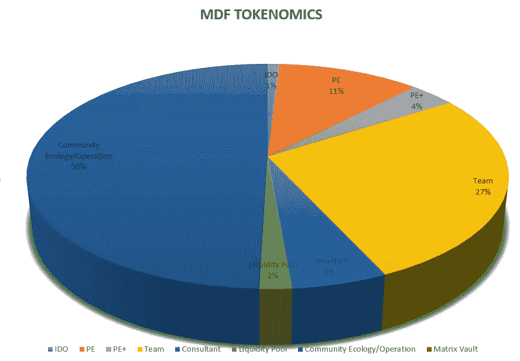

# MDF 令牌概述— MATRIXETF GEM

> 原文：<https://medium.com/coinmonks/overview-of-the-mdf-token-matrixetf-gem-6dc2fb7ce8a7?source=collection_archive---------50----------------------->

MDF token 是 MatrixETF 社区治理的关键。MDF 持有人可以参与社区治理和决策，包括 MatrixETF 打造什么样的 ETF 投资产品，ETF 基金的投资策略和资产类别，完善 ETF 和 MatrixETF 生态系统的发展方向。MDF 使持有者能够控制自己的财务。

关于 MatrixETF 的所有协议决策都由 MDF 持有者做出。持有 MDF 的用户是系统的管理员，有权参与平台的治理。MDF 持有者和基于 MDF 的应用程序将不断自动获得治理权。

在 MatrixETF 生态系统中，任何符合系统设定规则的管理员都可以发起提案，然后投票决定提案是否通过和实施。所有 MDF 持有者都可以发起提案，提案由 MatrixETF foundation 或 super nodes 审查。提案获得批准后，社区将进行公开投票。

所有 MDF 持有者都可以参与投票。新提案的内容包括重要的生态组成部分(包括利率、引入新资产、手续费等。)、重大生态发展规划等。

MatrixETF 基金会作为一个去中心化的 DeFi 平台，为了让项目尽快启动运营，前期会承担社区自治的责任，之后社区通过治理 token 的分配来承担所有决策。

由于平台完成了生态的布局，以去中心化的方式运行，社区将负责平台和协议的管理。MDF 持有者可以向 MDF 协议提供提案，或者对提案进行投票，使项目的“用户”无限接近项目的“所有者”，进一步促进去中心化治理的实现，解决区块链治理的问题:有效激励和共识。

因此，MDF 持有者负责有关 MatrixETF 的所有决策，以实现完全分散的社区治理。MDF 是以太坊和索拉纳区块链网络上部署的令牌，其最大供应限额为 1，000，000，000 个令牌。

ERC-20:6.23 亿立方米

SPL:3.77 亿立方米

MDF 合同信息:

以太坊:0x1a 57367 c 6194199 e 5d 9 AEA 1ce 027431682 DFB 411

https://ethers can . io/address/0x1a 57367 c 6194199 e 5d 9 AEA 1ce 027431682 DFB 411

**Solana**:Alq 9 kmwjfmxvbew 3 vmkjj 3 ypbakuorsggst 6 svchee 2 z https://explorer . Solana . com/address/Alq 9 kmwjfmxvbew 3 vmkjj 3 ypbakuorsggst 6 svchee 2 z

## 在哪里购买$MDF

gate io:https://www . gate . io/trade/MDF _ USDT
Mexc:https://www . Mexc . com/zh-CN/exchange/MDF _ USDT
Raydium:https://Raydium . io/swap/？ammId = eyyhurto 5 vuawxjm 6 nzsgtrkpr 53 mtbvk 1mg 74 xeyq 4
uni swap:https://www . dex tools . io/app/ether/pair-explorer/0x e 6 BBC 807 CB 59 b5 f 280 b 835135d 01d 077657d 4550

## MDF 实用程序

MDF 是 MatrixETF 社区的治理令牌，包括以下使用场景和实用程序:

*   参与 MatrixETF(道社区治理)的治理
*   购买 ETF 产品 ETF
*   通过从不同的 ETF 投资组合中获利来提升价值
*   参与流动性挖掘，获取回报
*   标桩采矿
*   生态增值
*   回购和销毁
*   手续费和其他费用的折扣

## $MDF 令牌分配

**I do(0.5%)**:I do 初始发行。

**PE (6.25%):** 上市前解锁 10%，其余每季度解锁一次，1 年内完成。

**PE+ (2%):** 上市前解锁 20%，其余每季度解锁一次，9 个月内完成。

**团队(15%):** 上市 6 个月后解锁 20%，剩余 80%在未来 24 个月内线性解锁。

**顾问(3%):** 上市 6 个月后解锁 20%，剩余 80%在未来 24 个月内线性解锁。

**流动性池(1%):** 创建 DEX 流动性池。

**社群生态与运营(27.25%):** 包括空投、社群推广、各种活动或提案奖励，其中 6%在上市后立即解锁，94%将在 4 年内线性解锁。

**Matrix Vault (45%):** 归属和应用场景由 Matrix DAO 社区投票，4 年内解锁，包括跑马圈地和流动性挖掘奖励、ETF 激励、社区活动等。

> 加入 Coinmonks [电报频道](https://t.me/coincodecap)和 [Youtube 频道](https://www.youtube.com/c/coinmonks/videos)了解加密交易和投资

# 另外，阅读

*   [最佳以太坊钱包](https://coincodecap.com/best-ethereum-wallets) | [电报上的加密货币机器人](https://coincodecap.com/telegram-crypto-bots)
*   [交易杠杆代币的最佳交易所](https://coincodecap.com/leveraged-token-exchanges) | [购买 Floki](https://coincodecap.com/buy-floki-inu-token)
*   [3Commas 对 Pionex 对 Cryptohopper](https://coincodecap.com/3commas-vs-pionex-vs-cryptohopper) | [Bingbon 评论](https://coincodecap.com/bingbon-review)
*   [加密复制交易平台](/coinmonks/top-10-crypto-copy-trading-platforms-for-beginners-d0c37c7d698c) | [如何在 WazirX 上购买比特币](/coinmonks/buy-bitcoin-on-wazirx-2d12b7989af1)
*   【Crypto.com 评论】|[【T4 评论】](/coinmonks/crypto-com-review-f143dca1f74c)