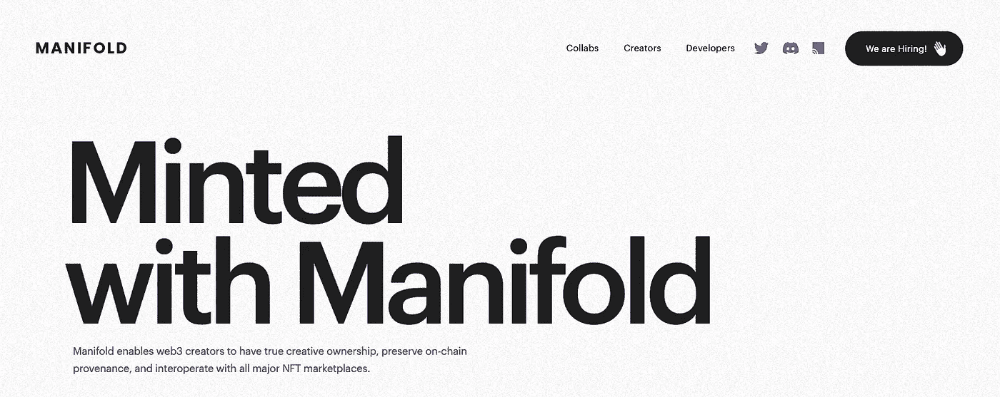
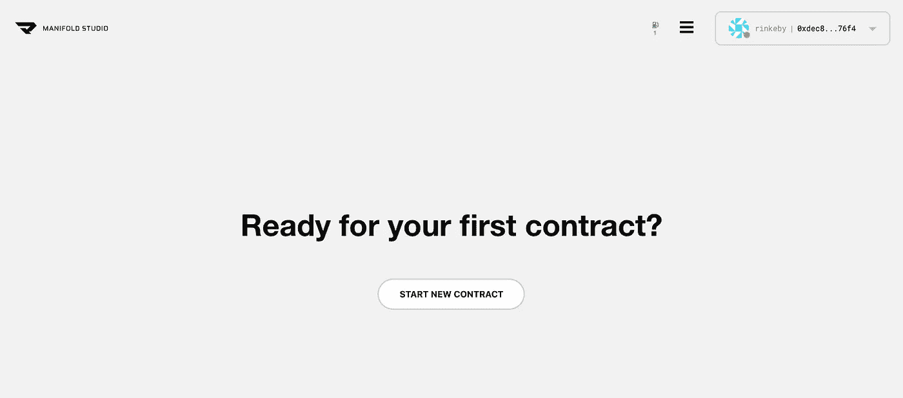
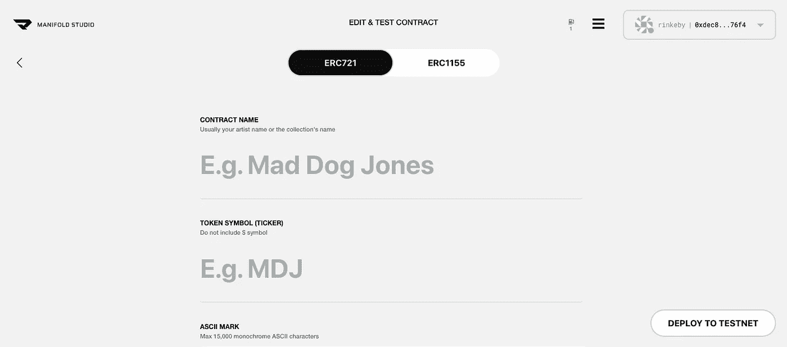
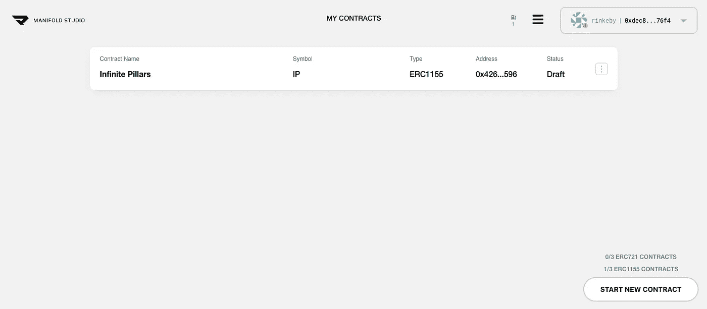
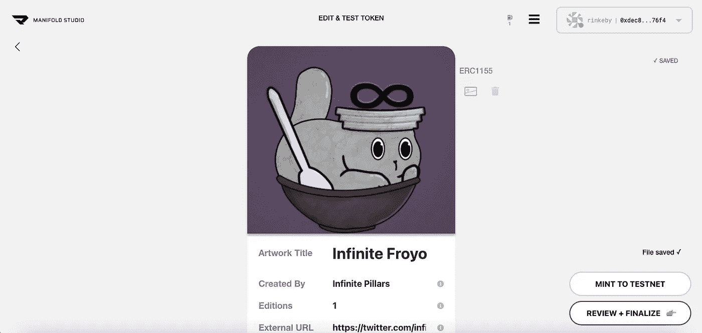
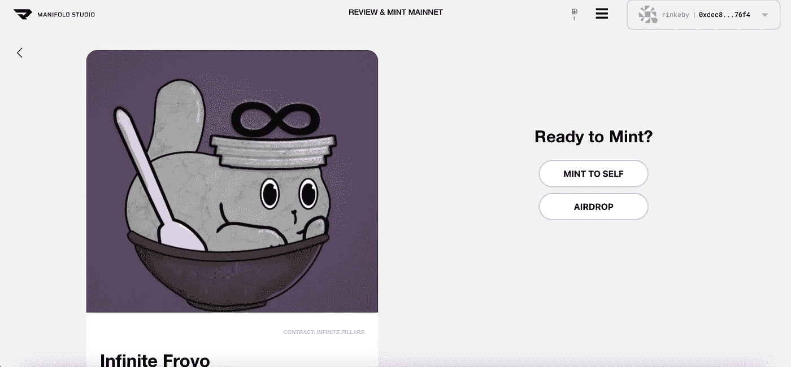

# 拥有你的艺术，拥有你的智能合同

> 原文：<https://medium.com/coinmonks/own-your-art-own-your-smart-contract-6f3ff1a1862f?source=collection_archive---------38----------------------->

OpenSea、Foundation、Super Rare、Looks Rare 和其他平台现在被成千上万的艺术家用来制作和出售他们的 NFT。这些艺术家拥有艺术品，但不拥有他们用来铸造艺术品的智能合同。他们对它没有任何控制权。因此，今天我们将向您展示 Manifold，这是一个艺术家和创作者无需编码即可拥有智能合约的解决方案。

[https://www.manifold.xyz/](https://www.manifold.xyz/)

Manifold 允许您使用草稿为项目做准备，并允许创建者在创建日期之前编辑元数据。

要在 manifold 上注册，您需要签署一条消息并提供一个电子邮件地址。你必须提供一个有效的地址，因为有一个确认电子邮件。

一旦你签署了信息，并点击了确认链接流形发送给您的邮件。您可以打开流形工作室，开始创建您的智能合同。

[https://studio.manifold.xyz/contracts](https://studio.manifold.xyz/contracts)

点击“开始新合同”，您将进入以下页面。

您可以选择“ERC721”或“ERC1155”代币。这是两个具有不同特性的 NFT 的令牌标准。ERC721 标准是第一个允许铸造 NFT 的标准。这一标准允许代币是独特的，数量有限的和可交易的。

ERC1155 标准是由区块链游戏公司金恩项目团队推出的。简而言之，它为 NFTs 带来了批量传输，以及在同一个智能合约中拥有不同类型令牌的能力。ERC1155 支持单个智能合约中的多个令牌，而 ERC721 需要每个令牌一个智能合约。与 ERC721 标准相比，ERC1155 更便宜、更高效，因此我们建议将其用于您的智能合同。然而，ERC721 是最常用的标准，并被视为 NFT 行业的规范。

**对于本文，我们决定使用 ERC1155 标准。**选择名称和代码后，我们将智能合同部署到 testnet。在以太坊主网上部署时，你只需支付油费。Manifold 对他们的服务不收取任何费用。

部署您的智能合同后，您将能够在打开“我的合同”页面时看到此信息。

[https://studio.manifold.xyz/contracts](https://studio.manifold.xyz/contracts)

用户体验非常愉快，因为这些步骤很容易遵循。一旦我们点击合同，我们被要求“铸造新令牌”,这将引导我们到下一页，在那里我们将能够上传艺术，指定数量和描述。如果你愿意，你也可以添加一个外部链接(到你的网站)。

Token creation page

Review + Finalize page

因此，你可以把它放进你的钱包或者空投到一个特定的钱包里。**代币的来源是智能合约，智能合约是你的。**

OpenSea 最近用 Manifold 实现了 Mint，在这里了解更多信息