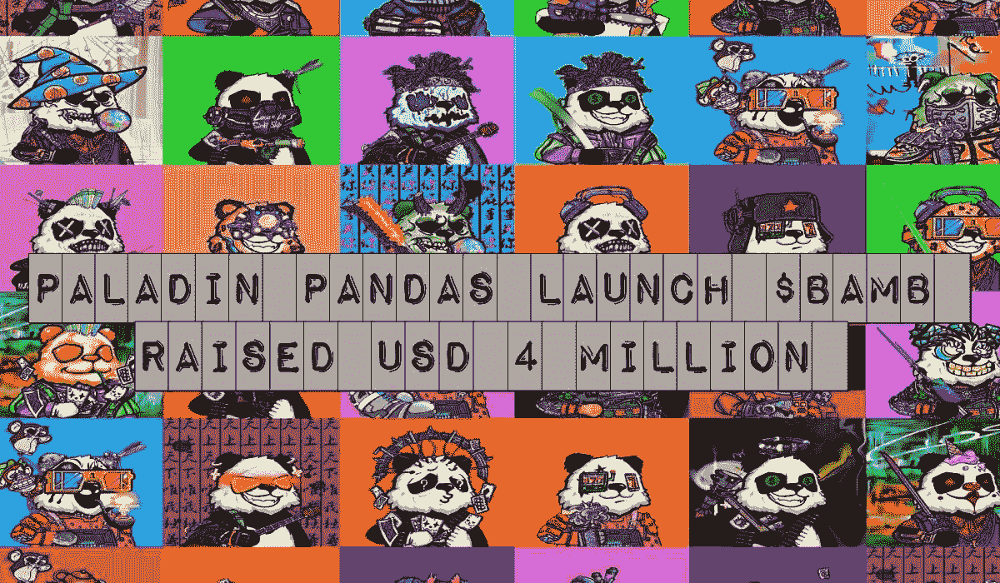
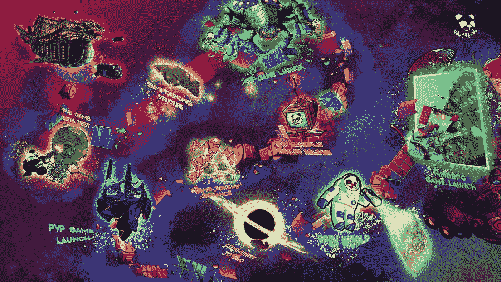
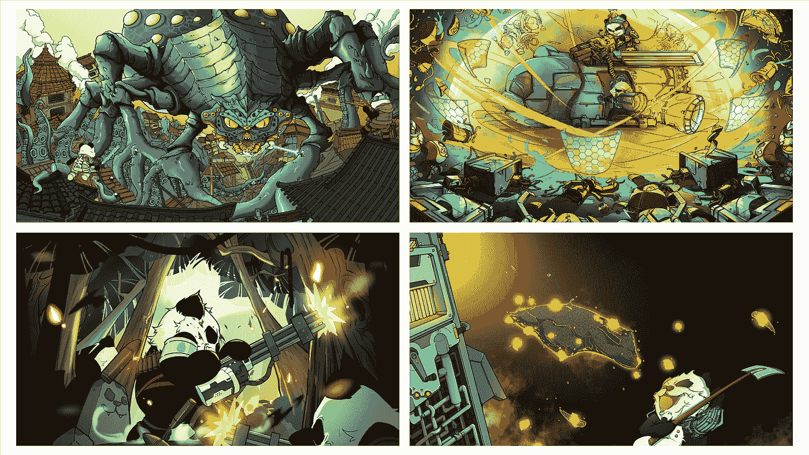
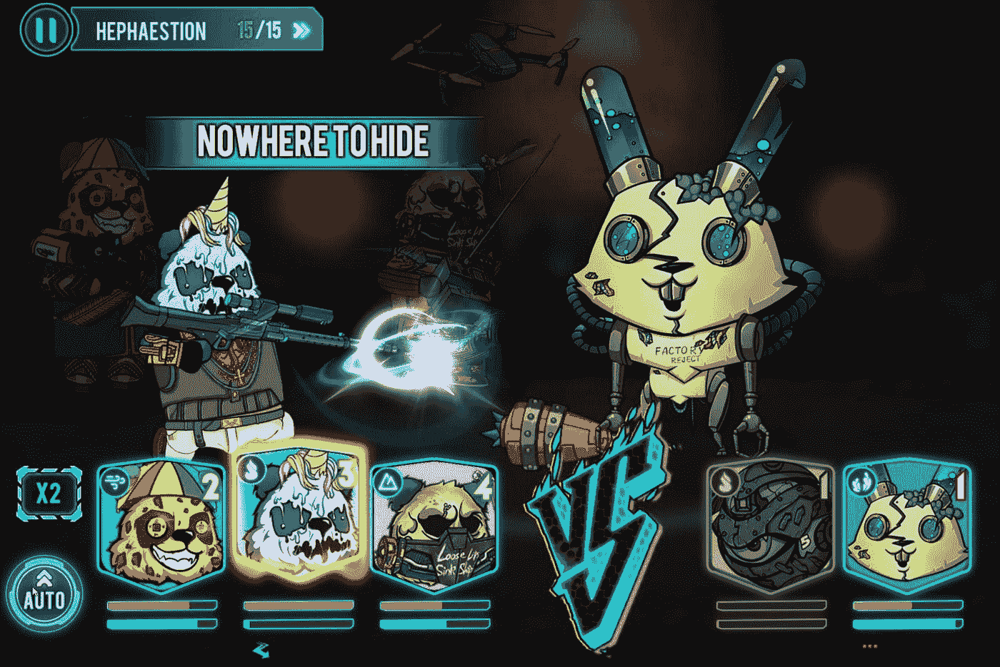
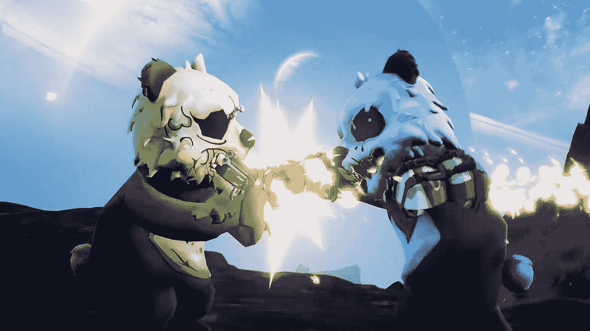
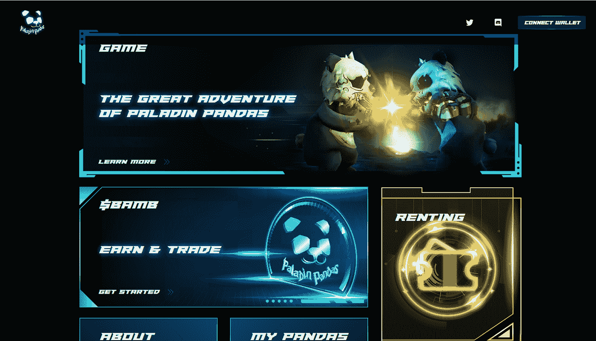

# 帕拉丁熊猫在筹集了 400 万美元资金后宣布启动$BAMB

> 原文：<https://medium.com/coinmonks/paladin-pandas-announces-bamb-launch-after-raising-usd-4-million-in-funding-d2fc71e7b690?source=collection_archive---------36----------------------->

2022 年 4 月 6 日，隶属于 NFT 游戏项目[的圣骑士熊猫](https://www.paladinpandas.com/home)在以太坊连锁店推出了他们的 ERC-20 代币$BAMB。这确立了圣骑士熊猫作为**的地位，它是第一批完成了游戏和代币发布的 NFT 项目之一。**

【2021 年 9 月 28 日[**Opensea**](https://opensea.io/collection/paladin-pandas)**上线的一款手绘 10K NFT 系列，圣骑士熊猫 32 分钟售罄。**它在日交易量排行榜上排名第 6，在周交易量排行榜上排名第 13，并出现在 OpenSea 主页上。

包括影响者和顶级收藏家@Zeneca_33、**puddy Penguins**的联合创始人 COLE、NFT 影响者 Josh Ong 和 NFT 女孩以及密码艺术家 JN Silva 在内的 NFT 鲸鱼所有者都将帕拉丁熊猫加入了他们的收藏。

这得到了成熟的风投和其他机构以及天使投资者的认可，OHDAT 从 Future Capital、Hashkey Capital、Innoangel、Y2Z Capital、Sky9 Capital 的创始人 Vincent Niu 和 Odaily 的创始人 Mandy Wang 那里筹集了总计 400 万美元的资金。筹集的资金将用于启动新项目和实施开放世界社会模拟游戏和 MMORPG 游戏，这在他们的路线图 2.0 中有所强调。

1 月 25 日，圣骑士熊猫推出了“PvE 游戏太空探险”，玩家将他们的熊猫送到行星上进行探险(每个探险有 15 个阶段)，同时战略性地将熊猫分成 3 个小组，通过战斗和迷你游戏找回丢失的$BAMB (Bamboonium)。由于元素、职业、武器等类别在游戏中都很重要，玩家需要选择合适的熊猫来购买并被送上战场，因为这涉及到策略游戏。

从 PvE 游戏中获得的所有$BAMB 都被锁定在玩家的$BAMB 余额中，可以解锁并以每周 15%的比率索取。如果玩家设法进入 PvP 每日/每周排行榜，锁定可以解除。

3 月 9 日，PvP:《熊猫大战熊猫》开放试玩正式发布，这是一款面向真正游戏玩家的 1V1 3D 格斗游戏。玩家支付$BAMB 进入竞技场，并从其他玩家那里掠夺更多的$BAMB。有 48 种武器，7 个基本动作和 21 个阶段，游戏不局限于“赢得赌注”的机制；这是一个真正的“玩到赚”的 NFT 游戏，有令人愉快的策略游戏，这是一个革命性的 NFT 游戏的尝试。到目前为止，当只关注收益时，可能会相当单调。PvP 公开演示发起了“清洁地毯”运动，并向 gamefi 项目持有人空投了 4 万美元的 BAMB 代币。

在设计帕拉丁熊猫生态系统时，考虑到了给所有 NFT 持有者额外津贴。强制使用圣骑士熊猫进入游戏，从而将用户群扩展到更多的 NFT 游戏玩家，非持有者也可以通过支付$BAMB 租用熊猫。每只熊猫的租借限额是 PvE 的 2 倍和 PvP 的 3 倍。

除了作为游戏中的货币，BAMB 还有几个用途。首先，BAMB 可以和 LP 代币一起开采总供应量的 5%，总共 2500 万美元 BAMB。第二，BAMB 可以换成 Power 抽彩券，这是一种 WEB3 抽彩机，可以用最低的报名费赢得蓝筹 NFT 项目。第三，BAMB 持有者可以访问独家在线商店商品，游戏内市场提升，以及白名单市场来消费他们的代币。

为了庆祝$BAMB 的发布，OHDAT 团队将通过两次空投来激励熊猫主人。首先，60 张租赁票将被投放到 30K 个新地址，用于挖掘游戏，这是它们的第一次运行。第二，总供应量的 1.5%，总计 750 万美元 BAMB 将空投给所有熊猫持有者。优先考虑有趣的游戏功能，帕拉丁熊猫的目标是$BAMB 成为 NFT 市场的长期“蓝筹令牌”。

**圣骑士熊猫链接**

opensea:【https://opensea.io/collection/paladin-pandas 

推特:【https://twitter.com/Paladin_Pandas 

不和:[http://discord.gg/paladin-pandas](https://t.co/tM29wpjaaQ)

网址:[https://paladinpandas.com](https://paladinpandas.com)

词汇学:[https://paladin-pandas.gitbook.io/usdbamb-tokenomics/](https://paladin-pandas.gitbook.io/usdbamb-tokenomics/)

> 加入 Coinmonks [电报频道](https://t.me/coincodecap)和 [Youtube 频道](https://www.youtube.com/c/coinmonks/videos)了解加密交易和投资

# 另外，阅读

*   [TraderWagon 回顾](https://coincodecap.com/traderwagon-review) | [北海巨妖 vs 双子 vs 比特亚德](https://coincodecap.com/kraken-vs-gemini-vs-bityard)
*   [如何在 FTX 交易所交易期货](https://coincodecap.com/ftx-futures-trading) | [OKEx vs 币安](https://coincodecap.com/okex-vs-binance)
*   [OKEx vs KuCoin](https://coincodecap.com/okex-kucoin) | [摄氏替代度](https://coincodecap.com/celsius-alternatives) | [如何购买 VeChain](https://coincodecap.com/buy-vechain)
*   [ProfitFarmers 回顾](https://coincodecap.com/profitfarmers-review) | [如何使用 Cornix 交易机器人](https://coincodecap.com/cornix-trading-bot)
*   [如何匿名购买比特币](https://coincodecap.com/buy-bitcoin-anonymously) | [比特币现金钱包](https://coincodecap.com/bitcoin-cash-wallets)