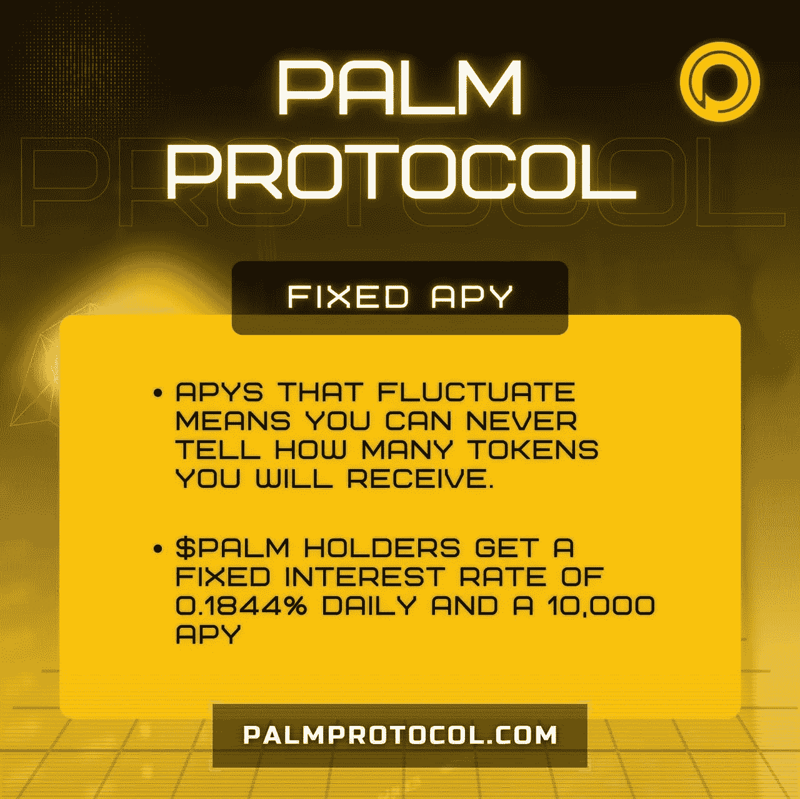
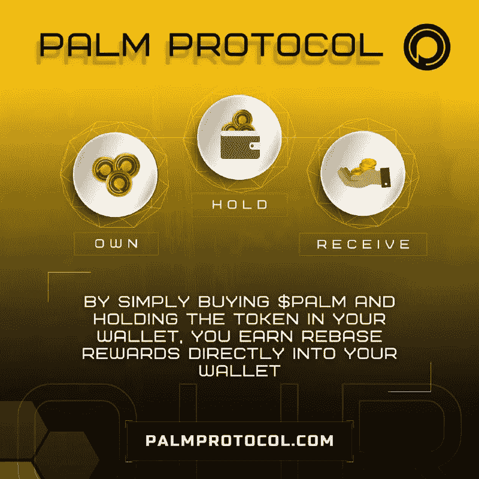

# PALM 协议轻松产生固定回报的方法

> 原文：<https://medium.com/coinmonks/palm-protocol-the-way-to-generate-fixed-returns-with-ease-a7b9dcb37db1?source=collection_archive---------29----------------------->

区块链技术改变了我们所知的金融世界，从集中到分散。

有了不同的选择，人们现在可以通过数字化的金融手段轻松增加收入。

其中一个项目是 Palm Protocol，它提供了最现实的协议，具有稳定固定的自我维持的长期回报。

因为区块链中的数据不能被操纵或破坏，普通个人现在有机会拥有一组特定的数据。

虽然没有人能够阻止加密货币，但错误信息和 FUD 很容易传播，尤其是在大多数人一无所知的空间。

对于新手加密爱好者和其他寻找多样化加密投资组合的人来说，真正的问题和挑战是在哪里安全投资，以及如何确保你能长期受益。

> Palm Protocol 为其用户提供了一个安全、长期的解决方案。

Palm Protocol 一直致力于缩小权力下放和高持续财务回报之间的差距。

通过自动赌注，自动复利功能，$PALM 持有人有最好的被动收入选择，在未来几年有稳定的收益。

用稳定的收入让你的钱为你工作。

我们有一个公用事业公司的列表，它会告诉你如何长期持续下去。勾选此处[T3 此处](https://docs.palmprotocol.com/guides/protocol-utilities)

你有什么想法？

加入我们的全球社区，了解我们的最新信息:

**电报—**[**https://t.me/journeywithpp**](https://t.me/journeywithpp)

**推特—**[**https://twitter.com/palm_protocol**](https://twitter.com/palm_protocol)

**insta gram—**[【https://www.instagram.com/palm_protocol/】T21](https://www.instagram.com/palm_protocol/)

**网站—**[**Palmprotocol.com**](http://Palmprotocol.com)

**白皮书—**[**https://docs.palmprotocol.com/guides/the-protocol-overview**](https://docs.palmprotocol.com/guides/the-protocol-overview)