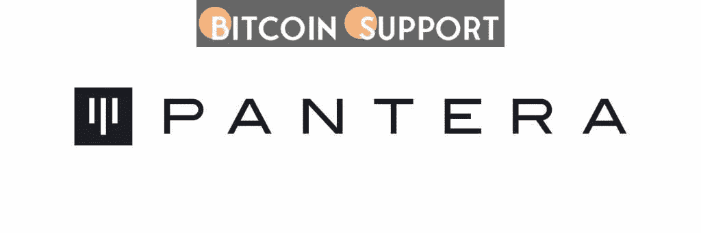

# 潘迪拉资本声称，一些加密出售的压力是由于税收问题

> 原文：<https://medium.com/coinmonks/pantera-capital-claims-that-some-crypto-selling-pressure-is-due-to-tax-concerns-baac8aa2704e?source=collection_archive---------46----------------------->

**Visit our website:-** [**https://bitcoinsupports.com/**](https://bitcoinsupports.com/)

**据一位对冲基金经理称，去年加密货币资本收益总计 1.4 万亿美元。**

根据潘迪拉资本的 2 月区块链信，加密货币最近的一些抛售压力是由于不可预见的税收头寸。报告称，美国今年 4 月 18 日的纳税日可能会对加密货币的价格产生影响。根据该基金的数据，去年产生了超过 1.4 万亿美元的比特币资本利得，满足相关的税单可能占了最近销售的“很大一部分”。这位基金经理指出，在 2013 年、2017 年和 2020 年的大幅上涨之后，比特币在纳税日之前 35 天见顶，然后随着投资者清算持股以支付累计税款而暴跌。它表示，加密货币价格通常会在税收日之前下降，这种模式在 2021 年上涨后可能会在今年再次出现。“许多加密货币交易者是没有经验的投资者，”信中写道。“……人们可能会想象有人购买尽可能多的比特币。然后他们决定把它换成乙醚。然后，他们的报税人告诉他们，他们欠他们收入的 34%的税。该基金解释称:“由于投资者‘全押’在加密上，因此投资者履行纳税义务的唯一方法是卖出一些比特币。”。

由于缺乏从赌注支出到不可替代代币(NFT)的指导方针，报税涉及一定程度的猜测。

潘迪拉于 2013 年创建了美国第一只比特币基金。同年，该公司推出了全球首只专注于区块链的风险投资基金。丹·莫尔黑德于 2003 年创办了这家公司。它目前管理着 46 亿美元的资产，投资了 95 家企业。

**访问我们的网站:-**[**https://bitcoinsupports.com/**](https://bitcoinsupports.com/)

**免责声明:以上为作者观点，不应视为投资建议。读者应该自己做研究。**

> 加入 Coinmonks [电报频道](https://t.me/coincodecap)和 [Youtube 频道](https://www.youtube.com/c/coinmonks/videos)了解加密交易和投资

# 另外，阅读

*   [八大加密附属计划](https://coincodecap.com/crypto-affiliate-programs) | [eToro vs 比特币基地](https://coincodecap.com/etoro-vs-coinbase)
*   [最佳以太坊钱包](https://coincodecap.com/best-ethereum-wallets) | [电报上的加密货币机器人](https://coincodecap.com/telegram-crypto-bots)
*   [交易杠杆代币的最佳交易所](https://coincodecap.com/leveraged-token-exchanges)
*   [最佳加密分析或链上数据](https://coincodecap.com/blockchain-analytics) | [Bexplus 评论](https://coincodecap.com/bexplus-review)
*   [NFT 十大市场造币集锦](https://coincodecap.com/nft-marketplaces)
*   [AscendEx Staking](https://coincodecap.com/ascendex-staking)|[Bot Ocean Review](https://coincodecap.com/bot-ocean-review)|[最佳比特币钱包](https://coincodecap.com/bitcoin-wallets-india)
*   [Bitget 回顾](https://coincodecap.com/bitget-review) | [双子星 vs BlockFi](https://coincodecap.com/gemini-vs-blockfi) | [OKEx 期货交易](https://coincodecap.com/okex-futures-trading)
*   [美国最佳加密交易机器人](https://coincodecap.com/crypto-trading-bots-in-the-us) | [经常性回顾](https://coincodecap.com/changelly-review)
*   [在印度利用加密套利赚取被动收入](https://coincodecap.com/crypto-arbitrage-in-india)
*   [霍比审核](https://coincodecap.com/huobi-review) | [OKEx 保证金交易](https://coincodecap.com/okex-margin-trading) | [期货交易](https://coincodecap.com/futures-trading)