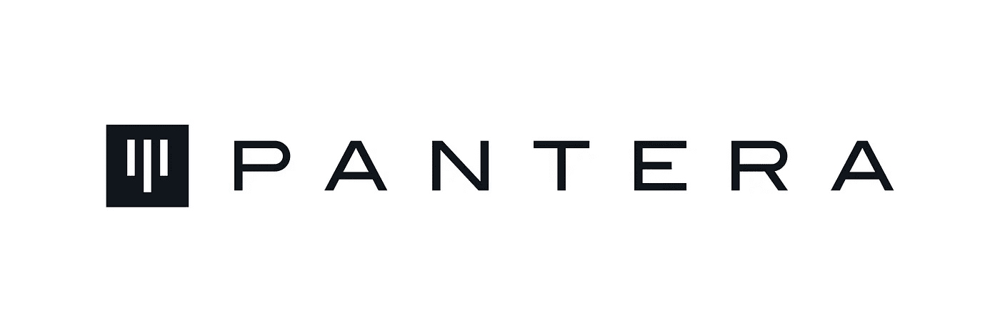

# 潘迪拉资本投资组合细分

> 原文：<https://medium.com/coinmonks/pantera-capital-portfolio-breakdown-1bef7aa5ac68?source=collection_archive---------52----------------------->

# 概述

潘迪拉资本由前老虎基金宏观交易主管兼首席财务官丹·莫尔黑德创立。潘迪拉的全球宏观战略投入了超过 10 亿美元的机构拨款。2013 年，潘迪拉在潘迪拉加利福尼亚州门洛帕克创建了美国第一家区块链对冲和风险基金，最初专注于全球宏观对冲基金投资。该公司在 2013 年将重点转移到区块链行业，当时得到了主要风险投资公司 Fortress Investment Group、Benchmark Capital 和 Ribbit Capital 的支持。

**关于潘迪拉资本的最新消息**

*   **泰拉投资者潘迪拉资本公司称，在 UST 崩盘前，该公司已套现 80%的投资**

潘迪拉资本是 Terraform Labs 的高调支持者之一，早在 TerraUSD (UST)崩溃之前，它就套现了近 80%的 Terra (LUNA)投资。据该公司称，由于潘迪拉很早就退出了大部分投资，因此产生了可观的利润。潘迪拉资本的合伙人保罗·维拉迪特塔基特告诉 Block，该公司将 170 万美元变成了约 1.7 亿美元。

*   **潘迪拉资本将关闭 13 亿美元的区块链基金**

根据投资者电话会议，潘迪拉资本计划关闭潘迪拉区块链基金，这是其第一只承诺资本约 13 亿美元的区块链基金。这一金额是该公司去年 11 月开始筹资时 6 亿美元目标的两倍多。潘迪拉上个月表示，当时的承诺已经超过 10 亿美元。该基金是在加密投资工具创纪录的时期推出的，包括同样始于 11 月的 Paradigm 的 25 亿美元基金。

# 投资

潘迪拉资本已经进行了 192 项投资。他们最近一次投资是在 2022 年 5 月 16 日，当时 Metatheory 筹集了 2400 万美元。

*   **随着时间的推移，该组织进行了多少投资？**

investments made over time

*   **该组织最积极地投资了哪些行业？**

industries by number of investments

潘迪拉资本投资了几个组织，这里是他们筹集资金最多的三个投资(有些不是潘迪拉资本的主要投资)。

*   **双子座**

Gemini 是一个加密货币交易所和托管机构，允许客户购买、出售和存储数字资产。这是一家由纽约州金融服务局监管的纽约信托公司，由卡梅隆和泰勒·文克莱沃斯于 2014 年创立。

*   **巴克特**

加密衍生品提供商 Bakkt 完成了 3 亿美元的 B 轮融资，并在一篇博文中分享了关于其即将推出的移动应用的更多细节。根据首席执行官迈克·布兰迪纳撰写的帖子，微软的 M12，PayU，波士顿咨询集团，Goldfinch Partners，CMT 数字，潘迪拉资本和 Bakkt 母公司洲际交易所(ICE)都参加了这轮融资。

Bakkt 是一种托管服务，以安全的形式存储比特币，称为冷存储。它代表机构投资者管理大量比特币。洲际交易所随后推出了 Bakkt 品牌的比特币期货产品。这是交易员能够押注比特币价格上涨或下跌的地方。所有用于支持交易的比特币都存放在 Bakkt 的安全保管处。

# 多元化投资

潘迪拉资本已经进行了 23 项多元化投资。他们最近一次多元化投资是在 2022 年 3 月 7 日，当时 Space Runners 筹集了 1000 万美元。

*   **随着时间的推移，该组织进行了多少多元化投资？**

Diversity investments made over time

*   **该组织最积极地投资于哪些多元化类型？**

Investments by diversity type

# 出口

潘迪拉资本有 18 个出口。潘迪拉资本最著名的退出公司包括 Wyre、Coins.ph 和 BitGo。

**该组织在哪些行业退出最多？**

industries by number of exits

# 结论

潘迪拉资本由前老虎基金宏观交易主管兼首席财务官丹·莫尔黑德创立。潘迪拉的全球宏观战略投入了超过 10 亿美元的机构拨款。2013 年，潘迪拉在潘迪拉加利福尼亚州门洛帕克创建了美国第一家区块链对冲和风险基金，最初专注于全球宏观对冲基金投资。潘迪拉资本仍然是数字资产行业的强者，并且没有表现出任何放缓的迹象。希望你有一个精彩的阅读。

> 加入 Coinmonks [电报频道](https://t.me/coincodecap)和 [Youtube 频道](https://www.youtube.com/c/coinmonks/videos)了解加密交易和投资

# 另外，阅读

*   [TraderWagon 回顾](https://coincodecap.com/traderwagon-review) | [北海巨妖 vs 双子星 vs BitYard](https://coincodecap.com/kraken-vs-gemini-vs-bityard)
*   [如何在 FTX 交易所交易期货](https://coincodecap.com/ftx-futures-trading) | [OKEx vs 币安](https://coincodecap.com/okex-vs-binance)
*   [OKEx vs KuCoin](https://coincodecap.com/okex-kucoin) | [摄氏替代品](https://coincodecap.com/celsius-alternatives) | [如何购买 VeChain](https://coincodecap.com/buy-vechain)
*   [ProfitFarmers 回顾](https://coincodecap.com/profitfarmers-review) | [如何使用 Cornix 交易机器人](https://coincodecap.com/cornix-trading-bot)
*   [如何匿名购买比特币](https://coincodecap.com/buy-bitcoin-anonymously) | [比特币现金钱包](https://coincodecap.com/bitcoin-cash-wallets)
*   [瓦济克斯 NFT 评论](https://coincodecap.com/wazirx-nft-review)|[Bitsgap vs Pionex](https://coincodecap.com/bitsgap-vs-pionex)|[Tangem 评论](https://coincodecap.com/tangem-wallet-review)